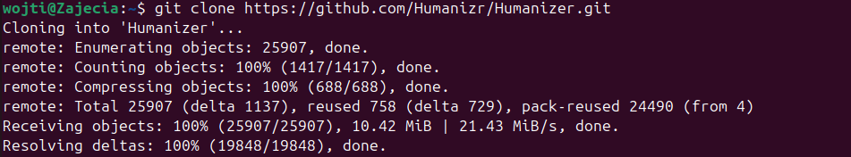
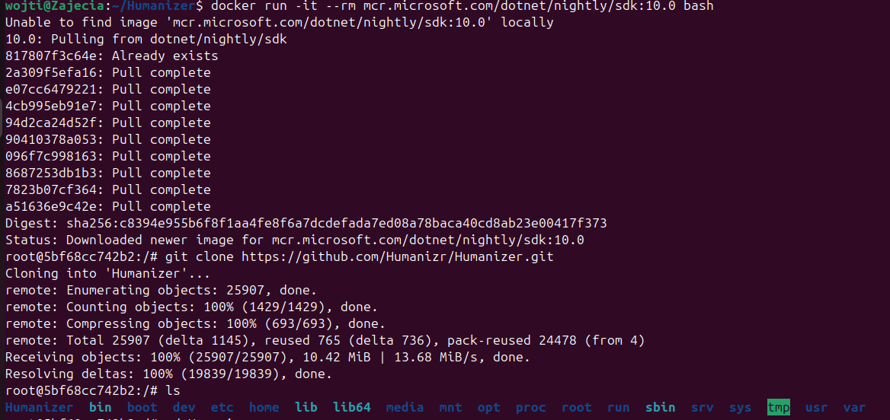
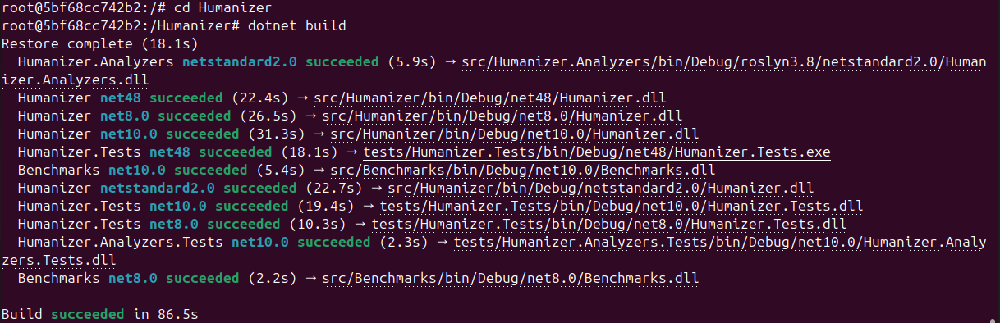
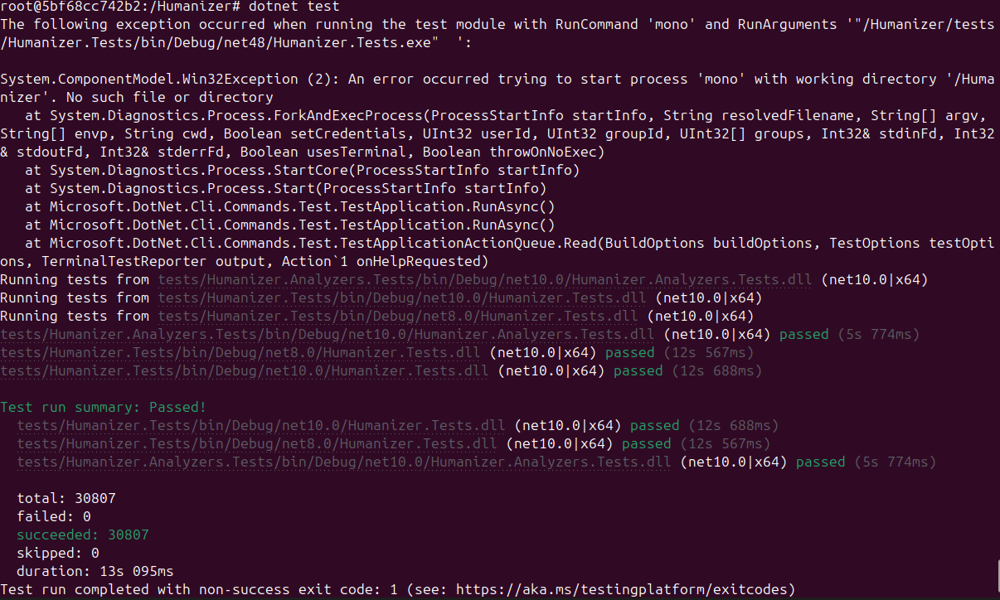
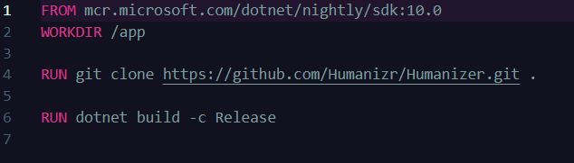
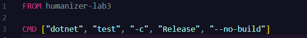
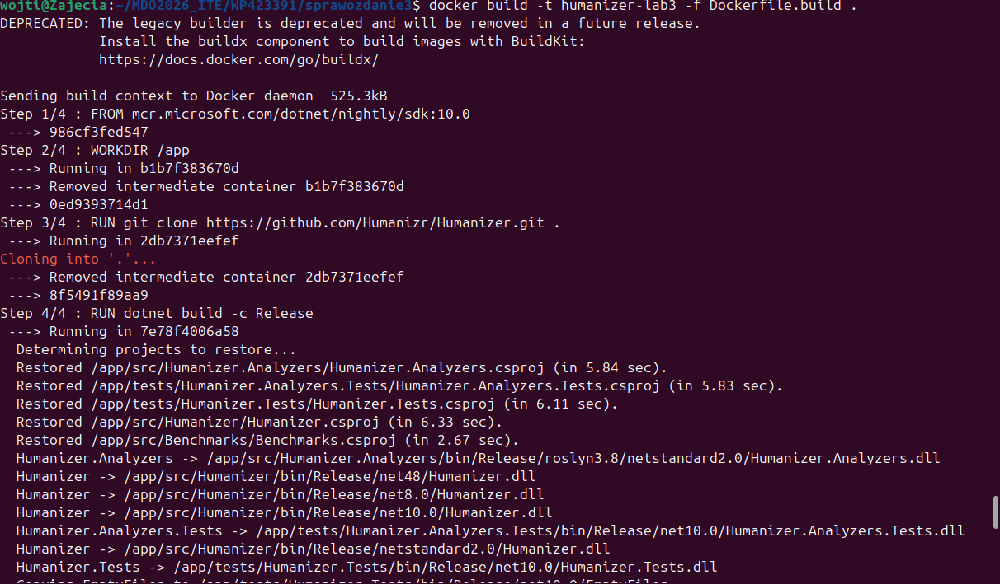
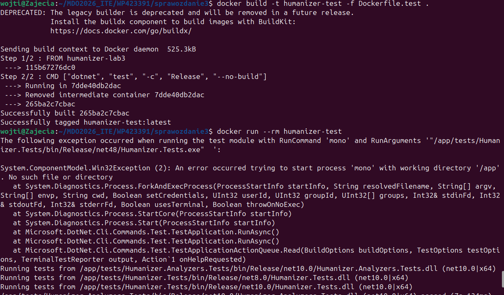

# Sprawozdanie - Laboratorium 3
## Wojciech Pieńkowski
---
### Sklonowanie wybranego repozytorium 

### Sklonowanie w dokerze repozytorium

### Zbudowanie projektu

### Przeprowadzenie testów

### Pierwszy dockerfile z klonowaniem i budowaniem projektu

### Drugi dockerfile z uruchomieniem testów

### Zbudowanie pierwszego konteneru

### Zbudowanie drugiego konteneru i uruchomienie go

W moim kontenerze pracuje proces dotnet test, który wykonuje operacje na procesorze i pamieci RAM