# Sprawozdanie - Laboratorium 4
## Wojciech Pieńkowski
---
###  Przygotowanie woluminów 
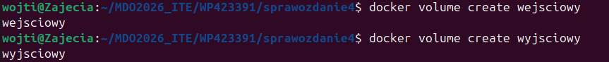

### Uruchomienie kontenera i sklonowanie repozytorium na wolumin wejsciowy
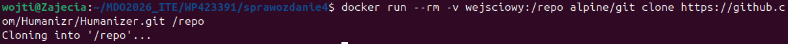

### Uruchomienie kontenera budującego i ustawienie woluminu wejsciowego jako src i wyjsciowego jako app
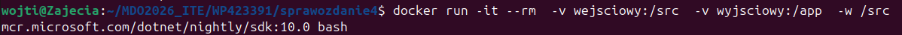

### Skompilowanie projektu i zapisanie wynikin wy woluminie wyjsciowym
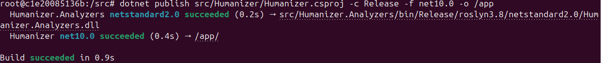

### Zawartość w wolumienie wyjsciowym
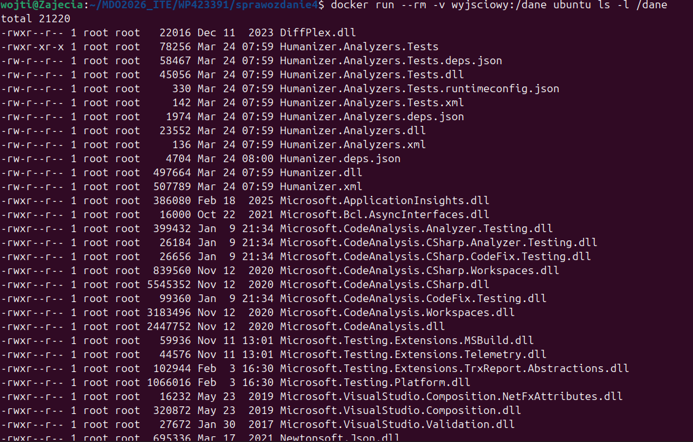

### Utworzenie własnej sieci
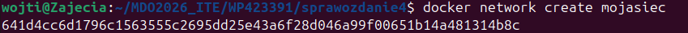

### Utworzenie kontenera serwer-iperf w trybie nasłuchiwanie wewnątrz mojasiec
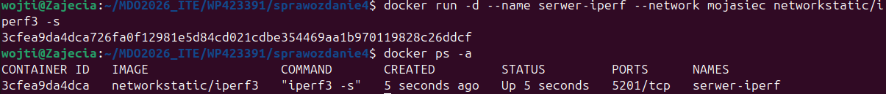

### Utworzenie drugiego kontenera jako klient 
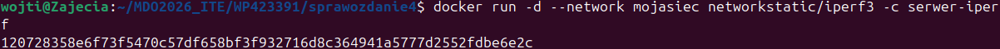

### Logi ukazujące test przepustowości między kontenerami
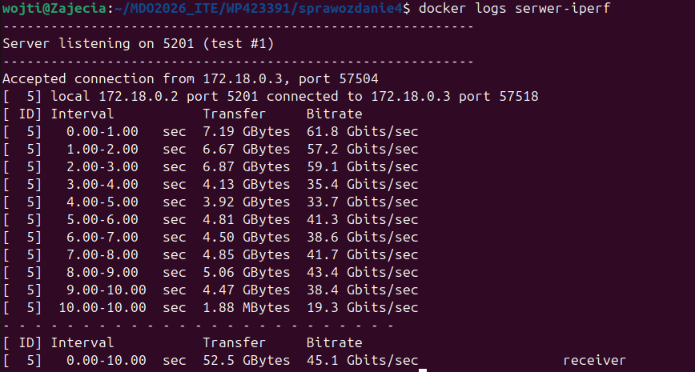

### Utworzenie nowego serwera iperf 
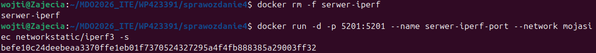

### Połączenie się spoza kontenera
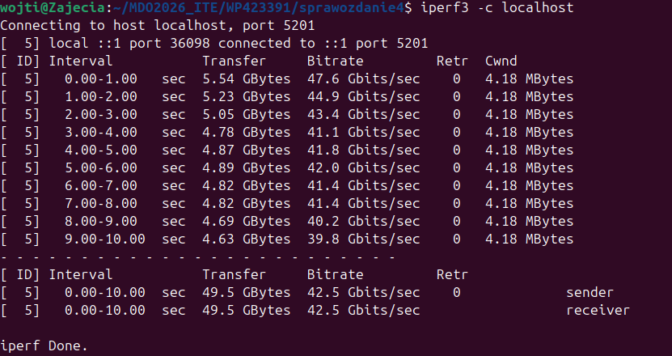

### Uruchomienie kontenera ubuntu i instalacja openssh-server
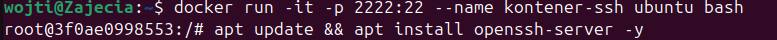

### Konfiguracja serwera ssh, ustawienie hasła
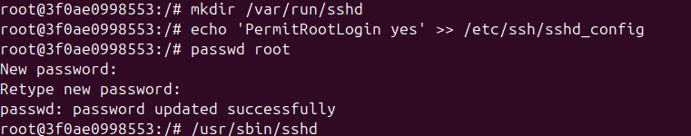

### Nawiązanie połączenia ssh z hosta do kontenera
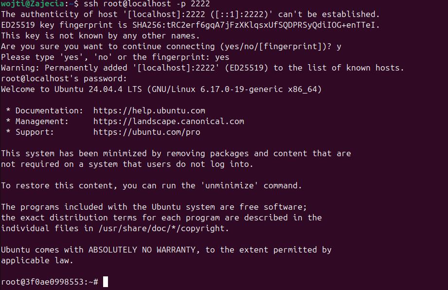

### Utworzenie woluminu jenkins_data oraz uruchomienie kontenera jenkins
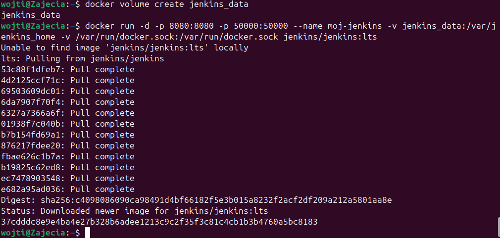

### Odczytanie logów kontenera w celu uzyskania hasła administratora 
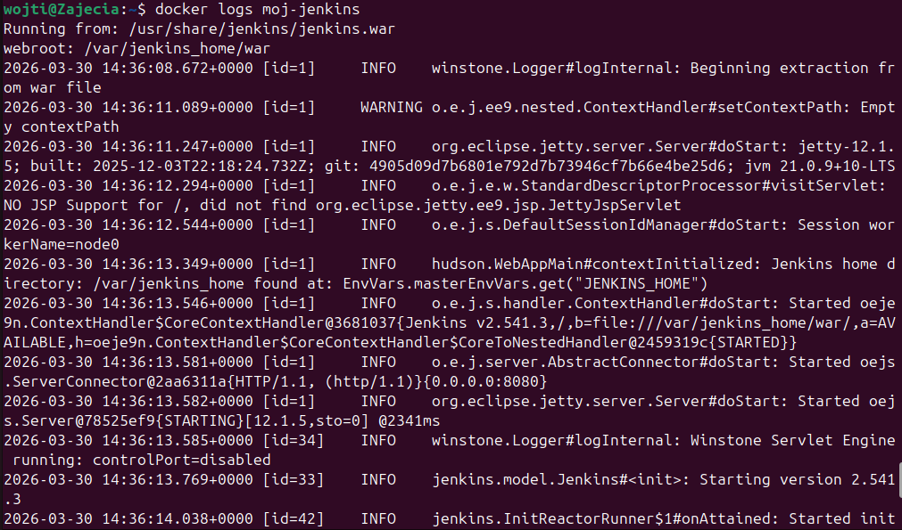

### Wejście na przeglądarke oraz zalogowanie się przy użyciu hasła 
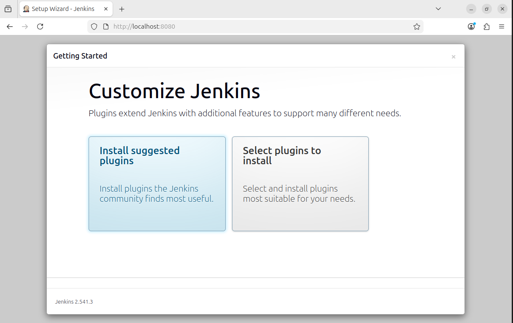
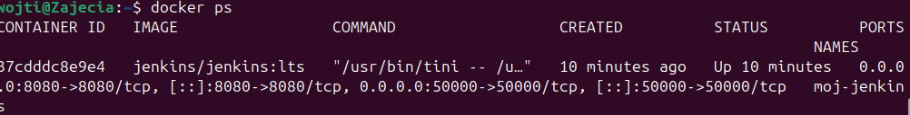