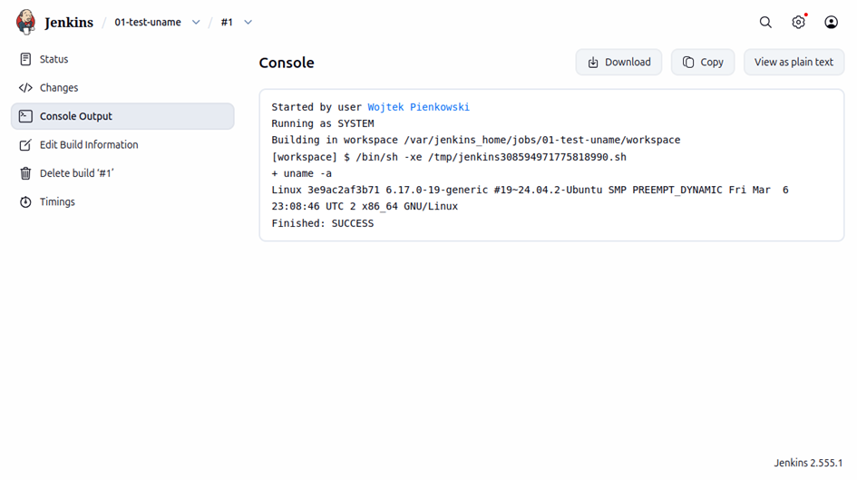
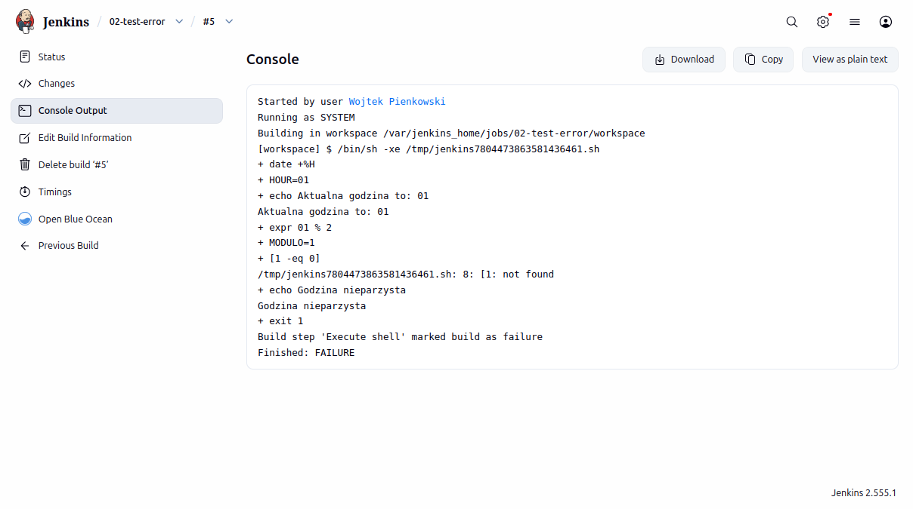
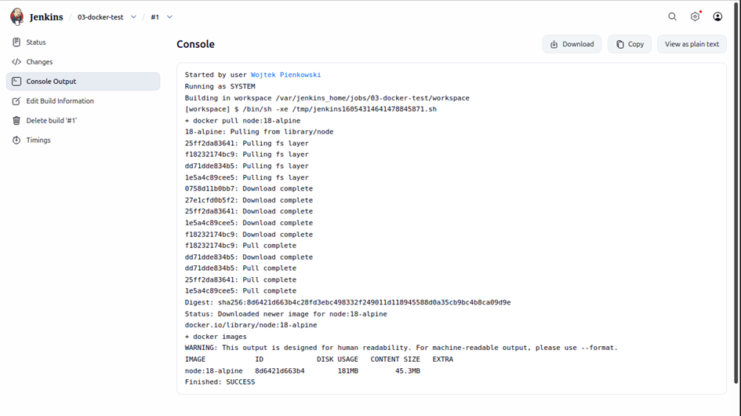
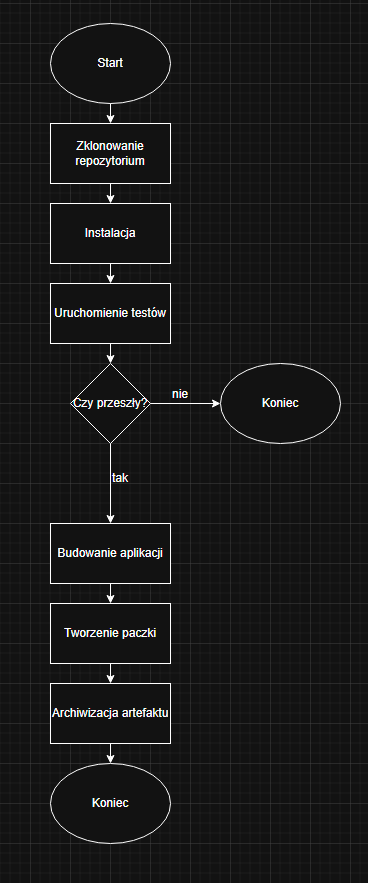

# Sprawozdanie zbiorcze z zajęć 5 - 7

## Wojciech Pieńkowski

## Wstęp 
Etap zajęć składał się z laboratoriów 5, 6 i 7 których celem było zaprojektowanie i wdrożenie nowoczesnego procesu cięgłej integracji i dostarczania oprogramowania.
Cykl zajęć polegał na transformacji procesu budowania aplikacja w pełni zautomatyzowany pipeline sterowany kodem. W ten etap wchodziło:
### 1. Przygotowanie środowiska:
Konfigurację serwera automatyzacji Jenkins w architekturze kontenerowej oraz rozwiązanie problemów związanych z komunikacją między kontenerami
### 2. Projektowanie procesu: 
Wybór aplikacji bazowej , analizę jej cyklu życia oraz wyznaczenie ścieżki krytycznej, czyli zbioru operacji niezbędnych do uznania buildu za poprawny.
### 3. Implementacje
Stworzenie skryptu Jenkinsfile, który zarządza instalacją, testowaniem, budowaniem oraz archiwizacją artefaktów.


## 1. Laboratorium 5 - Pipeline, Jenkins, izolacja etapów\

Celem tego etapu było powołanie do życia infrastruktury. Skupiliśmy się na konteneryzacji serwera automatyzacji oraz zapewnieniu mu możliwości zarządzania innymi kontenerami.

### 1.1. Omówienie technologii i kluczowych pojęć

Jenkins: Open-source'owy serwer automatyzacji, który pełni rolę "dyrygenta". Jego zadaniem jest reagowanie na zmiany w kodzie, uruchamianie skryptów i pilnowanie, aby każdy krok rurociągu (pipeline) został wykonany w odpowiedniej kolejności.

Docker: Platforma do konteneryzacji, która pozwala na izolację aplikacji od systemu operacyjnego. Dzięki Dockerowi mamy pewność, że "u mnie działa" oznacza również "działa na serwerze".

DIND (Docker-in-Docker): Specyficzna architektura, w której wewnątrz jednego kontenera uruchamiany jest drugi demon Dockera. Jest to niezbędne, aby Jenkins mógł budować obrazy i uruchamiać kontenery testowe w sposób izolowany.

Blue Ocean: Nowoczesny interfejs graficzny dla Jenkinsa, który w sposób przejrzysty wizualizuje procesy CI/CD w formie graficznego rurociągu.

### 1.2. Przebieg prac konfiguracyjnych

- Tworzenie sieci i wolumenów
Prace rozpoczęto od stworzenia dedykowanej sieci mostkowej (bridge) o nazwie jenkins, aby umożliwić komunikację między kontenerem serwera a kontenerem Dockera. Utworzono również wolumeny dla danych Jenkinsa i certyfikatów, co gwarantuje trwałość danych nawet po restarcie kontenerów.

- Uruchomienie kontenera Docker:dind
Uruchomiono obraz docker:dind z flagą --privileged. Nadanie uprawnień uprzywilejowanych pozwala kontenerowi na bezpośredni dostęp do zasobów sprzętowych hosta, co jest wymogiem architektury Docker-in-Docker.

- Budowa i start Jenkinsa
Użyto dedykowanego obrazu Jenkinsa z zainstalowanymi narzędziami Docker CLI. Po uruchomieniu przeprowadzono wstępną konfigurację: odblokowanie hasłem administratora oraz instalację sugerowanych wtyczek.

### 1.3. Weryfikacja środowiska – Projekty testowe 
Aby potwierdzić poprawność konfiguracji, stworzono trzy małe projekty testowe. Pozwoliły one zweryfikować różne aspekty działania systemu.

1 - Sprawdzenie środowiska 
Zadaniem projektu było wykonanie komendy uname -a wewnątrz kontenera Jenkins. Potwierdziło to, że Jenkins poprawnie wykonuje polecenia powłoki systemu Linux.
```groovy
uname -a
```


2 - Celowe wywołanie błędu 
Stworzono projekt, który miał za zadania zwracać błąd w przypadku kiedy godzina była nieparzysta.
```groovy
HOUR=$(date +%H)
echo "Aktualna godzina to: $HOUR"
MODULO=$(expr $HOUR % 2)
[ "$MODULO" -eq 0 ] && (echo "Godzina parzysta. Sukces!"; exit 0) || (echo "Błąd: Godzina nieparzysta!"; exit 1)
```


3 - Weryfikacja DIND 
Test sprawdzający, czy Jenkins widzi demona Dockera. Wykonano polecenie docker pull. Sukces tego testu oznaczał, że Jenkins jest gotowy do pobierania obrazów z Docker Hub i budowania własnych kontenerów.
```groovy
docker pull node:18-alpine
docker images
```


### 1.4. Zadanie wstępne: Pierwszy obiekt typu Pipeline
Przed przystąpieniem do realizacji głównej ścieżki krytycznej, przeprowadzono próbę technologiczną z nowym typem obiektu w Jenkinsie -Pipeline.

Przebieg zadania:

Inicjalizacja: Utworzono nowy obiekt typu Pipeline, wpisując jego treść bezpośrednio w edytorze Jenkinsa (zamiast pobierania z SCM). Pozwoliło to na szybką iterację i testowanie składni.

```groovy
pipeline {
    agent any
    stages {
        stage('Clone') {
            steps {
                git url: 'https://github.com/InzynieriaOprogramowaniaAGH/MDO2026_ITE.git',
                    branch: 'WP423391'
            }
        }
        stage('Build') {
            steps {
                sh 'docker build -t build -f WP423391/sprawozdanie3/Dockerfile.build .'
            }
        }
        stage('Test') {
            steps {
                sh 'docker build -t test -f WP423391/sprawozdanie3/Dockerfile.test .'
            }
        }
    }
}
```
Integracja z Dockerem: Wewnątrz definicji Pipeline użyto agenta Docker. Przetestowano proces budowania obrazu na podstawie dostarczonego pliku Dockerfile.

Checkout i Gałęzie: Skonfigurowano etap pobierania kodu tak, aby wskazywał na osobistą gałąź w repozytorium przedmiotowym. Było to kluczowe dla zrozumienia, jak Jenkins izoluje prace różnych deweloperów.

Weryfikacja powtarzalności: Zgodnie z instrukcją, rurociąg uruchomiono dwukrotnie. Miało to na celu sprawdzenie mechanizmu cache’owania warstw Dockera oraz upewnienie się, że skrypt za każdym razem poprawnie wykonuje checkout do najnowszej wersji kodu.

### 1.5 Błędy
Podczas prac napotkałem na błąd który polegał na tym, że docker nie mógł się utworzyć, po sprawdzeniu logów, okazało się że błędem był "No space left on device" czyli wynikało to z braku wolnego miejsca wewnątrz maszyny
Zastosowałem komende, która pozwoliła mi odzyskać nieużywane miejsce na dysku, usuwając nieużywane obrazy i kontenery. 
```groovy
docker system prune -a -f
```

## 2. Laboratorium 6 - Pipeline: lista kontrolna

Etap ren polegał na opracowaniu strategi CI/CD. Zdefiniowano zestaw regół, które musi spełnić kod  aby mógł zostać uznany za poprawny i gotowy do wydania.

### 2.1 Wybór aplikacji 
Do realizacji projektu wybrano aplikacje framworku NestJS. Jest to technologia oparta na TypeScript, co wymusza wieloetapowy proces.
https://github.com/nestjs/typescript-starter

Decyzja o stworzeniu forka:
https://github.com/wojzxc/typescript-starter
Kluczowym elementem przygotowań było stworzenie własnego forka repozytorium nestjs/typescript-starter. Decyzja ta była podyktowana potrzebą wdrożenia strategii Pipeline as Code. Dzięki własnej kopii możliwe było:
Umieszczenie pliku Jenkinsfile bezpośrednio w głównym katalogu projektu.

Uniezależnienie się od zmian w oryginalnym repozytorium.

Pełna kontrola nad wersjonowaniem rurociągu wraz z kodem aplikacji.

### 2.2. Definicja Ścieżki Krytycznej (Critical Path)
Zgodnie z wymaganiami, wyznaczono minimalny zbiór operacji niezbędnych do zachowania ciągłości integracji. Każdy build musi przejść przez następujące stany:

| Krok | Status |
| :---: | :---: |
| Commit | ✅ |
| Clone | ✅ |
| Install | ✅ |
| Test | ✅ |
| Build | ✅ |
| Publish | ✅ |

Commit: Wykrycie zmiany w kodzie lub ręczne wyzwolenie rurociągu.

Clone: Pobranie świeżej kopii kodu źródłowego do izolowanego środowiska.

Install: Przygotowanie środowiska uruchomieniowego poprzez instalację modułów NPM.

Test: Wykonanie testów automatycznych.

Build: Produkcyjna kompilacja kodu.

Publish: Archiwizacja efektów pracy w formie trwałego artefaktu.

### 2.3. Analiza listy kontrolnej rurociągu
W ramach projektowania procesu, przeanalizowano listę kontrolną wymaganą do poprawnego działania systemu w środowisku Jenkins:

Diagram aktywności procesu CI/CD:


Izolacja środowiska: Zdecydowano, że rurociąg musi być uruchamiany wewnątrz kontenera node:18-alpine. Zapobiega to zaśmiecaniu systemu hosta.

Trwałość Artefaktów: Zaprojektowano mechanizm archiveArtifacts, który zabezpiecza wynik buildu nest-app.tar.gz w pamięci Jenkinsa. Dzięki temu artefakt jest dostępny do pobrania nawet po usunięciu kontenera roboczego.

Optymalizacja zasobów: Ze względu na ograniczenia maszyny wirtualnej, do listy kontrolnej dodano wymóg ograniczania pamięci RAM dla procesu Node.js (flaga max-old-space-size), co zapobiega zawieszaniu się całego serwera CI.

Weryfikacja jakości: Przyjęto zasadę Fail Fast która mowi o tym że jeśli testy jednostkowe nie przejdą, rurociąg jest natychmiast przerywany, oszczędzając czas i zasoby na budowanie wadliwego kodu.

## 3. Laboratorium 7 - Jenkinsfile: lista kontrolna 
Ostatni etap prac polegał na urzeczywistnieniu zaprojektowanej ścieżki krytycznej poprzez stworzenie deklaratywnego pliku Jenkinsfile.

### 3.1. Architektura pipeline
W przeciwieństwie do projektów z Lab 5, rurociąg w Lab 7 opiera się na kontenerowym agencie. Dzięki temu cały proces budowania jest odizolowany od systemu operacyjnego, na którym działa Jenkins.
W tym celu wybrałem agenta node:18-alpine, ze wględu na minimalny rozmiar łączony z obecnością niezbędnych narzędzi do kompilacji NestJS. Integracja z SCM, Jenkins automatycznie pobiera Jenkinsfile z własnego forka repozytorium przy każdym uruchomieniu.

### 3.2 Opis etapów rurociągów
Cały proces pipeline jest podzielony na fazy, z których każda musi się zakończyć sukcesem aby przejść do następnej:

1. Etap Install
W tym kroku wykorzystano komendę npm ci. Jest ona bardziej rygorystyczna niż npm install, ponieważ bazuje wyłącznie na pliku blokady package-lock.json.
Zapewnia ona że build na serwerze używa dokładnie tych samych wersji biliotek co środowisko developerskie
```groovy
    stage('Install') {
        steps {
            sh 'npm ci'
        }
    }
```

2. Etap Test 
Uruchomienie testów jednostkowych za pomocą frameworka Jest.
Zastosowałem flagę NODE_OPTIONS="--max-old-space-size=512". Było to niezbędne dla optymalizaccji, która ograniczyła zużycie pamięci RAM przez proces testowy, zapobiegając awariom maszyny wirtualnej.
```groovy
    stage('Test') {
        steps {
            sh 'NODE_OPTIONS="--max-old-space-size=512" npm run test'
        }
    }
```

3. Etap Build
Jest to moment transformacji kodu źródłowego w produkt gotowy do uruchomienia. Dzięki izolacji w kontenerze, wynik buildu jest niezależny od lokalnych ustawień środowiska.
```groovy
    stage('Build') {
        steps {
            sh 'NODE_OPTIONS="--max-old-space-size=512" npm run build'
        }
    }
```

4. Etap Publish
Wykonano komendę tar -czf nest-app.tar.gz dist node_modules package.json.
Użyto funkcji archiveArtifacts, która wyciąga paczkę z kontenera i zapisuje ją trwale w historii buildów Jenkinsa.
```groovy
    stage('Publish') {
        steps {
            sh 'tar -czf nest-app.tar.gz dist node_modules package.json'
            archiveArtifacts artifacts: 'nest-app.tar.gz', fingerprint: true
        }
    }
```

### 3.3. Rezultaty 
Dzięki pomyślnej realizacji wszystkich etapów, rurociąg osiągnął status pełnej gotowości operacyjnej
Kolejne przejścia Build #2 i #3 potwierdziły powtarzalność procesu.

Wygenerowany artefakt nest-app.tar.gz o rozmiarze ok. 58 MiB zawiera pełne środowisko uruchomieniowe. Zgodnie z założeniami, może on zostać pobrany i uruchomiony na dowolnym serwerze bez konieczności ponownego budowania kodu.

Dzięki dołączeniu folderu node_modules wewnątrz archiwum, artefakt jest niezależny od zewnętrznych repozytoriów.

Zaplanowany diagram UML pokrywa się z efektem.