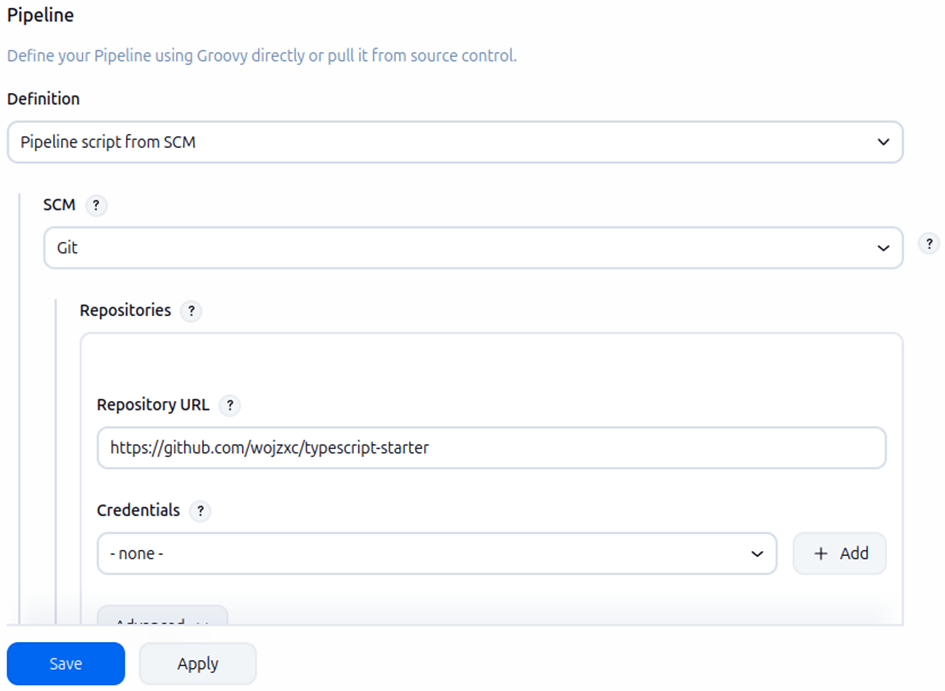
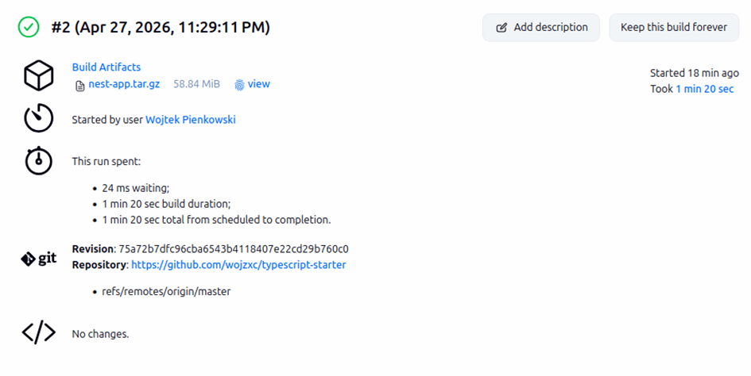
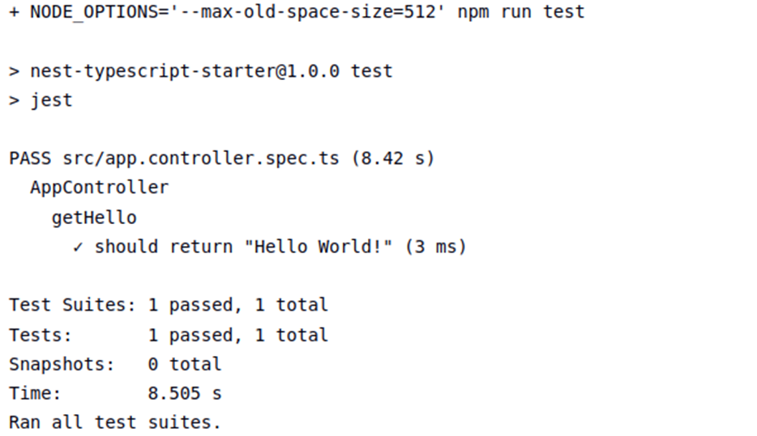
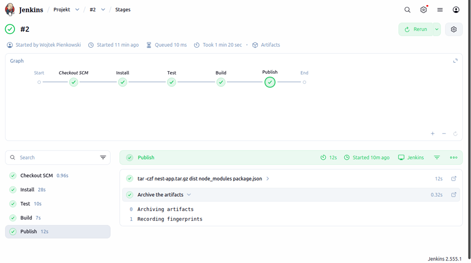

# Zajęcia 07 - Jenkinsfile: lista kontrolna 
## Wojciech Pieńkowski

## Projekt
W ramach realizacji laboratoriów został wybrany projekt:
https://github.com/nestjs/typescript-starter

## Ścieżka krytyczna 
Zrealizowano proces automatyzacji dla wybranej aplikacji. Każdy krok został wykonany pomyślnie 

| Krok | Status |
| :--- | :--- |
| Commit | ✅ |
| :--- | :--- |
| Clone| ✅ |
| :--- | :--- |
| Install | ✅ |
| :--- | :--- |
| Test | ✅ |
| :--- | :--- |
| Build | ✅ |
| :--- | :--- |
| Publish | ✅ |

## Kroki Jenkisfile i lista kontrolna

### Przepis dostarczany z SCM
Pipeline został zkonfigurowany w trybie Pipeline script from SCM. Jako źrófło wskazano włany fork repozytorium: https://github.com/wojzxc/typescript-starter

Zdecydowałem się na wybór zforkowania repozytorium aby móc niezależnie ingerować w kod i dodać plik Jenkinsfile do własnego repozytorium, dodatkowo własne repozytorium zapewnia pełną kontrolę i stabilność procesu CI/CD. Jenkins automatycznie pobiera plik Jenkinsfile przy kazdym uruchomieniu, co zapewnia nam spójność środowiska.


### Wybrany program buduje się i przechodzi testy
Wybrany projekt buduję się poprawnie przy użyciu npm run build, a weryfikacja odbywa się podczas testów za pomocą npm run test. W obu przypadkach zastosowałem flage --max-old-space-size=512 w celu poprawy wydajności budowania, ponieważ wcześniej RAM mojej maszyny wirtualnej był zbyt przeciążony co kończyło się "zfreezowaniem" ekranu, w tym samym celu użyłem npm ci zamiast npm install




### Build wykonany wewnątrz kontenera 
Cały proces budowania odbywa się wewnątrz izolowanego kontenera node:18-alpine. Zapewnia to identyczne warunki budowania niezależnie od konfiguracji hosta.


### Publikacja artefaktów
Po udanym buildzie i testach, Pipeline tworzy archiwum nest-app.tar.gz. Zawiera ono skompilowany kod z folderu dist oraz niezbędne zależności. Artefakt jest automatycznie numerowany zgodnie z numerem buildu w Jenkinsie.


Dodatkowe buildy potwierzają prawidłowe działanie pipeline

[6](sprawozdanie7/9.png)
[7](sprawozdanie7/7.png)

### Definition of Done
Artefakt nest-app.tar.gz zawiera kompletną strukturę folderów potrzebną do startu. Po rozpakowaniu na maszynie z zainstalowanym Node.js, aplikacje można uruchomić bez konieczności ponownego pobierania zależności.

Dzięki dołączeniu folderu node_modules wewnątrz archiwum, artefakt jest niezależny od zewnętrznych repozytoriów.

### Jenkinsfile

```groovy
pipeline {
    agent {
        docker { image 'node:18-alpine' }
    }
    stages {
        stage('Install') {
            steps {
                sh 'npm ci'
            }
        }
        stage('Test') {
            steps {
                sh 'NODE_OPTIONS="--max-old-space-size=512" npm run test'
            }
        }
        stage('Build') {
            steps {
                sh 'NODE_OPTIONS="--max-old-space-size=512" npm run build'
            }
        }
        stage('Publish') {
            steps {
                sh 'tar -czf nest-app.tar.gz dist node_modules package.json'
                archiveArtifacts artifacts: 'nest-app.tar.gz', fingerprint: true
            }
        }
    }
}
```