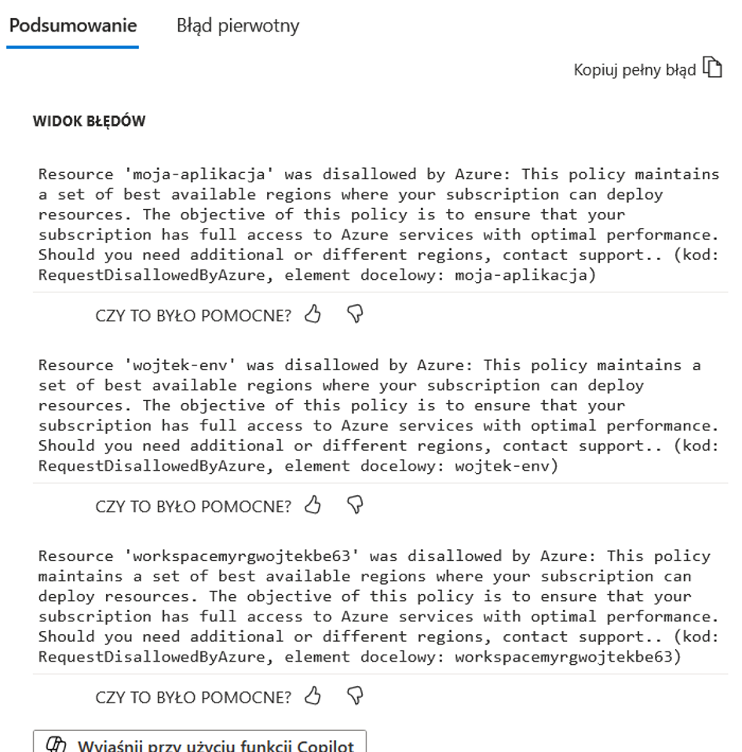
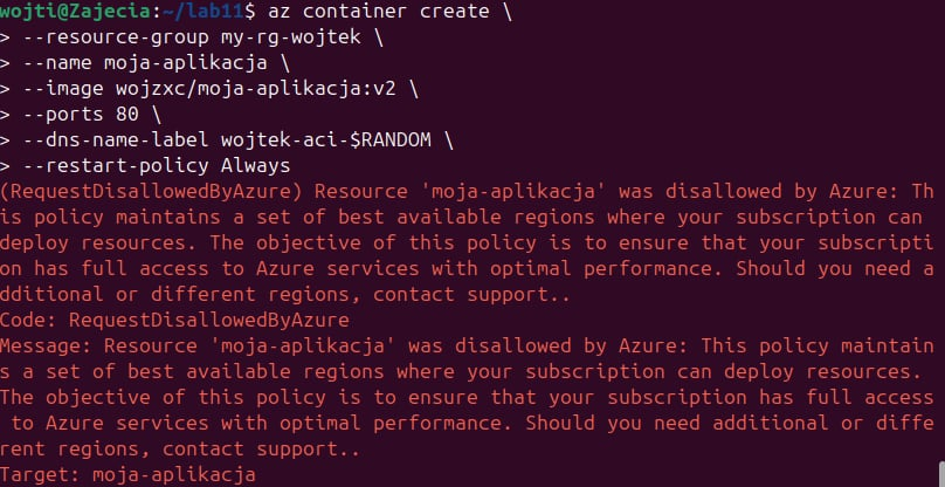
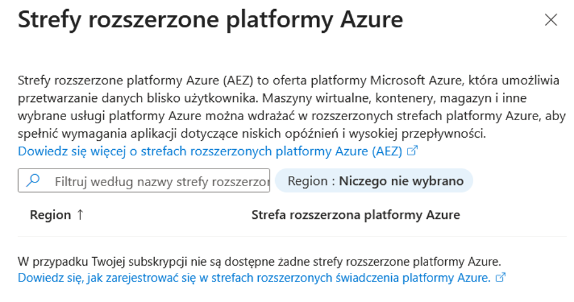
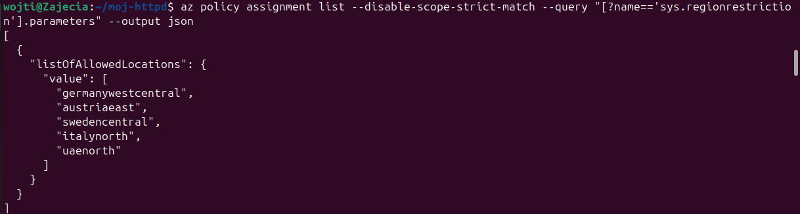
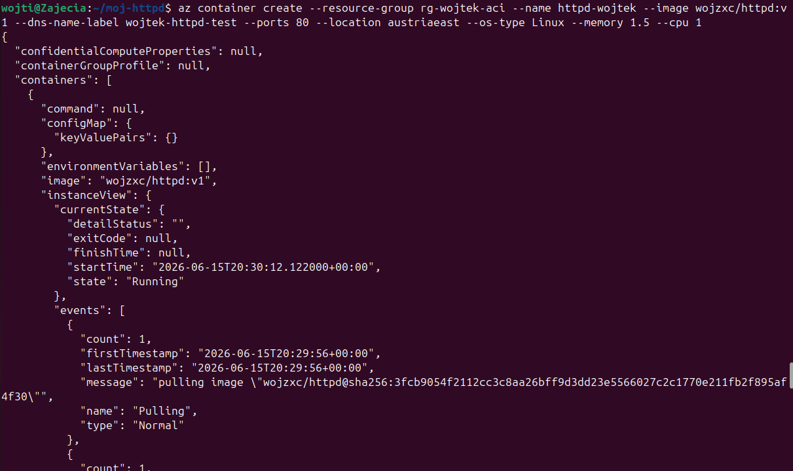
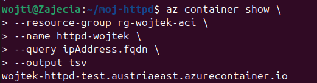
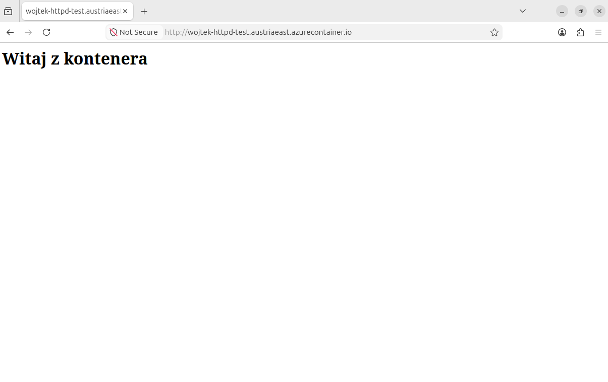
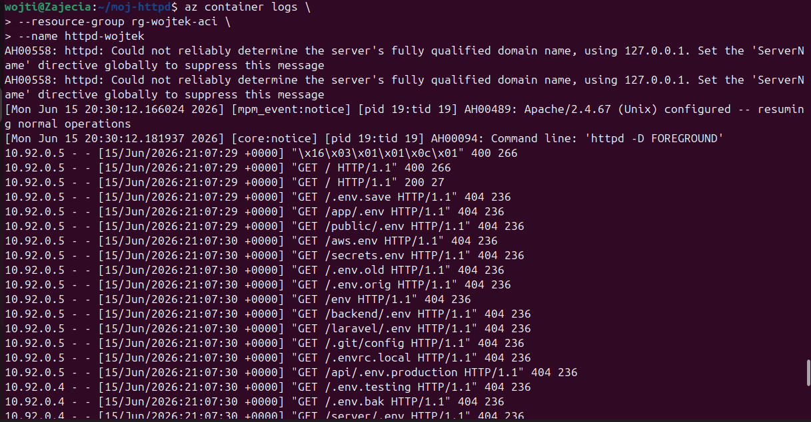
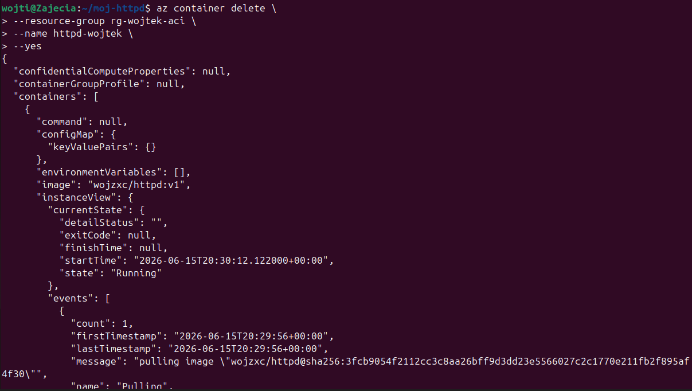
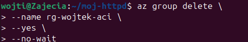

# Sprawozdanie zbiorcze z lab 8-12

## Wojciech Pieńkowski 423391

## Wstęp
Cykl laboratoriów obejmujący zagadnienia od ósmego do dwunastego stanowił logiczne rozwinięcie tematów związanych z metodyką DevOps. Główny nacisk w tej fazie projektowej został położony na automatyzację procesów konfiguracyjnych, realizację instalacji nienadzorowanych, a także na zaawansowaną orkiestrację i chmurowy deployment aplikacji kontenerowych.

Poszczególne etapy pracy charakteryzowały się ścisłą synergią i bezpośrednio ze sobą współgrały. Początkowe ćwiczenia w ramach laboratoriów ósmego i dziewiątego koncentrowały się na eliminacji powtarzalnych zadań administracyjnych. Wykorzystano narzędzie Ansible do deklaratywnego zarządzania konfiguracją systemów, a także przygotowano plik Kickstart, który umożliwił w pełni bezobsługową, zautomatyzowaną instalację bazowego systemu operacyjnego. W tym miejscu zintegrowano środowisko z wcześniejszym etapem pracy, wykorzystując artefakty wytworzone uprzednio w potoku CI/CD serwera Jenkins (podczas laboratoriów od piątego do siódmego) i implementując je bezpośrednio w playbookach Ansible.

## Zajęcia 8, Automatyzacja i zdalne wykonywanie poleceń za pomocą Ansible

### Wstęp 
Laboratorium ósme było pierwszym praktycznym kontaktem z narzędziem Ansible i miało pokazać, jak w prosty sposób zautomatyzować konfigurację systemów oraz wykonywać zdalne operacje administracyjne. Zadanie polegało na przygotowaniu dwóch maszyn wirtualnych: jednej pełniącej rolę sterującej, na której instalowane było Ansible, oraz drugiej - docelowej, na której wykonywane były operacje. Celem było skonfigurowanie bezhasłowej komunikacji SSH, przygotowanie pliku inwentarza oraz stworzenie playbooka wykonującego podstawowe zadania administracyjne. Laboratorium miało również pokazać, czym jest idempotentność i dlaczego jest kluczowa w narzędziach do automatyzacji.

### Opis technologii
Ansible to narzędzie do automatyzacji konfiguracji, które wyróżnia się tym, że działa bez agenta. Maszyna docelowa nie wymaga żadnego dodatkowego oprogramowania poza SSH i Pythonem, co znacząco upraszcza wdrażanie automatyzacji. Ansible działa w sposób deklaratywny: zamiast opisywać krok po kroku, co ma zostać wykonane, definiuje się stan docelowy, a narzędzie samo decyduje, jakie operacje są potrzebne, aby go osiągnąć.

Podstawą działania Ansible jest inventory, czyli plik opisujący hosty i ich grupy. Logika automatyzacji zapisana jest w playbookach w formacie YAML, które zawierają listę zadań wykonywanych na wskazanych hostach. Każde zadanie korzysta z gotowych modułów, takich jak copy, apt, service czy ping. Kluczową cechą Ansible jest idempotentność – wielokrotne uruchomienie tego samego playbooka daje ten sam efekt końcowy, a narzędzie wykonuje tylko te operacje, które są rzeczywiście potrzebne. Dzięki temu automatyzacja jest przewidywalna i bezpieczna.

### Rozwiązanie
W ramach laboratorium przygotowałem dwie maszyny wirtualne: główną, na której zainstalowałem Ansible, oraz docelową, na której miały być wykonywane zadania. Na maszynie docelowej utworzyłem użytkownika przeznaczonego do pracy z Ansible i upewniłem się, że działa na niej serwer SSH. Następnie skonfigurowałem bezhasłowe logowanie, korzystając z ssh-copy-id, co umożliwiło Ansible wykonywanie poleceń bez konieczności podawania hasła. Dodatkowo uzupełniłem plik /etc/hosts, aby obie maszyny mogły komunikować się po nazwach.

Kolejnym krokiem było przygotowanie pliku inventory.ini, w którym zdefiniowałem grupę maszyn sterujących oraz grupę maszyn docelowych. Poprawność konfiguracji sprawdziłem poleceniem ansible -m ping, które potwierdziło, że komunikacja działa prawidłowo.

Następnie przygotowałem playbook playbook.yml, który wykonywał cztery zadania: test łączności, kopiowanie pliku inwentarza na maszynę docelową, aktualizację pakietów systemowych oraz restart wybranych usług. Pierwsze uruchomienie playbooka wprowadziło zmiany w systemie, co zostało oznaczone statusem changed. Drugie uruchomienie wykazało, że Ansible nie wykonuje zbędnych operacji, jeśli system znajduje się już w oczekiwanym stanie - większość zadań zwróciła status ok. To potwierdziło idempotentność działania narzędzia.

Laboratorium pozwoliło mi zrozumieć, jak duże możliwości daje Ansible w kontekście automatyzacji i zarządzania konfiguracją. Playbooki okazały się czytelne i łatwe do utrzymania, a samo narzędzie bardzo intuicyjne. Dzięki temu ćwiczeniu zyskałem solidną podstawę do dalszej pracy z automatyzacją w kolejnych laboratoriach.

## Zajęcia 9, Pliki odpowiedzi dla wdrożeń nienarodzonych 

### Wstęp 
Laboratorium dziewiąte było poświęcone przygotowaniu w pełni automatycznej instalacji systemu Fedora z wykorzystaniem mechanizmu Kickstart. Celem było stworzenie pliku odpowiedzi, który pozwala przeprowadzić instalację systemu bez jakiejkolwiek interakcji użytkownika od konfiguracji dysku, przez instalację pakietów, aż po uruchomienie aplikacji po pierwszym starcie systemu. Zadanie obejmowało najpierw wykonanie klasycznej instalacji Fedory, pobranie wygenerowanego przez instalator pliku anaconda-ks.cfg, a następnie jego modyfikację tak, aby system po instalacji był gotowy do uruchomienia aplikacji w kontenerze Docker. Ostatecznym etapem było uruchomienie nowej maszyny z ISO i wskazanie jej przygotowanego pliku odpowiedzi, co pozwoliło zweryfikować, że instalacja przebiega całkowicie automatycznie.

### Technologie

Mechanizm Kickstart jest częścią instalatora Anaconda stosowanego w systemach Fedora, RHEL i CentOS. Pozwala on opisać całą instalację systemu w jednym pliku tekstowym od ustawień regionalnych, przez partycjonowanie dysku, po listę pakietów i polecenia wykonywane po instalacji. Dzięki temu instalacja może przebiegać całkowicie bezobsługowo, co jest kluczowe w środowiskach serwerowych, automatyzacji testów czy wdrażaniu wielu maszyn jednocześnie.

Plik Kickstart składa się z kilku sekcji. Pierwsza część zawiera podstawowe ustawienia systemu, takie jak język, układ klawiatury, konfigurację sieci czy hasła użytkowników. Kolejna sekcja %packages definiuje listę pakietów, które mają zostać zainstalowane. Najbardziej elastycznym elementem jest sekcja sekcja_post, wykonywana po zakończeniu instalacji, już w środowisku docelowego systemu. To właśnie tam można umieścić polecenia konfigurujące usługi, pobierające pliki, instalujące oprogramowanie czy tworzące własne skrypty startowe.

Kickstart pozwala również korzystać z repozytoria_Fedora, co umożliwia instalację systemu nawet wtedy, gdy obraz ISO nie zawiera wszystkich potrzebnych pakietów. Plik odpowiedzi można udostępnić instalatorowi na wiele sposobów - przez HTTP, FTP, NFS lub jako plik lokalny. W laboratorium wykorzystano najprostszy wariant: serwer HTTP uruchomiony na pierwszej maszynie.

### Rozwiązanie 
Pracę rozpocząłem od wykonania klasycznej instalacji Fedory w maszynie wirtualnej. Po jej zakończeniu instalator automatycznie wygenerował plik /root/anaconda-ks.cfg, który stanowił punkt wyjścia do przygotowania własnego pliku odpowiedzi. W pliku tym znajdowały się wszystkie ustawienia wybrane podczas instalacji, jednak wymagał on kilku modyfikacji, aby nadawał się do w pełni automatycznego wdrożenia.

Najważniejszą zmianą było zastąpienie dyrektywy clearpart --none poleceniem clearpart --all --initlabel, które wymusza wyczyszczenie całego dysku niezależnie od jego wcześniejszej zawartości. Następnie dodałem repozytoria sieciowe Fedory, aby instalator mógł pobierać pakiety z internetu, co jest niezbędne przy minimalnych obrazach ISO. Ustawiłem również własny hostname, a w sekcji pakietów dodałem docker, curl i wget, ponieważ system po instalacji miał automatycznie uruchamiać aplikację działającą w kontenerze.

Najważniejsza część znajdowała się w sekcji %post. Umieściłem tam skrypt, który przygotowywał środowisko do uruchomienia aplikacji Express.js w kontenerze Docker. Skrypt tworzył plik /usr/local/bin/start-express.sh, odpowiedzialny za uruchomienie kontenera, oraz definicję usługi systemowej express-app.service, która startowała automatycznie przy każdym uruchomieniu systemu. Zastosowanie dyrektywy systemctl enable pozwoliło ominąć ograniczenie, że Docker nie działa jeszcze podczas samej instalacji - kontener uruchamiał się dopiero po pierwszym restarcie systemu.

Po przygotowaniu pliku ks-modified.cfg udostępniłem go przez prosty serwer HTTP uruchomiony poleceniem python3 -m http.server. Następnie stworzyłem nową maszynę wirtualną i podczas bootowania dopisałem do parametrów startowych GRUB polecenie inst.ks=http://<adres>/ks-modified.cfg. Instalator pobrał plik odpowiedzi i przeprowadził całą instalację automatycznie, bez żadnej interwencji. Po restarcie systemu zweryfikowałem, że hostname został ustawiony poprawnie, Docker działa jako usługa, a aplikacja odpowiada na porcie 3000. Cały proces potwierdził, że przygotowany plik Kickstart działa zgodnie z założeniami.

## Zajęcia 10, Wdrażanie na zarządzalne kontenery: Kubernetes

### Wstęp

Laboratorium dziesiąte było pierwszym praktycznym spotkaniem z platformą Kubernetes i miało na celu zrozumienie podstawowych mechanizmów orkiestracji kontenerów. Zadanie polegało na uruchomieniu lokalnego klastra przy użyciu Minikube, sprawdzeniu działania komponentów systemowych oraz wdrożeniu prostej aplikacji kontenerowej w formie pojedynczego poda, a następnie w formie deploymentu z wieloma replikami. Laboratorium miało pokazać różnicę między uruchamianiem kontenera „ręcznie” a zarządzaniem nim przez Kubernetes, a także wprowadzić pojęcia takie jak Pod, Deployment i Service. 

### Technologia 

Kubernetes to platforma służąca do automatycznego zarządzania kontenerami w skali. W odróżnieniu od Dockera, który uruchamia pojedyncze kontenery, Kubernetes zarządza ich cyklem życia, skalowaniem, aktualizacjami i odpornością na awarie. Najmniejszą jednostką w Kubernetesie jest Pod, logiczna kapsuła zawierająca jeden lub kilka kontenerów współdzielących sieć i zasoby. Pody są efemeryczne, dlatego w praktyce nie uruchamia się ich bezpośrednio, lecz korzysta z Deployment, który deklaruje pożądany stan aplikacji, np. liczbę replik i wersję obrazu. Deployment automatycznie tworzy i utrzymuje ReplicaSet, który dba o to, aby zawsze działała odpowiednia liczba podów.

Aby udostępnić aplikację na zewnątrz, Kubernetes wykorzystuje obiekt Service, który zapewnia stabilny punkt dostępu do zestawu podów, niezależnie od tego, ile ich jest i jak często są wymieniane. W środowisku lokalnym Minikube udostępnia uproszczony mechanizm port-forward, który pozwala przekierować ruch z portu hosta do portu kontenera działającego w klastrze.

Minikube jest lekką implementacją Kubernetes, która uruchamia cały klaster na jednej maszynie. Dzięki temu idealnie nadaje się do nauki i testowania konfiguracji bez konieczności korzystania z chmury.

### Rozwiązanie 
Pracę rozpocząłem od instalacji Minikube. Następnie uruchomiłem klaster poleceniem minikube start --driver=docker, co spowodowało utworzenie lokalnej maszyny wirtualnej z pełnym środowiskiem Kubernetes. Po starcie klastra zweryfikowałem działanie komponentów systemowych, korzystając z polecenia minikube kubectl -- get pods -A. Wszystkie podstawowe elementy, takie jak kube-apiserver, etcd, kube-scheduler czy kube-proxy, znajdowały się w stanie Running, co potwierdziło poprawne działanie środowiska.

Pierwszym wdrożeniem była aplikacja Express.js uruchomiona jako pojedynczy Pod. Wykorzystałem polecenie kubectl run, które tworzy Pod bezpośrednio na podstawie obrazu Docker. Aplikacja została uruchomiona w kontenerze Node.js, a jej działanie zweryfikowałem za pomocą port-forward, przekierowując port 3000 z poda na port 9090 hosta. Po wykonaniu curl aplikacja zwróciła odpowiedź, co potwierdziło, że Pod działa poprawnie.

Następnie przygotowałem deklaratywny plik YAML opisujący Deployment z czterema replikami tej samej aplikacji. Po zastosowaniu pliku poleceniem kubectl apply Kubernetes automatycznie utworzył ReplicaSet i cztery identyczne Pody. Ich stan zweryfikowałem poleceniem kubectl get pods, które pokazało wszystkie repliki w stanie Running. Aby udostępnić aplikację, utworzyłem Service typu NodePort i ponownie użyłem port-forward, tym razem na poziomie serwisu. Aplikacja była dostępna pod adresem localhost:9091, co potwierdziło poprawne działanie całego wdrożenia.

Laboratorium pokazało mi praktyczną różnicę między uruchamianiem pojedynczego kontenera a zarządzaniem aplikacją w Kubernetesie. Deklaratywny model wdrożeń, automatyczne skalowanie i odporność na awarie sprawiają, że Kubernetes jest znacznie bardziej elastyczny i przewidywalny niż tradycyjne podejście oparte na Dockerze. To ćwiczenie stanowiło solidne wprowadzenie do bardziej zaawansowanych mechanizmów, które pojawiły się w kolejnym laboratorium.

## Zajęcia 11, Wdrażanie na zarządzalne kontenery: Kubernetes

### Wstęp 
Laboratorium jedenaste było kontynuacją pracy z Kubernetesem i skupiało się na bardziej zaawansowanych mechanizmach zarządzania wdrożeniami. Celem zajęć było przygotowanie kilku wersji obrazu aplikacji, wdrożenie ich w klastrze oraz obserwacja zachowania Kubernetes podczas aktualizacji, skalowania i awarii. W ramach ćwiczenia zbudowałem różne wersje obrazu Docker, wdrożyłem je jako Deployment, przetestowałem skalowanie replik, przeprowadziłem aktualizację typu Rolling Update, a także celowo wdrożyłem wadliwą wersję aplikacji, aby sprawdzić, jak Kubernetes reaguje na błędy.

### Rozwiązanie 
Pracę rozpocząłem od przygotowania trzech wersji obrazu aplikacji. Pierwsza wersja była stabilna i zwracała poprawną odpowiedź. Druga wersja zawierała drobną zmianę w treści odpowiedzi, co pozwalało łatwo zweryfikować, że aktualizacja została zastosowana. Trzecia wersja była celowo wadliwa - aplikacja natychmiast kończyła działanie, co symulowało błąd konfiguracyjny. Wszystkie obrazy zostały zbudowane lokalnie i opublikowane w Docker Hub.

Następnie przygotowałem plik Deploymentu, który uruchamiał cztery repliki aplikacji w wersji pierwszej. Po wdrożeniu poleceniem kubectl apply Kubernetes utworzył ReplicaSet i cztery działające Pody. Skalowanie przetestowałem, zwiększając liczbę replik do ośmiu, a następnie zmniejszając do zera i ponownie przywracając cztery. Kubernetes natychmiast reagował na zmiany, tworząc lub usuwając Pody zgodnie z deklaracją.

Kolejnym etapem była aktualizacja obrazu z wersji pierwszej na drugą. Po zmianie pola image w pliku YAML i ponownym kubectl apply Kubernetes przeprowadził Rolling Update - nowe Pody uruchamiały się stopniowo, a stare były usuwane dopiero po potwierdzeniu, że nowe działają poprawnie. Po wykonaniu port-forward aplikacja zwróciła odpowiedź z wersji drugiej, co potwierdziło poprawność aktualizacji.

Następnie wdrożyłem wersję wadliwą. Kubernetes natychmiast wykrył, że nowe Pody crashują i zatrzymał rollout. Stare Pody pozostały działające, dzięki czemu aplikacja była nadal dostępna. To zachowanie idealnie pokazuje, jak Kubernetes chroni środowisko przed błędnymi wdrożeniami.

Aby przywrócić poprzednią wersję, wykonałem kubectl rollout undo, co natychmiast przywróciło działającą wersję drugą. Historia wdrożeń była dostępna przez kubectl rollout history, co pozwalało prześledzić wszystkie zmiany.

Na koniec przetestowałem strategię Recreate, obserwując pełne zatrzymanie starych Podów przed uruchomieniem nowych, oraz wdrożenie typu Canary, w którym niewielka część ruchu była kierowana do nowej wersji aplikacji działającej w osobnym Deploymentcie.

Laboratorium pokazało, jak potężnym narzędziem jest Kubernetes w kontekście zarządzania cyklem życia aplikacji. Mechanizmy aktualizacji, skalowania, ochrony przed błędami i rollbacku sprawiają, że wdrożenia są przewidywalne, bezpieczne i łatwe do kontrolowania. To ćwiczenie stanowiło naturalne przejście do pracy z chmurą w kolejnym laboratorium.

## Zajęcia 12, Wdrażanie na zarządzalne kontenery w chmurze Azure

### Wstęp
Laboratorium 12 polegało na wdrożeniu własnego obrazu kontenera z Docker Hub do chmury Microsoft Azure z wykorzystaniem usługi Azure Container Instances. Celem było przejście pełnej ścieżki: przygotowanie obrazu, uruchomienie kontenera w wybranym regionie, uzyskanie dostępu do aplikacji HTTP z internetu, analiza logów oraz poprawne usunięcie wszystkich zasobów, tak aby nie generowały dalszych kosztów. Dodatkowo w trakcie pracy pojawiły się realne problemy z politykami regionów i dostępnością obrazu, więc laboratorium zamieniło się w bardzo praktyczne ćwiczenie z debugowania wdrożeń w chmurze.

### Technologia
Azure Container Instances to usługa, która pozwala uruchomić pojedynczy kontener Docker bez konieczności tworzenia całego klastra Kubernetes czy zarządzania maszynami wirtualnymi. Podajemy obraz, parametry zasobów, porty oraz etykietę DNS, a Azure uruchamia kontener i nadaje mu publiczny adres FQDN. W odróżnieniu od Kubernetes, ACI nie oferuje zaawansowanej orkiestracji, skalowania czy strategii wdrożeń, ale idealnie nadaje się do prostych, krótkotrwałych wdrożeń i testów.

Istotnym elementem w tym laboratorium okazały się polityki subskrypcji. Azure może ograniczać dostępne regiony, w których wolno tworzyć zasoby. Próba wdrożenia kontenera w regionie spoza listy dozwolonych kończy się błędem typu RequestDisallowedByAzure. Dlatego oprócz samego ACI trzeba było zrozumieć, jak odczytać polityki i dopasować konfigurację do faktycznie dostępnych lokalizacji.

### Przebieg laboratoriów

Na początku, zgodnie z typowym scenariuszem ACI, została przygotowana komenda az container create, która miała utworzyć kontener z własnym obrazem z Docker Hub. Próba wdrożenia zakończyła się jednak błędem RequestDisallowedByAzure - zarówno w portalu Azure, jak i w Azure CLI pojawiła się informacja, że zasób o nazwie moja-aplikacja jest zablokowany przez politykę regionów. Komunikat wyjaśniał, że subskrypcja może korzystać tylko z wybranych „najlepszych” regionów i że w razie potrzeby innych lokalizacji należy kontaktować się z pomocą techniczną. To był pierwszy ważny wniosek: nawet poprawna komenda CLI nie zadziała, jeśli region jest niezgodny z polityką.

Dalsza analiza w portalu Azure pokazała też ekran dotyczący tzw. stref rozszerzonych (Azure Extended Zones), gdzie wyświetlała się informacja, że dla tej subskrypcji nie są dostępne żadne strefy rozszerzone. To potwierdziło, że środowisko studenckie ma dość mocno ograniczony zakres regionów i funkcji.

Żeby dowiedzieć się, jakie regiony są faktycznie dozwolone, użyta została komenda az policy assignment list z odpowiednim filtrem. Jej wynik zawierał parametr listOfAllowedLocations z listą regionów, m.in. germanywestcentral, austriaeast, swedencentral, italynorth, uaenorth. Na tej podstawie można było świadomie wybrać region, który na pewno przejdzie przez politykę.

Po ustaleniu listy dozwolonych lokalizacji kolejnym krokiem było dostosowanie komend CLI. Została utworzona grupa zasobów w jednym z dostępnych regionów, a następnie ponownie wywołano az container create, tym razem z poprawnym regionem i własnym obrazem z Docker Hub. Wcześniej pojawiał się też błąd typu InaccessibleImage, który wynikał z tego, że obraz o podanej nazwie i tagu nie istniał lokalnie ani w rejestrze pod tym dokładnym tagiem. Po zbudowaniu obrazu lokalnie i poprawnym wypchnięciu go na Docker Hub  problem z dostępnością obrazu zniknął i ACI był w stanie go pobrać.

Kolejna próba utworzenia kontenera zakończyła się sukcesem - komenda az container create zwróciła szczegółowy opis utworzonej grupy kontenerów, a w sekcji instanceView.currentState stan kontenera był oznaczony jako Running. To oznaczało, że obraz został poprawnie pobrany z Docker Hub, kontener wystartował, a usługa HTTP wewnątrz niego działa.

Następnie trzeba było uzyskać publiczny adres, pod którym kontener jest widoczny z internetu. W tym celu użyto komendy:

Wynikiem był FQDN w stylu wojtek-httpd-test.austriaeast.azurecontainer.io. Po wpisaniu tego adresu w przeglądarce pojawiła się prosta strona z napisem „Witaj z kontenera”, co było jednoznacznym potwierdzeniem, że kontener HTTP działa, port został poprawnie wystawiony, a DNS po stronie Azure został skonfigurowany automatycznie. Nie trzeba było ręcznie tworzyć żadnych rekordów DNS ani konfigurować load balancera.

Kolejnym elementem laboratorium była analiza logów kontenera. Za pomocą komendy:

pobrano logi serwera Apache działającego wewnątrz kontenera. W logach widać było standardowe komunikaty startowe oraz wpisy HTTP z kodem 200 dla żądań na /. Co ciekawe, pojawiło się też wiele żądań próbujących odczytać pliki .env, env.old, secrets.env i podobne, wszystkie kończyły się kodem 404. To bardzo realistyczna sytuacja: publicznie wystawiony serwer w chmurze jest szybko skanowany przez automatyczne boty szukające wrażliwych plików konfiguracyjnych. Z punktu widzenia laboratorium był to dobry przykład, dlaczego nie wolno trzymać sekretów w katalogu serwowanym przez HTTP.

Na koniec, zgodnie z wymaganiami zadania, należało posprzątać zasoby. Najpierw usunięto sam kontener poleceniem:

a następnie całą grupę zasobów:

Usunięcie grupy zasobów jest szczególnie ważne w kontekście subskrypcji studenckiej - wszystkie zasoby w jej obrębie przestają istnieć, więc nie generują dalszych kosztów. To domyka pełny cykl: od wdrożenia, przez weryfikację działania, po odpowiedzialne sprzątanie.

### Wnioski
Laboratorium 12 pokazało w praktyce, jak wygląda wdrożenie kontenera z Docker Hub do chmury Azure przy użyciu ACI, ale też jak bardzo realne są ograniczenia narzucane przez polityki subskrypcji. Błąd RequestDisallowedByAzure wymusił zrozumienie, w jakich regionach wolno tworzyć zasoby i jak to sprawdzić z poziomu CLI. Problemy z obrazem przypomniały, że poprawny tag i dostępność obrazu w rejestrze są kluczowe. Udało się doprowadzić do działającego wdrożenia, uzyskać publiczny FQDN, zobaczyć stronę w przeglądarce, przeanalizować logi serwera oraz poprawnie usunąć kontener i grupę zasobów. W efekcie to laboratorium było nie tylko, ale też bardzo konkretną lekcją o tym, jak naprawdę wygląda debugowanie i zarządzanie wdrożeniami w chmurze.