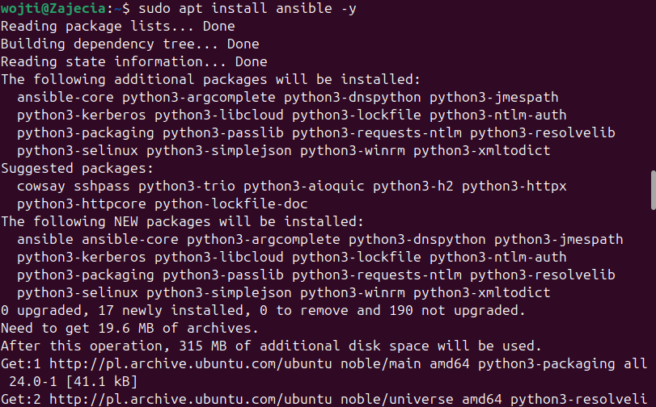
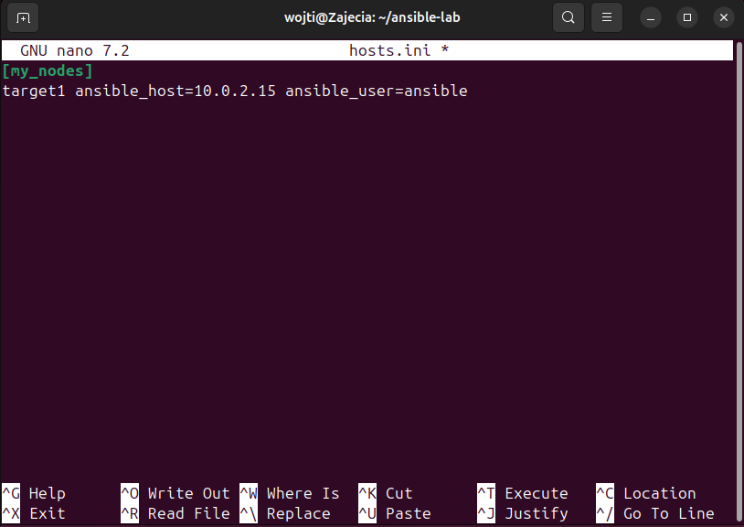
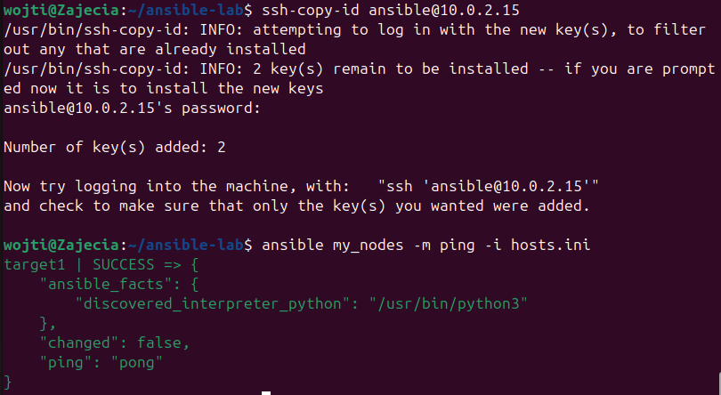
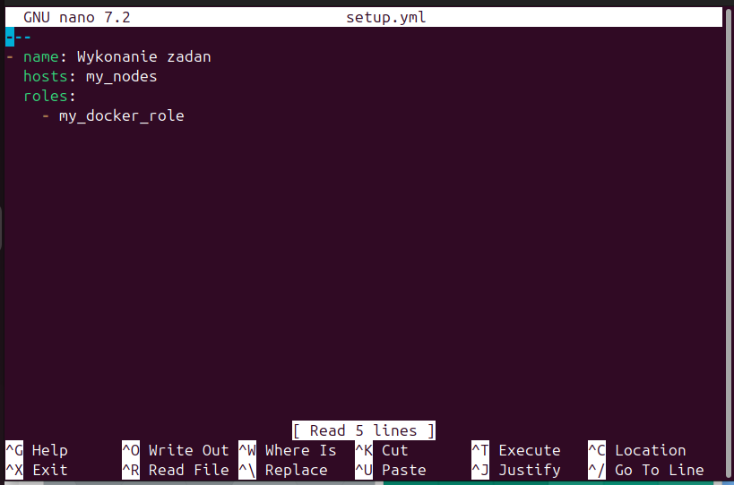
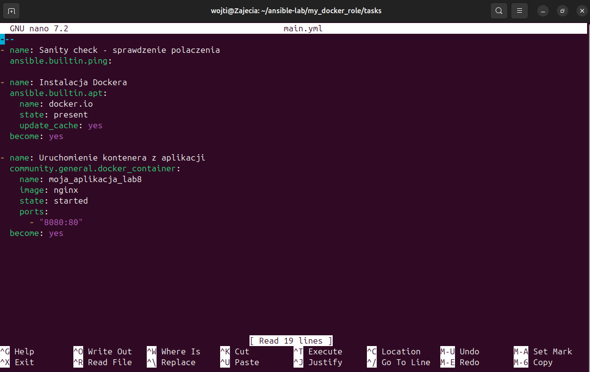
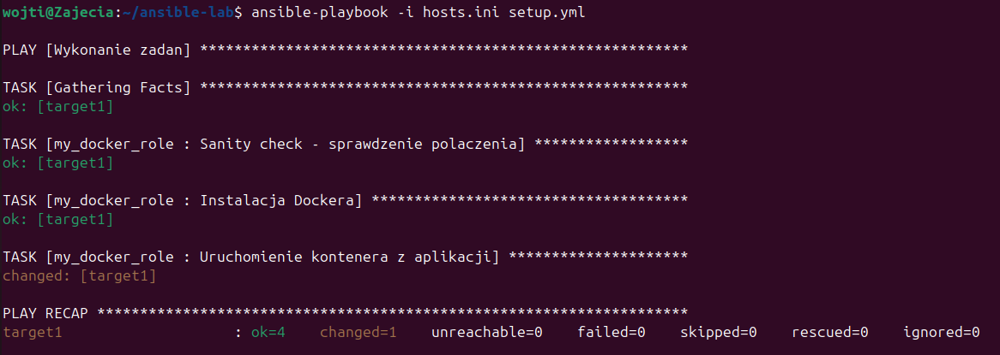
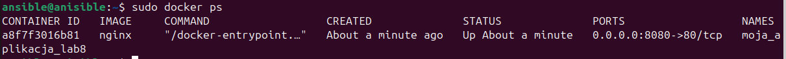
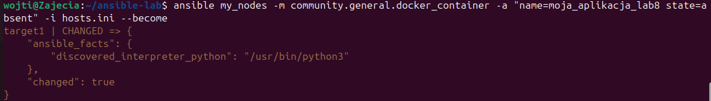

# Zajęcia 08 - Automatyzacja i zdalne wykonanie za pomocą Ansible 
## Wojciech Pieńkowski

---

### Instalacja oprogramowania Ansible na maszynie sterującej (Orkiestratorze) przy użyciu menadżera pakietów apt.

### Konfiguracja pliku inwentaryzacji host.ini, w którym zdefiniowano grupę [my_nodes] oraz parametry dostępu SSH do maszyny docelowej.

### Skuteczna wymiana kluczy SSH za pomocą ssh-copy-id praz weryfikacja łączności ping.

### Przygotowanie głównego playbooka setup.yml, który wykorzystuje strukture ról do zachowania czystości.

### Implementacja zadań wewnątrz roli, obejmująca sanity check, instalacje silnika docker i uruchomienia kontenera.

### Pomyślnie uruchomienie pełnego procesu automatyzacji.

### Ręczna weryfikacja stanu maszyny docelowej komendą sudo docker ps, obecność dockera potwierdza poprawne uruchomienie.

### Czyszczenie środowiska przy użyciu polecenia ad-hoc.

