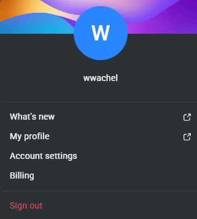
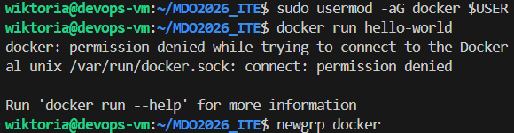
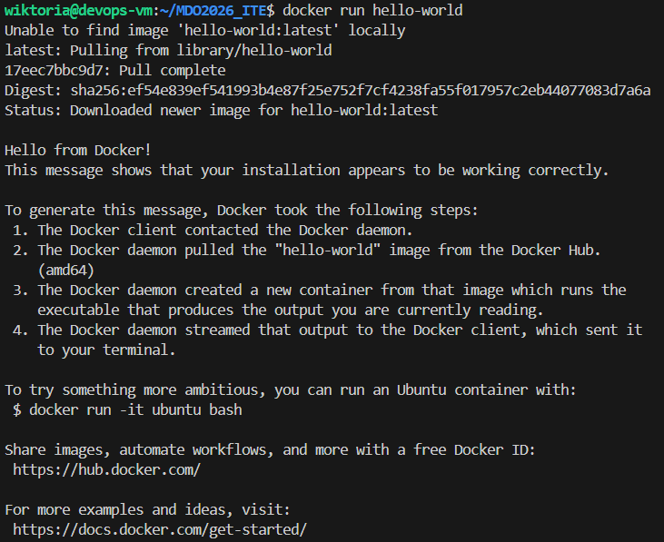
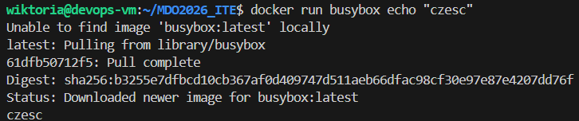
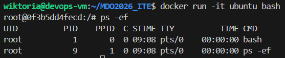
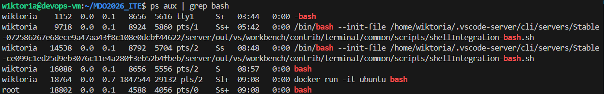

### 1. Rejestracja w DockerHub

### 2. Rejestracja w DockerHub

### 3. Praca z obrazami i kontenerami

### 4. Lista kontenerów oraz sprawdzenie wersji

### 5. Sprawdzenie kodu wyjścia

### 6. Prezentacja PID

### 7. Budowanie własnego obrazu

### 6. Porządki

