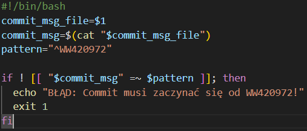
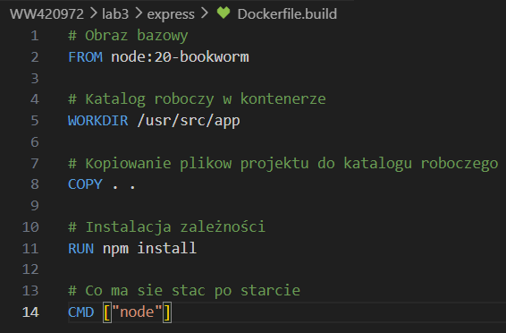
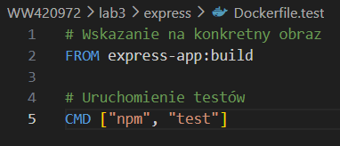
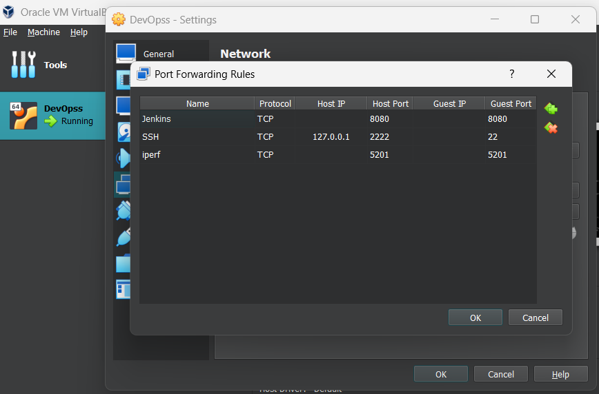

# Sprawozdanie zbiorcze z laboratoriów 1-4

## Lab 1: Git, gałęzie, klucze SSH, narzędzia
 **Git -** jest to narzędzie które pozwala na śledzenie historii zmian w kodzie oraz efektywną współpracę wielu osób nad jednym projektem. W ramach ćwiczenia zainstalowano Git'a, co umożliwiło lokalne zarządzanie repozytorium i komunikację z serwerem zdalnym (GitHub).

#### **Metody uwierzytelniania: HTTPS + PAT vs SSH**
W ramach konfiguracji dostępu do zdalnego repozytorium GitHub wykorzystano i przetestowano dwie główne metody uwierzytelniania. Obie służą do bezpiecznej identyfikacji użytkownika, jednak różnią się sposobem działania oraz konfiguracją.

**HTTPS z wykorzystaniem PAT -** zamiast tradycyjnego hasła do konta, które ze względów bezpieczeństwa jest blokowane w operacjach terminalowych, Git wymaga użycia Personal Access Token (PAT). Token pełni rolę unikalnego, silnego hasła z określonym zakresem uprawnień i datą ważności. Nie wymaga generowania kluczy na systemie operacyjnym; działa natychmiastowo na dowolnym urządzeniu z dostępem do sieci. Jednak konieczne jest manualne kopiowani i bezpieczne przechowywania tokena, który po wygaśnięciu musi zostać wygenerowany ponownie.

**Protokół SSH -** Wykorzystuje parę kluczy: prywatny (zabezpieczony na komputerze użytkownika) oraz publiczny (przekazany do serwera GitHub). Podczas komunikacji serwer sprawdza, czy użytkownik posiada pasujący klucz prywatny. Umożliwia w pełni zautomatyzowane połączenie bez potrzeby wpisywania hasła przy każdej operacji `push` czy `pull`. Wyższy poziom bezpieczeństwa i wygoda użytkowania po jednorazowej konfiguracji. Klucz prywatny nigdy nie jest przesyłany przez sieć. Wymaga wstępnej generacji kluczy w systemie operacyjnym i poprawnej konfiguracji agenta SSH.

**Git Hooks** to skrypty wyzwalane automatycznie przez określone zdarzenia w cyklu pracy Git. W zadaniu wykorzystano hook typu pre-commit, który weryfikuje poprawność komunikatu commita przed jego zapisaniem. Największą zaletą jest to że wymusza standardy nazewnictwa w zespole co ułatwia późniejszą analizę historii zmian

#### **Przydatne komendy:**
`git clone "ścieżka-do-repozytorium"` - sklonowanie repozytorium

`git checkout "nazwa-brancha"` - przejście na nowy branch

`git checkout -b "nowa-nazwa-brancha"` - utworzenie i przejście na nowy branch

`git pull` - pobieranie z serwera nowych zmian 

## Lab 2: Docker
W ramach zajęć przygotowano środowisko oparte na silniku Docker. Jest to technologia pozwalająca na "pakowanie" aplikacji wraz z ich wszystkimi zależnościami do izolowanych kontenerów.

**Docker Hub -** to publiczne repozytorium gotowych obrazów. W ramach zadania przeanalizowano różne rodzaje obrazów pod kątem ich zastosowań i rozmiarów:
- **Obrazy bazowe (Ubuntu, Fedora):** Pełne systemy operacyjne, służące jako fundament pod złożone aplikacje.
- **Obrazy narzędziowe (BusyBox):** Niezwykle lekkie obrazy zawierające podstawowe komendy Unix, idealne do diagnostyki.
- **Obrazy dedykowane (MariaDB, .NET SDK/Runtime):** Zoptymalizowane pod konkretne technologie (bazy danych, środowiska programistyczne).
- **Rozmiar i kod wyjścia:** Analiza wykazała, że obrazy różnią się znacząco rozmiarem (od kilku MB dla BusyBox do kilkuset MB dla .NET SDK). Kod wyjścia (Exit Code) pozwolił zweryfikować, czy proces wewnątrz kontenera zakończył się sukcesem (0) czy błędem.

**Praca interaktywna i izolacja procesów -** konteneryzacja zapewnia wysoką izolację procesów. Podczas ćwiczenia zaobserwowano mechanizm PID 1:
- Wewnątrz kontenera główny proces (np. /bin/bash) posiada identyfikator PID 1, co sugeruje, że jest on "systemem samym w sobie".
- Na hoście proces ten jest widoczny z zupełnie innym numerem PID, co dowodzi, że kontener jest jedynie odizolowaną grupą procesów zarządzaną przez jądro systemu.

**Budowa własnego obrazu -** Dockerfile to skrypt zawierający instrukcje niezbędne do automatycznego zbudowania obrazu. W zadaniu stworzono plik bazujący na systemie Linux, w którym:
- Zainstalowano klienta Git.
- Skonfigurowano automatyczne klonowanie repozytorium przedmiotowego.

#### **Przydatne komendy:**
`docker pull "nazwa-obrazu"` - pobiera obraz z repozytorium

`docker images` - wyświetla listę wszystkich pobranych obrazów, ich taki oraz rozmiar na dysku

`docker inspect "ID/nazwa-obrazu"` - wyświetla szczegółowe dane techniczne w formacie JSON

`docker run "nazwa-obrazu"` - rozpoczęcie pracy kontenera 

`docker run -it "nazwa-obrazu"` - uruchomienie kontenera w trybie aktywnym (wejście do środka)

`echo $?` - po zakończeniu pracy kontenera, można wywołać komendę która sprawdza jaki jest jego kod wyjścia

`ps -ef` - wywołane w środku kontenera pokazuje liste procesów które w nim działają

`docker build -t "nowa-nazwa-obrazu" .` - buduje nowy obraz na podstawie pliku Dockerfile znajdującego się w bieżącym katalogu 

`docker ps` - pokazuję listę aktualnie działających kontenerów, po dodaniu `-a` również te zakończone

`docker rm "ID-obrazu"` - usuwa konkretny, zakończony kontener,  

`docker rmi "ID/nazwa-obrazu"` - obraz z lokalnego magazynu (tylko jeżeli żaden kontener go nie używa), 

## Lab 3: Dockerfiles - podział na etapy
**Etap Build -** odpowiada za przygotowanie środowiska, instalację narzędzi budowania i przeprowadzenie kompilacji kodu. Efektem końcowym jest obraz zawierający gotowy artefakt.

**Etap Test -** bazuje bezpośrednio na obrazie stworzonym w pierwszym kroku (`FROM nazwa_pierwszego_obrazu`). Jego jedynym zadaniem jest uruchomienie zdefiniowanych testów jednostkowych.

Dzięki takiemu podziałowi, jeśli kod się nie zmieni, testy mogą być uruchamiane wielokrotnie na tym samym "zbudowanym" fundamencie, co oszczędza czas i zasoby.

#### **Obraz vs kontener**
**Obraz -** statyczny, niezmienny "przepis" lub zamrożony stan systemu plików. Jest to definicja etapu przechowywana na dysku.

**Kontener -** uruchomiona instancja obrazu. Jest to żywy proces w systemie operacyjnym. Korzysta z niego konkretny proces.

#### **Przydatne komendy:**

`docker build -f "nazwa-dockerfile-build" -t "nazwa-obrazu":build .` - buduje pierwszy etap, `-t` nadaje obrazowi nazwe i tag

`docker build -f "nazwa-dockerfile-test" -t "nazwa-obrazu":test .` - buduje drugi etap, który bazuje na pierwszym 

## Lab 4: Dodatkowa terminologia w konteneryzacji, instancja Jenkins
Kluczowym elementem pracy z kontenerami jest zapewnienie trwałości danych po usunięciu kontenera. W zadaniu przetestowano dwa podejścia:

**Volumes -** zarządzane przez Dockera, izolowane od struktury plików hosta. Idealne do przechowywania baz danych i wyników budowania.

**Bind Mounts -** bezpośrednie mapowanie katalogu z hosta do kontenera. Pozwala na natychmiastowy dostęp hosta do plików wewnątrz kontenera.

Aby zachować "czystość" kontenera budującego (brak narzędzia Git), wykorzystano **wolumin wejściowy**. Kod źródłowy został dostarczony do woluminu za pomocą kontenera pomocniczego (tymczasowy kontener z zainstalowanym Gitem pobrał kod bezpośrednio na współdzielony wolumin).

W pliku Dockerfile każda komenda `RUN` tworzy nową warstwę obrazu i zrobienie tam `git clone` niepotrzebnie go powiększa. Komenda `RUN --mount=type=bind` pozwala na tymczasowe podłączenie folderu z kodem tylko na czas budowania.

**Iperf3 -** narzędzie do sprawdzenia prędkości sieci. Aby ją zmierzyć potrzeba dwóch urządzeń: 
- **serwera** - `iperf -s`
- **klienta** - `iperf3 -c 172.17.0.2`

#### **Łączność sieciowa:**
- **Domyślna sieć -** kontenery komunikują się przez adresy IP
- **Dedykowana sieć mostkowa -** kontenery łączą się ze soba po nazwie
- **Eksponowanie portów -** mapowanie portu kontenera na port hosta (`-p 8080:8080`) umożliwiło dostęp do usług (np serwera Jenkins) spoza maszyny wirtualnej

#### **Przygotowanie do uruchomienia serwera Jenkins**
Tworzenie dedykowanej sieci mostkowej - aby Jenkins mógł połączyć sie z kontenerem Dockera za pomocą nazwy DNS, a nie zmiennej IP   
`docker network create jenkins`

Tworzenie woluminu na certyfikaty TLS - oba kontenery będą mogły bezpiecznie (szyfrowanie) rozmawiac ze sobą   
`docker volume create jenkins-docker-certs`   
Wolumin na dane Jenkinsa - bez tego po restarcie kontenera Jenins byłby całkowicie czysty   
`docker volume create jenkins-data`

Kontener "pomocnik" - jest silnikiem dockera, którego Jenkins będzie używał do budowania obrazów   
`docker run --name jenkins-docker --rm --detach --privileged --network jenkins --network-alias docker --env DOCKER_TLS_CERTDIR=/certs --volume jenkins-docker-certs:/certs/client --volume jenkins-data:/var/jenkins_home docker:dind`
- `--privileged` - daje kontenerowi uprawnienia administratora na hoście, jest niezbędne aby docker mógł uruchamiać kontenery wewnątrz kontenera
- `--network-alias docker` - nadaje kontenerowi nazwe której Jenkins będzie szukał (`tcp://docker:2376`)
- `--env DOCKER_TLS_CERTDIR=/certs` - nakazuje dockerowi generowania certyfikatów bezpieczeństwa w podanym folderze
- `--volume jenkins-docker-certs:/certs/client` - udostępnia te certyfikaty do woluminu, skąd Jenkins będzie z nich korzystał
- `docker:dind` - obraz zawierający silnik dockera

Właściwy serwer Jenkins - to jest interfejs który jest widoczny w przeglądarce   
`docker run --name jenkins-blueocean --rm --detach --network jenkins --env DOCKER_HOST=tcp://docker:2376 --env DOCKER_CERT_PATH=/certs/client --env DOCKER_TLS_VERIFY=1 --publish 8080:8080 --publish 50000:50000 --volume jenkins-data:/var/jenkins_home --volume jenkins-docker-certs:/certs/client:ro jenkins/jenkins:lts`
- `--env DOCKER_HOST=tcp://docker:2376` - powiadamia Jenkinsa pod jaką nazwą może znaleźć dockera
- `--env DOCKER_TLS_VERIFY=1` - Jenkins musi sprawdzać certyfikaty (bezpieczne połączenie)
- `--publish 8080:8080` - mapuje port interfejsu 
- `--publish 50000:50000` - port dla agentów Jenkinsa
- `:ro` - Read-Only, Jenkins może tylko czytac certyfikaty, ale nie moze ich zmienić ani usunąć

W VirtualBox należało dodać portu z którego będzie korzystał interfejs:

#### **Przydatne komendy:**
`docker volume create "nazwa-woluminu"` - stworzenie woluminu 

`docker run --rm -v $(pwd)/<lokalny-katalog>:/src -v <nazwa-woluminu>:/dest alpine cp -r /src/. /dest/` - załadowanie plików z komputera do woluminu dokcera bez konieczności ręcznego szukania ścieżek systemowych dockera

`docker run -it -v <wolumin-wejsciowy>:/app/src -v <wolumin-wyjsciowy>:/app/build <nazwa-obrazu> bash` - uruchomienie kontenera w trybie interaktywnym, który mapuje dwa osobne magazyny danych (src i build - wejście i wyjście), po wyłączeniu konenera pliki nadal istnieją w woluminie

`docker run --rm -v <nazwa-woluminu>:/data alpine ls /data` - szybki sposób na sprawdzenie co znajduje się wewnątrz woluminu bez wchodzenia do interaktywnej powłoki

`apt update && apt install -y iperf3` - odświeżenie listy paczek i instalacja iperf3 bez pytania o potwierdzenie

`iperf -s` - uruchamia iperf3 w trybie serwera, od tego momentu kontener słucha i czeka na połączenie przychodzące (aby zmierzyć szybkość łącza)

`docker inspect -f '{{range .NetworkSettings.Networks}}{{.IPAddress}}{{end}}' <nazwa-kontenera>` - wyciąga z wszystkich informacji technicznych tylko adres IP, ważne aby wiedziec pod jaki adres ma się połączyć drugi kontener w testach sieciowych

`iperf3 -c <adres-ip-serwera>` - uruchamia test w trybie klienta, łączy się z serwerem o podanym adresie i przesyła dane generując raport o przepustowości

`ssh <uzytkownik>@localhost -p <port-na-hoscie>` - próba połączenia się z serwerem SSH działającym wewnątrz kontenera, `localhost` - łączenie się z własnym komputerem, `-p <port>` - wskazuje na port podczas którego `docker run` został przypisany do usługi SSH