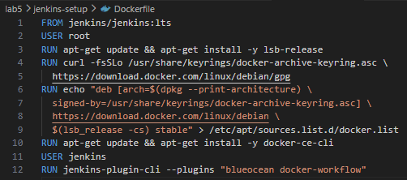
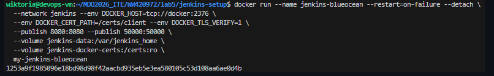
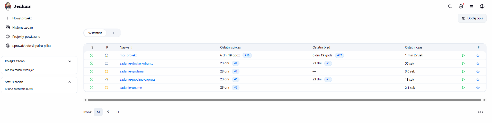
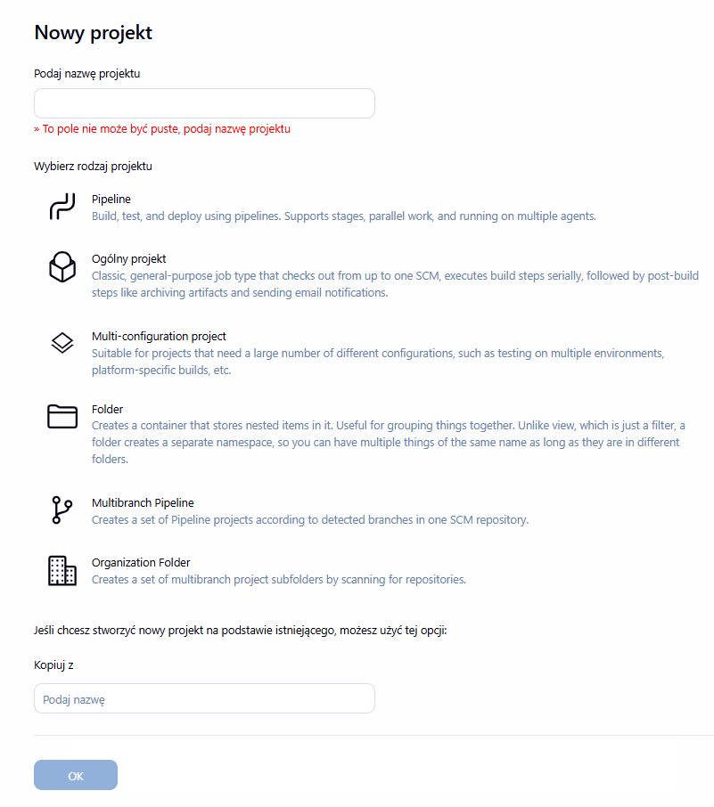
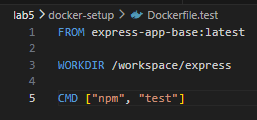
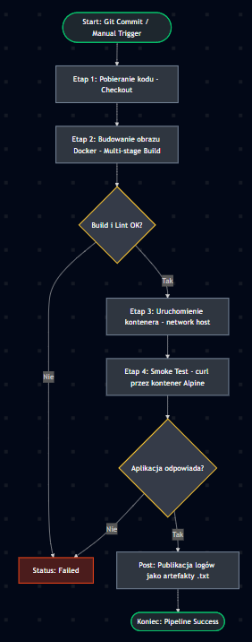
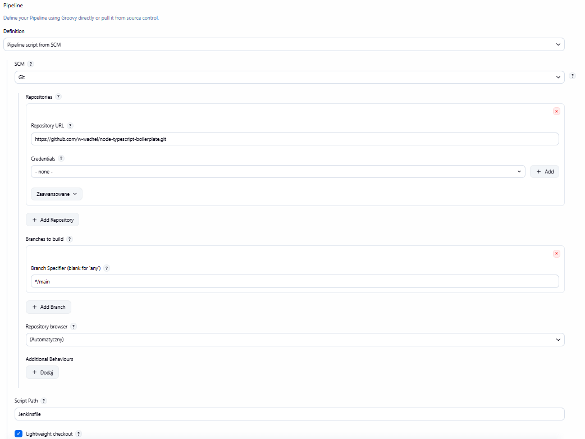
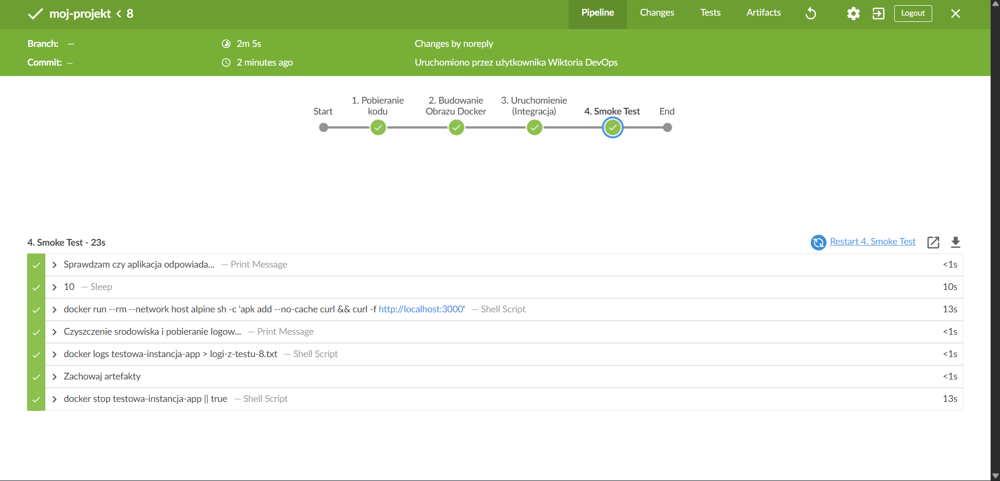

# Część teoretyczna

### **Jenkins**
Jest to darmowe narzędzie, które pomaga programistom automatyzować powtarzalne czynności. Zamiast ręcznie wpisywać komendy w terminalu za każdym razem, gdy chcemy zbudować lub przetestować program, zlecamy to Jenkinsowi.
- **Automatyzacja** – sam pilnuje, żeby każdy etap pracy nad kodem wykonał się w odpowiedniej kolejności.
- **Wielozadaniowość** – może obsługiwać wiele projektów jednocześnie i integrować się z prawie każdym innym narzędziem (np. Dockerem czy Gitem).
- **Historia i logi** – zapisuje dokładnie co, kiedy i dlaczego się zepsuło, co ułatwia naprawianie błędów.

### **Blue Ocean**
Podczas labów użyliśmy obrazu *blueocean*. Jest to nakładka graficzna (interfejs) na standardowego Jenkinsa, która sprawia, że praca jest znacznie prostsza i bardziej przejrzysta.
- **Wizualizacja pipeline'ów** – zamiast suchego tekstu, widzimy czytelne klocki i ścieżki, przez które przechodzi nasz kod.
- **Łatwiejsze debugowanie** – błędy widać od razu w konkretnym kroku, nie trzeba przeszukiwać tysięcy linii tekstu w logach.

### **Pipeline**
Pipeline (potok) to zestaw kroków, które nasz kod musi przejść od momentu wrzucenia go do repozytorium, aż do gotowego produktu. Zamiast klikać przyciski w menu, opisujemy cały proces za pomocą kodu.
- **Powtarzalność** – raz napisany pipeline zadziała tak samo za każdym razem.
- **Przejrzystość** – cały proces (budowanie, testowanie, publikacja) jest zapisany w jednym pliku, co ułatwia zarządzanie projektem.
- **Izolacja etapów** – błąd na etapie testów zatrzymuje cały proces, dzięki czemu nie "wypuścimy" na serwer zepsutego programu.

### **Ścieżka krytyczna**
To absolutne minimum, które musi się wydarzyć, żebyśmy mogli powiedzieć, że mamy działający Pipeline. Jeśli którykolwiek z tych kroków padnie, cały proces zostaje przerwany.

- **Commit** – sygnał do startu (pchnięcie kodu do repozytorium lub ręczne kliknięcie "Build").

- **Clone** – Jenkins pobiera najnowszą wersję kodu, żeby mieć na czym pracować.

- **Build** – kompilacja kodu i tworzenie "paczki" (np. obrazu Dockera).

- **Test** – automatyczne sprawdzenie, czy nowo zbudowany kod nie zepsuł istniejących funkcji.

- **Deploy** – wrzucenie gotowej aplikacji na serwer (środowisko testowe lub produkcyjne).

- **Publish** – udostępnienie gotowego produktu dla świata (np. wypchnięcie obrazu do Docker Hub).

### **Artefakt**
Jest to fizyczny efekt działania Pipeline'u. To coś, co możemy wziąć i zainstalować u kogoś innego.

- **Wybór formy** – decydujemy, czy naszym produktem jest cały kontener (obraz Dockera), czy tylko plik (np. .exe, .deb czy .tar.gz).
- **Wersjonowanie** – nadawanie numerów typu 1.2.3. Dzięki temu wiemy dokładnie, co jest wdrożone i możemy łatwo wrócić do starszej wersji, jeśli nowa okaże się wadliwa.
- **Pochodzenie** – system pozwala nam sprawdzić, z której dokładnie zmiany w kodzie (commita) powstał dany plik.

### **Weryfikacja - Smoke Test**
**Co to jest?** – Najprostszy możliwy test sprawdzający, czy aplikacja w ogóle "wstaje".

**Działanie** – Uruchamiamy kontener typu 'deploy' i sprawdzamy np. czy strona internetowa odpowiada (kod 200) lub czy program nie wywala błędu na starcie.

**Dlaczego to ważne?** – Zapobiega sytuacji, w której testy jednostkowe przeszły, ale aplikacja nie uruchamia się, bo brakuje jej jakiejś drobnej konfiguracji w systemie.

### **Docker w Dockerze**
W zadaniu musieliśmy uruchomić Jenkinsa tak, aby mógł on korzystać z Dockera. To tak zwana izolacja etapów – Jenkins działa w jednym kontenerze, ale potrafi "rozkazać" systemowi stworzenie kolejnych kontenerów do budowania i testowania naszych projektów.
- **Czystość systemu** – Jenkins nie śmieci na systemie głównym, wszystko dzieje się wewnątrz kontenerów.
- **Niezależność** – każde budowanie projektu może odbywać się w zupełnie innym środowisku (np. jeden projekt na Ubuntu, drugi na Alpine).   


# Część praktyczna

### **Lab 5: Pipeline, Jenkins, izolacja etapów**

Obraz jenkins-blueocean został utworzony na podstawie dockerfile:



Za pomocą komendy:



Ta komenda to polecenie uruchamiające nasz wcześniej przygotowany obraz w tle (w trybie detached). Nadaje ona kontenerowi nazwę *jenkins-blueocean* i zapewnia jego automatyczny restart w przypadku awarii. Najważniejszą częścią jest tutaj konfiguracja sieci i zmiennych środowiskowych, które pozwalają Jenkinsowi bezpiecznie łączyć się z silnikiem Dockera (za pomocą certyfikatów TLS), co jest niezbędne do budowania obrazów wewnątrz potoków.   
Dodatkowo polecenie otwiera porty komunikacyjne (8080 do przeglądarki i 50000 dla agentów) oraz podłącza wolumeny, dzięki którym nasze dane, wtyczki i projekty nie znikną po wyłączeniu kontenera.

Następnie przy wykorzystaniu komendy `docker logs jenkins-blueocean` można było podejrzeć hasło do Jenkins i stworzyć na nim konto uzupełniając podstawowe informacje.

Interfejs Jenkins:



Nowy projekt:



Na laboratoriach zostało utworzone kilka przykładowych zadań - jednym z nich było uruchomienie buildera w Jenkins z plików wrzuconych na Github'a

**Docker.build**


**Docker.test**



Do tego utworzony został skrypt którego zadaniem było pobranie z konkretnego brancha plików i ich uruchomienie:

```
pipeline {
    agent any
    stages {
        stage('Clone Branch') {
            steps {
                git branch: 'WW420972', url: 'https://github.com/InzynieriaOprogramowaniaAGH/MDO2026_ITE.git'
            }
        }
        stage('Build Image') {
            steps {
                sh 'docker build -t moj-budowniczy -f WW420972/lab5/docker-setup/Dockerfile.build WW420972/lab5/'
            }
        }
    }
}
```

Przy kolejnym uruchomieniu czas powyższych zadań znacząco sie zmniejszył - jest spowodowana cachowaniem, zapamiętany został poprzedni stan, dlatego nie trzeba było ponownie instalować.

### **Lab 6: Pipeline: lista kontrolna**

Na samym poczatku wybrana została aplikacja ([Link do repozytorium](https://github.com/jsynowiec/node-typescript-boilerplate)) i zrobiono na niej fork na publiczne repozytorium 

**Diagram:**



W aplikacji utworzono Jenkinsfile i edytowano go zgodnie z kolejnymi podpunktami:

```
pipeline {
    agent any

    environment {
        NAZWA_OBRAZU = "moj-boilerplate-ts"
        NAZWA_KONTENERA = "testowa-instancja-app"
    }

    stages {
        stage('1. Pobieranie kodu') {
            steps {
                checkout scm
            }
        }

        stage('2. Budowanie Obrazu Docker') {
            steps {
                echo "Rozpoczynam budowanie obrazu: ${NAZWA_OBRAZU}..."
                sh "docker build -t ${NAZWA_OBRAZU}:${BUILD_NUMBER} ."
            }
        }

        stage('3. Uruchomienie (Integracja)') {
            steps {
                echo "Uruchamiam kontener do testow dymnych..."
                sh "docker stop ${NAZWA_KONTENERA} || true"
                sh "docker rm ${NAZWA_KONTENERA} || true"
                sh "docker run -d --name ${NAZWA_KONTENERA} --network host ${NAZWA_OBRAZU}:${BUILD_NUMBER}"
            }
        }

        stage('4. Smoke Test') {
            steps {
                echo "Sprawdzam czy aplikacja odpowiada..."
                sleep 10
                sh "docker run --rm --network host alpine sh -c 'apk add --no-cache curl && curl -f http://localhost:3000'"            }
        }
    }

    post {
        always {
            echo "Czyszczenie srodowiska i pobieranie logow..."
            sh "docker logs ${NAZWA_KONTENERA} > logi-z-testu-${BUILD_NUMBER}.txt"
            archiveArtifacts artifacts: "*.txt", fingerprint: true
            sh "docker stop ${NAZWA_KONTENERA} || true"
        }
    }
}
```

Dodatkowo został utworzony Dockerfile w celu poprawnego uruchomienia aplikacji:

```
# ETAP 1
FROM node:22-alpine AS builder
WORKDIR /app
COPY package*.json ./
RUN npm install
COPY . .
RUN npm run build

# ETAP 2
FROM node:22-alpine
WORKDIR /app
COPY --from=builder /app/build ./build
COPY --from=builder /app/package*.json ./
RUN npm ci --only=production

EXPOSE 3000

CMD ["node", "build/main.js"]
```

Konfiguracja Jenkins'a - w celu pobrania z odpowiedniego repozytorium aplikacji:



Pipeline przechodzi wszystkie etapy poprawnie:



### **Lab 7: kontynuacja listy kontrolnej**

Część kroków zostało zrealizowanych na poprzednich laboratoriach, jednak wprowadzono jeszcze kilka zmian.

**Przygotowanie i czyszczenie:**

```
stage('1. Przygotowanie i Cleanup') {
    steps {
        echo "Sprzątanie folderu roboczego..."
        deleteDir()
        
        echo "Pobieranie świeżego kodu z SCM..."
        checkout scm 

        sh "docker system prune -f" 
    }
}
```

**Budowanie:**

```
stage('2. Build - Tworzenie BLDR i Artefaktu') {
    steps {
        echo "Buduję obraz budujący (BLDR)..."
        sh "docker build --target builder -t ${NAZWA_OBRAZU}:BLDR ."
        
        echo "Buduję finalny obraz docelowy..."
        sh "docker build -t ${NAZWA_OBRAZU}:${BUILD_NUMBER} ."
        sh "docker tag ${NAZWA_OBRAZU}:${BUILD_NUMBER} ${NAZWA_OBRAZU}:latest"
    }
}
```

**Testy jednostkowe:**

```
stage('3. Testy Jednostkowe') {
    steps {
        echo "Uruchamiam testy na obrazie BLDR..."
        sh "docker run --rm ${NAZWA_OBRAZU}:BLDR npm test || echo 'Testy wykryły błędy, ale idziemy dalej (tryb lab)'"
    }
}
```

**Sandbox:**

```
stage('4. Deploy - Sandbox') {
    steps {
        echo "Uruchamiam Sandbox..."
        sh "docker stop ${NAZWA_KONTENERA} || true"
        sh "docker rm ${NAZWA_KONTENERA} || true"
        
        sh "docker run -d --name ${NAZWA_KONTENERA} --network host ${NAZWA_OBRAZU}:${BUILD_NUMBER}" 
    }
}
```

**Weryfikacja i metadane:**

```
stage('5. Smoke Test & Publish') {
    steps {
        echo "Czekam aż aplikacja wstanie..."
        sleep 15
        
        echo "Sprawdzam połączenie przez kontener zewnętrzny..."
        sh "docker run --rm --network host curlimages/curl -f http://localhost:3000"
        
        echo "Publikowanie artefaktów..."
        sh "docker inspect ${NAZWA_OBRAZU}:${BUILD_NUMBER} > image_info.json"
    }
}
```

**Wynik powyższych czynności:**

