# Instalacja klastra Kubernetes
### Instalacja Minikube
- pobranie programu instalacyjnego Minikube
- zainstalowanie go w systemie
- posprzątanie pobranego pliku tymczasowego

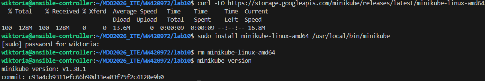

### Zaopatrzenie sie w kubectl
kubectl - narzędzie tekstowe którym można sterować Kubernetes   
(dodatkowo ustawiono alias dzięku któremy minikubctl zadziała jak minikube kubectl)

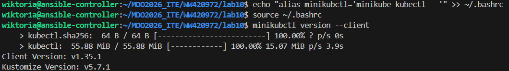

### Uruchomienie klastra
`minikube start --driver=docker` - uruchomienie

`minikubctl get nodes` - sprawdzenie czy działa poprawnie

Bezpieczeństwo: Kiedy Minikube uruchamia się na driverze docker, całe środowisko jest odizolowane wewnątrz kontenera Dockerowego na Ubuntu.

- Izolacja środowiska: Wszystkie procesy Kubenertesa działają wewnątrz odrębnej sieci i kontenera.

- Lokalny dostęp: Jest on widoczny tylko i wyłącznie lokalnie na maszynie.

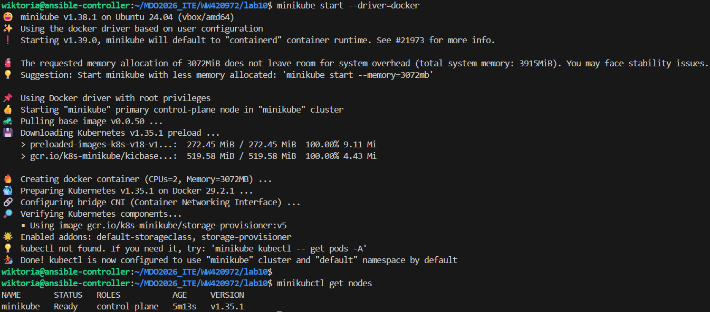

### Uruchomienie interfejsu graficznego
`minikube dashboard`

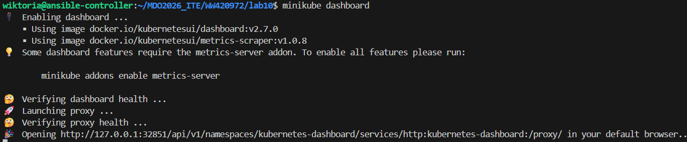

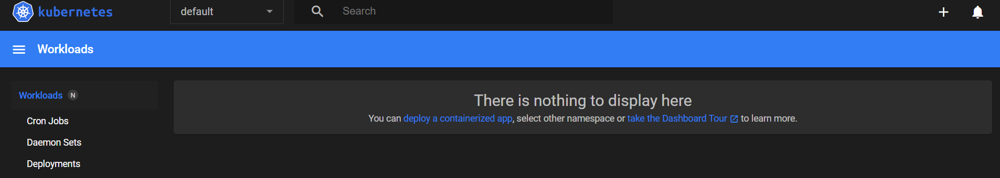

# Analiza posiadanego kontenera
Mój projekt wypisuje wykonuje prosty skrypt, wypisuje tekst w konsoli i natychmiast kończy prace - nie jest on przystosowany do ciągłej pracy.

Dlatego został stworzony prosty program na stabilnym obrazie `nginx` i dodana została własna konfiguracja w folderze `/projekt` (`index.html` i `Dockerfile`)

`eval $(minikube docker-env)` - komenda do "połączenia" terminala z Dockerem
`docker build -t moja-aplikacja:v1 .` - budowanie obrazu

Efekt finalny

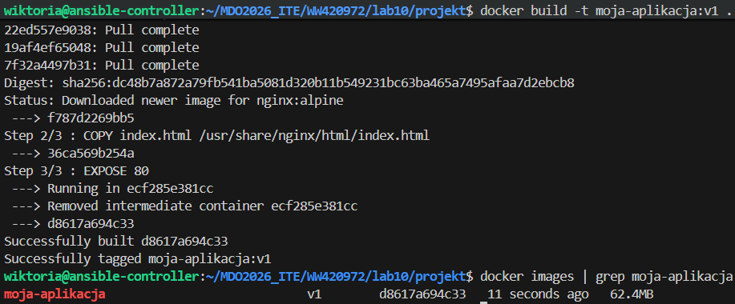

# Uruchamianie oprogramowania
`minikubctl run moja-web-aplikacja --image=moja-aplikacja:v1 --port=80 --labels app=moja-web-aplikacja` - tworzenie poda i ustawienie etykiety rozpoznawczej

`minikubctl get pods` - weryfikacja działania

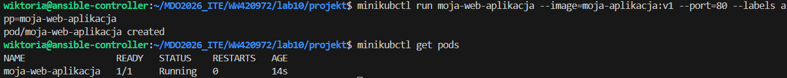

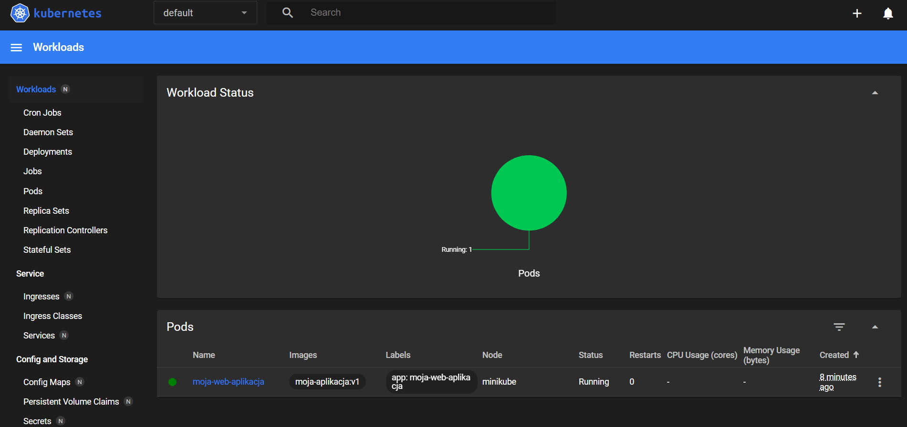

Przekierowanie portu (na `8081` ponieważ `8080` jest zajęty):

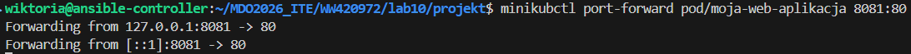

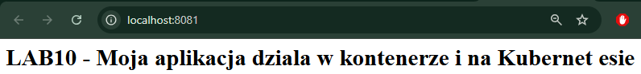

# Przekucie wdrożenia manualnego w plik wdrożenia
### deployment.yaml
- `kind: Deployment` – tworzenie managera wdrożenia.
- `replicas: 4` – dokładnie 4 działające kopie (Pody) aplikacji.
- `image: moja-aplikacja:v1` – wskazanie spersonalizowanego obrazu.

### Wdrożenie konfiguracji
`minikubctl apply -f deployment.yaml` - zmuszenie Kubernesta do przeczytania pliku i wdrożeniu go

`minikubctl rollout status deployment/moja-aplikacja-deployment` - sprawdzenie stanu

`minikubctl get pods` - sprawdzenie stanu, czy poprawnie wdrożono

Efekt finalny: 

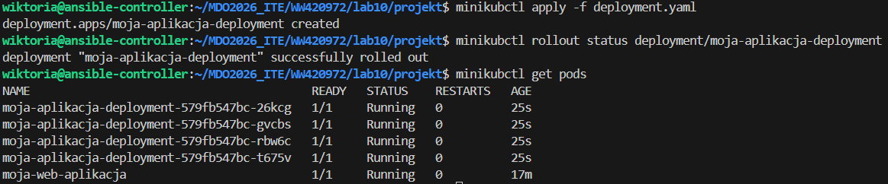

### Stworzenie serwisu
Serwis został stworzony przy pomocy komendy:
`minikubctl expose deployment moja-aplikacja-deployment --type=NodePort --port=80 --name=moja-aplikacja-serwis`

### Przekierowanie portu

`minikubctl port-forward service/moja-aplikacja-serwis 8082:80`

dodatkowo dodanie portu w VSC:

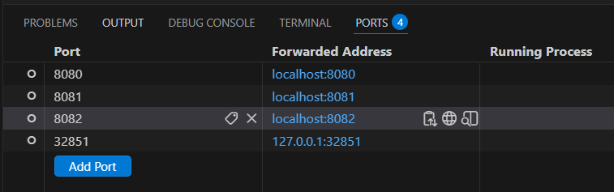

Efekt na stronie - serwis działa poprawnie

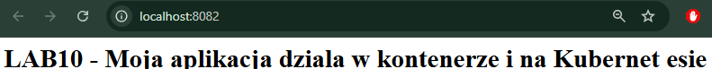
