## Przygotowanie nowego obrazu

- Plik `index.html` został zmieniony
- Zbudowany został ponownie pbraz
- Utworzony został Dockerfile z wadliwą wersją 

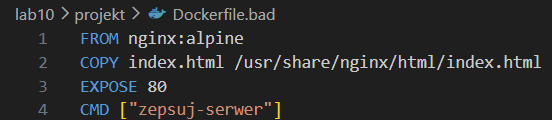

Wszystkie obrazy działają:

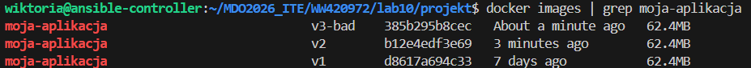

## Zmiany w deploymencie

Plik`deployment.yaml` został wzbogacony o komendę:

```
  labels:
    app: moja-web-aplikacja
```

A następnie uruchomiony komendą 

`minikubctl apply -f deployment.yaml`

Do zmiany liczby replik nie trzeba za każdym razem edytowac pliku *YAML*, wystarczy komenda:

`minikubctl scale deployment/moja-aplikacja-deployment --replicas=8`

- replicas=8 - oznacza liczbę replik

Dashboard:

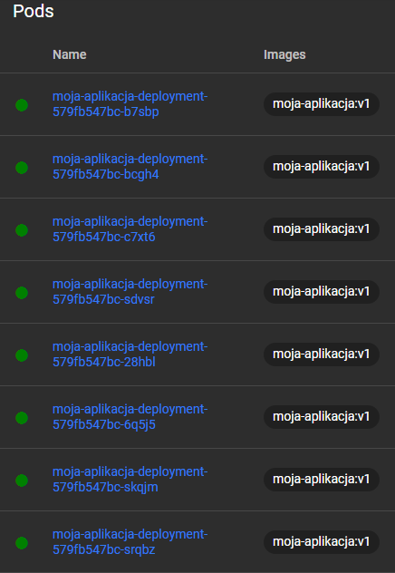

Liczba replik: 1:

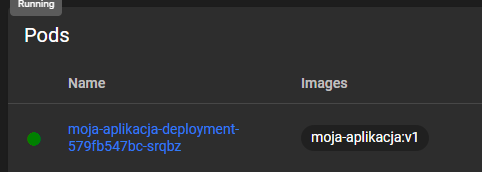

Liczba replik: 0:

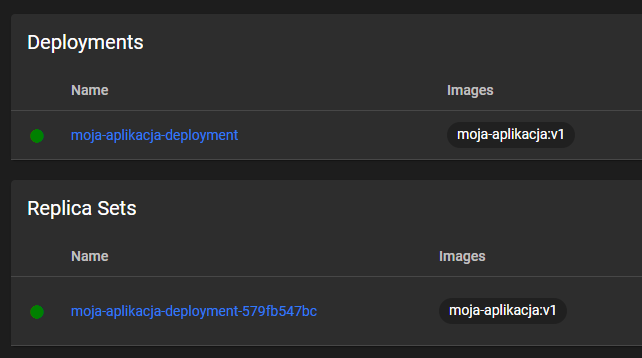

Liczba replik: 4:

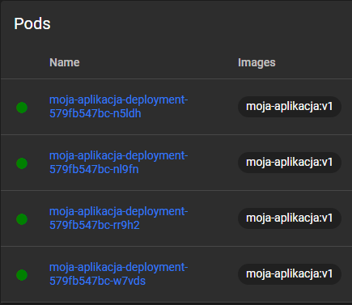

### Aktualizacja aplikacji do nowej wersji

Komendą:

`minikubctl set image deployment/moja-aplikacja-deployment nginx-kontener=moja-aplikacja:v2`

Odnotowany został 
- REVISION 1 - pierwszy start aplikacji `v1`
- REVISION 2 - stan po wpisaniu komendy, Kubernetes odnotował nową wersję jako drugą rewizję w historii

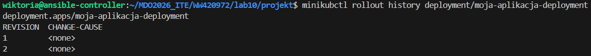

### Powrót do wersji `v1`

Przed komendą:

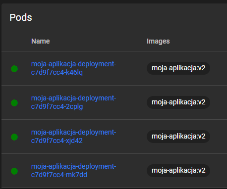

Przy pomocy komendy:

`minikubctl rollout undo deployment/moja-aplikacja-deployment`

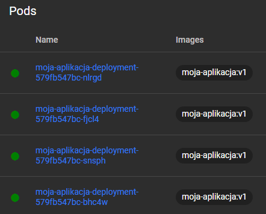

### Wgranie wadliwej wersji `v3`

`minikubctl set image deployment/moja-aplikacja-deployment nginx-kontener=moja-aplikacja:v3-bad`

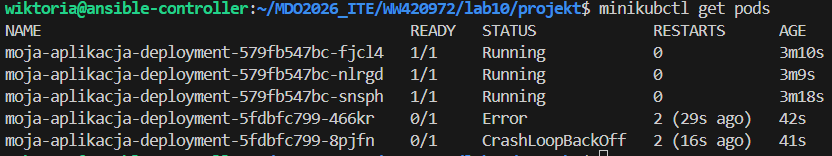

Komendą `rollout undo`, błyskawicznie można wrócic do poprzedniej wersji

## Kontrola wdrożenia

Utworzono plik `weryfikuj.sh` i nadano mu uprawnienia - `chmod +x weryfikuj.sh`

```
#!/bin/bash

echo "=== Rozpoczynam weryfikację wdrożenia (Max 60 sekund) ==="

minikube kubectl -- rollout status deployment/moja-aplikacja-deployment --timeout=60s

if [ $? -eq 0 ]; then
    echo "✅ Poprawne wdrożenie"
    exit 0
else
    echo "❌ Przekroczenie limitu 60 sekund lub awaria!"
    exit 1
fi
```

(pierwsze uruchomienie pliku jest na wersji v1, drugie na wadliwej v3)

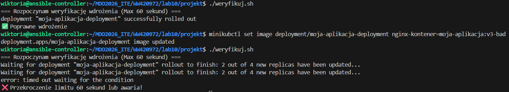

## Stragegie wdrożeń

### Recreate

Utworzono plik `deployment-recreate.yaml` i uruchomiono go:

```
apiVersion: apps/v1
kind: Deployment
metadata:
  name: aplikacja-recreate
spec:
  replicas: 4
  strategy:
    type: Recreate
  selector:
    matchLabels:
      app: web-recreate
  template:
    metadata:
      labels:
        app: web-recreate
    spec:
      containers:
      - name: nginx-kontener
        image: moja-aplikacja:v1
        ports:
        - containerPort: 80
```

Cztery pody natychmiast są usuwane jednocześnie, a klaster na moment zostaje z zerem działających aplikacji, po czym stawia 4 nowe

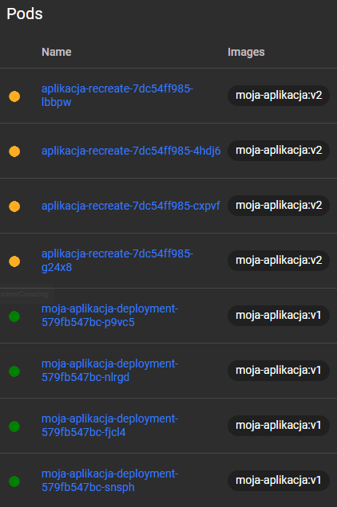

### Rolling Update

Plik `deployment-rolling.yaml`

```
cat <<EOF > deployment-rolling.yaml
apiVersion: apps/v1
kind: Deployment
metadata:
  name: aplikacja-rolling
spec:
  replicas: 4
  strategy:
    type: RollingUpdate
    rollingUpdate:
      maxUnavailable: 2
      maxSurge: 25%
  selector:
    matchLabels:
      app: web-rolling
  template:
    metadata:
      labels:
        app: web-rolling
    spec:
      containers:
      - name: nginx-kontener
        image: moja-aplikacja:v1
        ports:
        - containerPort: 80
EOF
```

Kubernetes najpierw powołuje 1 dodatkowy pod `v2`, potem gasi 2 stare `v1` a na ich miejsce wstawia kolejne nowe.

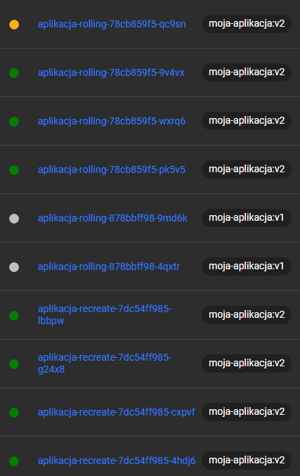

### Canary Deployment

Stworzono trzy pliki:
- `canary-production.yaml` - główne wdrożenie
- `canary-test.yaml` - wdrożenie testowe
- `canary-service.yaml` - serwis

Jeden serwis rozdziela ruch między dwa niezależne zdrożenia:

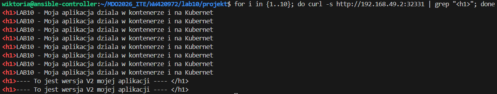