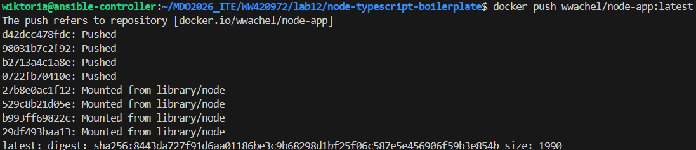
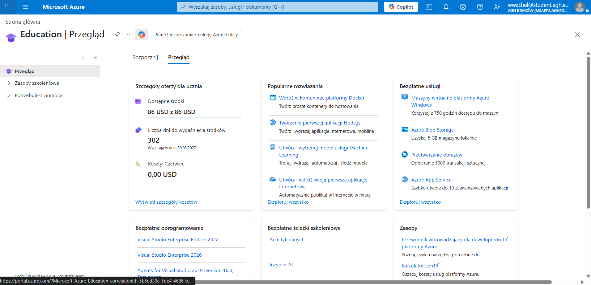
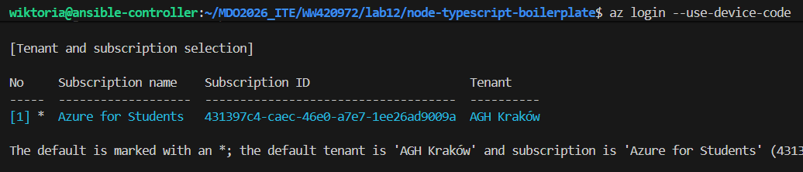
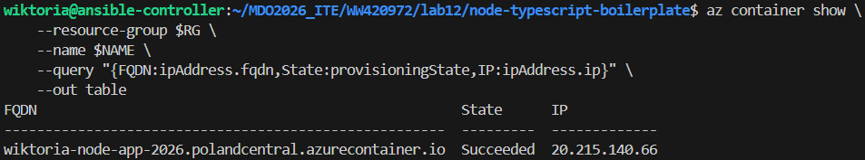
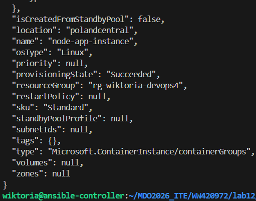
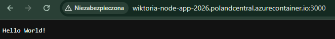
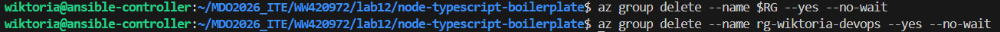

### Deploy projektu:


### Utworzenie konta na Azure:


### Logowanie na Azure przez terminal


Zmienne
```
RG="rg-wiktoria-devops4"
LOC="polandcentral"
NAME="node-app-instance"
IMG="wwachel/node-app:latest"
DNS="wiktoria-node-app-2026"
```

Tworzenie folderu na zasoby:

`az group create --name $RG --location $LOC`

### Wdrażanie i uruchamianie kontenera

```
az container create \
    --resource-group $RG \
    --name $NAME \
    --image $IMG \
    --dns-name-label $DNS \
    --ports 3000 \
    --ip-address public \
    --location $LOC \
    --os-type Linux \
    --cpu 1 \
    --memory 1.5
```



### Weryfikacja działania:

```
az container show \
    --resource-group $RG \
    --name $NAME \
    --query "{FQDN:ipAddress.fqdn,State:provisioningState,IP:ipAddress.ip}" \
    --out table
```



Test w przeglądarce pod adresem:

`http://wiktoria-node-app-2026.polandcentral.azurecontainer.io:3000`



Usuwanie zasobów za pomocą:

`az group delete --name $RG --yes --no-wait`

`az group delete --name rg-wiktoria-devops --yes --no-wait`

