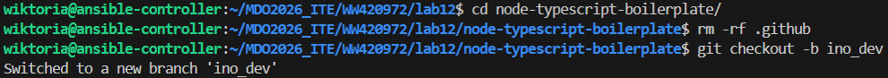
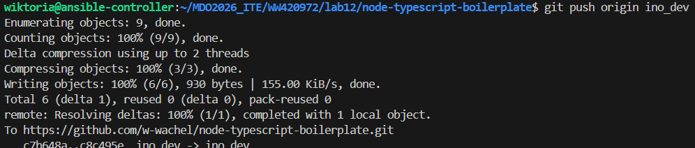
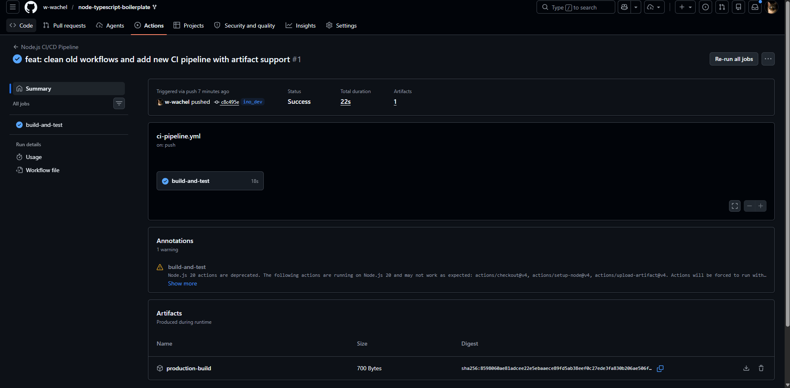
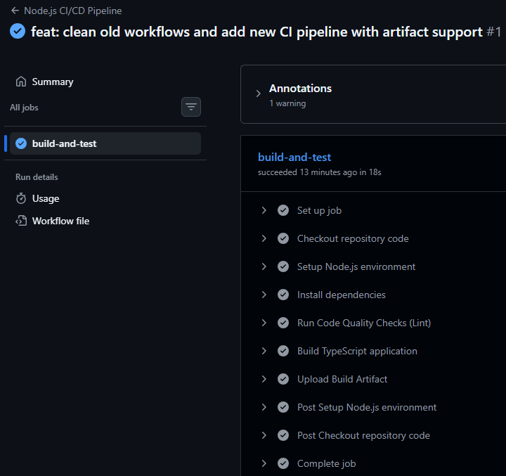
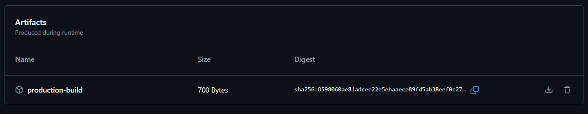

# Sprawozdanie 13

## 1. Przygotowanie gałęzi deweloperskiej
Usunięto z projektu stare pliki automatyzacji i utworzono dedykowaną gałąź deweloperską o nazwie ino_dev w celu odizolowania potoku CI/CD od głównej gałęzi kodu, komendami:

```
rm -rf .github
git checkout -b ino_dev
git push --set-upstream origin ino_dev
```




## 2. Konfiguracja potoku
Utworzono plik konfiguracyjny `.github/workflows/ci-pipeline.yml` z triggerem, który uruchamia automatyzację wyłącznie po wykryciu zmian na gałęzi ino_dev:

```
name: Node.js CI/CD Pipeline

on:
  push:
    branches:
      - ino_dev

jobs:
  build-and-test:
    runs-on: ubuntu-latest
    steps:
      - name: Checkout repository code
        uses: actions/checkout@v4
      - name: Setup Node.js environment
        uses: actions/setup-node@v4
        with:
          node-version: '22'
          cache: 'npm'
```

## 3. Kontrola jakości kodu i budowanie projektu
Do potoku dodano kroki automatycznej instalacji zależności, weryfikacji statycznej jakości kodu za pomocą lintera (`npm run lint`) oraz kompilacji kodu TypeScript do czystego JavaScriptu (`npm run build`)

```
    - name: Install dependencies
        run: npm install

      - name: Run Code Quality Checks (Lint)
        run: npm run lint

      - name: Build TypeScript application
        run: npm run build
```
## 4. Publikacja artefaktu końcowego
Skonfigurowano oficjalną akcję upload-artifact, która automatycznie pakuje skompilowany katalog build/ do archiwum ZIP i udostępnia go jako gotowy produkt końcowy bezpośrednio w panelu GitHub


```
    - name: Upload Build Artifact
        uses: actions/upload-artifact@v4
        with:
          name: production-build
          path: build/
```

## 5. Weryfikacja i uruchomienie w chmurze
Zmiany wypchnięto do zdalnego repozytorium, co zainicjowało poprawne wykonanie całego potoku w chmurze GitHub Actions, kończąc się statusem powodzenia i wygenerowaniem artefaktu.









**Wnioski:**

Automatyzacja potoku CI/CD w GitHub Actions pozwala na natychmiastowe sprawdzanie i budowanie kodu po każdym wdrożeniu zmian. Dzięki zasadzie Shift-left i użyciu lintera błędy w kodzie są wyłapywane bardzo wcześnie, zanim zdążą popsuć główny projekt. Uruchamianie testów tylko na dedykowanej gałęzi `ino_dev` daje pewność, że niesprawdzony kod jest bezpiecznie odizolowany od reszty zespołu. Na koniec chmura sama pakuje gotowy program do pliku ZIP, dzięki czemu sprawną aplikację można pobrać jednym kliknięciem myszki.