## 1. Pobranie repozytorium - express 
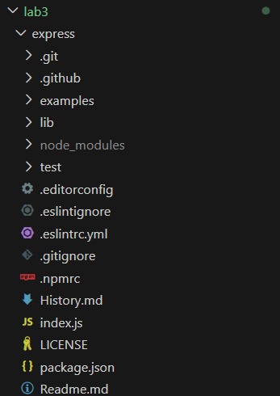

### Zainstalowanie wszystkich paczek
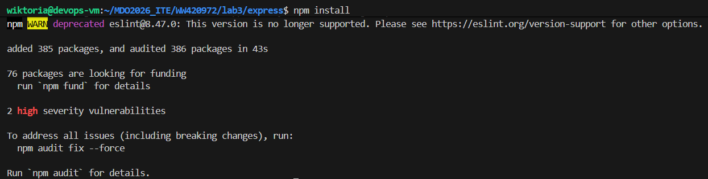

### Sprawdzenie czy posiada testy
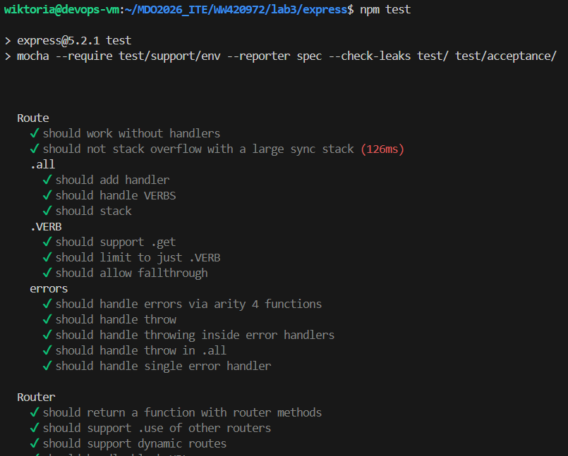

## 2. Uruchamianie czystego kontenera

```-it``` - interaktywny terminal

```node:20-bookworm``` - bazowy obraz

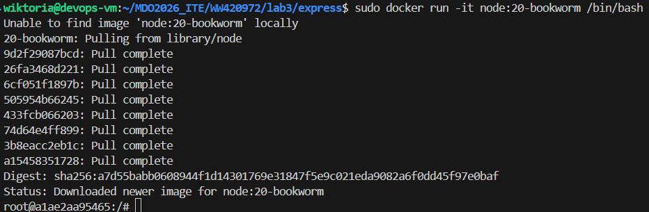

### Klonowanie i budowanie
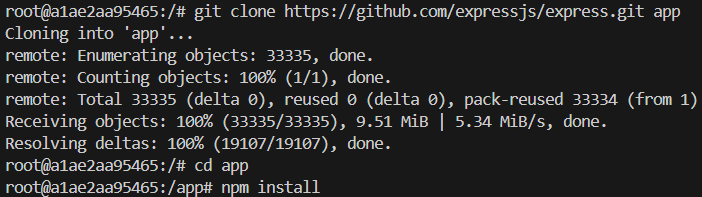

### Testy
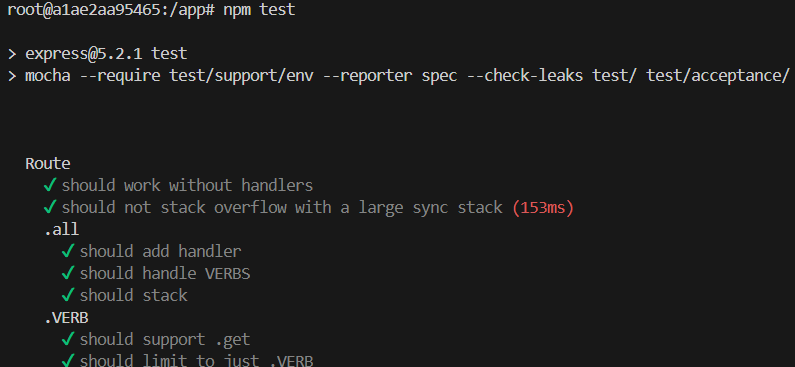

```node:20``` ma wszystko czego potrzeba - git, npm czy node

## 3. Tworzenie kontenera z pliku

### Dockerfile.build
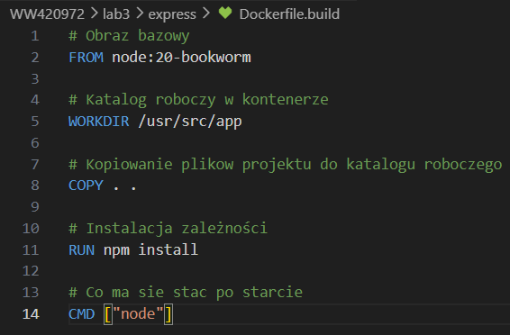

```-t express-app:build``` - nadanie nazwy obrazowi

```-f Dockerfile.build``` - wskazanie na konkretny plik


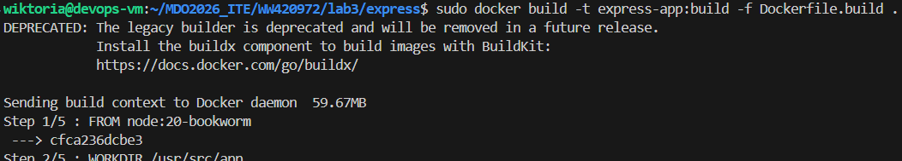

### Dockerfile.test
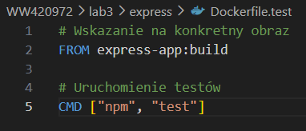
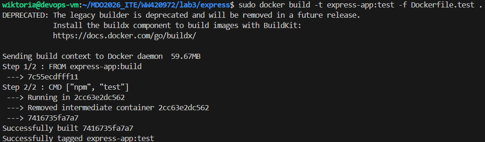

## 4. Weryfikacja
Po odpaleniu komendy
```docker run --name test-run express-app:test```
pojawiają sie logi i przechodzą pomyślnie wszystki testy

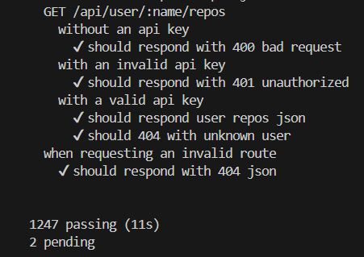

## Status
kontener posiada status ```exit 0``` - wszystko przeszło pomyślnie

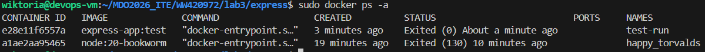