## 1. Zachowanie stanu między kontenerami
### Stworzenie woluminów - wejściowego i wyjściowego
Nie ma znaczenia w jakim folderze się znajduje, ponieważ wolumin i tak zapisze go w specjalnym katalogu stystemowym: `/var/lib/docker/volumes/`
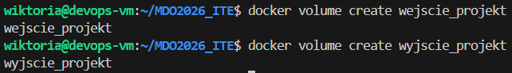

### Przeniesienie kodu do do woluminu *wejscie_projektu*
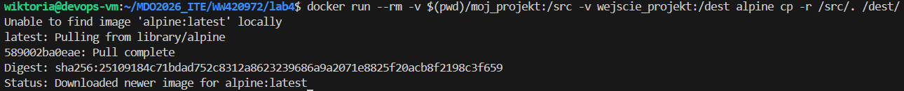
`docker run --rm` - uruchamia kontener i po skończonej pracy od razu go kasuje

`-v $(pwd)/moj_projekt:/src` - Bind Mount, łączy folder *moj_projekt* z folderem `/src` wewnątrz kontenera

`-v wejscie_projekt:/dest` - łączy wolumen o nazwie *wejscie_projekt* z folderem `/dest` wewnątrz kontenera

`alpine` - nazwa obrazu który służy tylko do przeniesienia kodu do kontenera

`cp -r /src/. /dest/` - właściwa instrukcja, kopiowanie z folderu `/src` do `/dest`

### Uruchomienie kontenera budującego
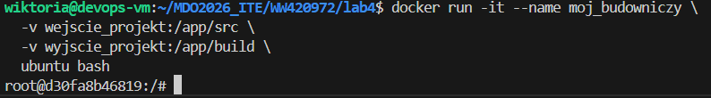
`-it` - wejscie do środka terminalu kontenera

`-v wejscie_projekt:/app/src` - połączenie woluminu z kodem do folderu `/app/src` wewnątrz kontenera

`-v wyjscie_projekt:/app/build` - połączenie pustego wolumina do folderu w którym zapisze się wynik

### Build projektu wewnątrz kontenera
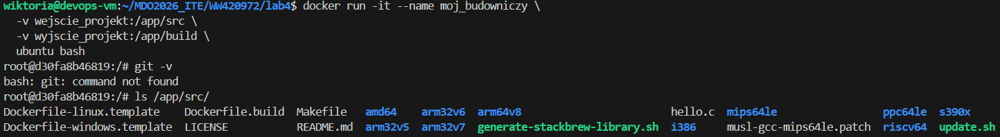
- brak git'a
- kod jest na swoim miejscu

### Zapisanie wyniku
Wyniki przetrwały śmierć kontenera
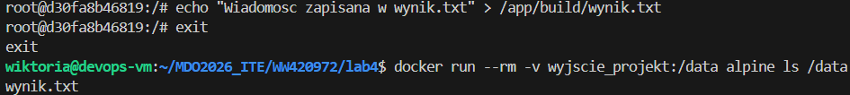

Kontener pomocniczy pozwolił przenieść dane z hosta do woluminu, ponieważ woluminy dockera są ukryte w systemie gdzie zwykły użytkownik nie ma dostępu

---
### Ponowienie operacji z wykorzystaniem git'a
Instalacja git'a w kontenerze
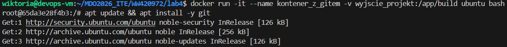

Skopiowanie repo w kontenerze
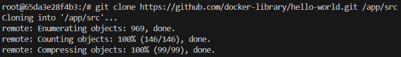

Stworzenie wyniku i zapisanie go w woluminie
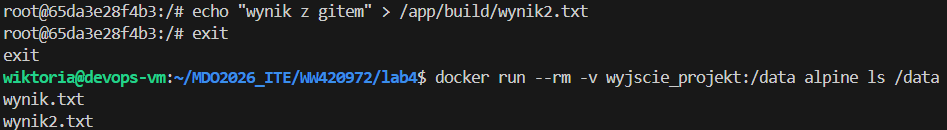

---
### Dyskusja o wykorzystanie Dockerfile'a
W pliku Dockerfile każda komenda `RUN` tworzy nową warstwę obrazu i zrobienie tam `git clone` niepotrzebnie go powiększa. Komenda `RUN --mount=type=bind` pozwala na tymczasowe podłączenie folderu z kodem tylko na czas budowania.

## 2. Eksportowanie portu i łączność między kontenerami
Utworzenie i wejscie do kontenera
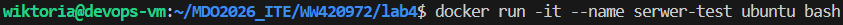

Instalacja iperf
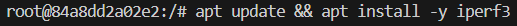

`-s` - oznacza sever mode, powoduje że kontener nasłuchuje na odpowiednim porcie
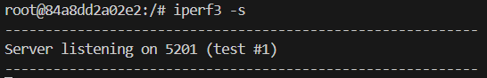

Sprawdzenie IP serwera
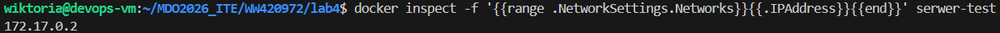

Stworzenie nowego kontenera *klient-test* i pobranie na nim iperf'a, a następnie wykonanie testu.
Wynikiem jest tabelką z prędkością przesyłu - kontenery się widzą
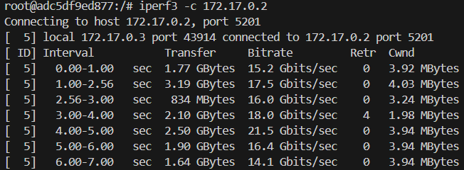

---
### Tworzenie sieci
Stworzenie sieci
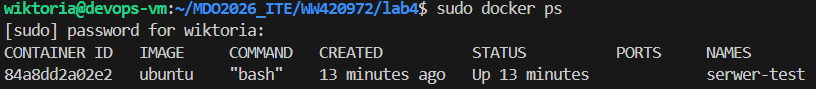

Uruchomienie w niej serwera
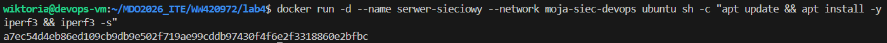

Uruchomienie klienta w tej samej sieci (zamiast IP jest nazwa)
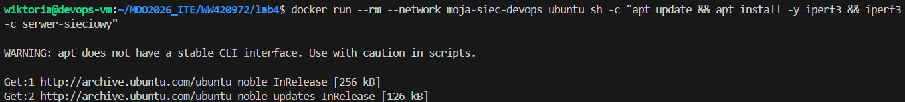

Uruchomienie serwera z mapowaniem portów za pomocą komendy:   
`docker run -d -p 5201:5201 --name serwer-publiczny ubuntu sh -c "apt update && apt install -y iperf3 && iperf3 -s"`

`-p 5201:5201` - docker wie że jeżeli ktoś będzie chciał dostać się za pomocą portu 5201 to ma go przekierować do środka kontenera na port 5201

### Łączenie sie do sieci z poza kontenera
Z hosta
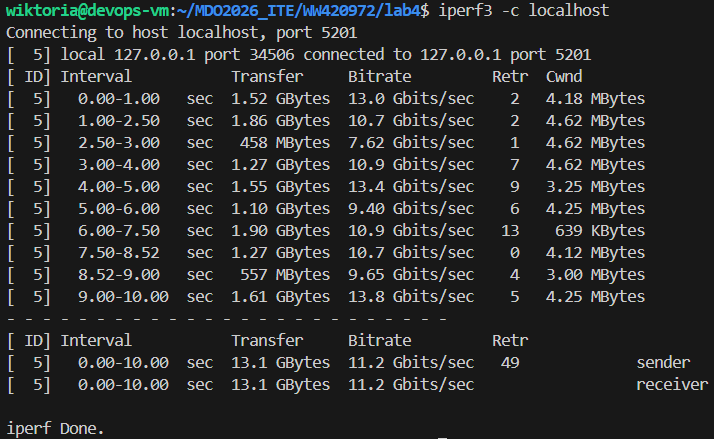

Spoza hosta
Po pobraniu iperf'a na Windowsie i wpisaniu komendy   
`.\iperf3.exe -c 127.0.0.1`
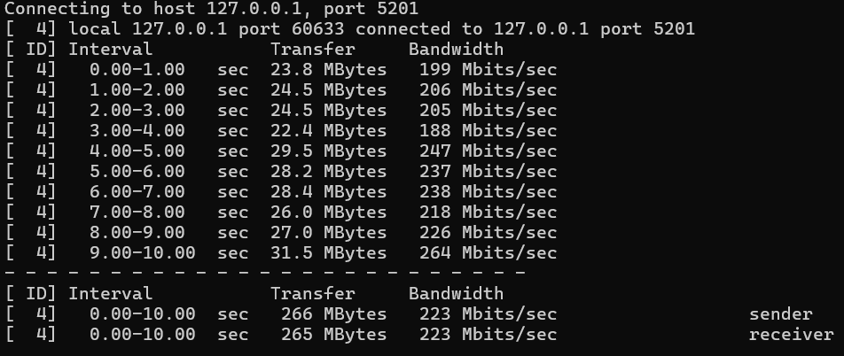

### Wyciąganie logów
Za pomocą komendy   
`.\iperf3.exe -c 127.0.0.1`

## 3. Usługi w rozumieniu systemu, kontenera i klastra
### Instalacja wewnątrz kontenera serwera SSH
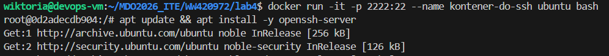

Pozwolenie na logowanie rootem przez SSH i uruchomienie usługi komendami:   
`sed -i 's/#PermitRootLogin prohibit-password/PermitRootLogin yes/' /etc/ssh/sshd_config`

`/usr/sbin/sshd`

## Łączenie się z serwerem
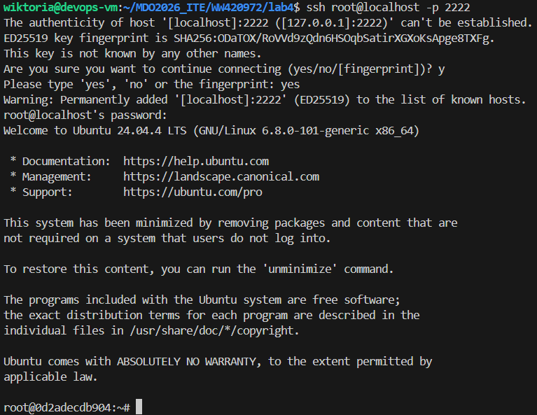

#### Zalety:
- pozwala na użycie narzędzi które działają tylko po SSH
- można łączyć się bez zainstalowanego Dockera na kliencie

#### Wady:
- zarządzanie hasłami/kluczami wewnątrz kontenerów może być trudne
- kontener powiniem mieć jeden proces a dodanie do niego SSH to kolejny proces którym trzeba zarządzać

## Przygotowanie do uruchomienia serwera Jenkins
### Stworzenie siedi dla Jenkinsa i Dockera
`docker network create jenkins`

### Woluminy na dane Jenkinsa i certyfikaty Dockera
`docker volume create jenkins-docker-certs`   
`docker volume create jenkins-data`

### Stworzenie kontenera który Jenkins użyje do budowania obrazów
`
docker run --name jenkins-docker --rm --detach \
  --privileged --network jenkins --network-alias docker \
  --env DOCKER_TLS_CERTDIR=/certs \
  --volume jenkins-docker-certs:/certs/client \
  --volume jenkins-data:/var/jenkins_home \
  docker:dind
`
### Uruchomienie właściwego serweru Jenkins
`docker run --name jenkins-blueocean --rm --detach \
  --network jenkins --env DOCKER_HOST=tcp://docker:2376 \
  --env DOCKER_CERT_PATH=/certs/client --env DOCKER_TLS_VERIFY=1 \
  --publish 8080:8080 --publish 50000:50000 \
  --volume jenkins-data:/var/jenkins_home \
  --volume jenkins-docker-certs:/certs/client:ro \
  jenkins/jenkins:lts`

Dodawanie portu:
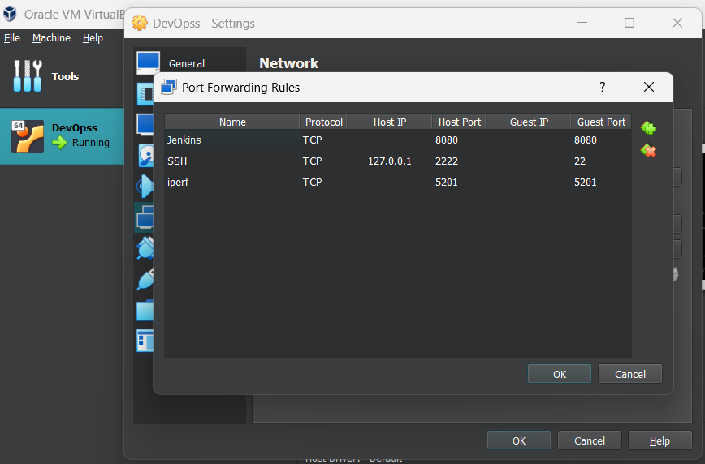

Oba kontenery działają
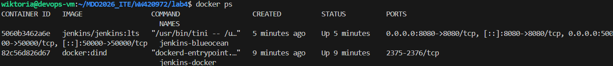

W przeglądarce
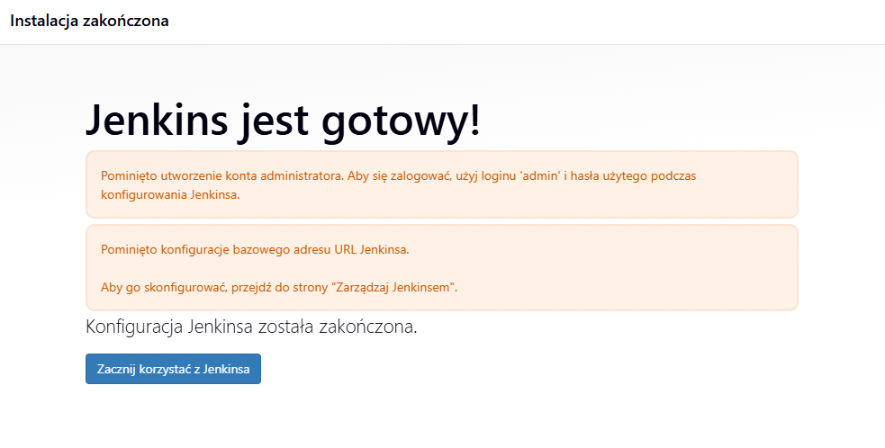
