# Lab 5: Pipeline, Jenkins, izolacja etapów

### Przygotowania
Tworzenie obrazów zostało dokonane na poprzednich zajęciach - jednak błędne zostały połączone ze sobą certyfikaty, co spowodowało problemy z połączeniem się z *jenkins-docker*, dlatego jeszcze raz stworzony został obraz *jenkins-blueocean* na podstawie dockerfile:


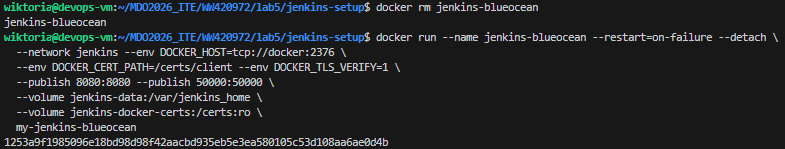


#### Oba kontenery działają
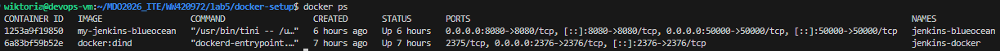

### Logowanie w przeglądarce
Dzięki komendzie `docker logs jenkins-blueocean` przy pierwszym uruchomieniu, możemy podejrzeć hasło do Jenkins

**Tworzenie konta:**   
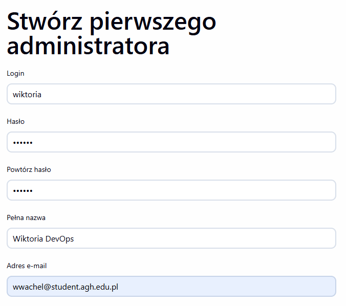

**Konfiguracja instancji:**   
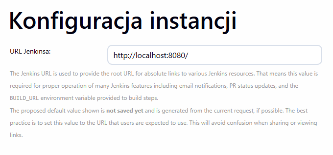

**Pomyślne zalogowanie:**   
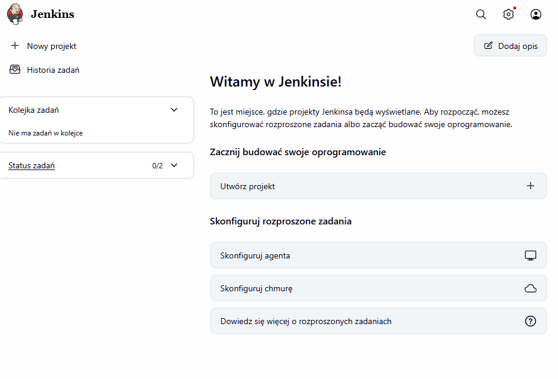

### Tworzenie zadań
**zadanie-uname:**   

```
pipeline {
    agent any
    stages {
        stage('Wyświetl info o systemie') {
            steps {
                sh 'uname -a'
            }
        }
    }
}
```

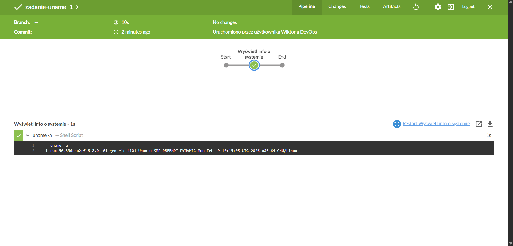

**zadanie-godzina:**

```
pipeline {
    agent any
    stages {
        stage('Sprawdzanie godziny') {
            steps {
                sh '''
                HOUR=$(date +%H)
                echo "Aktualna godzina: $HOUR"
                if [ $((HOUR % 2)) -ne 0 ]; then
                    echo "BŁĄD: Godzina $HOUR jest nieparzysta!"
                    exit 1
                else
                    echo "Godzina $HOUR jest parzysta. Wszystko OK."
                fi
                '''
            }
        }
    }
}
```

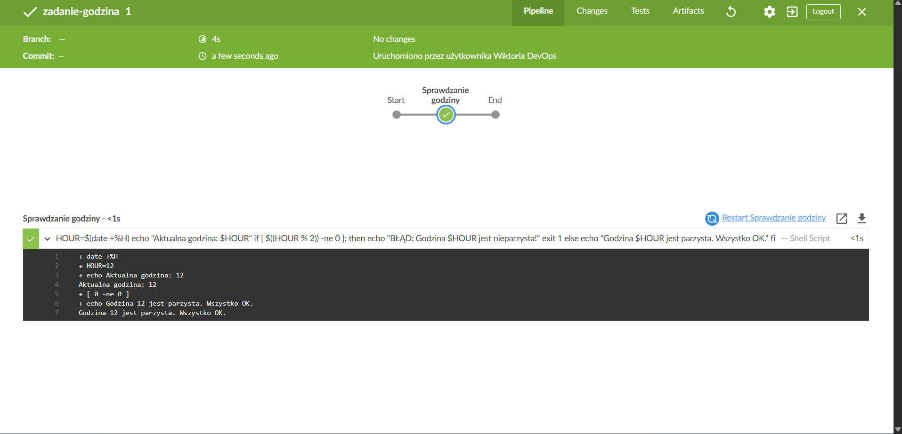

**zadanie-docker:**

```
pipeline {
    agent any
    stages {
        stage('Docker Pull') {
            steps {
                sh 'docker pull ubuntu:latest'
                sh 'docker images | grep ubuntu'
            }
        }
    }
}
```

W tym miejscu można zobaczyć że docker nie mógł odnaleźć folderu z certyfikatami.

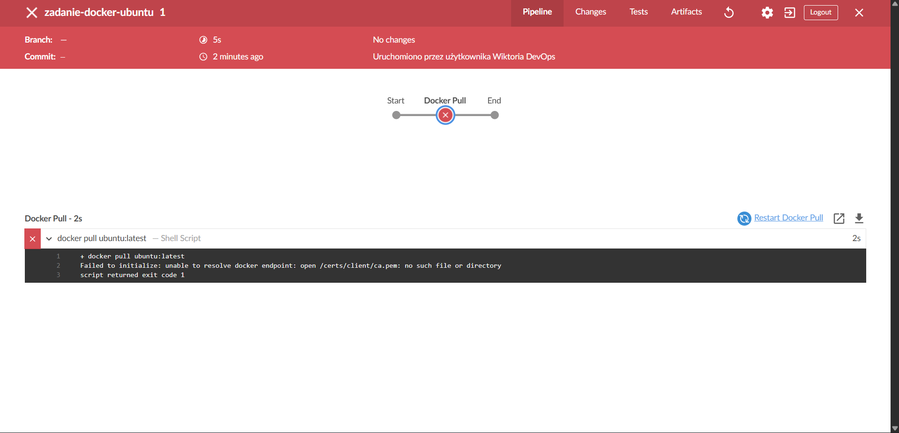


dlatego należało uruchomić go z poprawioną ścieżką i skrypt przeszedł pomyślnie:

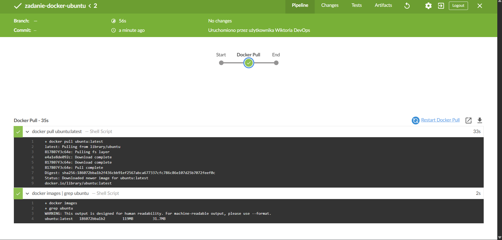


### Uruchomienie buildera w Jenkins - oba pliki wrzucone na Github'a
**Docker.build**

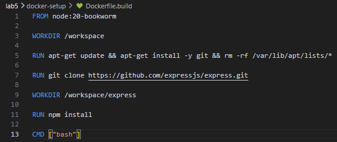

**Docker.test**


**skrypt pipeline**

```
pipeline {
    agent any
    stages {
        stage('Clone Branch') {
            steps {
                git branch: 'WW420972', url: 'https://github.com/InzynieriaOprogramowaniaAGH/MDO2026_ITE.git'
            }
        }
        stage('Build Image') {
            steps {
                sh 'docker build -t moj-budowniczy -f WW420972/lab5/docker-setup/Dockerfile.build WW420972/lab5/'
            }
        }
    }
}
```

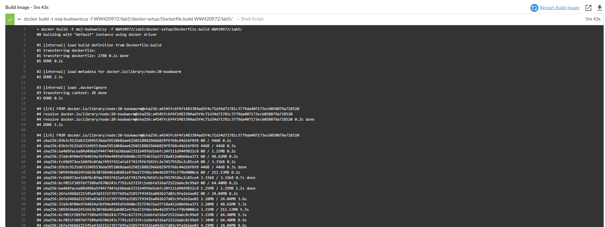
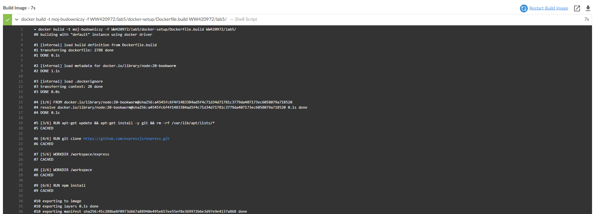

**Różnica w czasie -** jest spowodowana cachowaniem, zapamiętany został poprzedni stan, dlatego nie trzeba było ponownie instalować
