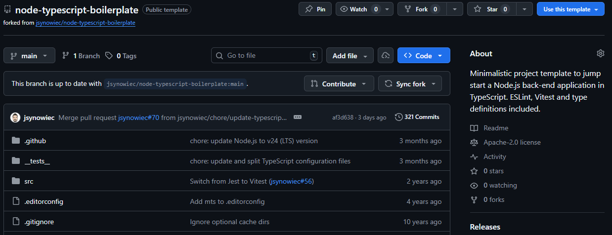
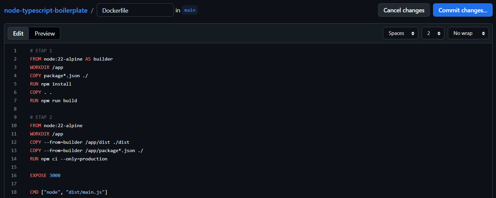
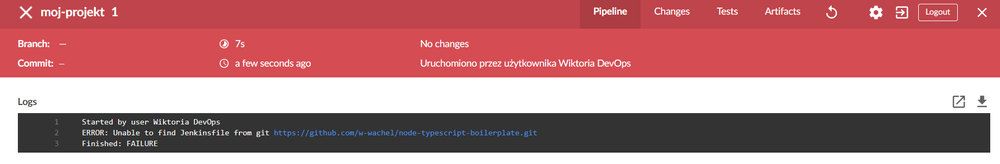
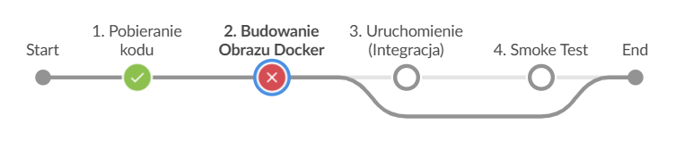

## 1. Wybór projektu
Aplikacja została wybrana✅

Repozytorium - `https://github.com/jsynowiec/node-typescript-boilerplate`

Zdecydowano, czy jest potrzebny fork własnej kopii repozytorium✅   
Wykonałam fork repozytorium, co pozwoliło mi na pracę nad projektem w uporządkowanym środowisku.



Repozytorium stanowi boilerplate, czyli gotowy szkielet aplikacji — zawiera pustą aplikację napisaną w języku TypeScript, z uporządkowaną strukturą folderów oraz skonfigurowanymi narzędziami do testowania.

## 2. Diagram


## 3. Dodanie do projektu Dockerfile
Pliki Dockerfile i Jenkinsfile dostępne w sprawozdaniu w kopiowalnej postaci oraz obok sprawozdania, jako osobne pliki✅   



```
# ETAP 1
FROM node:22-alpine AS builder
WORKDIR /app
COPY package*.json ./
RUN npm install
COPY . .
RUN npm run build

# ETAP 2
FROM node:22-alpine
WORKDIR /app
COPY --from=builder /app/build ./build
COPY --from=builder /app/package*.json ./
RUN npm ci --only=production

EXPOSE 3000

CMD ["node", "build/main.js"]
```

## 4. Konfiguracja Jenkins


Błąd - brak Jenkinsa



## 5. Dodanie Jenkinsfile
Zdefiniowano, jaki element ma być publikowany jako artefakt✅   
Logi z procesu są odkładane jako numerowany artefakt, niekoniecznie jawnie✅   
Przedstawiono sposób na zidentyfikowanie pochodzenia artefaktu✅
```
pipeline {
    agent any

    environment {
        NAZWA_OBRAZU = "moj-boilerplate-ts"
        NAZWA_KONTENERA = "testowa-instancja-app"
    }

    stages {
        stage('1. Pobieranie kodu') {
            steps {
                checkout scm
            }
        }

        stage('2. Budowanie Obrazu Docker') {
            steps {
                echo "Rozpoczynam budowanie obrazu: ${NAZWA_OBRAZU}..."
                sh "docker build -t ${NAZWA_OBRAZU}:${BUILD_NUMBER} ."
            }
        }

        stage('3. Uruchomienie (Integracja)') {
            steps {
                echo "Uruchamiam kontener do testow dymnych..."
                sh "docker stop ${NAZWA_KONTENERA} || true"
                sh "docker rm ${NAZWA_KONTENERA} || true"
                sh "docker run -d --name ${NAZWA_KONTENERA} --network host ${NAZWA_OBRAZU}:${BUILD_NUMBER}"
            }
        }

        stage('4. Smoke Test') {
            steps {
                echo "Sprawdzam czy aplikacja odpowiada..."
                sleep 10
                sh "docker run --rm --network host alpine sh -c 'apk add --no-cache curl && curl -f http://localhost:3000'"            }
        }
    }

    post {
        always {
            echo "Czyszczenie srodowiska i pobieranie logow..."
            sh "docker logs ${NAZWA_KONTENERA} > logi-z-testu-${BUILD_NUMBER}.txt"
            archiveArtifacts artifacts: "*.txt", fingerprint: true
            sh "docker stop ${NAZWA_KONTENERA} || true"
        }
    }
}
```

Błąd - zla nazwa folderu



W Dockerfile zamiast

`COPY --from=builder /app/dist ./dist`

zmiana na

`COPY --from=builder /app/build ./build`

## 6. Odpalenie pipeline

Wybrany program buduje się✅   
Przechodzą dołączone do niego testy✅
Następuje weryfikacja, że aplikacja pracuje poprawnie (*smoke test*) poprzez uruchomienie kontenera 'deploy'✅


