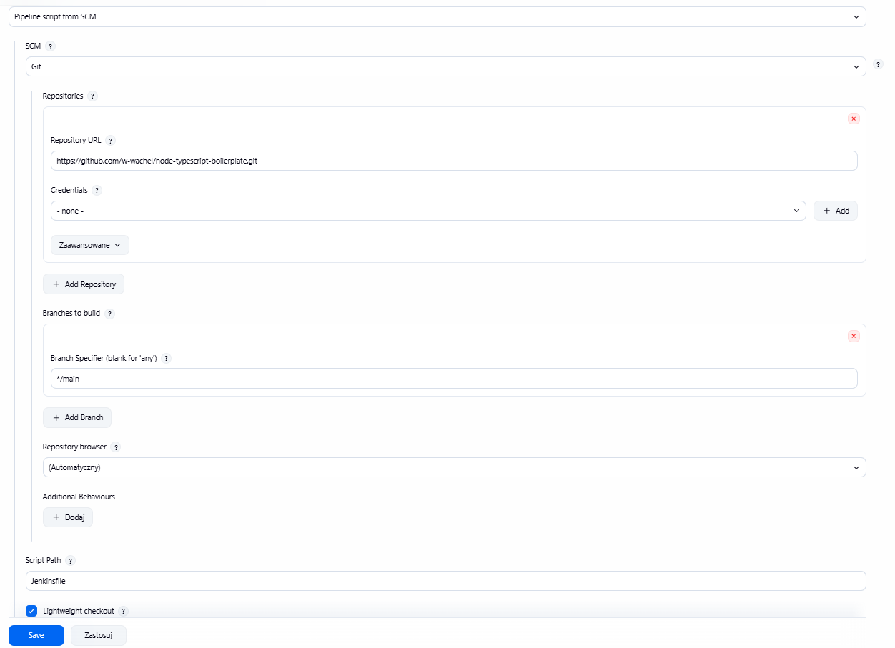
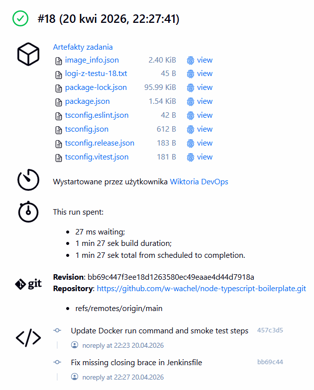
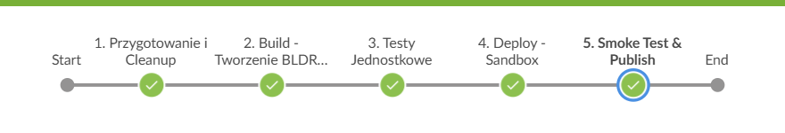

## 1.Konfiguracja SCM


## 2. Przygotowanie i czyszczenie
```
    stage('1. Przygotowanie i Cleanup') {
        steps {
            echo "Sprzątanie folderu roboczego..."
            deleteDir()
            
            echo "Pobieranie świeżego kodu z SCM..."
            checkout scm 

            sh "docker system prune -f" 
        }
    }
```

## 3. Etap budowania
```
    stage('2. Build - Tworzenie BLDR i Artefaktu') {
        steps {
            echo "Buduję obraz budujący (BLDR)..."
            sh "docker build --target builder -t ${NAZWA_OBRAZU}:BLDR ."
            
            echo "Buduję finalny obraz docelowy..."
            sh "docker build -t ${NAZWA_OBRAZU}:${BUILD_NUMBER} ."
            sh "docker tag ${NAZWA_OBRAZU}:${BUILD_NUMBER} ${NAZWA_OBRAZU}:latest"
        }
    }
```

## 4. Testy jednostkowe
```
    stage('3. Testy Jednostkowe') {
        steps {
            echo "Uruchamiam testy na obrazie BLDR..."
            sh "docker run --rm ${NAZWA_OBRAZU}:BLDR npm test || echo 'Testy wykryły błędy, ale idziemy dalej (tryb lab)'"
        }
    }
```

## 5. Sandbox
```
    stage('4. Deploy - Sandbox') {
        steps {
            echo "Uruchamiam Sandbox..."
            sh "docker stop ${NAZWA_KONTENERA} || true"
            sh "docker rm ${NAZWA_KONTENERA} || true"
            
            sh "docker run -d --name ${NAZWA_KONTENERA} --network host ${NAZWA_OBRAZU}:${BUILD_NUMBER}" 
        }
    }
```

## 6. Weryfikacja i metadane
```
    stage('5. Smoke Test & Publish') {
        steps {
            echo "Czekam aż aplikacja wstanie..."
            sleep 15
            
            echo "Sprawdzam połączenie przez kontener zewnętrzny..."
            sh "docker run --rm --network host curlimages/curl -f http://localhost:3000"
            
            echo "Publikowanie artefaktów..."
            sh "docker inspect ${NAZWA_OBRAZU}:${BUILD_NUMBER} > image_info.json"
        }
    }
```

## 7. Operacje końcowe i archiwizacja


```
    post {
        always {
            echo "Czyszczenie srodowiska i pobieranie logow..."
            sh "docker logs ${NAZWA_KONTENERA} > logi-z-testu-${BUILD_NUMBER}.txt || echo 'Brak kontenera do zalogowania'"
            archiveArtifacts artifacts: "*.txt, *.json", fingerprint: true
            sh "docker stop ${NAZWA_KONTENERA} || true"
        }
    }
```



## Podsumowanie
***Czy opublikowany obraz może być uruchomiony w Dockerze bez modyfikacji?***

Stworzony obraz kontenera jest w pełni autokonfigurowalny i gotowy do natychmiastowej eksploatacji. Dzięki zastosowaniu instrukcji CMD w pliku Dockerfile, proces startowy aplikacji (uruchomienie skompilowanego kodu przez Node.js) jest zaszyty wewnątrz obrazu. Pomyślne przejście etapu 5 (Smoke Test) udowodniło, że po komendzie docker run kontener poprawnie wystawia usługę na porcie 3000, nie wymagając od operatora żadnych dodatkowych zmian wewnątrz systemu plików czy konfiguracji zmiennych.

***Czy artefakt dołączony do builda ma szansę zadziałać od razu na maszynie docelowej?***

Tak - głównym artefaktem procesu jest obraz Dockerowy, którego spójność została zagwarantowana przez rurociąg Jenkins. Konteneryzacja eliminuje problem różnic w środowiskach. Artefakt zawiera w sobie wszystkie biblioteki, specyficzną wersję runtime oraz pliki binarne.