## 1. Setup nowej maszyny
Utworzenie maszyny:

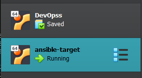

Pierwsze uruchomienie:   

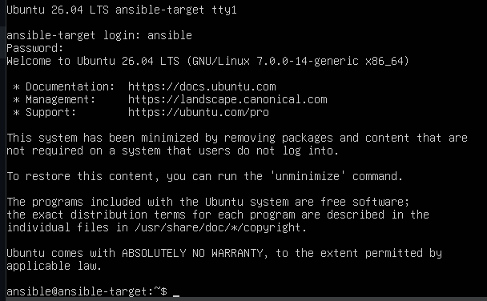

Posiada tar:   

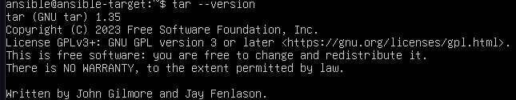

Utworzono snapshota i wyeksportowano ją:   

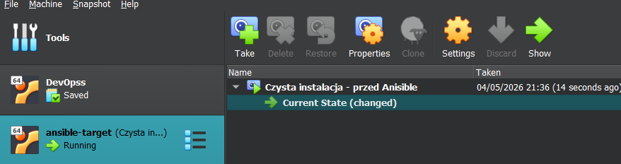   

Pobranie ansible:

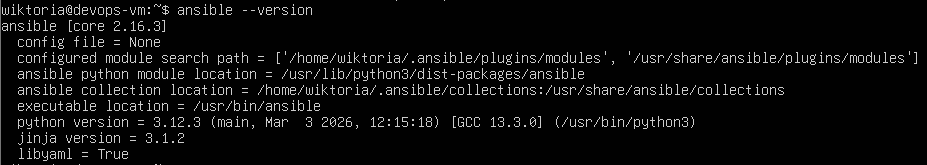

## 2. Inwentaryzacja i zdalne wywoływanie procedur
Sprawdzenie łączności:   

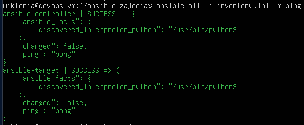

Ustawienie nazw:

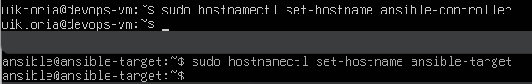

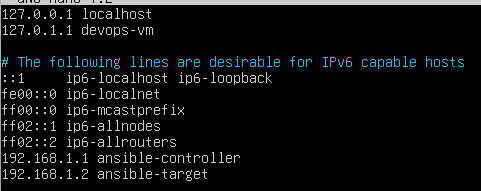

Plik `inventory.ini`

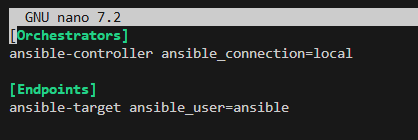

Plik inwentaryzacyjny:  

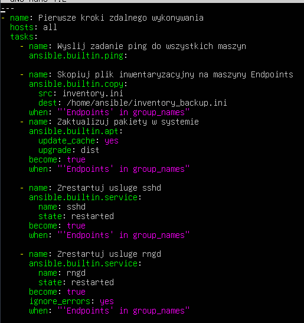

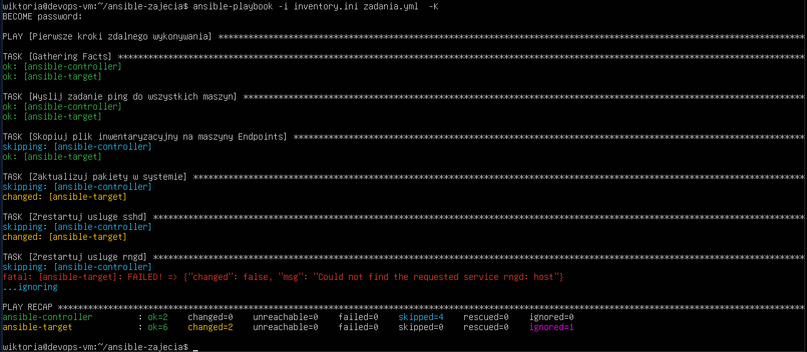

# Role

Utworzenie folderu na role przy pomocy komendy `ansible-galaxy role init docker_deploy`:

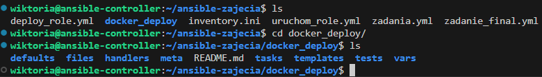

Plik `meta/main.yml`

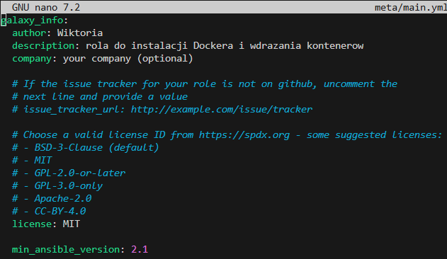

Uruchomienie roli:

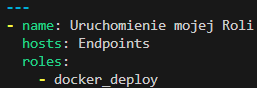

Dodatkowo dodano zmiany w pliku `tasks/main.yml`

Rezultat:

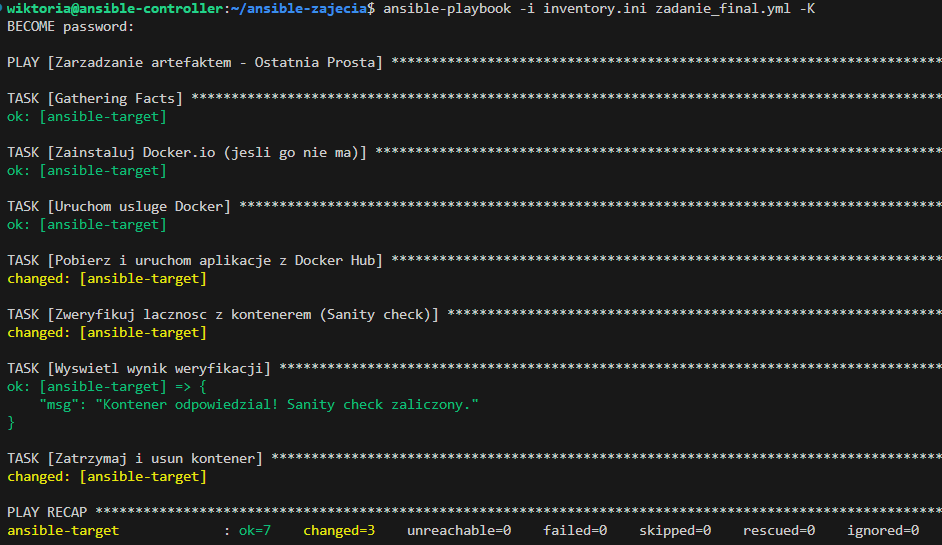
