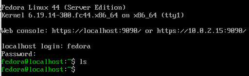
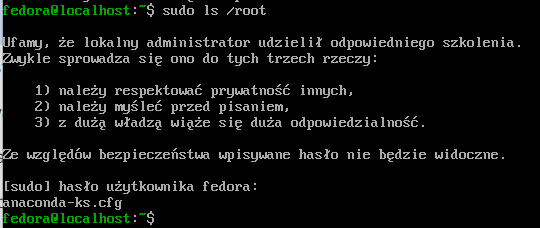
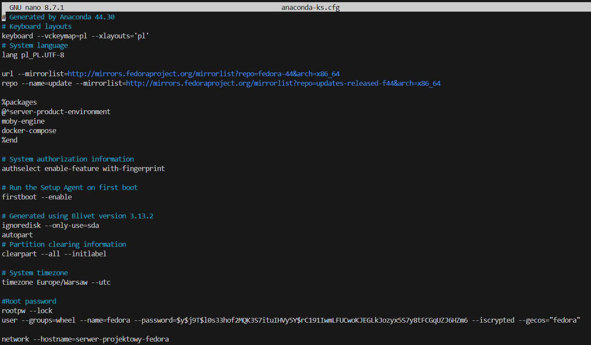
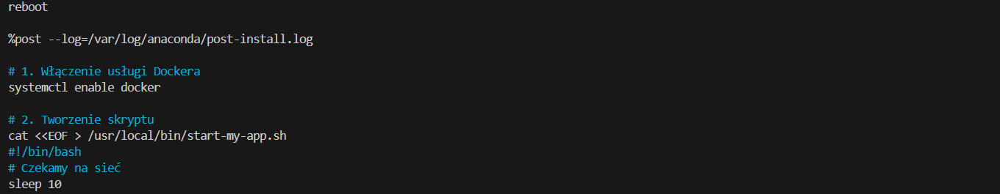
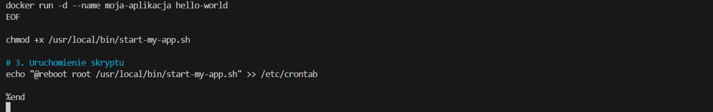
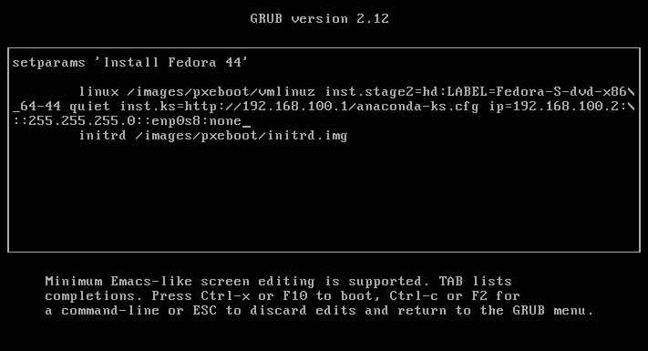
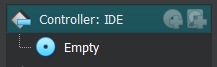
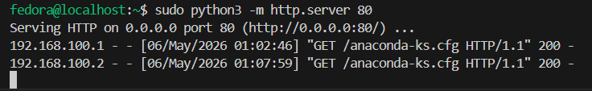
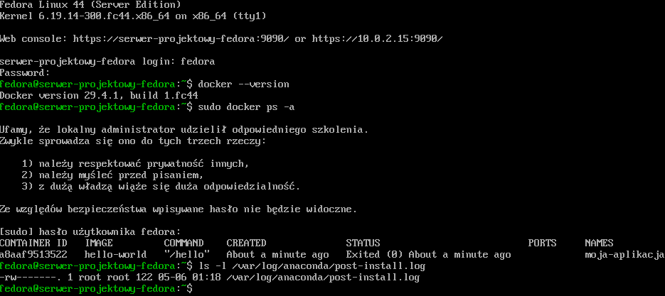

# Laboratoria 9
## 1. Przygotowanie bazy i obrazu ISO

Utworzenie nowej maszyny z fedora

## 2. Plik `anaconda-ks.cfg`

## 3. Dodatkowa maszyna z fedorą 
Przy uruchamianiu się maszyny wciśnięto przycisk `e` w celu edytowania lini bootowania

Została instrukcja:

`inst.ks=http://192.168.100.1/anaconda-ks.cfg ip=192.168.100.2:::255.255.255.0::enp0s8:none`

Po skończeniu odłączone zostało ISO:

Sprawdzono czy połączyło się z główną maszyną:

Serwer 
