# Instalacja klastra Kubernetes
1. Zainstalowano minikube, kubectl oraz uruchomiono Kubernetes: \
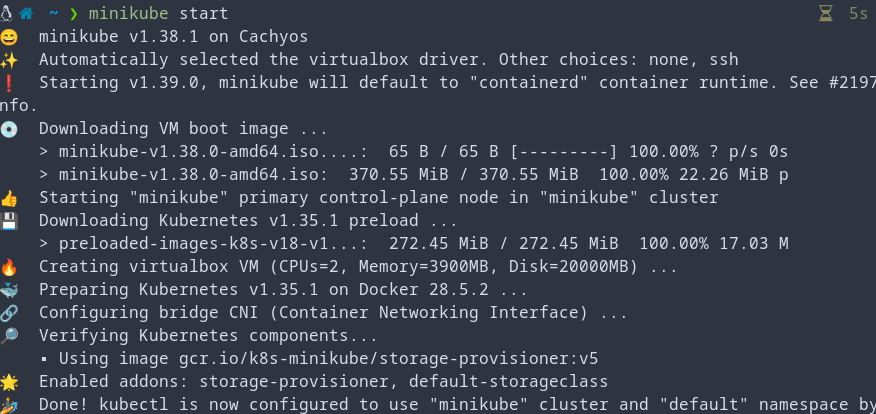

2. Wymogi sprzętowe minikube to:
- 2 CPUs or more
- 2GB of free memory
- 20GB of free disk space
- Internet connection
- Container or virtual machine manager, such as: Docker, QEMU, Hyperkit, Hyper-V, KVM, Parallels, Podman, VirtualBox, or VMware Fusion/Workstation.

Na komputerze na którym wykonano instalację zostały spełnione wszystkie wymogi sprzętowe, oraz jest dostępny: Docker, Virtualbox oraz KVM

3. Na początku był już aktywny 1 worker: 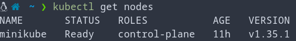

4. Następnie uruchomiono dashboard: \
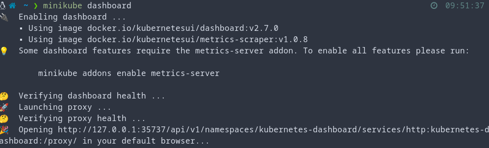 \
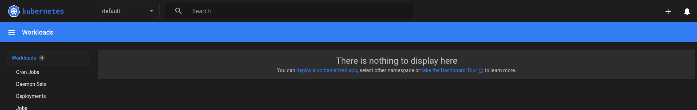

# Analiza posiadanego kontenera

1. Biblioteka FLAC (i jej narzędzie CLI) nie nadają się do deploymentu jako serwis, dlatego na potrzeby tego zadania stworzono customowy kontener nginx:

- index.html:
```html
<!DOCTYPE html>
<html>
<head><title>Moja aplikacja w Minikube</title></head>
<body>
<h1>Witaj w kontenerze!</h1>
<p>Aplikacja działa na Kubernetes + Minikube.</p>
</body>
</html>
```
- default.conf:
```
server {
    listen       80;
    server_name  localhost;
    location / {
        root   /usr/share/nginx/html;
        index  index.html;
    }
}
```
- Dockerfile:
```dockerfile
FROM nginx:alpine
COPY default.conf /etc/nginx/conf.d/default.conf
COPY index.html /usr/share/nginx/html/index.html
EXPOSE 80
```

2. Kontener następnie zbudowano i przetestowano lokalnie: \
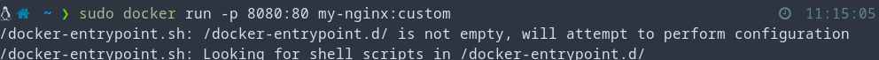 \
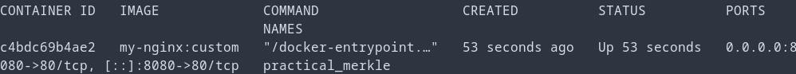 \
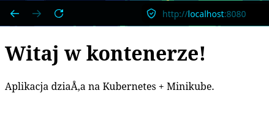

# Uruchomienie oprogramowania

1. Kontener zbudowano następnie wewnątrz dockera Kubernetesa: \
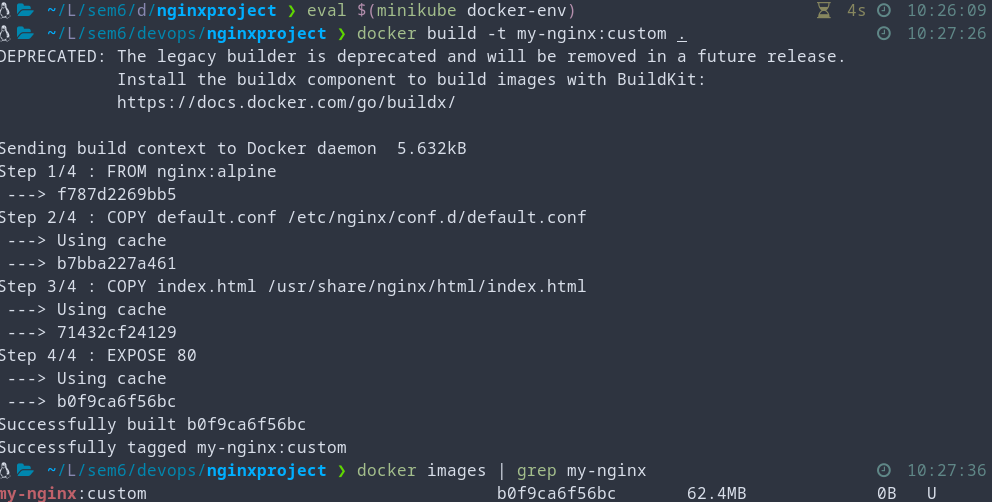

2. Uruchomiono pod: \
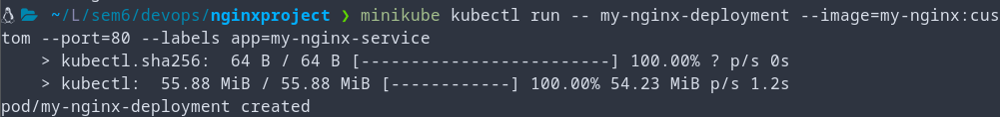

3. Sprawdzono czy działa: \
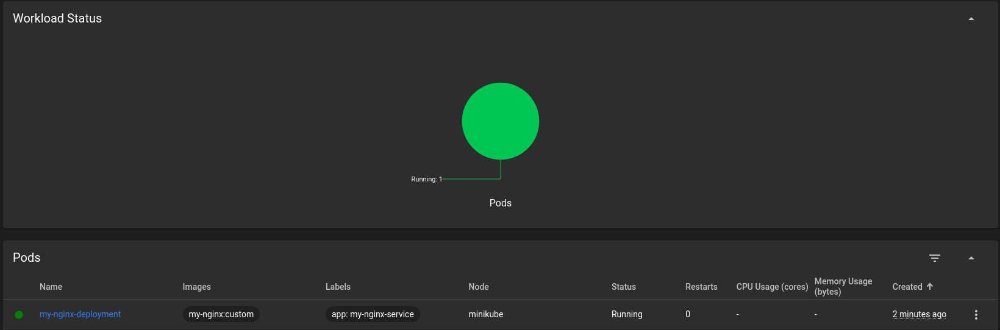

4. Przekierowano port i sprawdzono pracę strony: \
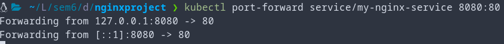 
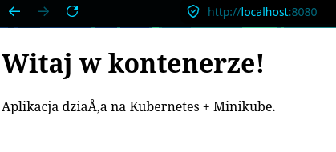

# Przekucie wdrożenia manualnego w plik wdrożenia (wprowadzenie)

1. Utworzono plik wdrożenia który zarówno tworzy deployment jak i serwis:

```yaml
apiVersion: apps/v1
kind: Deployment
metadata:
  name: my-nginx-deployment
spec:
  replicas: 1
  selector:
    matchLabels:
      app: my-nginx
  template:
    metadata:
      labels:
        app: my-nginx
    spec:
      containers:
      - name: nginx-custom
        image: my-nginx:custom
        imagePullPolicy: Never   # tylko lokalny obraz
        ports:
        - containerPort: 80
---
apiVersion: v1
kind: Service
metadata:
  name: my-nginx-service
spec:
  type: NodePort
  selector:
    app: my-nginx
  ports:
    - port: 80
      targetPort: 80
```

2. Następnie wdrożono za pomocą:
```bash
kubectl apply -f deployment.yaml
```
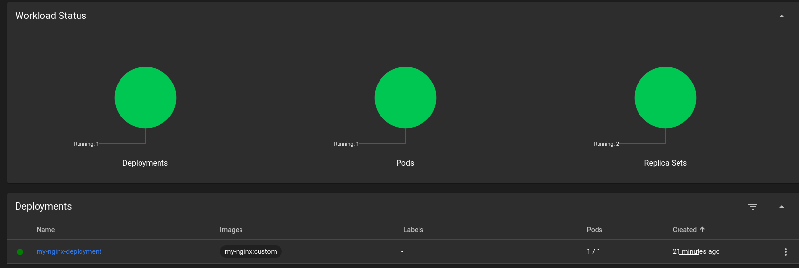

i poszerzono deployment do 4 replik za pomocą:

```bash
kubectl scale deployment my-nginx-deployment --replicas=4
```
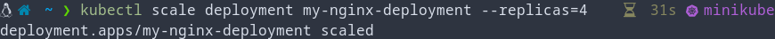

3. Sprawdzono następnie czy strona funkcjonuje (po przekierowaniu portów):
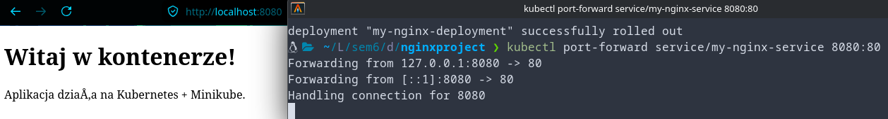
