# Przygotowanie nowego obrazu
1. Przygotowano nową wersję obrazu nginx (pliki potrzebne do zbudowania obrazu są w folderze nginx2):
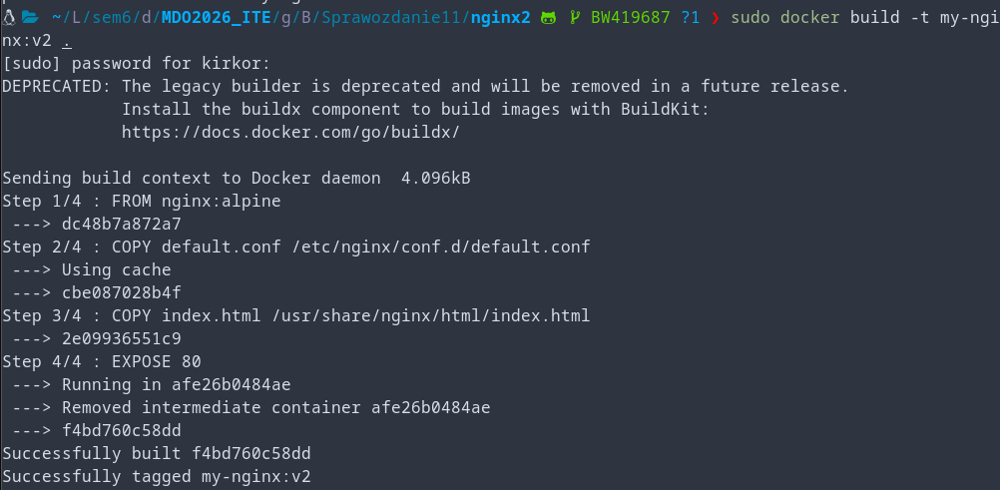
2. Przygotowano wadliwą wersję obrazu nginx (pliki potrzebne do zbudowania obrazu są w folderze nginxfail):
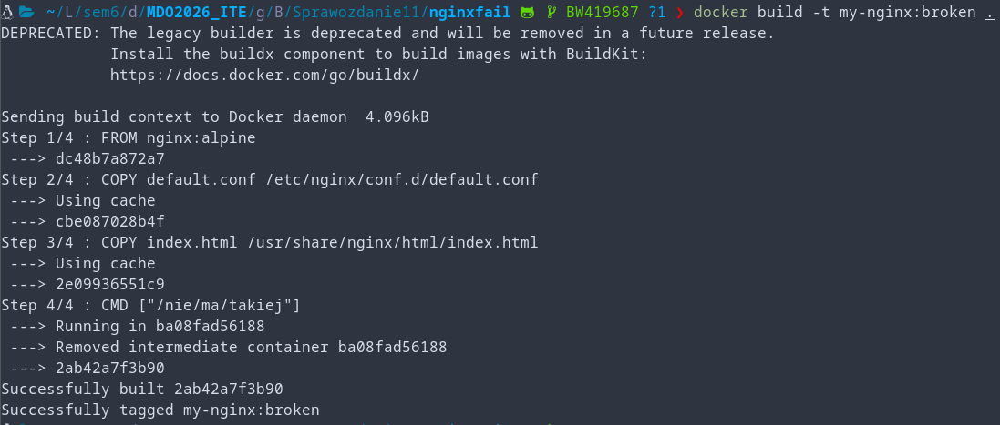
3. Załadowano obie wersje do minikube:
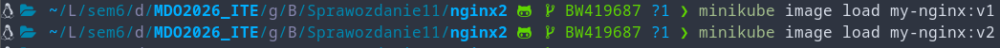 \
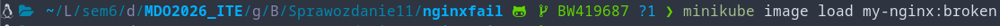
4. Sprawdzono czy obrazy są dostępne:
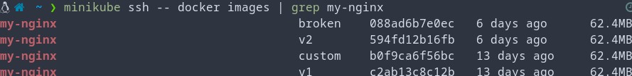

# Zmiany w deploymencie
1. Po zwiększeniu ilości replik do 8:
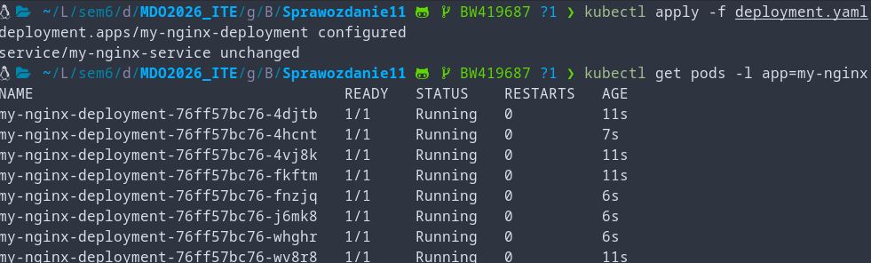
2. Po redukcji ilości replik do 1:
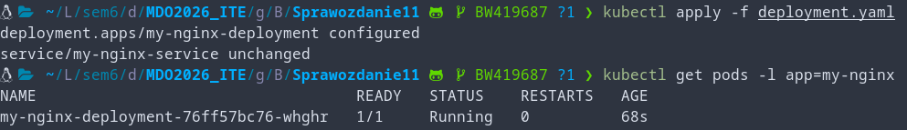
3. Po redukcji ilości replik do 0:
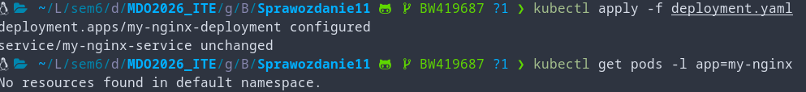
4. Po ponownym przeskalowaniu do 4 replik:
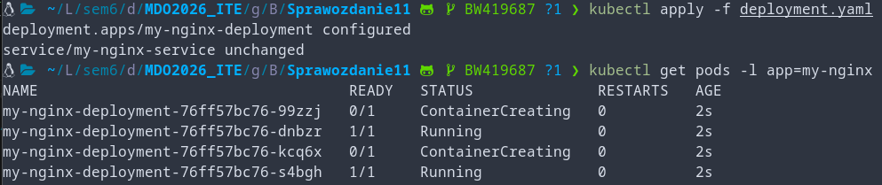
5. Po zastosowaniu nowszej wersji nginx:v2:
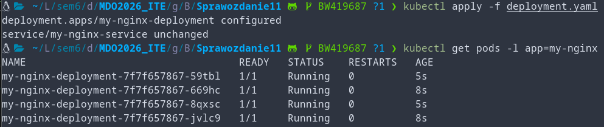
6. Po przywróceniu poprzedniej wersji nginx:v1:
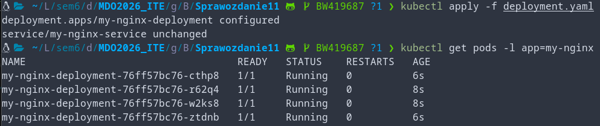
7. Po zastosowaniu wadliwej wersji nginx (3 z 5 podów dalej jest funkcjonalna ponieważ minikube defaultowo używa strategii rolling release, więc w tym przypadku po 2 błędach nie zostały wymienione):
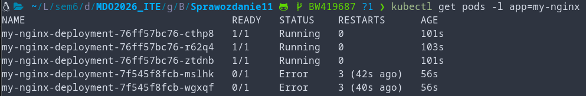
8. Wyświetlono historię deploymentów:
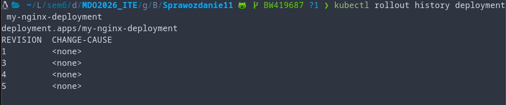
9. Sprawdzono dogłębnie najnowszą rewizję:
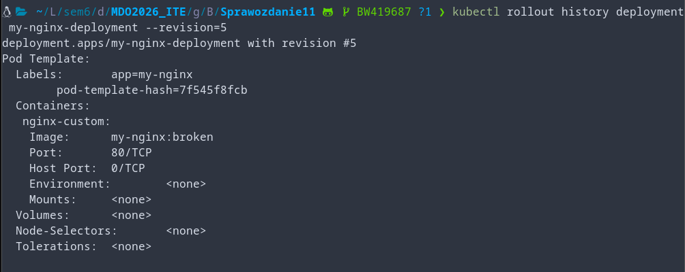
10. Przywrócono rewizję nr.3 (wersję nginx:v2):
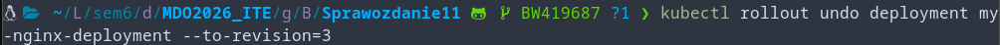
11. Sprawdzono stan nginx:
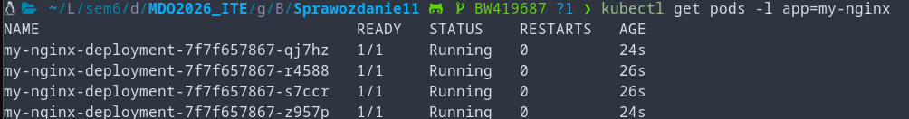

# Kontrola wdrożenia
1. Rozponano rewizje:
1 - 3 rewizje z skalowaniem ilości obrazu v1
4 - wdrożenie obrazu v2
5 - wdrożenie wadliwego obrazu
2. Napisano skrypt weryfikujący wdrożenie:
```bash
#!/bin/bash

DEPLOYMENT=$1
NAMESPACE=${2:-default}

if [ -z "$DEPLOYMENT" ]; then
  echo "Użycie: $0 <nazwa-deploymentu> [namespace]"
  exit 1
fi

echo "Sprawdzanie rolloutu deploymentu '$DEPLOYMENT' w namespace '$NAMESPACE' (limit czasu: 60s)..."

# Uruchom kubectl rollout status z timeoutem 60 sekund
if kubectl rollout status deployment/"$DEPLOYMENT" -n "$NAMESPACE" --timeout=60s; then
  echo "Deployment '$DEPLOYMENT' zakończył rollout pomyślnie w czasie < 60s."
  exit 0
else
  echo "Deployment '$DEPLOYMENT' NIE zakończył rolloutu w ciągu 60 sekund (lub wystąpił błąd)."
  exit 1
fi
```

# Strategie wdrożenia
1. Przygotowano wdrożenia dla różnych strategii (w plikach deployment-rolling, deployment-recreate, deployment-canary-*)
2. Uruchomiono każde wdrożenie i sprawdzono stan podów:
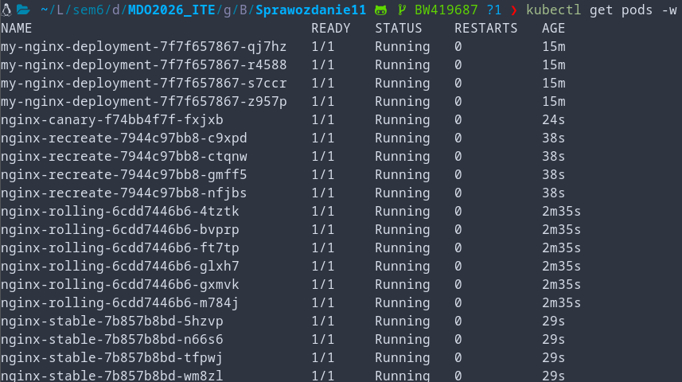
3. Następnie zmieniono wersję nginx i wdrożono ponownie (w tym przypadku doszło do przestoju w funkcjonowaniu nginx dla strategii recreate, ponieważ każdy pod został zatrzymany i utworzony ponownie w przeciwieństwie do strategii rolling która stopniowo wdrażała zmianę):
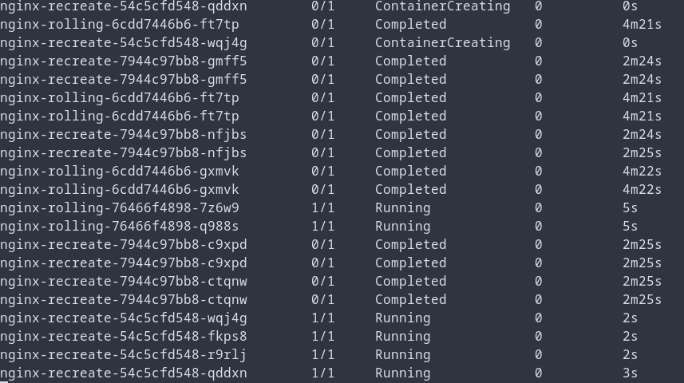
4. Następnie manualnie wyskalowano strategią canary:
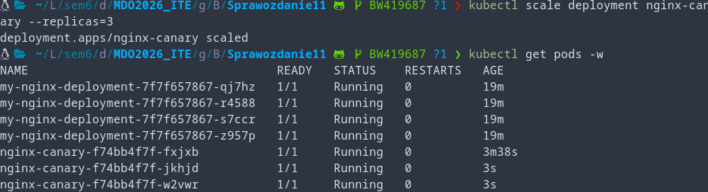
5. Podsumowując:
- Strategia rolling stopniowo wprowadza zmiany wśród replik unikając tym samym przestojów w funkcjonowaniu oprogramowania.
- Strategia recreate bezpośrednio wprowadza zmiany zatrzymując wszystkie pody, a następnie tworząc je ponownie. To jest najbardziej zakłócająca metoda.
- Strategia canary zapewnia największą kontrolę ponieważ to administrator manualnie decyduje ile podów zostaje wdrożonych (przez co zostawia dużo czasu na monitorowanie zachowania programu).