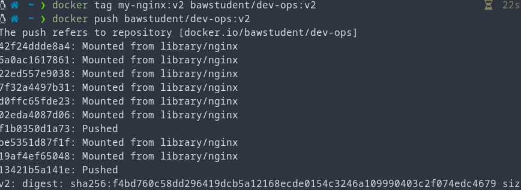
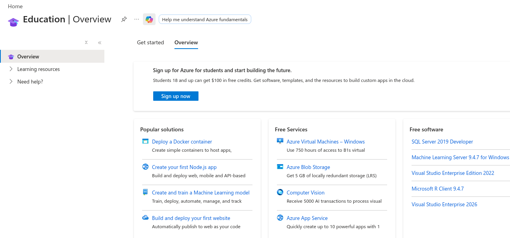
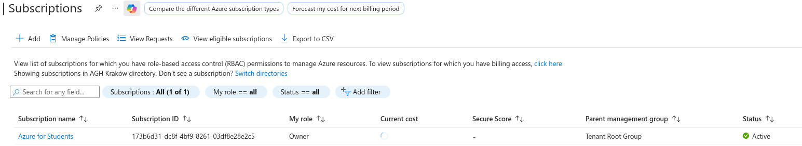
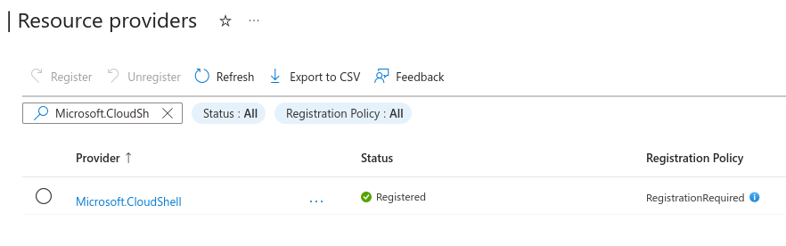
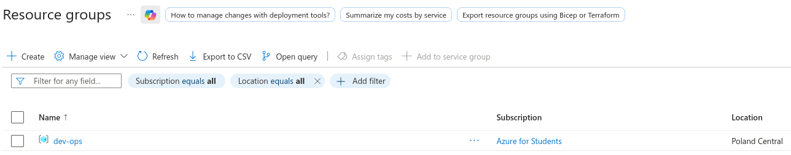
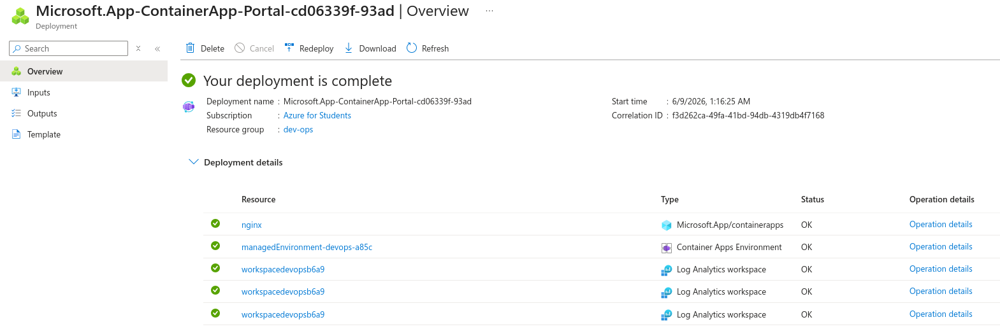
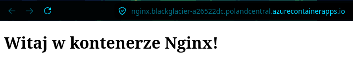
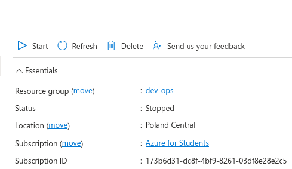
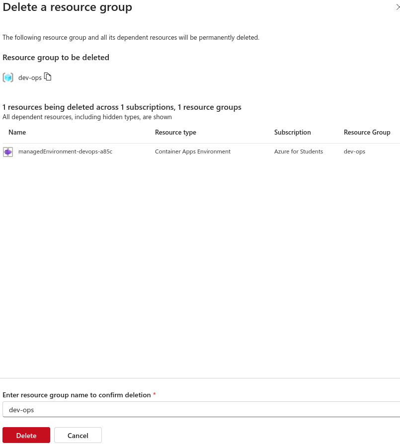

# Przygotowanie kontenera
Przygotowano i zpushowano do dockerhub świeży obraz kontenera:

# Zapoznanie z platformą
1. Utworzono nowe konto:

2. A następnie aktywowano odpowiednią subskrypcję dla studentów:

3. Aktywowano usługę cloudshell aby zyskać dostęp do powłoki chmury:

# Zadanie
1. Przygotowano resource group (bez resource group nie można wdrażać usług ponieważ muszą być odpowiednio grupowane):

2. Następnie wdrożono kontener nginx do grupy dev-ops (pamiętając podczas wstępnj konfiguracji kontenera, że bez ustawionego zewnętrznego ingressu będzie niedostępny dla reszty internetu):

3. Sprawdzono działanie kontenera poprzez wejście na przydzielony mu automatycznie adres:

4. Pobrano logi kontenera za pomocą "Log Stream":
```
Connecting to stream...
2026-06-08T23:24:50.64887  Connecting to the container 'nginx'...
2026-06-08T23:24:50.67880  Successfully Connected to container: 'nginx' [Revision: 'nginx--y53npdc', Replica: 'nginx--y53npdc-94f4c75df-l6ngd']
2026-06-08T23:19:13.3057342Z stdout F /docker-entrypoint.sh: Launching /docker-entrypoint.d/10-listen-on-ipv6-by-default.sh
2026-06-08T23:19:13.3092268Z stdout F 10-listen-on-ipv6-by-default.sh: info: Getting the checksum of /etc/nginx/conf.d/default.conf
2026-06-08T23:19:13.3197062Z stdout F 10-listen-on-ipv6-by-default.sh: info: /etc/nginx/conf.d/default.conf differs from the packaged version
2026-06-08T23:19:13.3203505Z stdout F /docker-entrypoint.sh: Sourcing /docker-entrypoint.d/15-local-resolvers.envsh
2026-06-08T23:19:13.3203685Z stdout F /docker-entrypoint.sh: Launching /docker-entrypoint.d/20-envsubst-on-templates.sh
2026-06-08T23:19:13.3234767Z stdout F /docker-entrypoint.sh: Launching /docker-entrypoint.d/30-tune-worker-processes.sh
2026-06-08T23:19:13.3257689Z stdout F /docker-entrypoint.sh: Configuration complete; ready for start up
2026-06-08T23:19:13.3304362Z stderr F 2026/06/08 23:19:13 [notice] 1#1: using the "epoll" event method
2026-06-08T23:19:13.3304548Z stderr F 2026/06/08 23:19:13 [notice] 1#1: nginx/1.31.0
2026-06-08T23:19:13.3304629Z stderr F 2026/06/08 23:19:13 [notice] 1#1: built by gcc 15.2.0 (Alpine 15.2.0) 
2026-06-08T23:19:13.3304652Z stderr F 2026/06/08 23:19:13 [notice] 1#1: OS: Linux 6.6.139.1-1.azl3
2026-06-08T23:19:13.3304673Z stderr F 2026/06/08 23:19:13 [notice] 1#1: getrlimit(RLIMIT_NOFILE): 1048576:1048576
2026-06-08T23:19:13.3305165Z stderr F 2026/06/08 23:19:13 [notice] 1#1: start worker processes
2026-06-08T23:19:13.3307504Z stderr F 2026/06/08 23:19:13 [notice] 1#1: start worker process 29
2026-06-08T23:19:13.3308670Z stderr F 2026/06/08 23:19:13 [notice] 1#1: start worker process 30
2026-06-08T23:19:13.3310328Z stderr F 2026/06/08 23:19:13 [notice] 1#1: start worker process 31
2026-06-08T23:19:13.3311849Z stderr F 2026/06/08 23:19:13 [notice] 1#1: start worker process 32
2026-06-08T23:20:00.3168444Z stdout F 100.100.0.53 - - [08/Jun/2026:23:20:00 +0000] "GET / HTTP/1.1" 200 202 "https://sandbox-4.reactblade.portal.azure.net/" "Mozilla/5.0 (X11; Linux x86_64; rv:151.0) Gecko/20100101 Firefox/151.0" "149.156.124.21"
2026-06-08T23:20:00.4552771Z stderr F 2026/06/08 23:20:00 [error] 29#29: *17 open() "/usr/share/nginx/html/favicon.ico" failed (2: No such file or directory), client: 100.100.0.53, server: localhost, request: "GET /favicon.ico HTTP/1.1", host: "nginx.blackglacier-a26522dc.polandcentral.azurecontainerapps.io", referrer: "https://nginx.blackglacier-a26522dc.polandcentral.azurecontainerapps.io/"
2026-06-08T23:20:00.4554040Z stdout F 100.100.0.53 - - [08/Jun/2026:23:20:00 +0000] "GET /favicon.ico HTTP/1.1" 404 153 "https://nginx.blackglacier-a26522dc.polandcentral.azurecontainerapps.io/" "Mozilla/5.0 (X11; Linux x86_64; rv:151.0) Gecko/20100101 Firefox/151.0" "149.156.124.21"
```
5. Następnie zatrzymano kontener:

6. I usunięto cały resource group razem z powiązaną zawartością:
