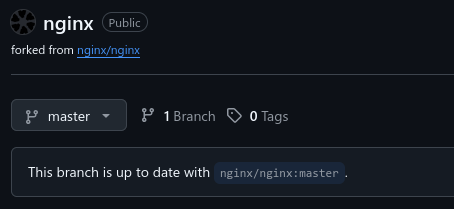
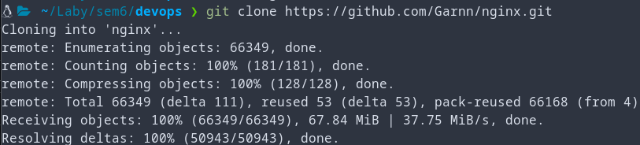
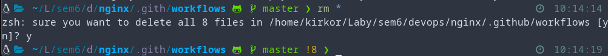
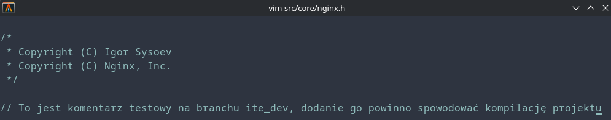
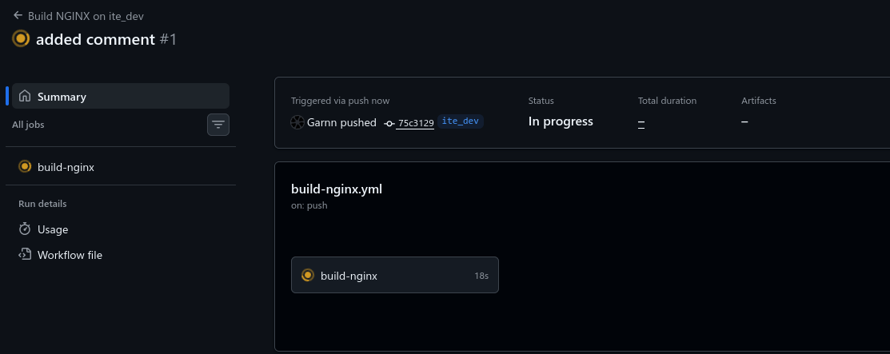
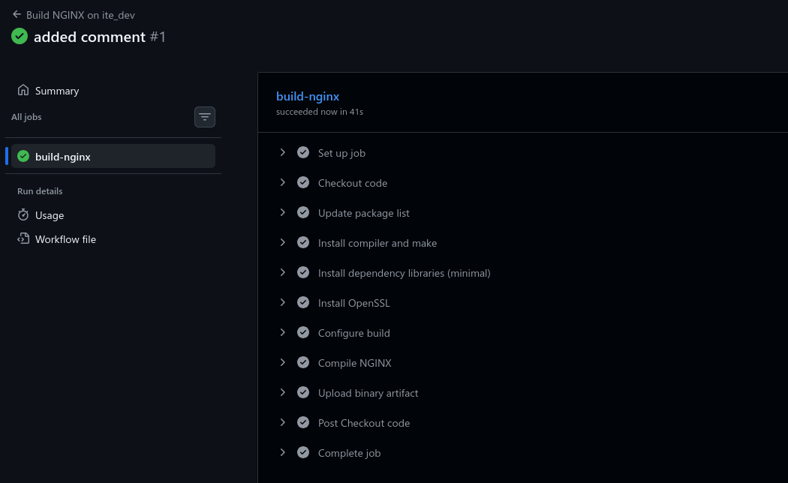
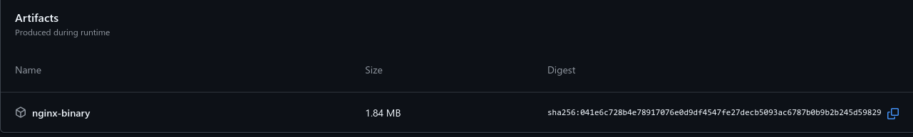

# Stosowanie Github Actions

1. Utworzono fork repozytorium nginx:

2. Następnie sklonowano repozytorium:

3. Oraz usunięto obecne już pliki workflow:

4. Następnie utworzono nowy plik workflow ograniczony do gałęzi "ite_dev":
```yml
name: Build NGINX on ite_dev

on:
  push:
    branches: [ ite_dev ]

jobs:
  # GŁÓWNY JOB: Budowanie NGINX (domyślnie uruchamiany)
  build-nginx:
    runs-on: ubuntu-latest
    steps:
      - name: Checkout code
        uses: actions/checkout@v4
        with:
          ref: ite_dev   # upewnia się, że pracujemy na właściwej gałęzi

      - name: Update package list
        run: sudo apt update

      - name: Install compiler and make
        run: sudo apt install -y gcc make

      - name: Install dependency libraries (minimal)
        run: sudo apt install -y libpcre3-dev zlib1g-dev

      - name: Install OpenSSL
        run: sudo apt install -y libssl-dev

      - name: Configure build
        run: auto/configure

      - name: Compile NGINX
        run: make

      - name: Upload binary artifact
        uses: actions/upload-artifact@v4
        with:
          name: nginx-binary
          path: objs/nginx
          if-no-files-found: error
```
5. Następnie wprowadzono zmianę aby spowodować wywołanie workflowa (ponieważ sekcja "on: push:" powoduje że jakikolwiek push na ten branch wywołuje build):

6. Już w przeglądarce, w zakładce actions repozytorium workflow został wywołany:

7. Build przebiegł pomyślnie:

8. Oraz automatycznie załączył skompilowany plik binarny dzięki ostatniemu etapowi używającemu dedykowanej akcji: "actions/upload-artifact@v4":
