Wszystkie poniższe czynności zostały wykonane na maszynie wirtualnej Ubuntu Server za pomocą SSH.

# Zestawienie środowiska skonteneryzowanego

1. Zainstalowano Docker poprzez: \
Uaktualnienie apt: 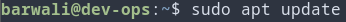 \
Zainstalowanie odpowiedniego package'a: 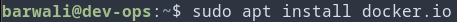 \
Uruchomienie serwisu: 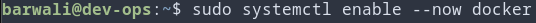 \
Dodanie użytkownika do grupy która może pracować z dockerem: 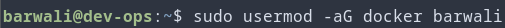

2. Zarejestrowano konto na Dockerhub: \


3. Zapoznano się z obrazami: \
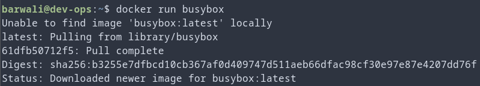 \
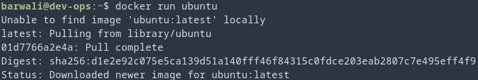 \
Sprawdzono ich rozmiary: \
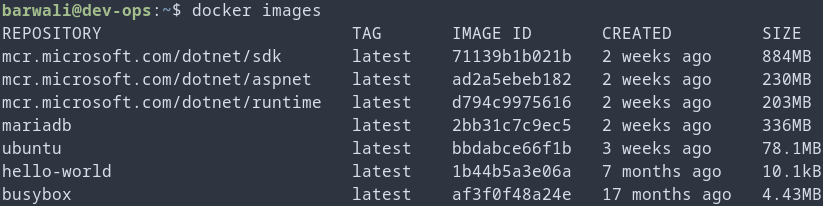 \
oraz ich kody wyjścia: \
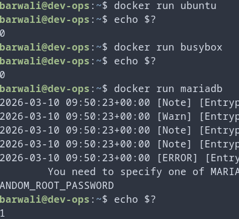 \
(Mariadb wymaga dodatkowej konfiguracji np. poprzez zmienną środowiskową, dlatego zwraca 1)

4. Uruchomiono kontener busybox interaktywnie (bez polecenia do wykonania busybox natychmiastowo się wyłącza): \
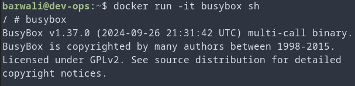

5. Uruchomiono kontener Ubuntu i zaktualizowano package:
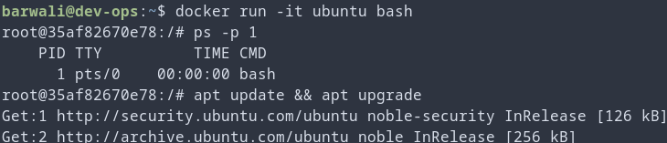 \
W międzyczasie sprawdzono procesy dockera: 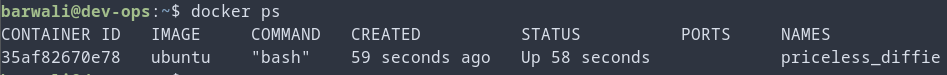

6. Stworzono własnoręcznie Dockerfile dla obrazu pobierającego repozytorium: \

```dockerfile
FROM ubuntu:22.04

RUN apt-get update && apt-get install -y git


WORKDIR /src
RUN git clone https://github.com/InzynieriaOprogramowaniaAGH/MDO2026_ITE.git repo
WORKDIR /src/repo

CMD ["git", "branch"]
```

obraz zbudowano (z tagiem, aby był bardziej rozpoznawalny): \
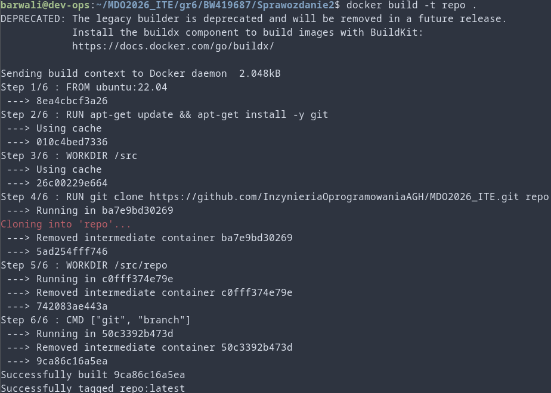

oraz sprawdzono czy repozytorium rzeczywiście się sklonowało: \
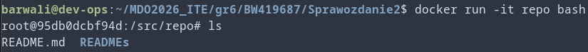

7. Pokazano uruchomione kontenery: \
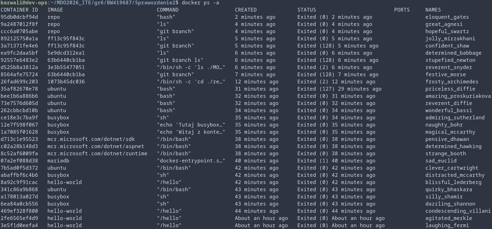 \
Oraz usunięto zakończone: \
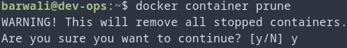 \

8. Wyczyszczono obrazy przechowywane w lokalnym magazynie: \
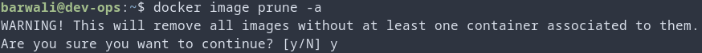