Wszystkie poniższe czynności zostały wykonane na maszynie wirtualnej Ubuntu Server za pomocą SSH.

# Dobór i wstępna kompilacja programu otwartoźródłowego

1. Wybrano repozytorium FLAC (https://gitlab.xiph.org/steils/flac/) jako program z otwartą licencją i systemem buildowania z testami: 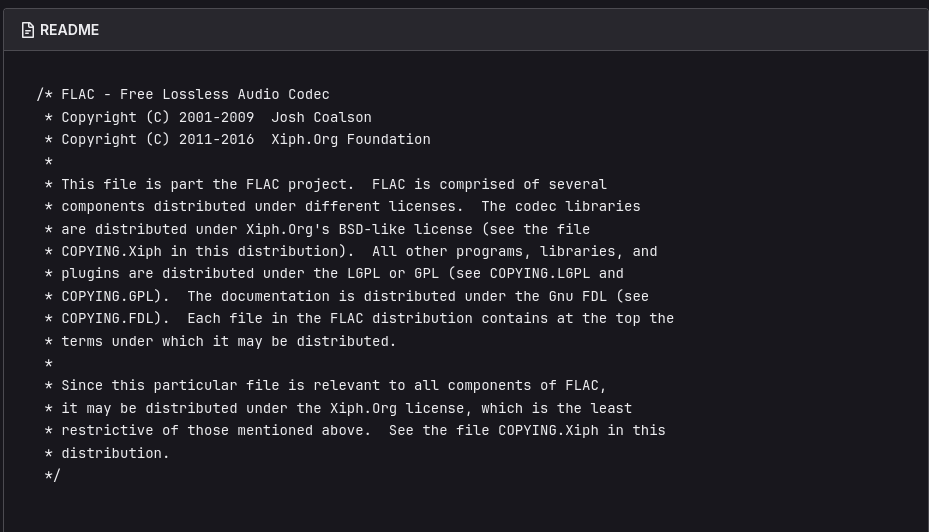

2. Po zainstalowaniu zależności wywołano skrypt autoconf: 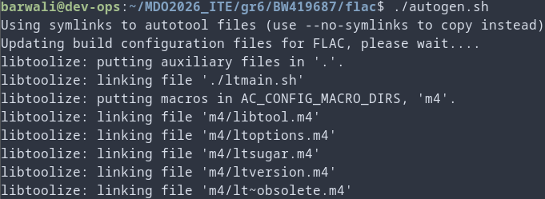

3. Następnie wywołano skrypt configure 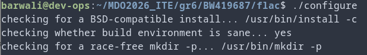

4. Po uruchomieniu obu narzędzi program może być zbuildowany za pomocą make: 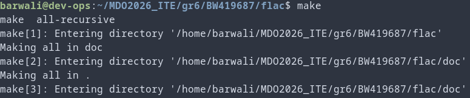

5. I przetestowany za pomocą make check: 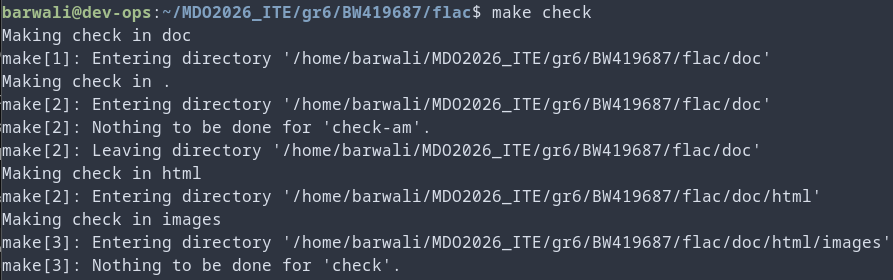

# Build w kontenerze

1. Uruchomiono nowy kontener Ubuntu: 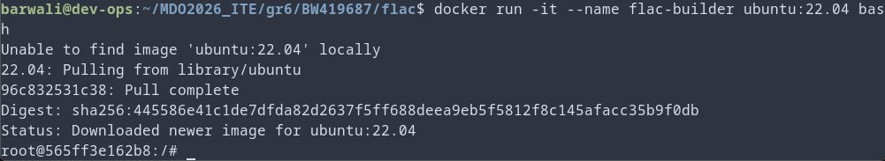

2. Pobrano zależności: 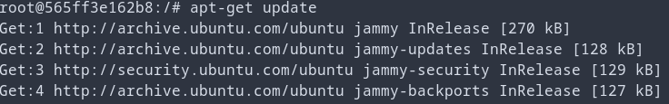 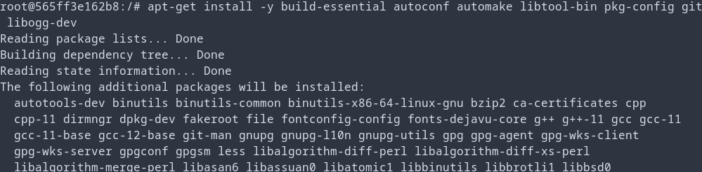 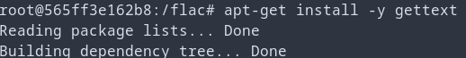

3. Sklonowano repozytorium: 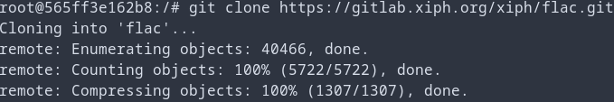

4. Zbudowano program: 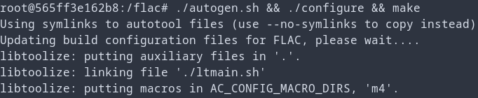

5. Utworzono użytkownika do wykonywania testów (root nie powinien ich wykonywać): 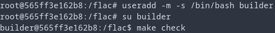

# Automatyzacja z dockerfile

1. Utworzono plik Dockerfile-build do buildowania (ale nie testowania) FLAC:
```docker
FROM ubuntu:22.04

# Pobieranie zależności
RUN apt-get update && apt-get install -y \
    build-essential \
    autoconf \
    automake \
    libtool-bin \
    pkg-config \
    git \
    libogg-dev \
    gettext

# Przygotowanie użytkownika
RUN useradd -m -s /bin/bash builder && \
    echo "builder ALL=(ALL) NOPASSWD:ALL" >> /etc/sudoers

USER builder
WORKDIR /home/builder

# Klonowanie
RUN git clone https://gitlab.xiph.org/xiph/flac.git flac

# Build
WORKDIR /home/builder/flac
RUN ./autogen.sh && \
    ./configure && \
    make -j$(nproc)
```

2. Zbudowano następnie obraz z zbuildowanym FLAC: 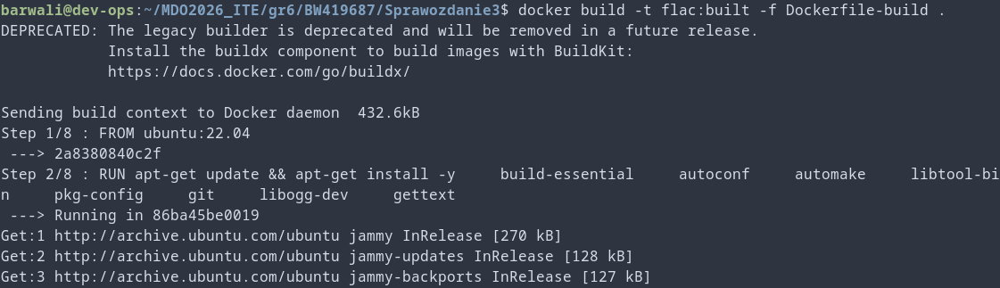

3. Stworzono dockerfile testowy na podstawie poprzedniego:
```docker
# Obraz bazowany na poprzednim obrazie
FROM flac:built

USER builder
WORKDIR /home/builder/flac

# Testy (bez ponownej kompilacji)
RUN make check
```

4. Zbudowano obraz testowy: 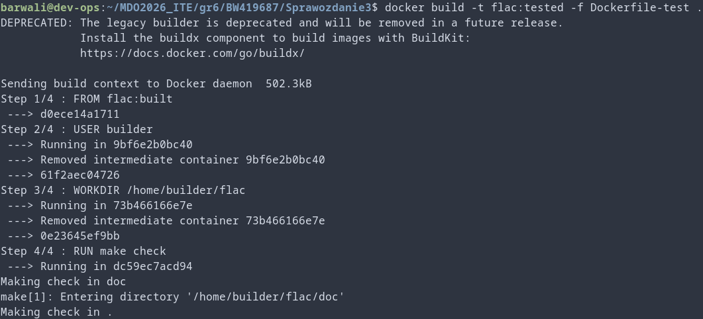