Wszystkie poniższe czynności (poza ostatnim pomiarem prędkości) zostały wykonane na maszynie wirtualnej Ubuntu Server za pomocą SSH.

# Zachowywanie stanu między kontenerami

1. Stworzono 2 nowe woluminy: 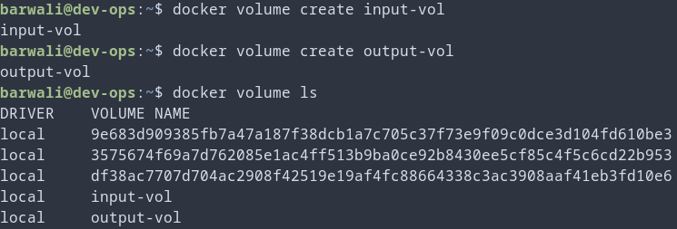

2. Zmodyfikowano Dockerfile z poprzednich zajęć aby stworzyć obraz builder bez gita:
```docker
FROM ubuntu:22.04

# Pobieranie zależności
RUN apt-get update && apt-get install -y \
    build-essential \
    autoconf \
    automake \
    libtool-bin \
    pkg-config \
    libogg-dev \
    gettext
```
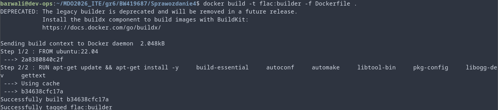
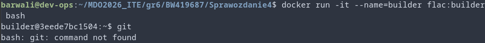 \
3. 
Utworzono kontener z załączonymi woluminami: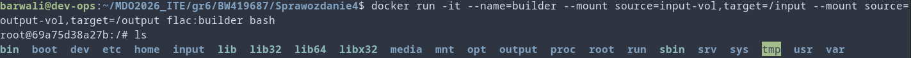 \
4. Sklonowano repozytorium za pomocą kontenera pomocniczego:
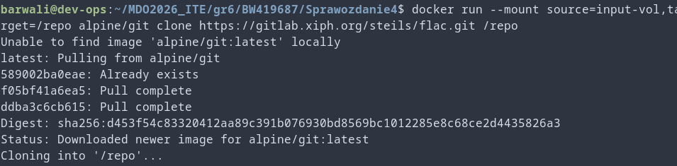 \
5. Uruchomiono build w kontenerze: 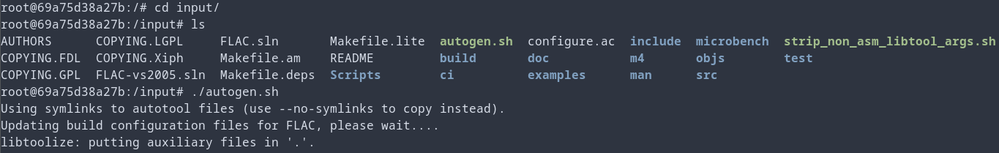 i zapisano wynik: 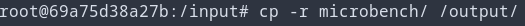 \
6. Można również wszystko wykonać za pomocą dockerfile'a i parametru --mount dla RUN:
```docker
FROM flac:builder AS builder

# Montujemy wolumin wejściowy (bind mount) – źródło może być np. lokalny katalog
RUN --mount=type=bind,target=/input \
    cd /input && ./autogen.sh && ./configure && make -j$(nproc)

# Kopiujemy wynik do woluminu wyjściowego (lub do obrazu)
RUN --mount=type=bind,target=/output \
    cp -r /input/microbench /output/
```

# Eksponowanie portu i łączność między kontenerami

1. Uruchomiono kontener iperf w trybie serwera (-s): 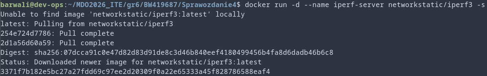
2. Sprawdzono adres IP serwera za pomocą docker inspect: 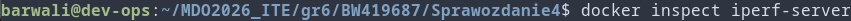 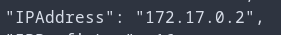
3. Wykonano test tymczasowym kontenerem w trybie klienta (-c): 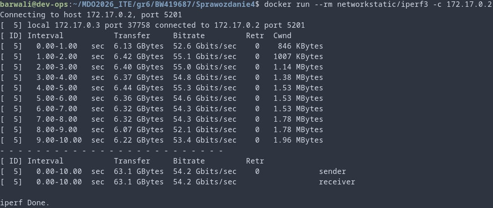
4. Utworzono nową sieć: 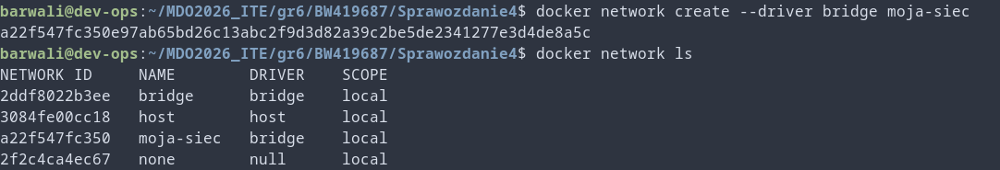
5. Utworzono nowy serwer przyłączony do tej sieci: 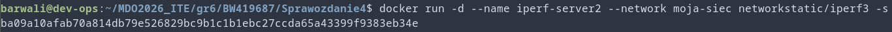
6. Wykonano kolejny test, tym razem za pomocą wewnętrznego DNS: 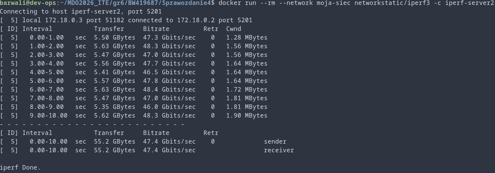
7. Uruchomiono nowy serwer z opublikowanym portem: 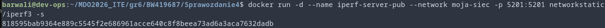
8. Oraz sprawdzono łączość z hostem: 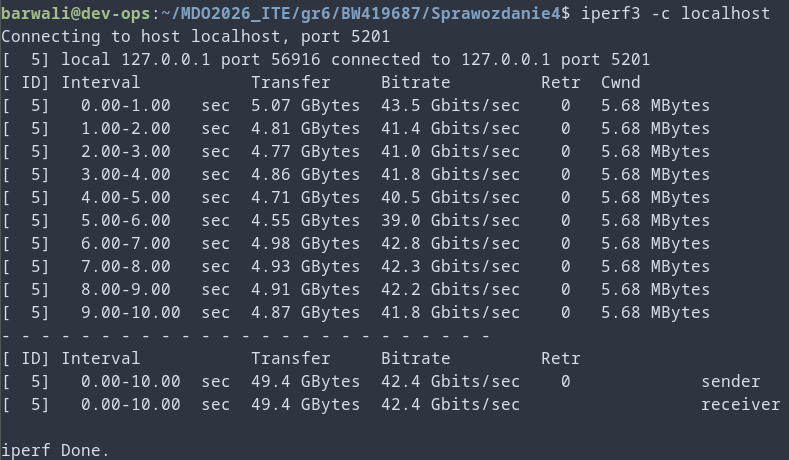
9. Następnie sprawdzono łączność z hostem hosta (fizycznym komputerem na którym wykonywane są zadania): 

# Usługi w rozumieniu systemu, kontenera i klastra

1. Stworzono nowy kontener: 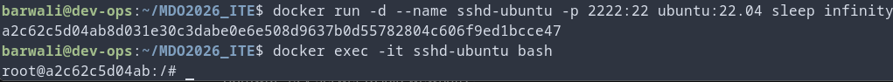
2. Zainstalowano serwer ssh: 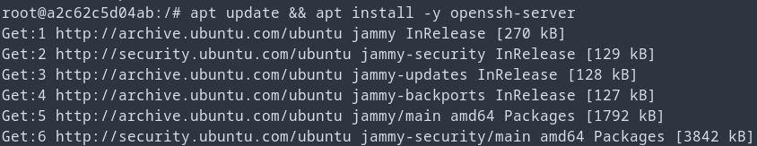
3. Ustawiono hasło roota i pozwolono na logowanie przez nie: 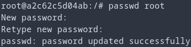 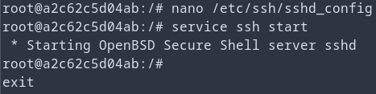
4. Zalogowano się przez ssh: 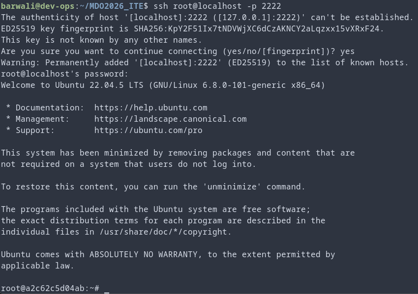

## Zalety:
1. Można wykorzystać klucze SSH, uwierzytelnianie dwuskładnikowe, ograniczenia dostępu.
2. Można wykorzystywać narzędzia wykorzystujące SSH do komunikacji jak np. rsync.
3. SSH umożliwia tunelowanie ruchu, co mogłoby być przydatne jeśli chcemy "nadawać" serwis z innego miejsca niż localhost.
## Wady:
1. Dodatkowy narzut od uruchamiania serwera.
2. SSH utrudnia rekreację tego co zostało zrobione w kontenerze ponieważ nie jest deklaratywne.

W zasadzie taki kontener z SSH mógłby się przydać jako lekkie środowisko kompilacji.

# Przygotowanie do uruchomienia serwera Jenkins

1. Stworzono nową sieć: 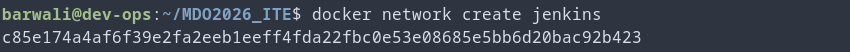
2. Utworzono nowy kontener DIND: 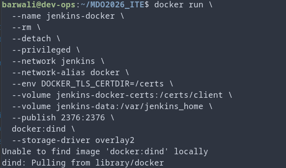
3. Utworzono nowy obraz kontenera Jenkins na podstawie poniższego kodu:
```docker
FROM jenkins/jenkins:2.541.3-jdk21
USER root
RUN apt-get update && apt-get install -y lsb-release ca-certificates curl && \
    install -m 0755 -d /etc/apt/keyrings && \
    curl -fsSL https://download.docker.com/linux/debian/gpg -o /etc/apt/keyrings/docker.asc && \
    chmod a+r /etc/apt/keyrings/docker.asc && \
    echo "deb [arch=$(dpkg --print-architecture) signed-by=/etc/apt/keyrings/docker.asc] \
    https://download.docker.com/linux/debian $(. /etc/os-release && echo \"$VERSION_CODENAME\") stable" \
    | tee /etc/apt/sources.list.d/docker.list > /dev/null && \
    apt-get update && apt-get install -y docker-ce-cli && \
    apt-get clean && rm -rf /var/lib/apt/lists/*
USER jenkins
RUN jenkins-plugin-cli --plugins "blueocean docker-workflow json-path-api"

```
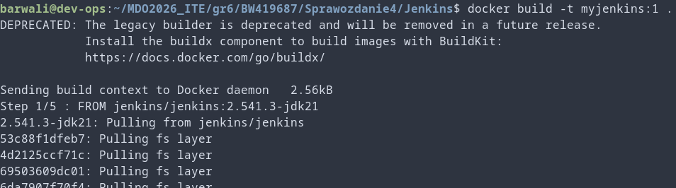
4. Uruchomiono nowy obraz: 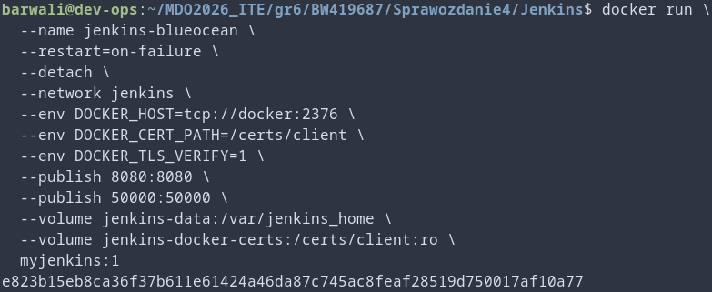
5. Sprawdzono aktywne obrazy: 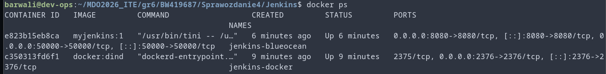
6. Wykonano kolejne kroki instalacji za pomocą interfejsu graficznego na porcie 8080: 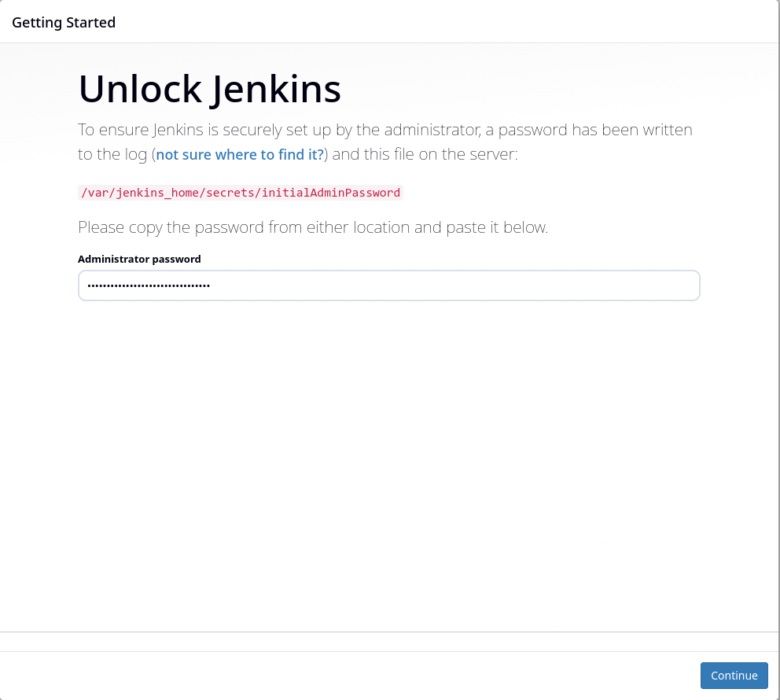 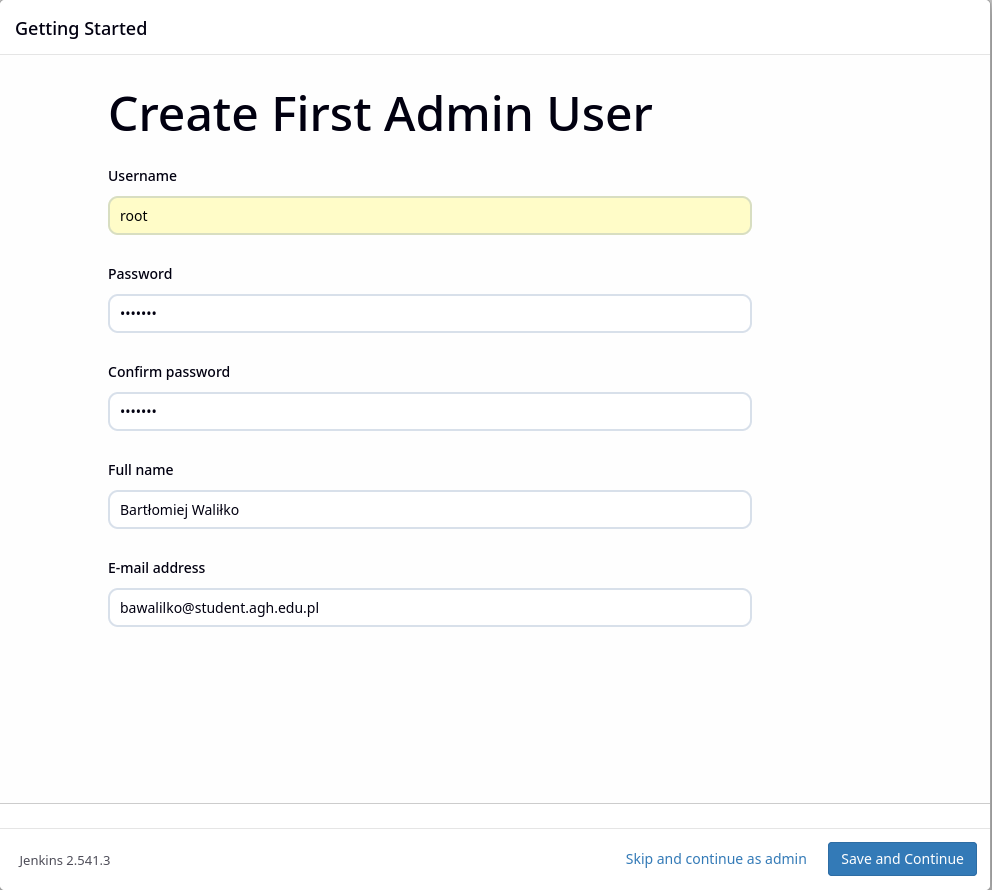 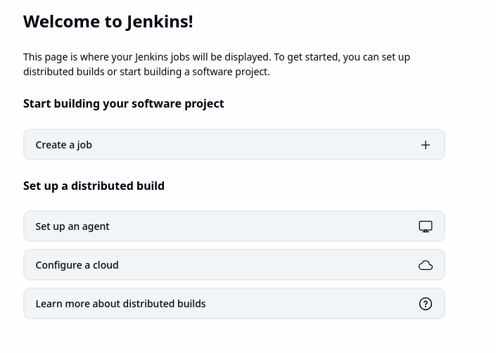

# Historia
```bash
  211  mkdir Sprawozdanie4
  212  cp Sprawozdanie3/Dockerfile-build Sprawozdanie4/
  213  cd Sprawozdanie4
  214  ls
  215  docker build -t flac:built -f Dockerfile .
  216  docker build -t flac:builder -f Dockerfile .
  217  docker run -it --name=builder flac:builder bash
  218  docker rm builder
  219  docker run -it --name=builder --mount source=input-vol,target=/input --mount source=output-vol,target=/output flac:builder bash
  220  docker run --mount source=input-vol,target=/repo ubuntu clone https://gitlab.xiph.org/steils/flac.git /repo
  221  docker run --mount source=input-vol,target=/repo ubuntu git clone https://gitlab.xiph.org/steils/flac.git /repo
  222  docker run --mount source=input-vol,target=/repo alpine git clone https://gitlab.xiph.org/steils/flac.git /repo
  223  docker ps
  224  docker ps -a
  225  docker rm infallible_lamport
  226  docker exec -it builder bash
  227  docker start -it builder bash
  228  docker start builder
  229  docker exec -it builder bash
  230  docker rm builder
  231  docker rm -f builder
  232  docker run -it --name=builder --mount source=input-vol,target=/home/builder/input --mount source=output-vol,target=/home/builder/output flac:builder bash
  233  docker rm builder
  234  ls
  235  docker build -t flac:builder -f Dockerfile .
  236  docker run -it --name=builder --mount source=input-vol,target=/input --mount source=output-vol,target=/output flac:builder bash
  237  docker run -it --name=builder-git --mount source=input-vol,target=/input --mount source=output-vol,target=/output flac:builder bash
  238  docker run -d --name iperf-server networkstatic/iperf3 -s
  239  man docker
  240  docker --help
  241  docker ps
  242  docker inspect -f '{{range .NetworkSettings.Networks}}{{.IPAddress}}{{end}}' iperf-server
  243  docker inspect iperf-server
  244  docker inspect -f '{{range .NetworkSettings.Networks}}{{.IPAddress}}{{end}}' iperf-server
  245  docker run --rm networkstatic/iperf3 -c 172.17.0.2
  246  docker network create --driver bridge moja-siec
  247  docker network ls
  248  docker run -d --name iperf-server2 --network moja-siec networkstatic/iperf3 -s
  249  docker run --rm --network moja-siec networkstatic/iperf3 -c iperf-server2
  250  docker stop iperf-server2 && docker rm iperf-server2
  251  docker stop iperf-server2 && docker rm iperf-server2
  252  docker run -d --name iperf-server-pub --network moja-siec -p 5201:5201 networkstatic/iperf3 -s
  253  docker ps
  254  iperf3 -c localhost
  255  sudo apt install iperf3
  256  iperf3 -c localhost
  257  shutdown now
  258  sudo shutdown now
  259  ls
  260  cd MDO2026_ITE/
  261  ls
  262  docker ls
  263  docker ps
  264  docker ps -a
  265  docker start iperf-server-pub --network moja-siec -p 5201:5201 networkstatic/iperf3 -s
  266  docker start iperf-server-pub
  267  ip link
  268  docker run -d --name sshd-ubuntu -p 2222:22 ubuntu:22.04 sleep infinity
  269  docker exec -it sshd-ubuntu bash
  270  ssh root@localhost -p 2222
  271  docker network create jenkins
  272  docker run -d   --name dind   --privileged   --network jenkins   --restart unless-stopped   -v jenkins-dind-cache:/var/lib/docker   docker:24-dind
  273  docker rm -f d46231c722f3636b1851474a75cee1cc5561b224380e1c21888c0a4f8e67ce6b
  274  docker run   --name jenkins-docker   --rm   --detach   --privileged   --network jenkins   --network-alias docker   --env DOCKER_TLS_CERTDIR=/certs   --volume jenkins-docker-certs:/certs/client   --volume jenkins-data:/var/jenkins_home   --publish 2376:2376   docker:dind   --storage-driver overlay2
  275  ls
  276  cd gr6/
  277  ls
  278  cd BW419687/Sprawozdanie4/
  279  ls
  280  nano Dockerfile-jenkins
  281  docker build -t myjenkins:1 Dockerfile-jenkins
  282  mkdir Jenkins
  283  mv Dockerfile-jenkins Jenkins/
  284  mv Jenkins/
  285  cd Jenkins/
  286  ls
  287  mv Dockerfile-jenkins Dockerfile
  288  docker build -t myjenkins:1 .
  289  docker run   --name jenkins-blueocean   --restart=on-failure   --detach   --network jenkins   --env DOCKER_HOST=tcp://docker:2376   --env DOCKER_CERT_PATH=/certs/client   --env DOCKER_TLS_VERIFY=1   --publish 8080:8080   --publish 50000:50000   --volume jenkins-data:/var/jenkins_home   --volume jenkins-docker-certs:/certs/client:ro   myjenkins:1
  290  cat /var/jenkins_home/secrets/initialAdminPassword
  291  journalctl -u jenkins.service
  292  docker ps
  293  docker exec -it jenkins-blueocean bash
  294  docker kill sshd-ubuntu
  295  docker kill iperf-server-pub
  296  docker ps
  297  shutdown now
  298  sudo shutdown now
  299  ls
  300  docker ps -a
  301  docker start jenkins-docker
  302  docker run jenkins-docker
  303  docker run jenkins-blueocean
  304  docker start jenkins-blueocean
  305  history
```