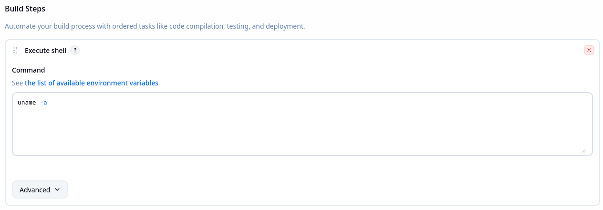
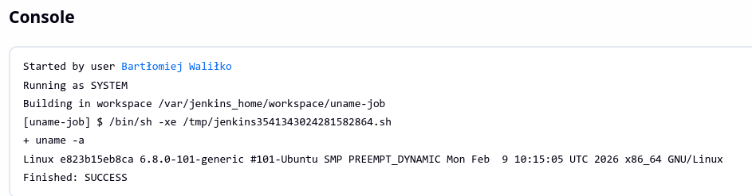
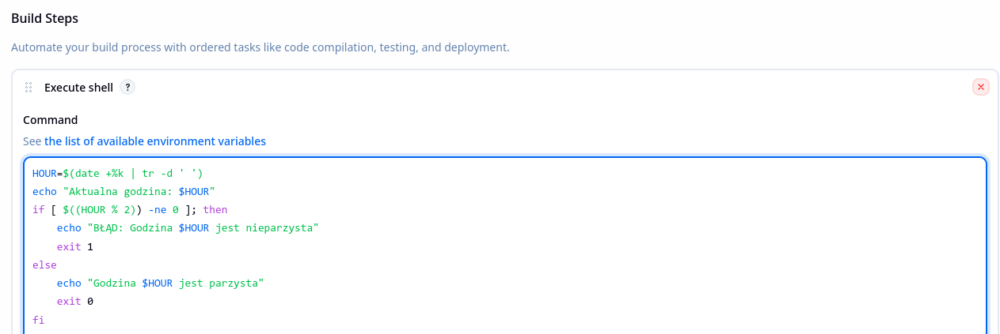
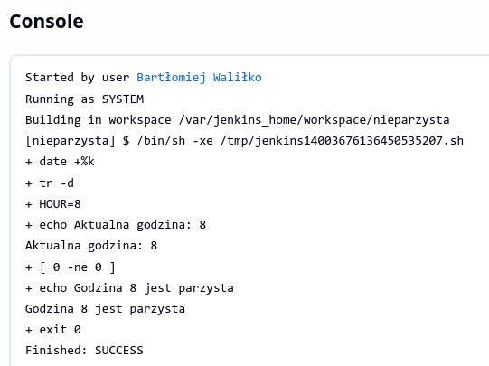
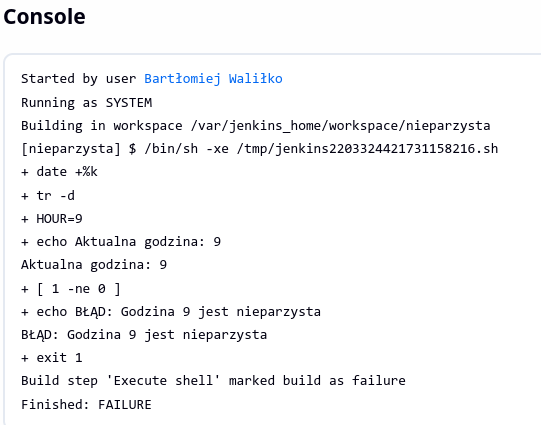
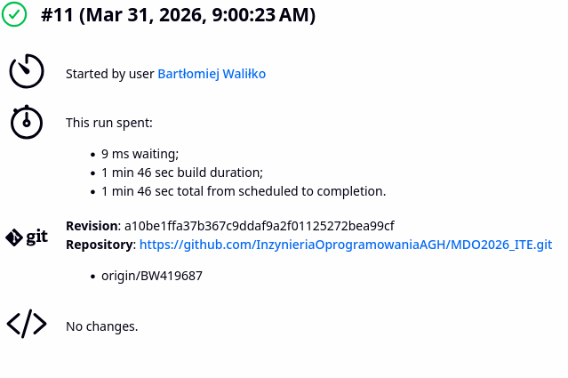
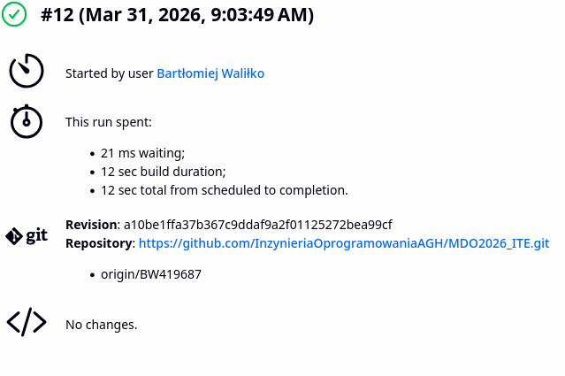

Wszystkie poniższe czynności zostały wykonane na maszynie wirtualnej Ubuntu Server za pomocą SSH.

# Projekt uname
1. Utworzono nowy projekt poprzez New Item > Freestyle Job i dodano skrypt bash jako część builda w konfiguracji: 
2. Zbudowano projekt: 

# Projekt buildujący się tylko w parzyste godziny
1. Utworzono nowy projekt poprzez New Item > Freestyle Job i dodano skrypt bash jako część builda w konfiguracji: 
2. Zbudowano w parzystą godzinę: 
3. Zbudowano w nieparzystą godzinę: 

# Obiekt typu pipeline
1. Utworzono nowy projekt poprzez New Item > Pipeline i napisano skrypt pipeline'a w konfiguracji:
```yaml
pipeline {
    agent any

    environment {
        IMAGE_NAME = "my-builder-${BUILD_NUMBER}"
    }

    stages {
        stage('Checkout') {
            steps {
                checkout([$class: 'GitSCM',
                          branches: [[name: 'BW419687']],
                          userRemoteConfigs: [[url: 'https://github.com/InzynieriaOprogramowaniaAGH/MDO2026_ITE.git']]])
            }
        }

        stage('Build Docker image') {
            steps {
                script {
                    def image = docker.build("${IMAGE_NAME}", "-f gr6/BW419687/Dockerfile .")
                }
            }
        }
    }

    post {
        always {
            cleanWs()
        }
    }
}
```
2. Zbudowano projekt pierwszy raz: 
3. Oraz drugi raz: 
Za drugim razem build wykonał się znacząco szybciej, ponieważ wcześniejsze etapy zostały już przygotowane wcześniejszym buildem. (Pipeline jest podobny do tego jak działa budowa obrazu Dockera)

# Budowa projektu FLAC za pomocą pipeline
FLAC jest biblioteką do obsługi plików dźwiękowych, z tego powodu nie ma etapu 'Deploy' ponieważ nie jest w żaden sposób wykonywalna.

Dla tego build będzie się składał z 4 etapów:
1. Collect - pobranie repozytorium
2. Build - zbudowanie repozytorium za pomocą kontenera flac:builder
3. Test - testowanie kontenerem testowym flac:tester
4. Publish - zebranie przetestowanych już plików bibliotecznych

Cały proces CI zostanie wykonany poniższym jenkinsfilem:

```yaml
pipeline {
    agent none

    stages {
        stage('Collect') {
            agent any
            steps {
                git url: 'https://gitlab.xiph.org/steils/flac.git', branch: 'master'
                stash name: 'flac-source', includes: '**/*'
            }
        }

        stage('Build') {
            agent {
                docker {
                    image 'flac:builder'
                    args '-v /var/run/docker.sock:/var/run/docker.sock'
                }
            }
            steps {
                unstash 'flac-source'
                sh '''
                    ./autogen.sh
                    ./configure
                    make
                '''
                stash name: 'flac-build'
            }
        }

        stage('Test') {
            agent {
                docker {
                    image 'flac:tester'
                }
            }
            steps {
                unstash 'flac-build'
                sh '''
                    make check
                '''
            }


        stage('Publish') {
            agent any
            steps {
                unstash 'flac-build'
                archiveArtifacts artifacts: 'src/libFLAC/.libs/libFLAC.so*, src/libFLAC++/.libs/libFLAC++.so*, src/flac/flac, src/metaflac/metaflac',
                                   fingerprint: true
            }
            post {
                success {
                    echo 'Biblioteki FLAC zapisane'
                }
                failure {
                    echo 'Nie udało się zapisać bibliotek FLAC'
                }
            }
        }
    }

    post {
        always {
            cleanWs()
        }
    }
}
```