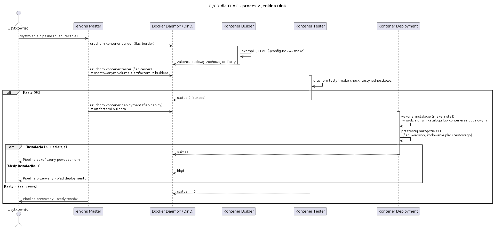

# Lista kontrolna
1. Wybrano otwartoźródłową bibliotekę FLAC jako projekt
2. Jej licencja to GNU LGPLv2.1, więc pozwala na wolny obrót kodem
3. FLAC buduje się poprawnie 
4. Oraz przechodzi testy 
5. Nie będzie potrzeby na tworzenie forka repozytorium, FLAC sam z siebie dobrze pasuje już do środowiska CI
6. Plan UML: 
7. Utworzono 2 kontenery o odpowiednich dependency: flac:builder i flac:tester 
8. Buildowanie wykonuje się w kontenerze
9. Testowanie również \

10. Kontener testera jest oparty na builderze:
```docker
FROM flac:builder

RUN useradd -m -s /bin/bash tester
USER tester

WORKDIR /home/tester/flac

CMD ["make", "check"]
```
11. Logi są numerowane jak widać na powyższym obrazku
12. Kontener Deploy to kontener w którym FLAC został zainstalowany za pomocą make install i jest dostępne narzędzie CLI flac. Do tego zadania wystarcza obraz builder. Po instalacji zostaje wykonany smoke test narzędzia CLI.
13. Jako artefakty udostępniane są logi testów oraz 4 pliki: libFLAC.so, libFLAC++.so, metaflac i flac. Pliki .so to skompilowane pliki biblioteki, metaflac to potrzebny do stosowania ich header, flac to narzędzie CLI. Wszystko jest wersjonowane zgodnie z semantic versioning i dostępne jako wynik builda w Jenkinsie.
14. Doszło do delikatnej rozbieżności w diagramie UML, powinna być notatka że kontener "Deployment" jest oparty na obrazie "Builder"

# Dockerfile obu obrazów

## flac:builder:
```docker
FROM ubuntu:22.04

# Pobieranie zależności
RUN apt-get update && apt-get install -y \
    build-essential \
    autoconf \
    automake \
    libtool-bin \
    pkg-config \
    libogg-dev \
    gettext

WORKDIR /workspace
```

## flac:tester:
```docker
FROM flac:builder

# Dodanie użytkownika do testów
RUN useradd -m -s /bin/bash tester
USER tester

WORKDIR /home/tester/flac

CMD ["make", "check"]
```

# Jenkinsfile pipeline'a
```groovy
pipeline {
    agent any

    stages {
        stage('Collect') {
            steps {
                git url: 'https://gitlab.xiph.org/steils/flac.git', branch: 'master'
                stash name: 'flac-source', includes: '**/*'
            }
        }

        stage('Build') {
            agent {
                docker {
                    image 'flac:builder'
                    args '-v /var/run/docker.sock:/var/run/docker.sock'
                }
            }
            steps {
                unstash 'flac-source'
                sh '''
                    ./autogen.sh
                    ./configure
                    make
                '''
                stash name: 'flac-build'
            }
        }
        
        stage('Test') {
            agent {
                docker {
                    image 'flac:tester'
                }
            }
            steps {
                unstash 'flac-build'
                sh '''
                    # Usuwanie starych logów
                    rm -f test/*.log
                    
                    # Testy
                    make check
                '''
            }
            post {
                always {
                    script {
                        def buildNum = env.BUILD_NUMBER
                        // Zmiana nazw na numerowane buildem
                        sh """
                            for log in test/*.log; do
                                if [ -f "\$log" ]; then
                                    case "\$log" in
                                        *_build_*) ;;  # skip already renamed logs
                                        *)
                                            base=\$(basename "\$log" .log)
                                            mv "\$log" "test/\${base}_build_${buildNum}.log"
                                            ;;
                                    esac
                                fi
                            done
                        """
                        // Archiwizacja
                        archiveArtifacts artifacts: "test/*_build_${buildNum}.log", allowEmptyArchive: true
                    }
                }
            }
        }

        stage('Deploy') {
            agent {
                docker {
                    image 'flac:builder'
                    args '-u root'
                }
            }
            steps {
                unstash 'flac-build'
                sh """
                    make install
                    ldconfig
                    flac --version
                """
            }
        }
        
        stage('Publish') {
            steps {
                unstash 'flac-build'
                archiveArtifacts artifacts: 'src/libFLAC/.libs/libFLAC.so.*.*.*, src/libFLAC++/.libs/libFLAC++.so.*.*.*, src/flac/flac, src/metaflac/metaflac',
                                   fingerprint: true
            }
            post {
                success {
                    echo 'Biblioteki FLAC zapisane'
                }
                failure {
                    echo 'Nie udało się zapisać bibliotek FLAC'
                }
            }
        }
    }

    post {
        always {
            cleanWs()
        }
    }
}pipeline {
    agent any

    stages {
        stage('Collect') {
            steps {
                git url: 'https://gitlab.xiph.org/steils/flac.git', branch: 'master'
                stash name: 'flac-source', includes: '**/*'
            }
        }

        stage('Build') {
            agent {
                docker {
                    image 'flac:builder'
                    args '-v /var/run/docker.sock:/var/run/docker.sock'
                }
            }
            steps {
                unstash 'flac-source'
                sh '''
                    ./autogen.sh
                    ./configure
                    make
                '''
                stash name: 'flac-build'
            }
        }
        
        stage('Test') {
            agent {
                docker {
                    image 'flac:tester'
                }
            }
            steps {
                unstash 'flac-build'
                sh '''
                    # Usuwanie starych logów
                    rm -f test/*.log
                    
                    # Testy
                    make check
                '''
            }
            post {
                always {
                    script {
                        def buildNum = env.BUILD_NUMBER
                        // Zmiana nazw na numerowane buildem
                        sh """
                            for log in test/*.log; do
                                if [ -f "\$log" ]; then
                                    case "\$log" in
                                        *_build_*) ;;  # skip already renamed logs
                                        *)
                                            base=\$(basename "\$log" .log)
                                            mv "\$log" "test/\${base}_build_${buildNum}.log"
                                            ;;
                                    esac
                                fi
                            done
                        """
                        // Archiwizacja
                        archiveArtifacts artifacts: "test/*_build_${buildNum}.log", allowEmptyArchive: true
                    }
                }
            }
        }

        stage('Deploy') {
            agent {
                docker {
                    image 'flac:builder'
                    args '-u root'
                }
            }
            steps {
                unstash 'flac-build'
                sh """
                    make install
                    ldconfig
                    flac --version
                """
            }
        }
        
        stage('Publish') {
            steps {
                unstash 'flac-build'
                archiveArtifacts artifacts: 'src/libFLAC/.libs/libFLAC.so.*.*.*, src/libFLAC++/.libs/libFLAC++.so.*.*.*, src/flac/flac, src/metaflac/metaflac',
                                   fingerprint: true
            }
            post {
                success {
                    echo 'Biblioteki FLAC zapisane'
                }
                failure {
                    echo 'Nie udało się zapisać bibliotek FLAC'
                }
            }
        }
    }

    post {
        always {
            cleanWs()
        }
    }
}
```