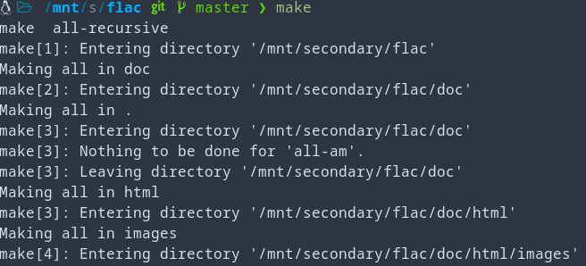
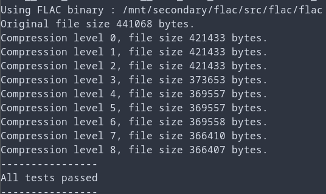
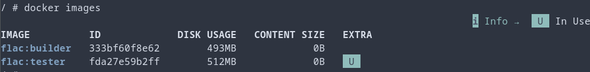
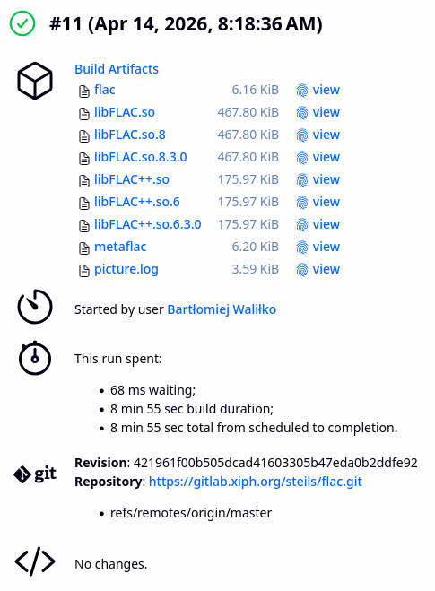

# Lista kontrolna
1. Wybrano otwartoźródłową bibliotekę FLAC jako projekt
2. Jej licencja to GNU LGPLv2.1, więc pozwala na wolny obrót kodem
3. FLAC buduje się poprawnie 
4. Oraz przechodzi testy 
5. Nie będzie potrzeby na tworzenie forka repozytorium, FLAC sam z siebie dobrze pasuje już do środowiska CI
6. ===TODO DIAGRAM UML===
7. Utworzono 2 kontenery o odpowiednich dependency: flac:builder i flac:tester 
8. Buildowanie wykonuje się w kontenerze
9. Testowanie również \

10. Kontener testera jest oparty na builderze:
```docker
FROM flac:builder

RUN useradd -m -s /bin/bash tester
USER tester

WORKDIR /home/tester/flac

CMD ["make", "check"]
```
11. Logi są numerowane jak widać na powyższym obrazku
12. TODO SPRÓBOWAĆ ZROZUMIEĆ CZYM JEST DEPLOY DLA BIBLIOTEKI
13. 