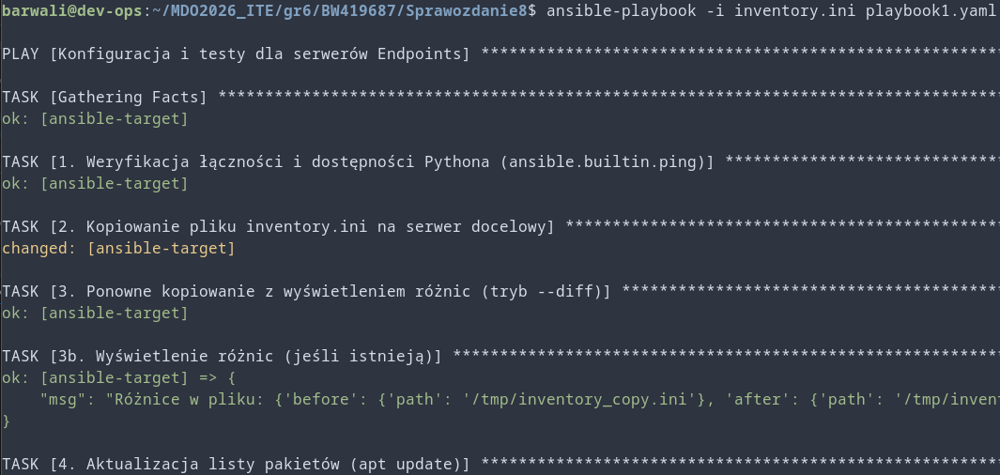
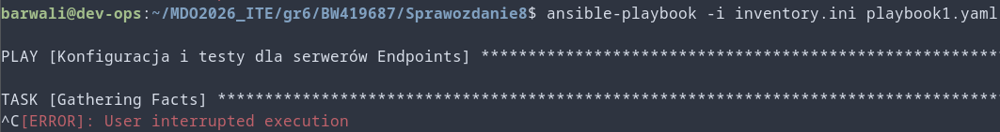
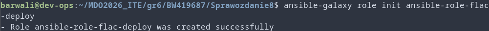
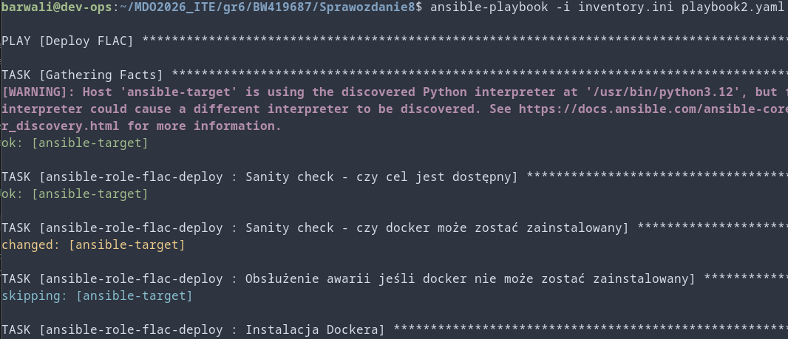

Wszystkie poniższe czynności zostały wykonane na maszynie wirtualnej Ubuntu Server (czyli Orchestratorze Ansible) za pomocą SSH.

# Setup
1. Postawiono maszynę wirtualną ansible-target: \

2. Ustawiono wzajemne rozpoznawanie adresów: \
, 
3. Sprawdzono łączność: \
, 
4. Stworzono plik inwentaryzacji: \

5. Przetestowano ping: \
 (Ping się nie powiódł z dev-ops do samego siebie ponieważ taki typ łącza ssh nie jest dozwolony)

# Pierwszy playbook
6. Napisano playbook do pierwszej grupy poleceń (playbook1.yaml) i wywołano go: \

7. Następnie ponowiono wywołanie playbooka po wypięciu karty sieciowej z ansible-target (Gathering Facts nie wykonuje się poprawnie): \


# Rola flac-deploy:
8. Utworzono nową rolę za pomocą ansible-galaxy: \


9. Dodano defaultowe wartości do roli w defaults/main.yml:
```yaml
flac_binary_src_path: "files/flac"
flac_container_name: "flac_container"
flac_docker_image: "ubuntu:22.04"
flac_workdir: "/flac_app"
```

10. Wypełniono poprawnie meta/main.yml:
```yaml
galaxy_info:
  role_name: flac_deploy
  author: Bartłomiej Waliłko
  description: Deployment plików binarnych FLAC i testowanie ich w kontenerze
  license: MIT
  min_ansible_version: 2.9
  platforms:
    - name: Ubuntu
      versions:
        - focal
        - jammy
  galaxy_tags:
    - flac
    - docker
    - audio

dependencies: []
```

11. Napisano potrzebne zadania w tasks/main.yml:
```yaml
- name: Sanity check - czy cel jest dostępny
  ping:

- name: Sanity check - czy docker może zostać zainstalowany
  package:
    name: docker.io
    state: present
  check_mode: yes
  register: docker_check
  ignore_errors: yes

- name: Obsłużenie awarii jeśli docker nie może zostać zainstalowany
  fail:
    msg: "Docker nie może zostać zainstalowany na {{ inventory_hostname }} - koniec deploymentu."
  when: docker_check is failed

- name: Instalacja Dockera
  package:
    name: "{{ item }}"
    state: present
  with_items:
    - docker.io
    - python3-docker
  become: yes

- name: Kopiowanie plików binarnych FLAC do celu
  copy:
    src: "{{ flac_binary_src_path }}"
    dest: "/tmp/{{ flac_binary_src_path | basename }}"
    mode: '0755'
  register: flac_binary_copy

- name: Pobranie obrazu dockera
  community.docker.docker_image:
    name: "{{ flac_docker_image }}"
    source: pull
  become: yes

- name: Stworzenie i uruchomienie kontenera FLAC
  community.docker.docker_container:
    name: "{{ flac_container_name }}"
    image: "{{ flac_docker_image }}"
    command: "tail -f /dev/null"
    volumes:
      - "/tmp/{{ flac_binary_src_path | basename }}:{{ flac_workdir }}/flac:ro"
    working_dir: "{{ flac_workdir }}"
    state: started
  become: yes

- name: Uruchomienie FLAC w kontenerze
  community.docker.docker_container_exec:
    container: "{{ flac_container_name }}"
    command: "./flac --version"
  register: flac_exec
  become: yes

- name: Wypisanie wyniku
  debug:
    var: flac_exec.stdout_lines

- name: Weryfikacja uruchomienia flac
  assert:
    that:
      - flac_exec is success
      - flac_exec.stdout is search("FLAC")
    fail_msg: "FLAC nie uruchomił się poprawnie - container log:\n{{ flac_exec.stderr }}"
    success_msg: "FLAC poprawnie się uruchomił."

- name: Usuwanie kontenera FLAC
  docker_container:
    name: "{{ flac_container_name }}"
    state: absent
  become: yes

- name: Usuwanie FLAC
  file:
    path: "/tmp/{{ flac_binary_src_path | basename }}"
    state: absent
```
12. Wywołano playbook2.yaml zawierający tą rolę: \
