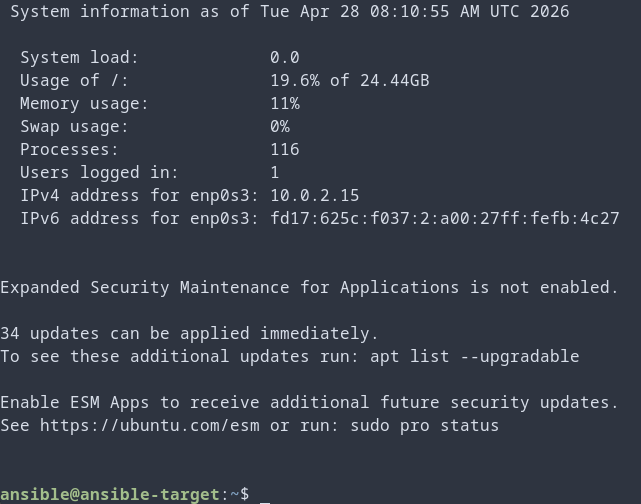
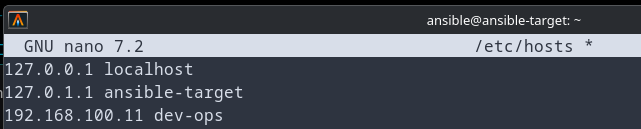
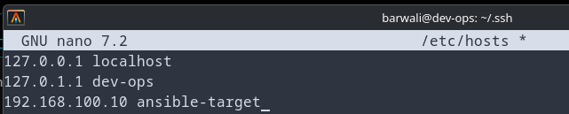
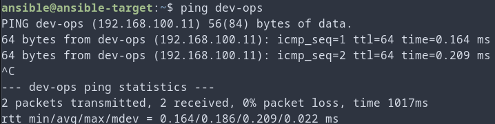
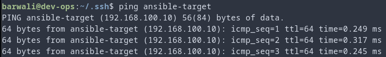
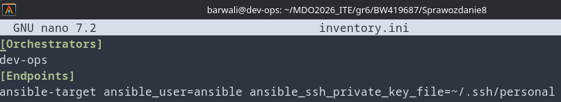
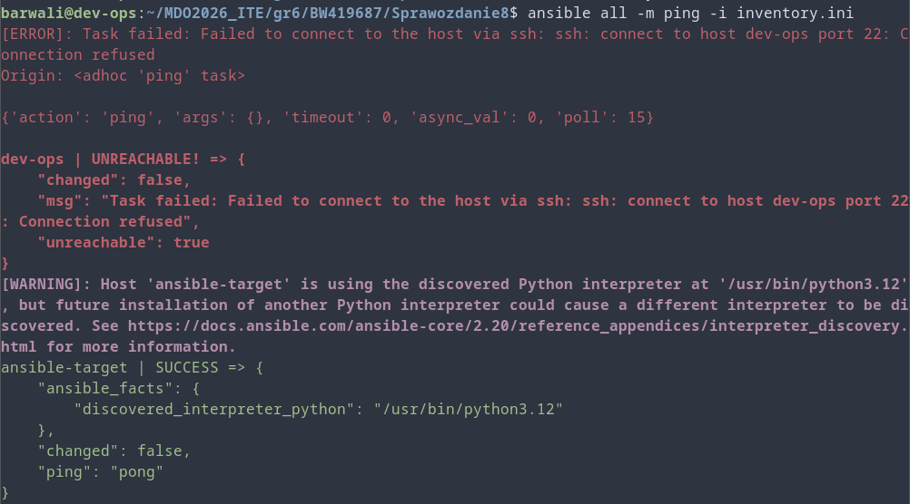

1. Postawiono maszynę wirtualną ansible-target: 
2. Ustawiono wzajemne rozpoznawanie adresów: , 
3. Sprawdzono łączność: , 
4. Stworzono plik inwentaryzacji: 
5. Przetestowano ping:  (Ping się nie powiódł z dev-ops do samego siebie ponieważ taki typ łącza ssh nie jest dozwolony)