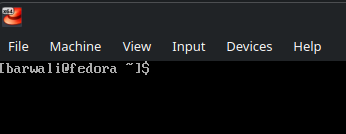
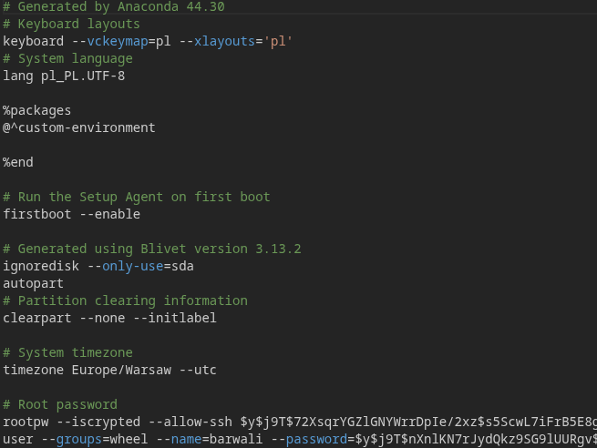
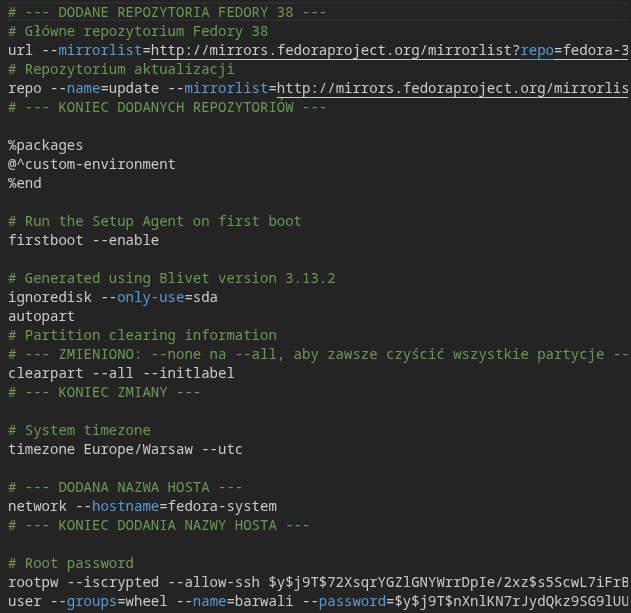
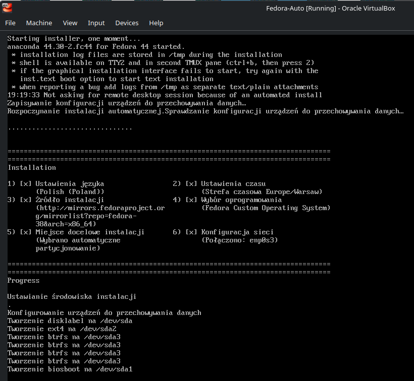
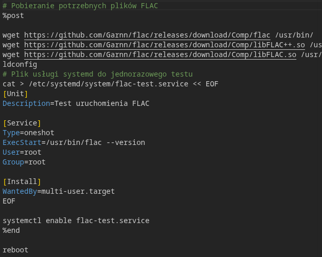
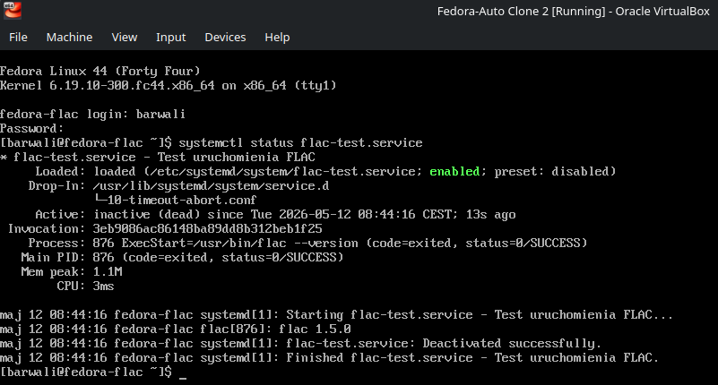

# Pobieranie pliku kickstart
1. Zainstalowano dystrybucję fedora w maszynie wirtualnej: \

2. Skopiowano plik anaconda-ks.cfg: \


# Automatyzacja customowej instalacji
3. Stworzono nowy plik new-ks.cfg (Z dodatkowymi repozytoriami, inną nazwą hosta i czyszczeniem partycji): \

4. Połączono plik new-ks.png i obraz fedora aby utworzyć nowy obraz z automatyczną instalacją poleceniem:
```bash
sudo mkksiso --ks new-ks.cfg ~/Downloads /Fedora-Server-dvd-x86_64-44-1.7.iso auto.iso
```
Utworzono nową maszynę wirtualną: \

Następnie instalacja przebiegła w pełni automatycznie: \


# Instalacja razem z FLAC:

5. Stworzono nowy plik flac-ks.cfg oparty na new-ks.cfg różniący się tylko sekcją instalującą i testującą FLAC (CLI flac jest wykonywane automatycznie po ponownym uruchomieniu): \


6. Utworzono kolejny plik ISO do instalacji systemu:
```bash
sudo mkksiso --ks flac-ks.cfg ~/Downloads/Fedora-Server-dvd-x86_64-44-1.7.iso auto-flac.iso
```

7. Udało się poprawnie zainstalować system i przetestować FLAC: 