# Sprawozdanie z lab1 - Wprowadzenie, Git, Gałęzie, SSH
**Autor:** Aleksandra Duda, grupa 2

## Cel
Na zajęciach laboratoryjnych przygotowałam stanowisko pracy do dalszej nauki przedmiotu, wstępnie zapoznałam się ze środowiskiem pracy.

## Git
1. Na początku zainstalowałam klienta Git i obsługę kluczy SSH. W tym miejscu chciałam zaznaczyć że na początku się pomyliłam i zawarłam zrzuty ekranu z konsoli programu visual studio code, a nie maszyny wirtualnej. W dalszej części tego punktu zawarłam jednak także zrzuty ekranu z maszyny wirtualnej.

Ponieważ miałam już na swoim urządzeniu zainstalowanego klienta Git oraz narzędzia OpenSSH, potwierdziłam w terminalu obecność tych narzędzi:
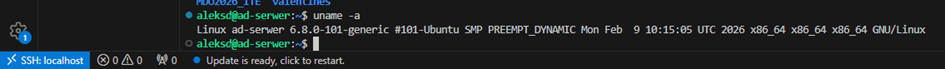
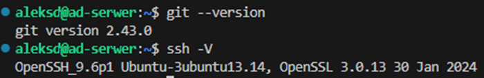

2. Następnie sklonowałam repozytorium przedmiotowe za pomocą HTTPS i personal access token.
Najpierw wygenerowałam token PAT (tokenu nie pokazuje ze względów bezpieczeństwa):
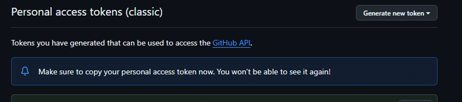

Oraz sklonowałam repozytorium:
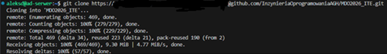

## SSH
1. Najpierw utworzyłam dwa klucze SSH, jeden z nich ed25519 bez hasła, dowód - klucz publiczny:
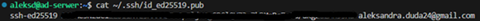
-oraz drugi klucz, również ed25519, jednak tym razem z hasłem. Tutaj zorientowałam się że kroki powinnam była wykonywać w maszynie wirtualnej a nie w vs code, więc następne zrzuty ekranu są z konsoli w virtualbox.
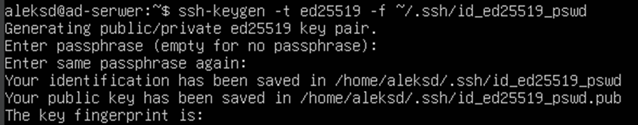
Sprawdziłam, czy wszystkie wygenerowane klucze są obecne:
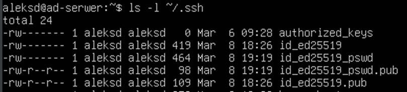
-Następnie skonfigurowałam klucz SSH jako metodę dostępu do GitHuba, kopiując klucze publiczne z serwera i dodając w GitHub:
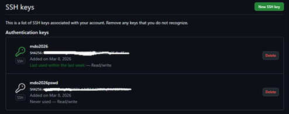
Zweryfikowałam, czy na pewno GitHub mnie widzi:
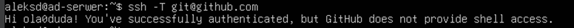
Dzięki tym wykonanym krokom, gdy będę chciała pobrać kod lub go wysłać, to git nie będzie pytał o token pat, tylko rozpozna mnie po kluczu.
-Następnie sklonowałam repozytorium z wykorzystaniem protokołu SSH. Jednak, ponieważ miałam je już sklonowane z użyciem https, tym razem sklonowałam je do innego folderu:
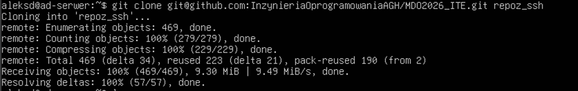

2. Na koniec tej części skonfigurowałam uwierzytelnianie dwuskładnikowe na koncie GitHub, skanując kod QR z GitHuba za pomocą aplikacji w telefonie Google Authenticator:


## Narzędzia
1. Najpierw skonfigurowałam dostęp do repozytorium przedmiotowego (i maszyny wirtualnej) w edytorze IDE Visual Studio Code.
Tak, jak już pokazałam na wcześniejszych zrzutach ekranu, zdalny dostęp do maszyny wirtualnej i repozytorium zadziałał dzięki zainstalowanej wtyczce remote-ssh. Potwierdzenie:


SSH configuration file:
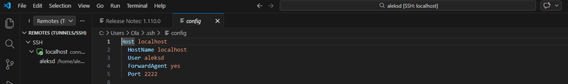

2. Następnie skonfigurowałam natychmiastową wymianę plików ze środowiskiem pracy za pomocą menedżera plików FileZilla:
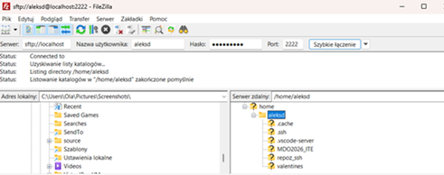
Zarówno połączenie, jak i przesłanie plików zadziałało bez zarzutów.

## Gałąź
1. Przełączyłam się na gałąź main, a następnie na gałąź swojej grupy:
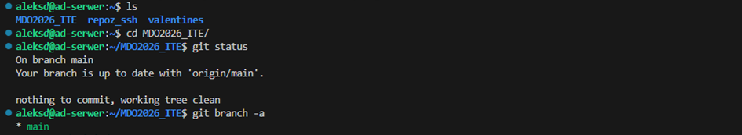
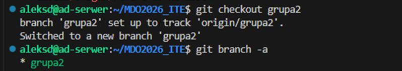

2. Następnie utworzyłam gałąź o nazwie zgodnej z moimi inicjałami i numerem indeksu:
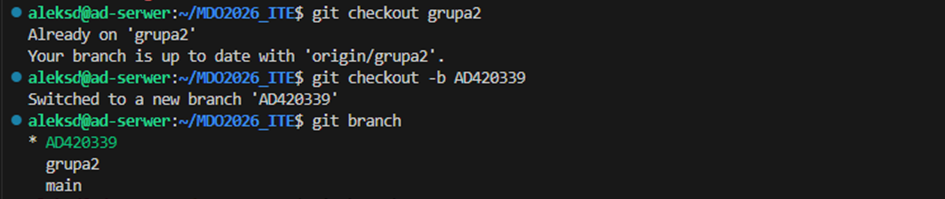
-W katalogu właściwym dla grupy utworzyłam nowy katalog, także o nazwie zgodnej z moimi inicjałami i numerem indeksu:
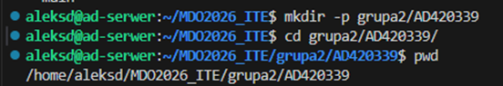
-Następnie napisałam Git hooka, czyli skrypt weryfikujący czy mój commit message zaczyna się od moich inicjałów i numeru indeksu:
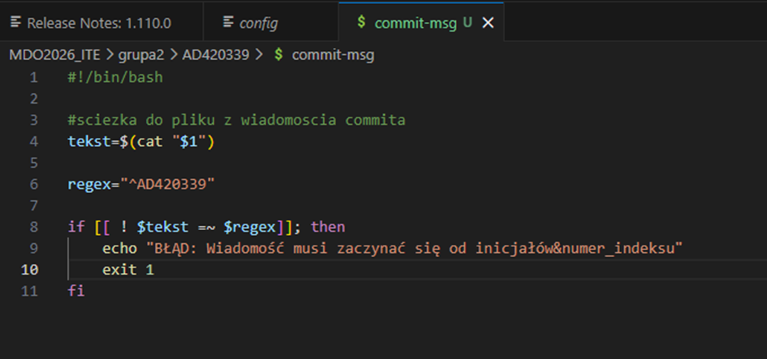
-Skrypt dodałam do stworzonego wcześniej katalogu.
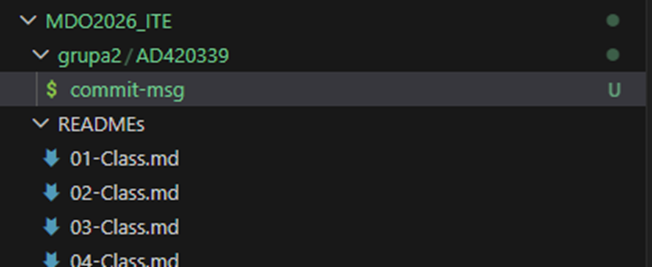
-Skopiowałam go we właściwe miejsce (czyli tam, gdzie jest ukryty folder .git), tak by uruchamiał się za każdym razem gdy robię commita. Najpierw nadałam jednak uprawnienia plikowi Hook, żeby wiedział, że ma prawo się uruchomić:
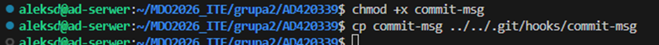
Następnie przetestowałam, czy plik działa. Negatywny wynik commita:

Pozytywny wynik commita:
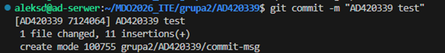
-Treść githooka:

```bash
#!/bin/bash

#sciezka do pliku z wiadomoscia commita
tekst=$(cat "$1")

regex="^AD420339"

if [[ ! $tekst =~ $regex ]]; then
    echo "BŁĄD: Wiadomość musi zaczynać się od inicjałów&numer_indeksu"
    exit 1
fi
```

-w katalogu dodałam plik ze sprawozdaniem i uporządkowałam pliki (przeniosłam Hooka do folderu Sprawozdanie1):
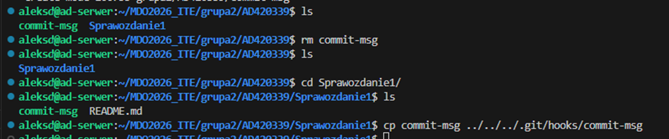

## Podsumowanie i wnioski
Na zajęciach zapoznałam się ze środowiskiem pracy, w którym będę uczyła się metodyki DevOps. Zainstalowałam maszynę wirtualną, połączyłam serwer z gitem za pomocą SSH i generująć PAT, skonfigurowałam odpowiednio Visual Studio Code i sprawdziłam działanie natychmiastowej wymiany plików ze środowiskiem pracy. Zapoznałam się także z repozytorium przedmiotu i mam już utworzoną swoją gałąź w swojej grupie laboratoryjnej. Utworzyłam git hooka i folder z plikami z dzisiejszych zajęć.

Historia poleceń z terminala (polecenie history):
```bash
1  git status
    2  git config user.name
    3  git config --global user.name "ola0duda"
    4  git config --global user.email "aleksandra.duda24@gmail.com"
    5  git config user.name
    6  git clone git@github.com:InzynieriaOprogramowaniaAGH/MDO2026_ITE.git
    7  ssh-keygen -t ed25519 -C "aleksandra.duda24@gmail.com"
    8  cat ~/.ssh/id_ed25519.pub
    9  git clone git@github.com:InzynieriaOprogramowaniaAGH/MDO2026_ITE.git
   10  ls
   11  cd MDO2026_ITE/
   12  ls
   13  git branch
   14  cd ~
   15  ls
   16  rm -rf MDO2026_ITE/
   17  ls
   18  git --version
   19  ssh -V
   20  https://(pat)@github.com/InzynieriaOprogramowaniaAGH/MDO2026_ITE.git
   21  git clone https://ghp_(pat)@github.com/InzynieriaOprogramowaniaAGH/MDO2026_ITE.git
   22  ls
   23  uname -a
   24  cat ~/.ssh/id_ed25519_pswd.pub
   25  whoami
   26  hostname -I
   27  git checkout main
   28  ls
   29  cd MDO2026_ITE/
   30  git status
   31  git branch -a
   32  git checkout grupa2
   33  git branch -a
   34  git checkout grupa2
   35  git checkout -b AD420339
   36  git branch
   37  ls
   38  git checkout grupa2
   39  ls
   40  git branch
   41  git checkout AD420339 
   42  git branch
   43  mkdir -p grupa2/AD420339
   44  cd grupa2/AD420339/
   45  pwd
   46  chmod +x commit-msg
   47  cp commit-msg ../../.git/hooks/commit-msg
   48  git add commit-msg 
   49  git commit -m "test"
   50  cp commit-msg ../../.git/hooks/commit-msg
   51  git commit -m "test"
   52  git add commit-msg 
   53  git commit -m "test"
   54  mkdir Sprawozdanie1
   55  cp commit-msg Sprawozdanie1/commit-msg
   56  git commit -m "AD420339 test"
   57  ls
   58  rm commit-msg 
   59  ls
   60  cd Sprawozdanie1/
   61  ls
   62  cp commit-msg ../../../.git/hooks/commit-msg
   63  git branch
   64  history
```