# Sprawozdanie laboratorium nr 8
**Autor:** Aleksandra Duda, grupa 2

## Cel
Celem laboratorium było wdrożenie na zarządzalne kontenery oraz zapoznanie się z Kubernetes.

--------------------------------------------------------------------------------------

## Zadania do wykonania
### Instalacja klastra Kubernetes
 * Zaopatrz się w implementację stosu k8s: [minikube](https://minikube.sigs.k8s.io/docs/start/)
 * Przeprowadź instalację, wykaż poziom bezpieczeństwa instalacji
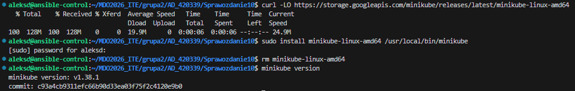
 Dodatkowo posprzątałam pobrany plik tymczasowy.

 Poziom bezpieczeństwa instalacji:
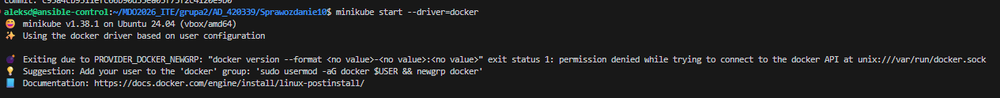
- Izolacja środowiska: Wykorzystanie sterownika docker sprawia, że Kubernetes działa wewnątrz odrębnego, odizolowanego kontenera i dedykowanej sieci Dockerowej na mojej maszynie wirtualnej.

 * Zaopatrz się w polecenie `kubectl` w wariancie minikube, może być alias `minikubctl`, jeżeli masz już "prawdziwy" `kubectl
Minikube ma już wbudowane narzędzie kubectl. Żeby nie instalować kolejnego programu i zachować kompatybilność, stworzyłam alias w konfiguracji mojego terminala (.bashrc). source ~/.bashrc przeładowuje konfiguracje, aby alias zaczął działać w obecnej sesji.
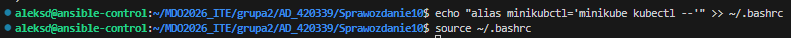
 * Uruchom Kubernetes, pokaż działający kontener/worker
Sprawdzenie działającego węzła - użyłam nowo utworzonego aliasu, żeby odpytać API Kubenertesa:
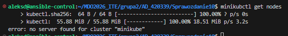
Nie zadziałał on niestety poprawnie. Problemem był brak uprawnień przy poleceniu minikube start --driver=docker, naprawiłam problem dodając użytkownika do grupy docker:
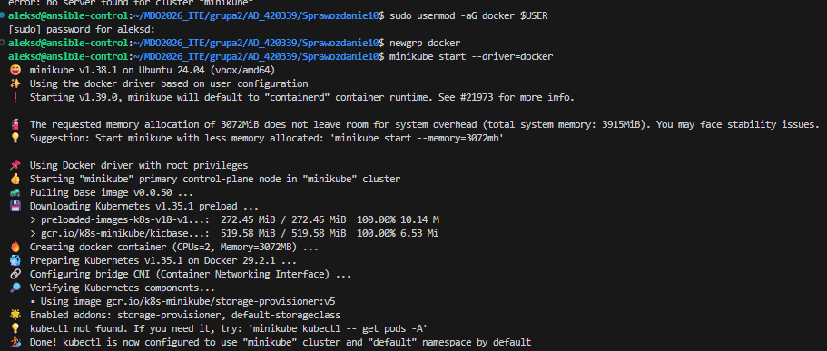
Tym razem Minikube odpalił się poprawnie.
Weryfikacja:
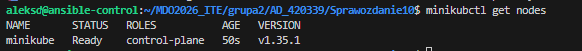

 * Uruchom Dashboard, otwórz w przeglądarce, przedstaw łączność
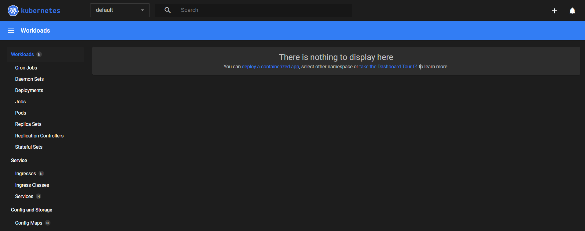
Łączność z graficznym panelem sterowania została uzyskana dzięki wbudowanemu w Minikube mechanizmowi proxy, który wystawia bezpieczny punkt dostępowy do API klastra. Środowisko VS Code automatycznie tuneluje ten ruch z maszyny wirtualnej na port hosta, umożliwiając interaktywne monitorowanie bezpośrednio z poziomu lokalnej przeglądarki internetowej.

 * Zapoznaj się z koncepcjami funkcji wyprowadzanych przez Kubernetesa (*pod*, *deployment* itp)
Pod to najmniejsza, podstawowa jednostka w Kubernetesie, która uruchamia i izoluje kontener z aplikacją, natomiast Deployment to nadrzędny zarządca (kontroler), który automatycznie dba o to, aby zadeklarowana liczba podów stale działała, samodzielnie je restartując lub skalując w przypadku awarii.

 
### Analiza posiadanego kontenera
   W powyższej sekcji wybrałam opcję optimum, czyli serwer nginx, ponieważ na ostatnich zajęciach wykorzystałam aplikację hello-world która tylko wypisywała tekst i od razu się wyłączała. Kubernetes potrzebuje aplikacji, która działa bez przerwy.
   Najpierw stworzyłam prosty plik index.html z napisem.
   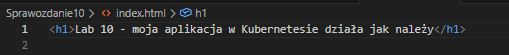
   Następnie stworzyłam Dockerfile, który bazuje na nginx i podmienia domyślną stronę na moją.
   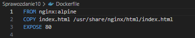

   Połączyłam terminal ze środowiskiem Dockera w Minikube - Minikube ma swój wewnętrzny silnik Dockera. Żeby Kubernetes widział obraz bez wysyłania go do internetu (Docker Hub), nakazałam terminalowi budowanie obrazu bezpośrednio wewnątrz Minikube.
   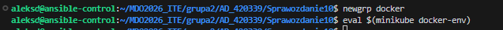

   Następnie zbudowałam obraz aplikacji:
   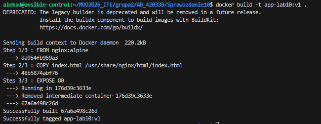
   
### Uruchamianie oprogramowania
Po uruchomieniu aplikacji:
    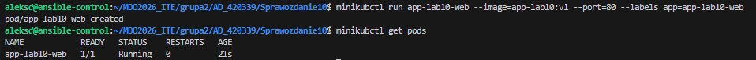
Pod działa:
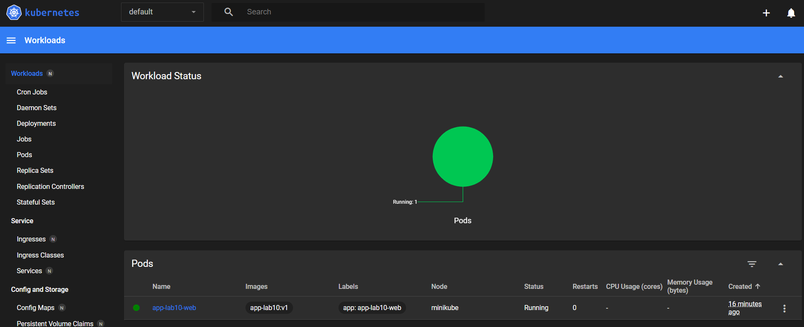

Wyprowadziłam port celem dotarcia do eksponowanej funkcjonalności:
    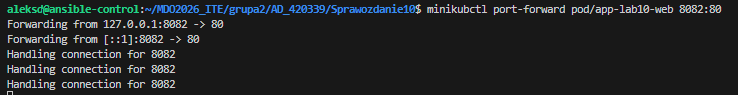

Przedstawienie komunikacji z eskopnowaną funkcjonalnością - wyswietlenie mojej strony (niestety umieściłam w tekście polskie znaki):
    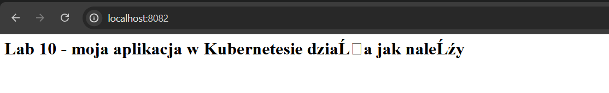


### Przekucie wdrożenia manualnego w plik wdrożenia (wprowadzenie)
Stworzyłam plik deployment.yaml:
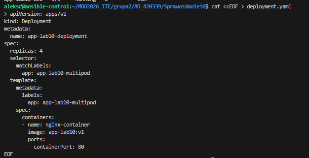
Zadeklarowałam w nim 4 repliki.

Uruchomiłam wdrożenie:
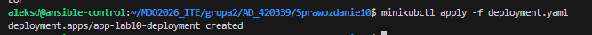

Zbadałam stan za pomocą ```kubectl rollout status```:
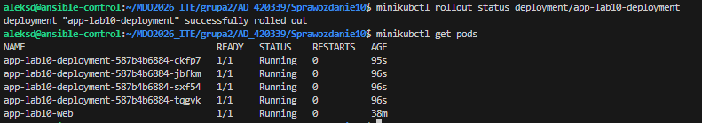
Działają wszystkie 4 pody.

Wyeksponowałam wdrożenie jako serwis, żebt ruch sieciowy rozkładał się automatycznie na wszystkie 4 pody:
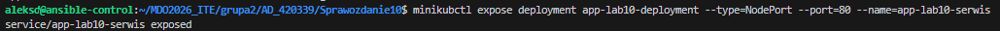

Następnie przekierowałam port do serwisu:
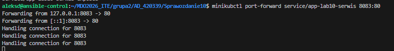
Wszystko działa, tym razem za pomocą 4 zsynchronizowanych podów:
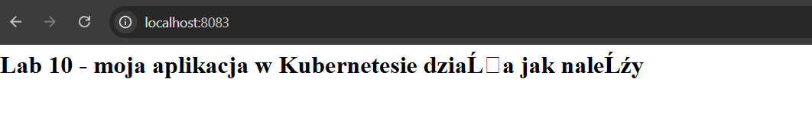

Widok z dashboardu:
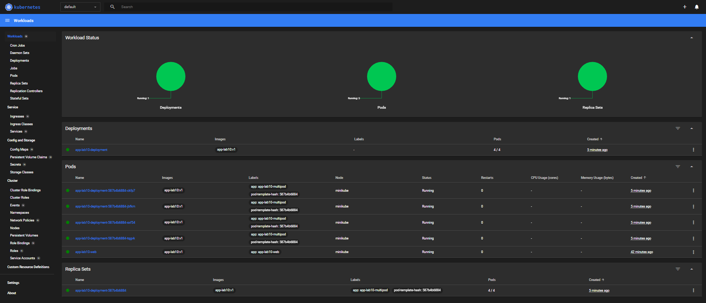
Dashboard wskazał łączną liczbę 5 działających podów. Wynika to z faktu, że klaster utrzymuje teraz 4 pody wygenerowane automatycznie oraz 1 pod uruchomiony wcześniej drogą manualną.

--------------------------------------------------------------------------------------------

 ## Wnioski
Lokalny Minikube na Dockerze pozwala szybko postawić całego Kubenertesa wewnątrz zwykłej maszyny wirtualnej. Najlepszym rozwiązaniem jest zamiana ręcznego wklepywania komend na jeden gotowy plik YAML, dzięki czemu wystarczy raz napisać konfigurację, a orkiestrator sam ją wdroży. Obiekty deployment i service pokazały, jak łatwo można sklonować aplikację do kilku kopii i automatycznie rozdzielać między nimi ruch, żeby serwer nie przestał działać pod dużym obciążeniem.

 Treść Dockerfile:
 ```Dockerfile
 FROM nginx:alpine
COPY index.html /usr/share/nginx/html/index.html
EXPOSE 80
 ```

Treść deployment.yaml:
```bash
apiVersion: apps/v1
kind: Deployment
metadata:
  name: app-lab10-deployment
spec:
  replicas: 4
  selector:
    matchLabels:
      app: app-lab10-multipod
  template:
    metadata:
      labels:
        app: app-lab10-multipod
    spec:
      containers:
      - name: nginx-container
        image: app-lab10:v1
        ports:
        - containerPort: 80
```