# Sprawozdanie laboratorium nr 11
**Autor:** Aleksandra Duda, grupa 2

## Cel
Celem laboratorium było dalsze zapoznanie wdrażania na zarządzalne kontenery i Kubernetesa.

--------------------------------------------------------------------------------------

## Zadania do wykonania

### Przygotowanie nowego obrazu
Zrzuty ekranu zrealizowanych kroków:
 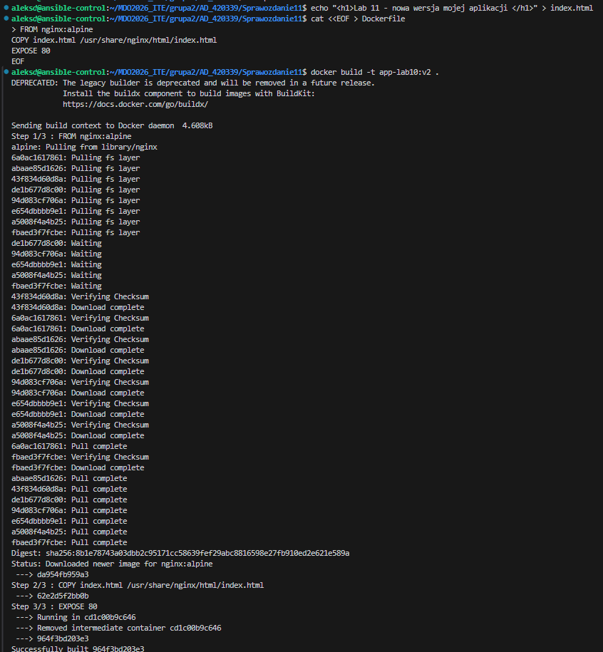
 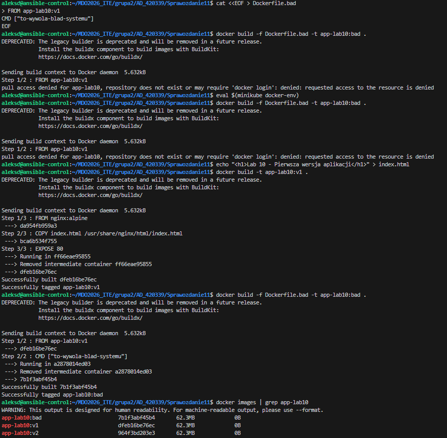
Przygotowałam trzy wersje lokalnego obrazu aplikacji, aby przetestować mechanizmy aktualizacji oraz obsługi błędów w Kubernetesie:
  1. Wersja 1: obraz bazowy z poprzedniego laboratorium (serwer Nginx z pierwotną stroną).
  2. Wersja 2: zaktualizowana wersja aplikacji z nową treścią strony index.html.
  3. Wersja bad: świadomie uszkodzony obraz (Dockerfile.bad), w którym nadpisałam domyślną komendę startową (CMD) błędnym poleceniem systemowym. Uruchomienie tego kontenera celowo wywoła błąd, co pozwoli na przetestowanie mechanizmów obronnych.

W celu rejestracji obrazów zastosowałam wariant lokalny, łącząc terminal bezpośrednio z silnikiem Dockera wewnątrz Minikube za pomocą polecenia eval $(minikube docker-env). Dzięki temu obrazy 1, 2 oraz bad budowały się od razu wewnątrz klastra, co wyeliminowało potrzebę ręcznego przesyłania plików komendą minikube image load. Poprawność rejestracji wszystkich trzech wersji i ich dostępność dla Kubenertesa potwierdziłam listą docker images.
  
### Zmiany w deploymencie
Pierwotna wersja deployment.yaml:
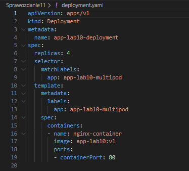
  * zwiększenie replik np. do 8
  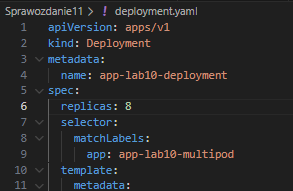
  Wynik:
  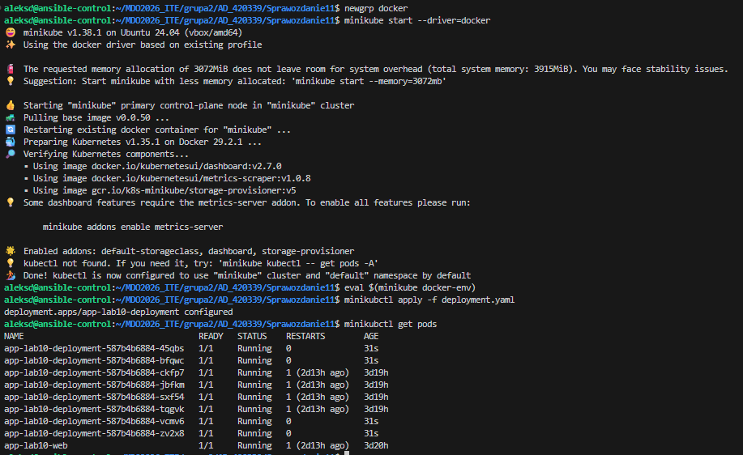
  * po zmniejszeniu liczby replik do 1
  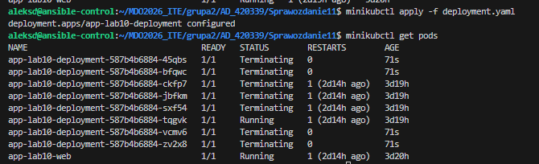
  Zgadza się - 1 w stanie running i reszta w stanie Terminating
  * po zmniejszeniu liczby replik do 0
  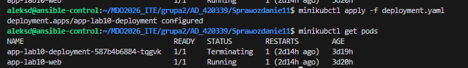
  * po ponownym przeskalowaniu w górę do 4 replik (co najmniej)
  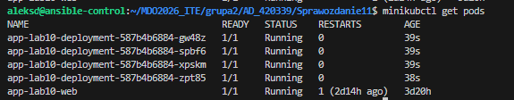

  Następnie przeszłam do testowania różnych wersji deployment.yaml w kontekście obrazu (image):
  * Zastosowanie nowej wersji obrazu
  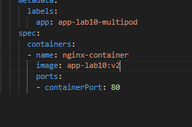
  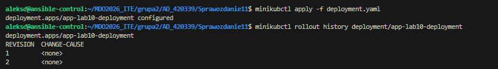
  * Zastosowanie starszej wersji obrazu - nie edytowałam jej ręcznie, zastosowałam polecenie 'minikubctl rollout undo deployment/app-lab10-deployment'
  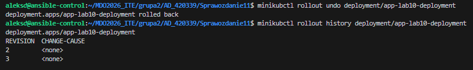
  * Zastosowanie "wadliwego" obrazu
  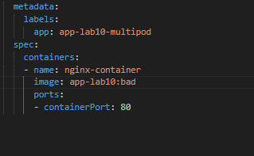
  Obserwacja stanów podów:
  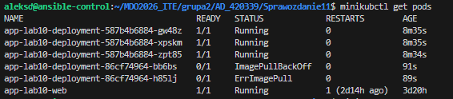
  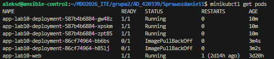

  Po przetesrowaniu różnych wariantów przywróciłam działającą wersję poleceniem 'minikubctl rollout undo deployment/app-lab10-deployment'. Pody znowu były w stanie Running.
  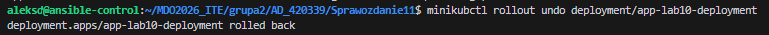
  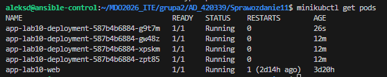

### Kontrola wdrożenia
 * Zidentyfikuj historię wdrożenia i zapisane w niej problemy, skoreluj je z wykonywanymi czynnościami
Podczas monitorowania klastra komendami 'minikubctl get pods' oraz 'rollout history' przeanalizowałam przyczyny występowania błędów wdrożenia. Status ErrImagePull wynikał z braku dostępu klastra do obrazu zbudowanego na hoście zamiast bezpośrednio w środowisku Minikube. Z kolei błąd ImagePullBackOff pojawił się przy wersji bad, ponieważ poprawne pobranie wadliwego obrazu kończyło się natychmiastowym wyrzuceniem błędnej komendy startowej CMD. Dzięki rolling update awarii uległy tylko nowe pody, a Kubernetes celowo utrzymał część starych kontenerów w stanie Running, zabezpieczając aplikację przed całkowitą utratą dostępności usług.

 * Napisz skrypt weryfikujący, czy wdrożenie "zdążyło" się wdrożyć (60 sekund)
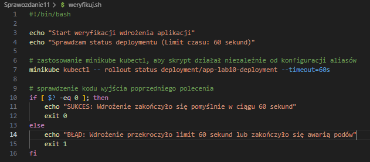
Test skryptu zakończony sukcesem:
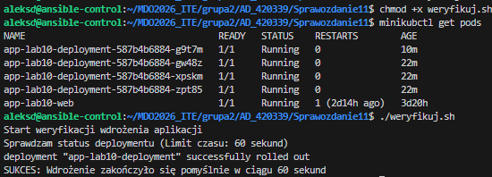
Test skryptu zakończony celowo błędem - test dla wersji bad:
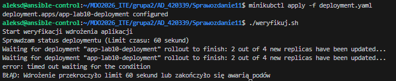
 
### Strategie wdrożenia
 * Przygotuj wersje [wdrożeń](https://kubernetes.io/docs/concepts/workloads/controllers/deployment/) stosujące następujące strategie wdrożeń
   * Recreate
   * Rolling Update (z parametrami `maxUnavailable` > 1, `maxSurge` > 20%)
   * Canary Deployment workload
 * Zaobserwuj i opisz różnice
 * Uzyj etykiet
 * Dla wdrożeń z wieloma replikami, używaj [serwisów](https://kubernetes.io/docs/concepts/services-networking/service/)

Przygotowałam serwis service.yaml - stabilny punkt dostępowy:
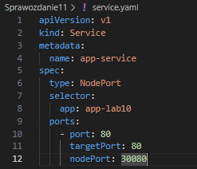
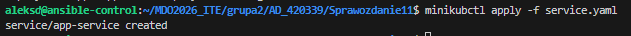

* Strategia 1 - recreate - ta strategia zabija wszystkie stare pody naraz, powoduje chwilową przerwę w działaniu strony i dopiero gdy jest pusto, stawia nowe pody
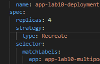
Statusy podów:
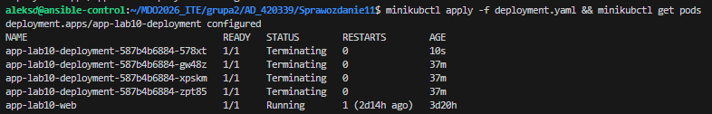
Zgodnie z założeniami strategii Recreate, Kubernetes najpierw bezwzględnie zabija wszystkie działające pody starej wersji (dlatego aż cztery pody mają status Terminating), zanim w ogóle zacznie pobierać nową wersję. 
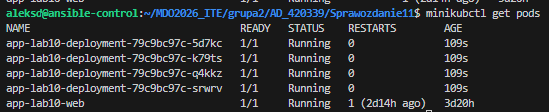

* Strategia 2 - rolling update - ta strategia wymienia pody partiami. Parametr maxUnavailable decyduje, ile podów może na raz nie działać, a maxSurge ile nadprogramowych podów klaster może chwilowo stworzyć podczas aktualizacji
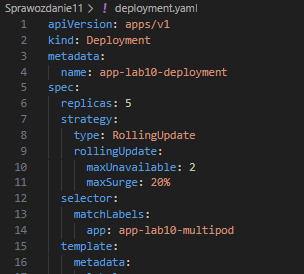
Po zmianie obrazu na nową wersję wywołałam aktualizacje:
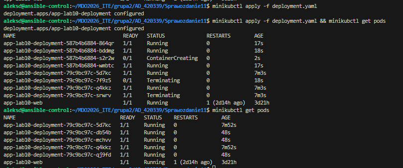
Dla 5 replik w fazie przejściowej widoczny jest stan mieszany: parametr maxSurge: 20% pozwolił na uruchomienie jednego nadprogramowego kontenera (ContainerCreating), podczas gdy limit maxUnavailable: 2 doprowadził do jednoczesnego wygaszania dokładnie dwóch starych podów (Terminating). Przez cały czas trwania operacji pozostałe kontenery utrzymywały status Running, co zapewniło ciągłość działania aplikacji bez jakiegokolwiek przestoju dla użytkowników. Następnie widoczny jest pełen sukces operacji - stabilne działanie wszystkich 5 replik w nowej wersji, o czym świadczy zróżnicowany wiek podów (część nowo utworzona 48 sekund wcześniej, część zmodyfikowana chwilę przed nimi).

* Strategia 3 - Canary Deployment - polega na tym, że wypuszczany jest jeden nowy pod obok działającej starej wersji i obserwujemy, czy działa. Robi się to poprzez uruchomienie dwóch osobnych wdrożeń (plików YAML), które mają tę samą etykietę główną, dzięki czemu jeden serwis kieruje ruch na obie wersje proporcjonalnie.
Przywróciłam plik deployment.yaml do stabilnej wersji produkcyjnej:
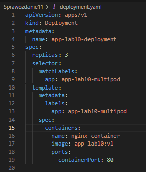
Stworzyłam nowy plik canary-deployment.yaml z tylko jedną repliką testową:
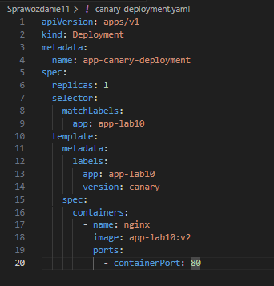
Lista podów oraz powiązanie z serwisem:

Zgodnie z założeniami ta strategia pozwoliła na bezpieczne przetestowanie nowej wersji na niewielkiej części ruchu sieciowego (1 pod canary obok podów produkcyjnych) bez modyfikowania głównego wdrożenia. Wszystkie pody są w stanie Running.

## Wnioski
Laboratorium pozwoliło na poznanie mechanizmów orkiestracji kontenerów w środowisku Kubernetes, ze szczególnym uwzględnieniem dynamicznego skalowania replik oraz automatyzacji weryfikacji wdrożeń za pomocą skryptu. Przeprowadzone testy różnych strategii aktualizacji, takich jak Recreate, Rolling Update oraz Canary Deployment, wykazały przewagę metod bezprzestojowych w kontekście utrzymania ciągłej dostępności usług. Wykorzystanie lokalnego rejestru Minikube oraz natywnych funkcji wycofywania zmian rollout undo udowodniło, że klaster potrafi skutecznie odizolować wadliwy obraz aplikacji i błyskawicznie przywrócić stabilną wersję systemu bez wywoływania przestojów produkcyjnych.


-----------------------------------------------------------

## Powiązanie z Docker Hubem (potrzebne na następne laby)
- upewniłam się, że moja maszyna jest powiązana z docker hubem: 
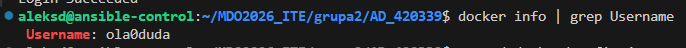

- wpisałam komendę 'eval $(minikube docker-env --unset)', aby terminal przestał patrzeć na wnętrze minikube a zaczął widzieć konto dockerhub, a następnie zbudowałam obraz ze swoim loginem. Na koniec wysłałam obraz do internetu:
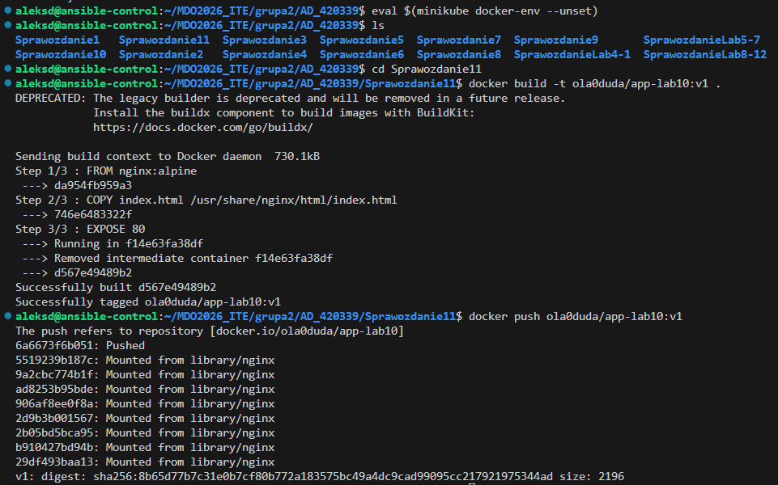
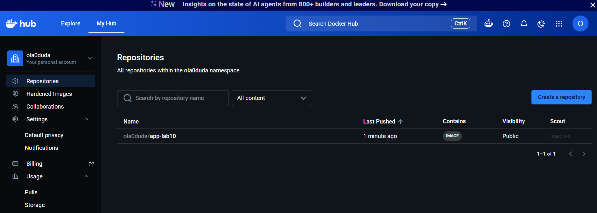

-------------------------------------------------------------

Plik Dockerfile:
```Dockerfile
FROM nginx:alpine
COPY index.html /usr/share/nginx/html/index.html
EXPOSE 80
```
Plik Dockerfile.bad:
```Dockerfile
FROM app-lab10:v1
CMD ["to-wywola-blad-systemu"]
```
deployment.yaml (edytowany w trakcie laboratorium):
```yaml
apiVersion: apps/v1
kind: Deployment
metadata:
  name: app-lab10-deployment
spec:
  replicas: 3
  selector:
    matchLabels:
      app: app-lab10-multipod
  template:
    metadata:
      labels:
        app: app-lab10-multipod
    spec:
      containers:
      - name: nginx-container
        image: app-lab10:v1
        ports:
        - containerPort: 80
```
canary-deployment.yaml:
```yaml
apiVersion: apps/v1
kind: Deployment
metadata:
  name: app-canary-deployment
spec:
  replicas: 1
  selector:
    matchLabels:
      app: app-lab10
  template:
    metadata:
      labels:
        app: app-lab10
        version: canary
    spec:
      containers:
        - name: nginx
          image: app-lab10:v2
          ports:
            - containerPort: 80
```

index.html:
```html
<h1>Lab 11 - nowa wersja mojej aplikacji</h1>
```

service.yaml:
```yaml
apiVersion: v1
kind: Service
metadata:
  name: app-service
spec:
  type: NodePort
  selector:
    app: app-lab10
  ports:
    - port: 80
      targetPort: 80
      nodePort: 30080
```

weryfikuj.sh:
```sh
#!/bin/bash

echo "Start weryfikacji wdrożenia aplikacji"
echo "Sprawdzam status deploymentu (Limit czasu: 60 sekund)"

# zastosowanie minikube kubectl, aby skrypt działał niezależnie od konfiguracji aliasów
minikube kubectl -- rollout status deployment/app-lab10-deployment --timeout=60s

# sprawdzenie kodu wyjścia poprzedniego polecenia
if [ $? -eq 0 ]; then
    echo "SUKCES: Wdrożenie zakończyło się pomyślnie w ciągu 60 sekund"
    exit 0
else
    echo "BŁĄD: Wdrożenie przekroczyło limit 60 sekund lub zakończyło się awarią podów"
    exit 1
fi
```