# Sprawozdanie laboratorium nr 12
**Autor:** Aleksandra Duda, grupa 2

## Cel
Celem laboratorium było zapoznanie się z wdrażaniem na zarządzalne kontenery w chmurze Azure.

--------------------------------------------------------------------------------------

## Zadania do wykonania

### Przygotowanie kontenera
 - Proszę upewnić się, że dysponuje się własnym kontenerem z aplikacją
 - Proszę zaktualizować wersję kontenera obecną na Docker Hub

Kontener znajduje się na DockerHub w repozytorium publicznym:
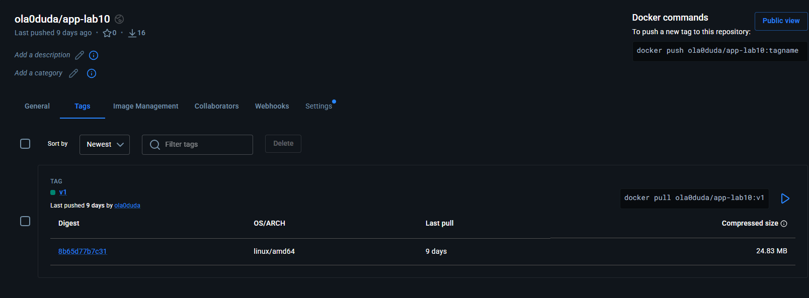
 
### Zapoznanie z platformą
Zalogowałam się na konto azure:
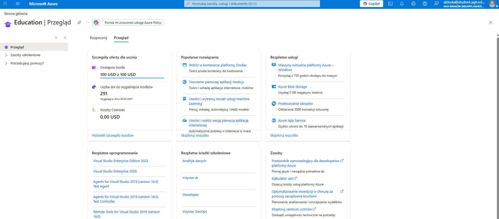
Na maszynie wirtualnej zainstalowalam Azure CLI i zalogowałam się do konta azure (az login --use-device-code):
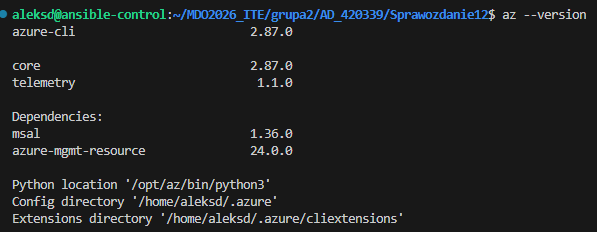
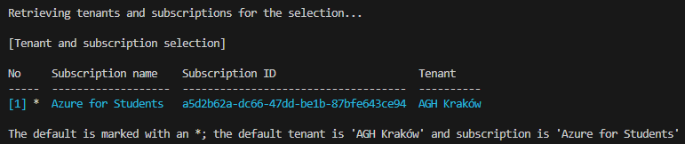
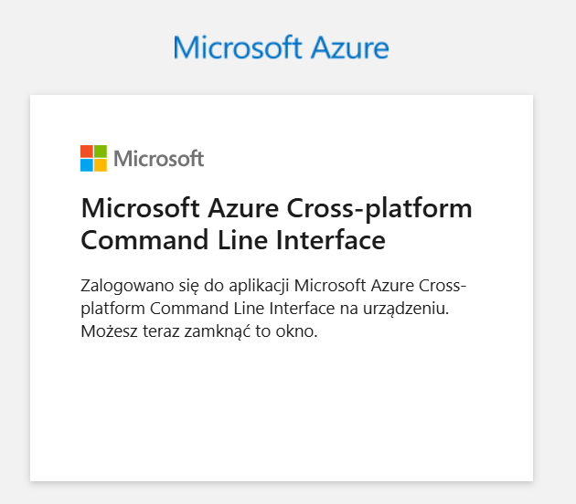

### Zadanie do wykonania
 1. Utwórz własny resource group
 Najpierw utworzyłam zmienne potrzebne do wykonania ćwiczenia (dobra praktyka devopsowa):
 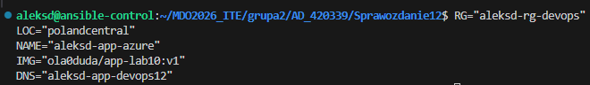
 Stworzyłam resource group:
 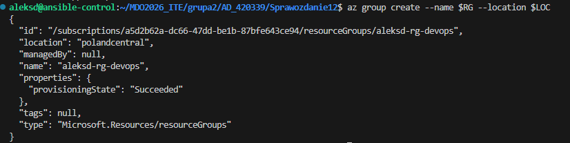

 2. Wdróż swój kontener z Docker Hub w swoim Azure
 Przy pierwszej próbie utworzenia kontenera otrzymalam błąd:
 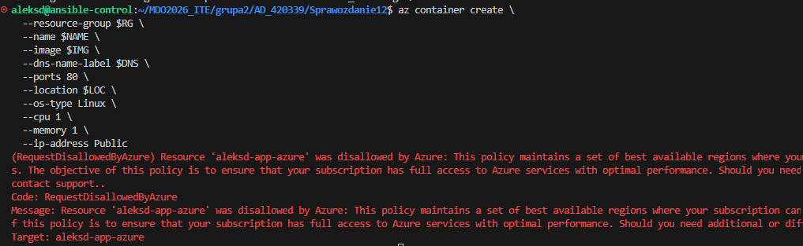
 Wskazywał on na brak możliwości użycia regionu polskiego w kontenerze, dlatego zmieniłam region na Europę. Jednak problem caly czas sie pojawiał. Zmieniłam obraz na httpd, przetestowałam różne lokacje, jednak nic nie pomogło. Przeniosłam więc pracę do terminala bash w portal.azure, jednak tam, mimo zastosowania komendy 'az provider register --namespace Microsoft.ContainerInstance' błąd nadal się pojawiał:
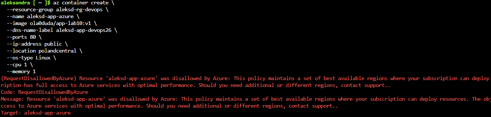

Sprawdziłam więc dostępne lokacje do utworzenia kontenera:
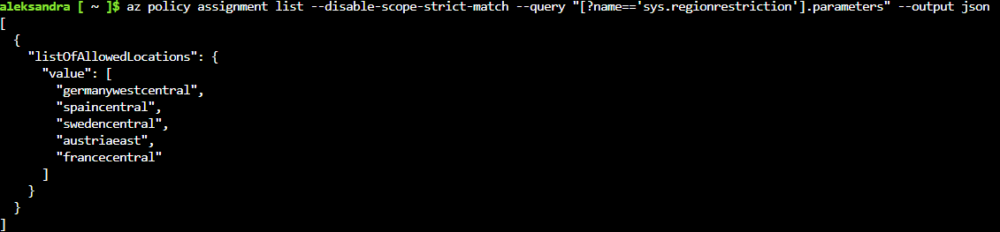
Okazało się, że na liście dostępnych lokalizacji nie ma ani Polski, ani Europy ani USA. Do utworzenia grupy i kontenera wybrałam więc Szwecję:
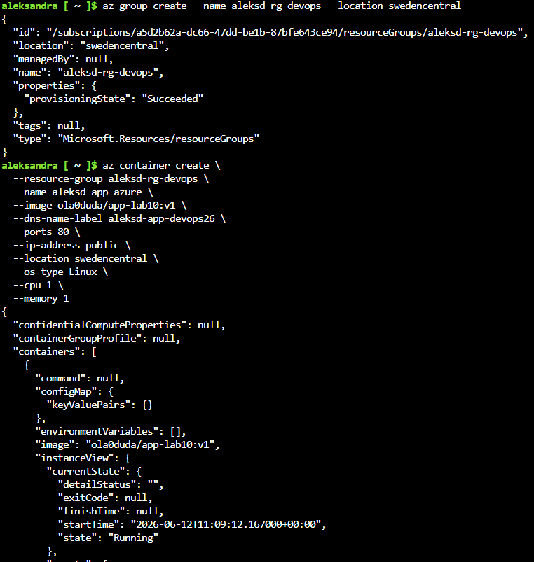
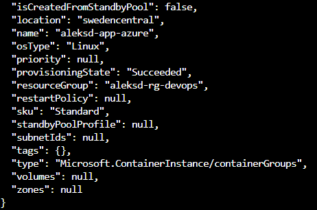
Status "succeeded" świadczy o tym, że kontener uruchomił się prawidłowo.

 3. Wykaż, że kontener został uruchomiony i pracuje, pobierz logi, przedstaw metodę dostępu do serwowanej usługi HTTP
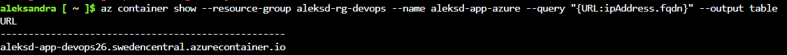
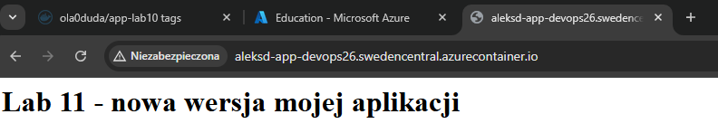
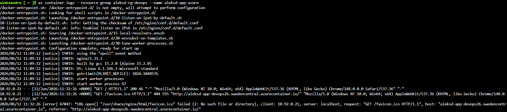

 4. Zatrzymałam i usunęłam kontener i grupę:
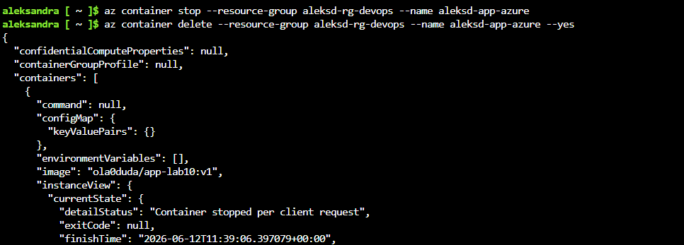
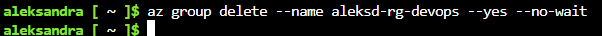

--------------------------------------------------------------------------------------

 ## Wnioski
Podczas zajęć laboratoryjnych nauczyłam się wdrażania na platformie azure, wykorzystując resource grupy i kontenery z aplikacją z poprzednich zajęć. Bardzo istotna przy wdrażaniu kontenerów jest odpowiednia lokalizacja oraz usunięcie zasobów po wykonanym ćwiczeniu, ze względu na płatne tokeny.