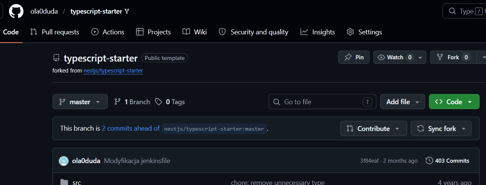
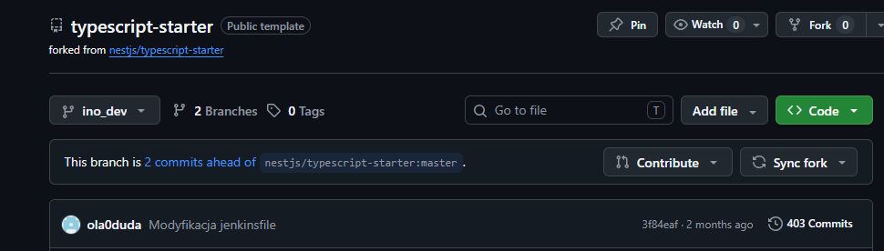
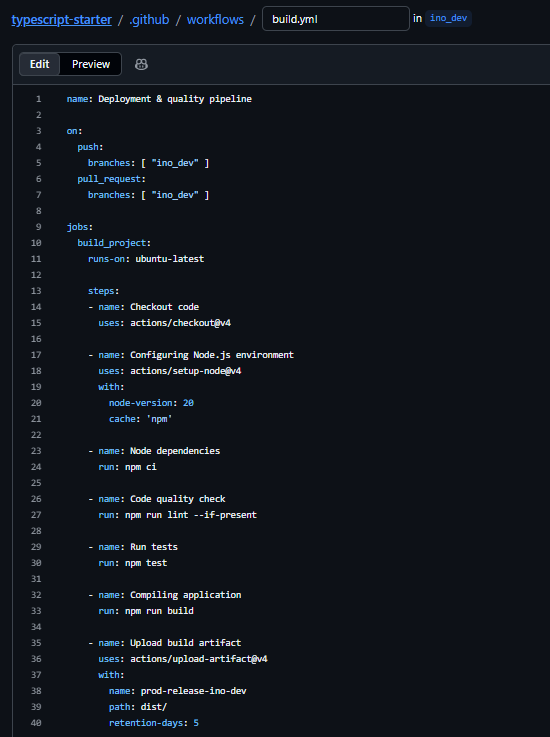
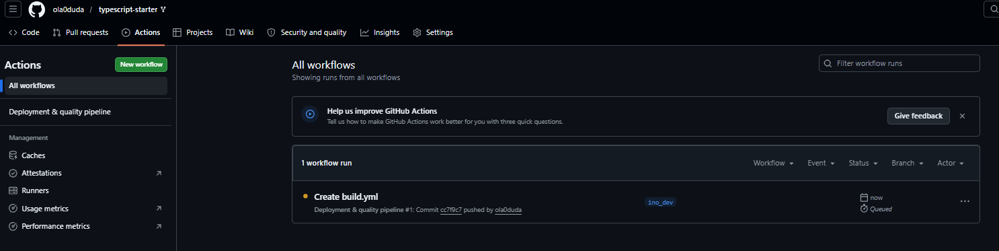
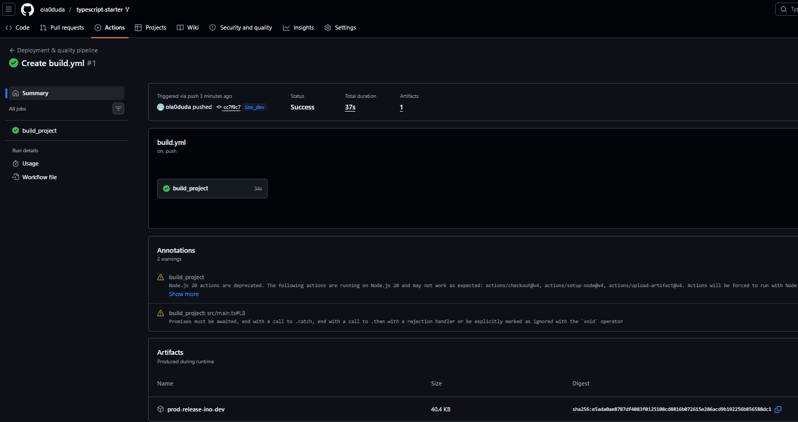
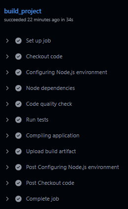
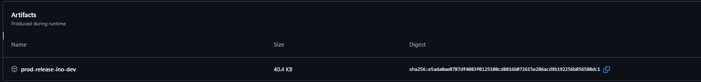

# Sprawozdanie laboratorium nr 13
**Autor:** Aleksandra Duda, grupa 2

## Cel
Celem laboratorium było zapoznanie się z działaniem GitHub Actions.

--------------------------------------------------------------------------------------

## Zadania do wykonania
 - Zapoznaj się z koncepcją [GitHub Actions](https://docs.github.com/en/actions)
 GitHub Actions to narzędzie wbudowane w GitHuba, które służy do automatyzacji pracy z kodem (CI/CD). Pozwala ono na automatyczne testowanie, budowanie i wdrażanie aplikacji przy każdej zmianie w repozytorium. Wszystkie te operacje wykonują się same na wirtualnych maszynach dostarczanych przez GitHuba.

 - Zwróć szczególną uwagę na *trigger* dla tworzonych akcji, omawiany na zajęciach
Trigger to warunek lub zdarzenie, które automatycznie uruchamia pipeline (workflow). W tym zadaniu triggerem będzie wrzucenie nowego kodu (push) lub stworzenie zmiany (pull request) skierowanej wyłącznie do konkretnej gałęzi. Dzięki temu główna gałąź projektu pozostaje bezpieczna i nienaruszona.

 - Cennik do przeczytania (ze zrozumieniem!!):
   https://docs.github.com/en/billing/managing-billing-for-github-actions/about-billing-for-github-actions
 - **Darmowy plan** powinien wystarczyć przynajmniej do zdefiniowania przykładu
Dla darmowych kont i publicznych repozytoriów GitHub Actions jest całkowicie bezpłatne i oferuje limit 2000 minut pracy wirtualnych maszyn miesięcznie.

 - *Sforkuj* repozytorium z wybranym oprogramowaniem. **Nie commituj pipeline'ów do głównego projektu!!** (kontrybutorzy go nie wciągną, ale nie ma potrzeby tego sprawdzać)
W tym ćwiczeniu wykorzystam wykonanego już na wcześniejszych laboratoriach forka: https://github.com/ola0duda/typescript-starter


 - Stwórz akcję przeprowadzającą *build* na podstawie *kontrybucji* do dedykowanej gałęzi `ino_dev`
 Stworzenie dedykowanej gałęzi ino_dev:
 

  - Usuń obecne w projekcie *workflows*, jeżeli istnieją
W moim sforkowanym projekcie nie znajdowały się żadne workflows.

  - Utwórz własną akcję reagującą na zmianę w `ino_dev` i/lub na kryterium indywidualnie omówione na zajęciach
  Utworzyłam akcję w .github/workflows/build.yml:
  

  - Zweryfikuj, że wybrany program buduje się wewnątrz Akcji po zacommitowaniu zmiany do gałęzi
  Po wykonaniu commita i wypchnięciu zmian do ino_dev github automatycznie zaczął wykonywać pipeline (chociaż najpierw znajdował się w kolejce):
  

  Pipeline zakończył się sukcesem:
  
  Pokazały się jedynie dwa ostrzeżenia, ale żadnych błędów krytycznych.
  
  Wszystko wykonało się w ciągu 34 sekund.

  - Jeżeli to możliwe, załącz zbudowany artefakt za pomocą [dedykowanej akcji](https://docs.github.com/en/actions/writing-workflows/choosing-what-your-workflow-does/storing-and-sharing-data-from-a-workflow)
  W podsumowaniu wykonania pipelinu w sekcji artefakt widoczny jest artefakt o nazwie prod-release-ino-dev:
  

## Wnioski
Zaprojektowany potok CI/CD w GitHub Actions prawidłowo automatyzuje zaimplementowane procesy wypchnięte w pliku .github/workflows/build.yml na dedykowaną gałąź ino_dev. Wygenerowany w tym procesie artefakt został poprawnie zapisany. Pipeline zakończył się sukcesem. GitHub Actions pozwala na automatyzację testowania i budowania projektu bezpośrednio w repozytorium, co zapewnia programiście natychmiastową informację zwrotną o błędach i gwarantuje, że każda zmiana w kodzie automatycznie generuje gotowy do wdrożenia artefakt.

typescript-starter/.github/workflows/build.yml:
```yml
name: Deployment & quality pipeline

on:
  push:
    branches: [ "ino_dev" ]
  pull_request:
    branches: [ "ino_dev" ]

jobs:
  build_project:
    runs-on: ubuntu-latest

    steps:
    - name: Checkout code
      uses: actions/checkout@v4

    - name: Configuring Node.js environment
      uses: actions/setup-node@v4
      with:
        node-version: 20
        cache: 'npm'

    - name: Node dependencies
      run: npm ci

    - name: Code quality check
      run: npm run lint --if-present

    - name: Run tests
      run: npm test

    - name: Compiling application
      run: npm run build

    - name: Upload build artifact
      uses: actions/upload-artifact@v4
      with:
        name: prod-release-ino-dev
        path: dist/
        retention-days: 5
```
