# Sprawozdanie z lab2 - Git, Docker
**Autor:** Aleksandra Duda, grupa 2

## Cel
Na zajęciach laboratoryjnych zapoznałam się z konteneryzacją w Dockerze, w szczególności z prawidłową instalacją i konfiguracją środowiska Docker w systemie Linux, zarządzaniu obrazami z DockerHub, zrozumieniu cyklu życia kontenera i wykorzystaniu pliku Dockerfile.

## Zestawienie środowiska skonteneryzowanego
1. Zainstalowałam Docker w systemie linuksowym, użwając repozytorium dystrybucji (docker.io w ubuntu) i niestosując Snapa i Flat Pak
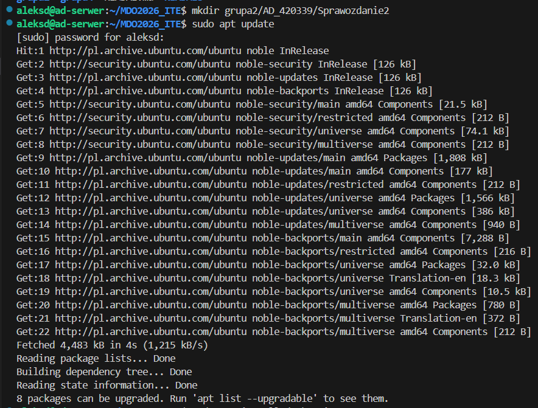
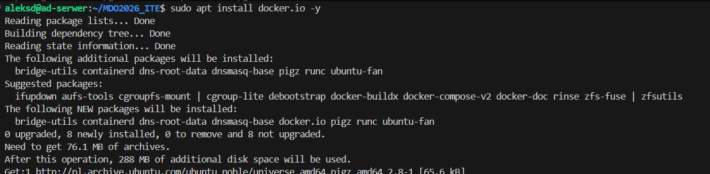
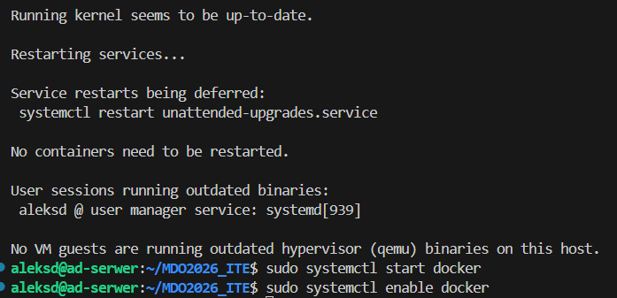

2. Zarejestrowałam się w DockerHub i zapoznałam z sugerowanymi obrazami
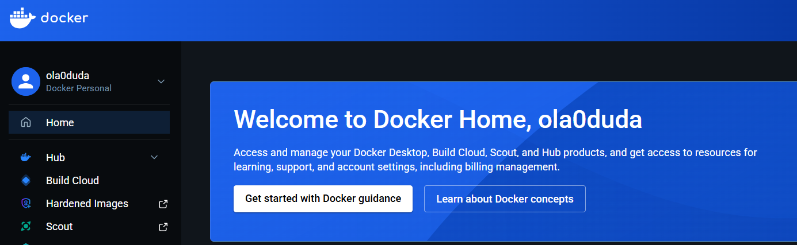

Następnie zalogowałam się w terminalu:
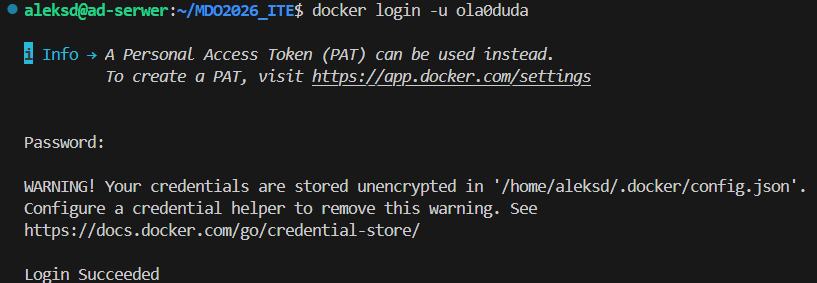

Sprawdziłam czy docker działa:
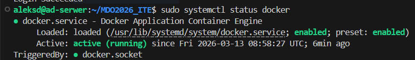
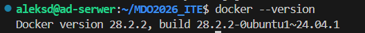

3. Zapoznałam się z obrazami hello-world, busybox, ubuntu lub fedora, mariadb, runtime, aspnet i sdk dla Microsoft .NET uruchamiając je, sprawdzając ich rozmiary i sprawdzając kod wyjścia. Wykorzystałam komende docker run - jak nie ma obrazu na dysku to Docker sam go pobierze i uruchomi.
Zrzuty ekranów uruchomienia trzech obrazów:
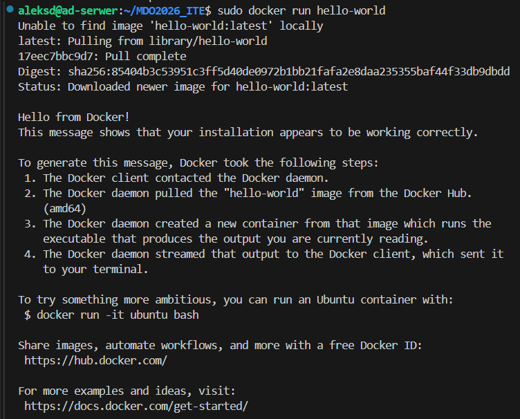
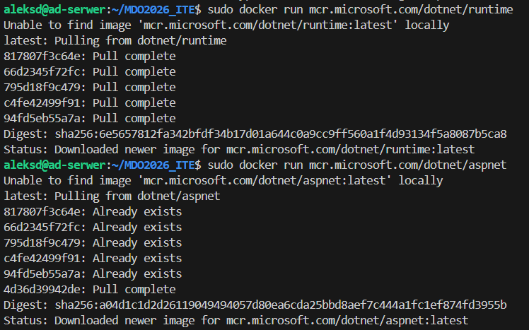

Sprawdziłam rozmiary obrazów:

Jak widać hello-world zajmuje najmniej miejsca, podczas gdy sdk zajmuje go zdecydowanie najwięcej.

Na koniec sprawdziłam kod wyjścia (poleceniem docker ps -a):

Większość uruchomionych kontenerów zakończyła pracę z kodem 0, co oznacza poprawne wykonanie. Kontener mariadb jako jedyny posiada status up, ponieważ jest to serwer bazy danych uruchomiony w tle (-d) i jego proces nie kończy się automatycznie tylko pozostaje aktywny.

4. Uruchomiłam kontener z obrazu busybox.
Efekt uruchomienia:
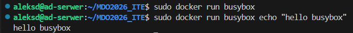

Następnie podłączyłam się do kontenera interaktywnie (flagi -i, -t) i wywołałam numer wersji:
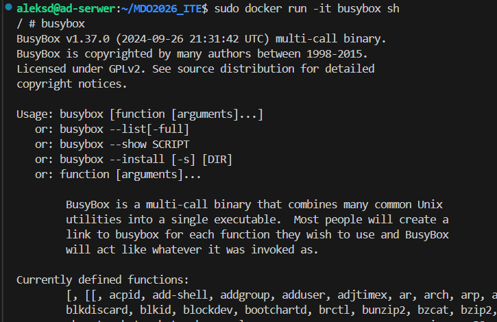
Na zrzucie ekranu widać, że wersja to BusyBox v1.37.0.

5. Uruchomiłam "system w kontenerze" - kontener z obrazu ubuntu.
Ponownie zastosowałam flagi -i, -t żebym mogła wydawać polecenia wewnątrz. PID1 w kontenerze:


Procesy dockera na hoście. W tym celu wykonałam polecenie 'ps -ef | grep bash' w drugim terminalu. Tutaj proces bash ma zupełnie inny, dużo wyższy numer PID niż 1 (wynika to z izolacji przestrzeni nazw i że kontener nie jest osobnym systemem operacyjnym, tylko odizolowanym procesem współdzielącym jądro z systemem nadrzędnym):


Zaktualizowałam pakiety i wyszłam:
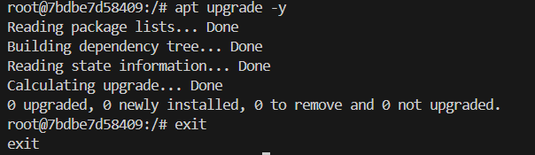

6. Stworzyłam, zbudowałam i uruchomiłam prosty plik Dockerfile bazujący na wybranym systemie i sklonowałam w nim repozytorium:

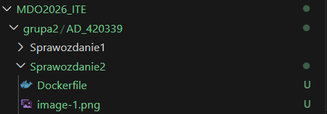

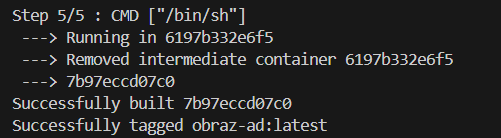
Znajduje się na liście:
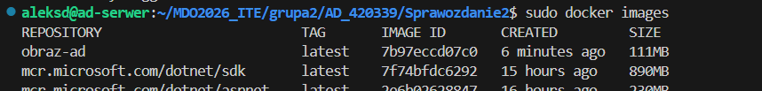

Następnie upewniłam się, że obraz będzie miał gita, uruchomiłam w trybie interaktywnym i zweryfikowałam, że jest tam ściągnięte nasze repozytorium:

Znajdują się tam pliki repozytorium i ukryty folder .git tak jak powinny.

7. Uruchomione kontenery, wyczyściłam zakończone:
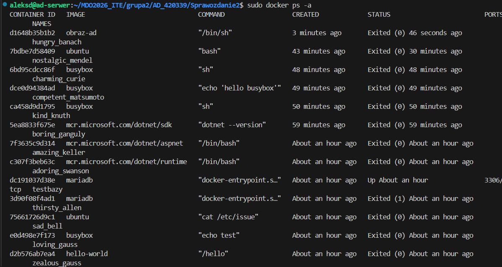
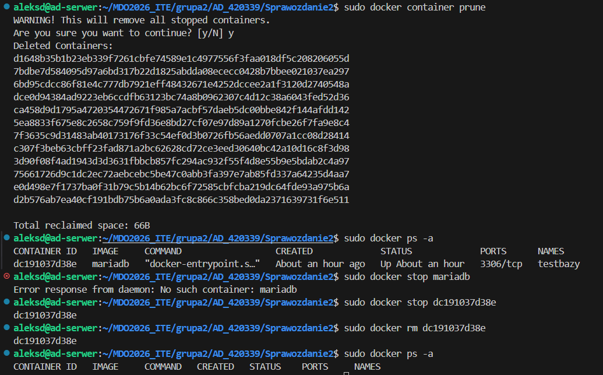

8. Wyczyściłam obrazy przechowywane w lokalnym magazynie:

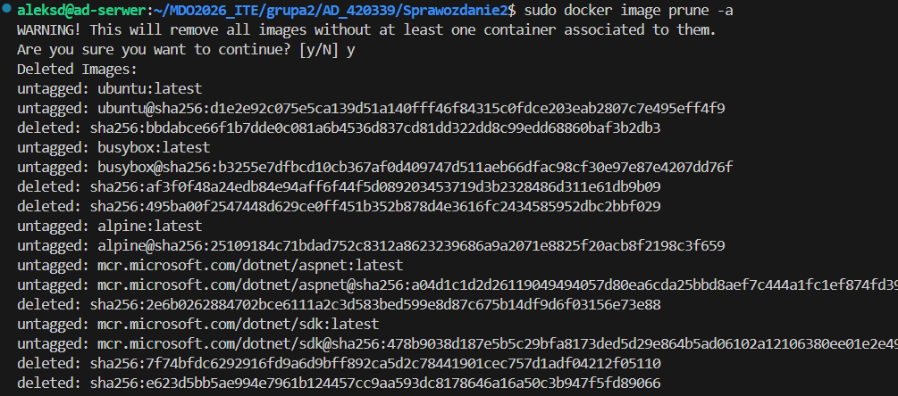

Zweryfikowałam czy magazyn jest czysty:
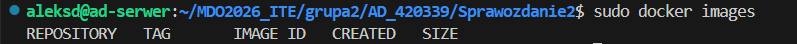

Treść Dockerfile:
```dockerfile
#lekki obraz bazowy
FROM alpine:latest

#instalacja gita i czyszczenie cache
RUN apk update && apk add --no-cache git

#ustalenie folderu roboczego
WORKDIR /app

#sklonowanie repozytorium do bieżącego folderu
RUN git clone https://github.com/InzynieriaOprogramowaniaAGH/MDO2026_ITE.git .

#domyślne polecenie po startcie kontenera - odpalanie shella, bez tego kontener by się wyłączył
CMD ["/bin/sh"]
```

Polecenie history:
```bash
  117  mkdir grupa2/AD_420339/Sprawozdanie2
  118  sudo apt update
  119  sudo apt install docker.io -y
  120  sudo systemctl start docker
  121  sudo systemctl enable docker
  122  docker login
  123  docker login -u ola0duda
  124  sudo systemctl status docker
  125  docker --version
  126  docker run hello-world
  127  sudo docker run hello-world
  128  sudo docker run busybox echo "test"
  129  sudo docker run ubuntu cat /etc/issue
  130  sudo docker run mariadb
  131  echo $?
  132  sudo docker run --name testbazy -e MARIADB_ROOT_PASSWORD=admin -d mariadb
  133  sudo docker ps
  134  sudo docker run mcr.microsoft.com/dotnet/runtime
  135  sudo docker run mcr.microsoft.com/dotnet/aspnet
  136  sudo docker run mcr.microsoft.com/dotnet/sdk dotnet --version
  137  sudo docker images
  138  sudo docker ps -a
  139  sudo docker run busybox
  140  sudo docker run busybox echo "hello busybox"
  141  sudo docker run -it busybox sh
  142  sudo docker run -it ubuntu bash
  143  sudo docker ps -a
  144  ls
  145  cd grupa2
  146  ls
  147  cd AD_420339/
  148  ls
  149  cd Sprawozdanie2
  150  sudo docker build -t obrazAD .
  151  sudo docker build -t obraz-ad .
  152  sudo docker images
  153  sudo docker run -it obraz-ad
  154  sudo docker ps -a
  155  sudo docker container prune
  156  sudo docker ps -a
  157  sudo docker stop mariadb
  158  sudo docker stop dc191037d38e
  159  sudo docker rm dc191037d38e
  160  sudo docker ps -a
  161  sudo docker image prune -a
  162  sudo docker images
  163  history
```
