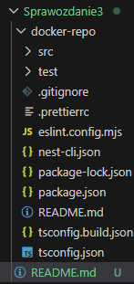
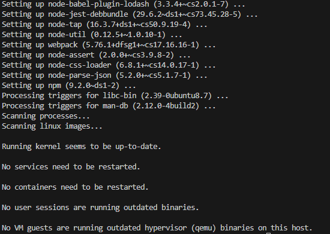
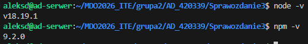
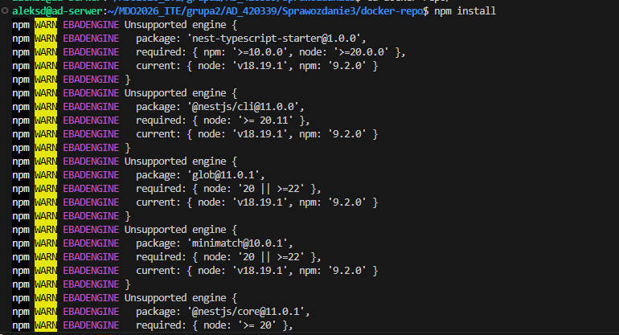
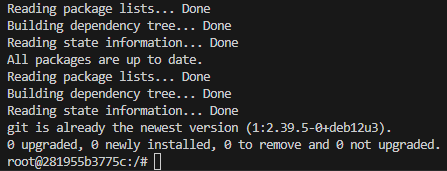
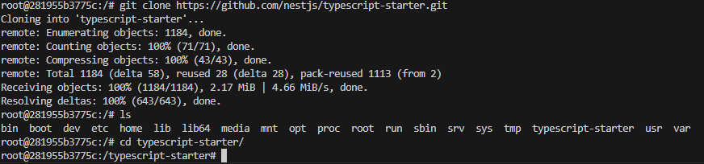
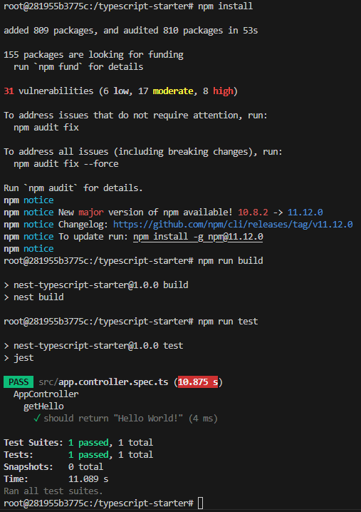
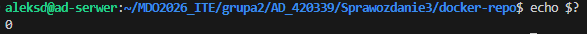

# Sprawozdanie z lab3 - Dockerfiles, kontener jako definicja etapu
**Autor:** Aleksandra Duda, grupa 2

## Cel
Na zajęciach laboratoryjnych zbudowałam oprogramownie w powtarzalnym środowisku CI tak, aby proces był przenośny między ustrojami.

## Wybór oprogramowania na zajęcia
1. Na początku znalazłam repozytorium z kodem dowolnego oprogramowania, które spełniało wymagania z instrukcji. Mój wybór: https://github.com/nestjs/typescript-starter
- Sklonowałam repozytorium do podfolderu docker-repo, zainstałowalam wymagane zależności i przeprowadziłam build programu.





build:


- Uruchomiłam testy jednostkowe dołączone do projektu w repozytorium - zakończone sukcesem


## Izolacja i powtarzalność: build w kontenerze
Następnie ponowiłam proces interaktywnie w kontenerze.
1. Wybrałam obraz kontenera (node:20) zawierający wymagane przez wybrany program środowisko uruchomieniowe potrzebne do jego zbudowania:


2. Wykonałam kroki build i test wewnątrz wybranego kontenera bazowego:

- uruchomiłam kontener - w poprzednim punkcie polecenie run

- podłączyłam do niego TTY celem rozpoczęcia interaktywnej pracy - w poprzednim punkcie flaga -it (interactive TTY)

- zaopatrzyłam kontener w wymagania wstępne (chociaż były już obecne)


- sklonowałam repozytorium


- skonfigurowałam środowisko i uruchomiłam build, uruchomiłam testy które zakończyły się sukcesem


3. Następnie stworzyłam dwa pliki Dockerfile automatyzujące kroki powyżej z uwzględnieniem, że kontener pierwszy ma przeprowadzać wszystkie kroki aż do builda, a kontener drugi ma bazować na pierwszym i wykonywać testy (lecz nie robić builda):
Pierwszy kontener:


Drugi obraz i kontener z testami zakończonymi sukcesem:


4. Na wcześniejszych zrzutach ekranu wykazałam, że kontener wdraża się i pracuje poprawnie - widać to na logach ze zdanymi testami (1 passed, 1 total) co oznacza, że kontener pomyślnie zamontował system plików, uruchomił środowisko Node.js, znalazł i wykonał skrypty testowe bez błędów. Widoczny jest także kod wyjścia 0 (sukces):\

Obraz i kontener różnią się tym, że obraz to zestaw plików i ustawień zapisanych na dysku, podczas gdy kontener to ożywionym, uruchomiony obraz - proces, który ruszył na podstawie tych plików.
W kontenerze pracuje proces, w moim przypadku proces środowiska uruchomieniowego Node.js. Kontener to w rzeczywistości odizolowany proces w systemie ubuntu. w kontenerze pracują pliki które podajemy w Dockerfile.

Treść Dockerfile1:
```dockerfile
FROM node:20-alpine

WORKDIR /app

# kopiowanie plików z ubuntu do kontenera
COPY . .

RUN npm install

RUN npm run build
```

Treść Dockerfile2:
```dockerfile
FROM dockerfile1

# cmd żeby testy ruszyły dopiero w momencie startu kontenera
CMD npm run test
```

Polecenie history:
```bash
176  cd MDO2026_ITE/
  177  ls
  178  cd grupa2
  179  ls
  180  cd AD_420339/
  181  ls
  182  mkdir Sprawozdanie3
  183  ls
  184  cd Sprawozdanie3
  185  mkdir docker-repo
  186  ls
  187  git clone https://github.com/nestjs/typescript-starter.git docker-repo/
  188  cd docker-repo/
  189  npm install
  190  sudo npm install
  191  npm run build
  192  sudo npm run build
  193  cd ..
  194  sudo apt update 
  195  sudo apt install nodejs npm-y
  196  sudo apt install nodejs npm -y
  197  node -v
  198  npm -v
  199  ls
  200  cd docker-repo/
  201  npm install
  202  npm run build
  203  npm run test
  204  cd ..
  205  docker run -it --name lab-interaktywny node:20 /bin/bash
  206  sudo docker run -it --name lab-interaktywny node:20 /bin/bash
  207  ls
  208  ls docker-repo/
  209  ls
  210  cd docker-repo/
  211  ls
  212  sudo docker build -t dockerfile1 -f Dockerfile.build .
  213  sudo docker build -t dockerfile2 -f Dockerfile.test .
  214  sudo docker run --rm dockerfile2
  215  sudo docker build -t dockerfile2 -f Dockerfile.test .
  216  sudo docker run --rm dockerfile2
  217  echo $?
  218  history
```