# Sprawozdanie z lab4 - Dodatkowa terminologia w konteneryzacji, instancja Jenkins
**Autor:** Aleksandra Duda, grupa 2

## Cel
Na zajęciach laboratoryjnych uruchomiłam instancję Jenkins w środowisku skonteneryzowanym, do czego potrzebna była dodatkowa wiedza dotycząca kontenerów.

## Zachowywanie stanu między kontenerami
1. Po zapoznaniu się z dokumentacją przygotowałam woluminy wejściowy i wyjściowy i podłączyłam je do kontenera bazowego (woluminy są podłącane w fazie tworzenia kontenera). Zrobiłam to w folderze Sprawozdanie3 ponieważ tam znajdują się pliki z poprzednich zajęć.
Zrzut ekranu z history ponieważ output z polecenia docker run był zbyt długi:
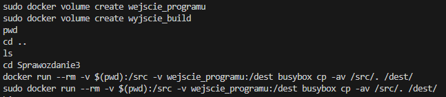
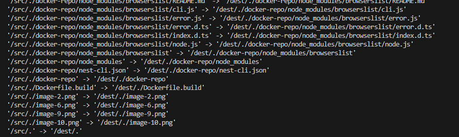

2. Następnie uruchomiłam kontener bazowy w folderze Sprawozdanie4:
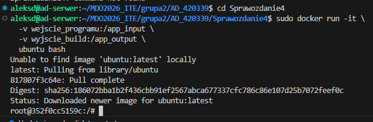
Dowody na brak gita i podpięcie volumenu z plikami ze Sprawozdania3:
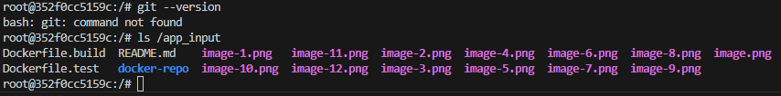


3. Sklonowałam repozytorium na wolumin wejściowy
Najpierw musiałam usunąć wszystko w wolumenie ponieważ przez przypadek skopiowałam tam wszystko z localhosta. Następnie skopiowałam wszystko tylko z folderu repozytorium
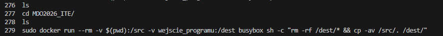
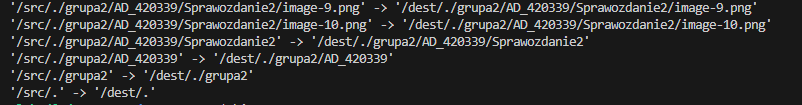

Jak zostało to zrobione: wykorzystałam kontener pomocniczy z obrazem busybox
Dlaczego:
- kontener pomocniczy pozwolił na bepieczny transfer plików z systemu hosta do wolumenu zarządzanego przez Dockera.
- Bind mount wykorzystałam, aby podmontować pliki źródłowe z ubuntu do kontenera busybox, co umożliwiło ich skopiowanie metodą cp
- dzięki temu mój kontener bazowy pozostał czysty, nie musiał posiadać zainstalowanego Gita ani dostępu do moich prywatnych kluczy SSH na hoście, aby otrzymać kod źródłowy.

4. Następnie aby uruchomić build w kontenerze sprawdziłam, czy potrzebny jest dostęp do kodu poleceniem ls /app_input. Tym razem uruchomiłam kontener używając obrazu node:20 ponieważ to jego używałam na ostatnich zajęciach w plikach Dockerfile:
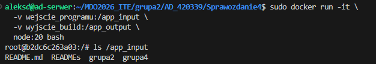
widzę pliki, co oznacza, że mam dostęp do kodu. Mogę teraz pracować na plikach, kompilować je lub pakować
Następnie przeniosłam się do folderu z plikiem package.json. Zainstalowałam zależności i uruchomiłam budowanie projektu:
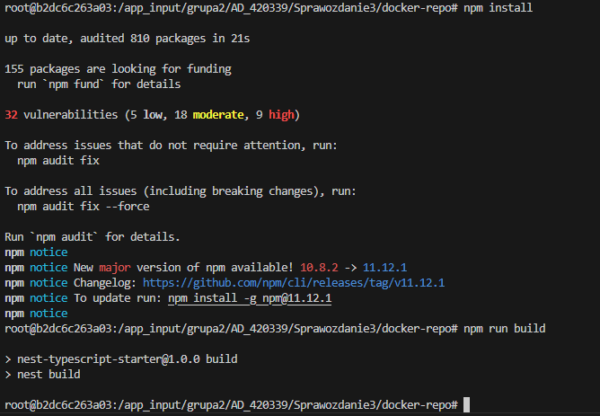
Zbudowane pliki znajdują się w katalogu dist:
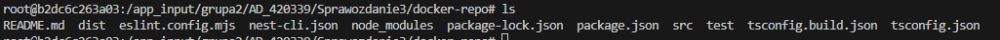

5. Zapisałam zbudowane pliki na wolumnie wyjściowym (/app_output) tak, by były dostępne po wyłączeniu kontenera
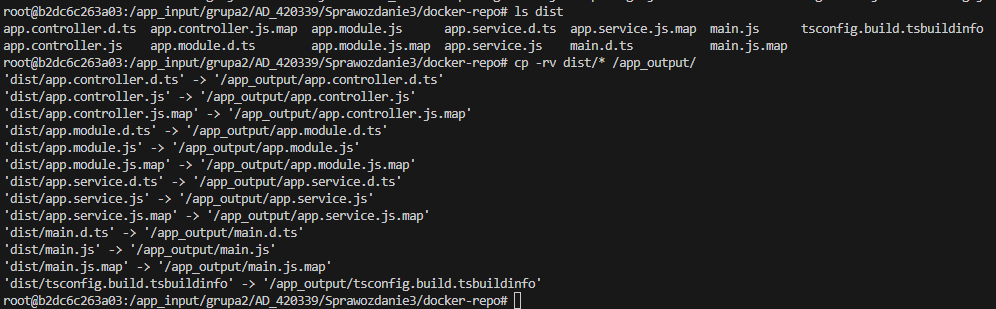

6. Dokumentacja wyników:
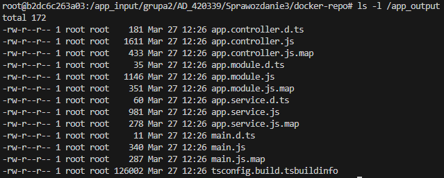
Sprawdziłam także trwałość (czy skoro wyszłam z kontenera node to pliki dalej są w woluminie). Wszystkie pliki były widoczne:
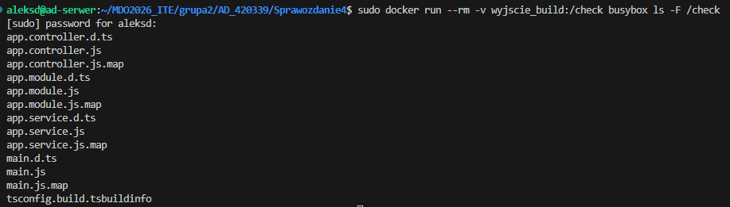

7. Ponowiłam operację, ale tym razem klonowanie na wolumin "wejściowy" przeprowadziłam wewnątrz kontenera używając Gita w kontenerze. Dla odmiany użyłam tym razem kontenera dla ubuntu.
Uruchomiłam kontener, przygotowałam środowisko, wyczyściłam woluminy i sklonowałam repozytorium:
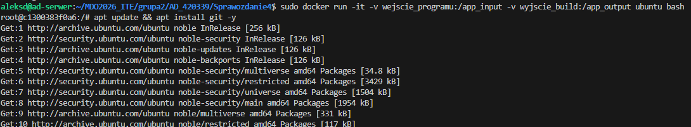
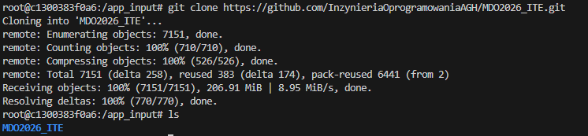

8. Przeanalizowałam możliwość wykonania tych kroków za pomocą docker build i pliku Dockerfile:
Do tej pory używałam flagi -v przy docker run, co podłączyło wolumen na czas działania kontenera i pozwoliło na pełną kontrolę nad danymi. Aby jednak dążyć do automatyzacji, stosowane są pliki Dockerfile. W pliku dockerfile można zastosować instrukcję RUN --mount, a dokładnie RUN --mount=type=bind, co pozwoliłoby na:
- zastąpienie manualnego klonowania - kod źródłowy mógłby być zamontowany bezpośrednio z hosta podczas fazy budowania, bez konieczności instalowania Gita wewnątrz obrazu bazowego
- optymalizację obrazu - dzięki zastosowaniu multi-stage builds w finalnym kontenerze znalazłyby się jedynie pliki wynikowe, co znacząco zmniejszyłoby rozmiar obrazu i zwiększyło bezpieczeństwo
- skrócenie czasu pracy - mechanizm type=cache pozwoliłby na współdzielenie zależności między różnymi buildami, dzięki czemu nie trzeba by za każdym razem uruchamiać npm install.

## Eksponowanie portu i łączność między kontenerami
1. Zapoznałam się z dokumentacją programu IPerf. IPerf to narzędzie konsolowe służące do aktywnego pomiaru maksymalnej przepustowości sieci IP. Działa w architekturze klient-serwer, pozwalając na badanie parametrów takich jak przepustowość, opóźnienia (jitter) oraz utrata pakietów.
2. Uruchomiłam wewnątrz kontenera serwer iperf:
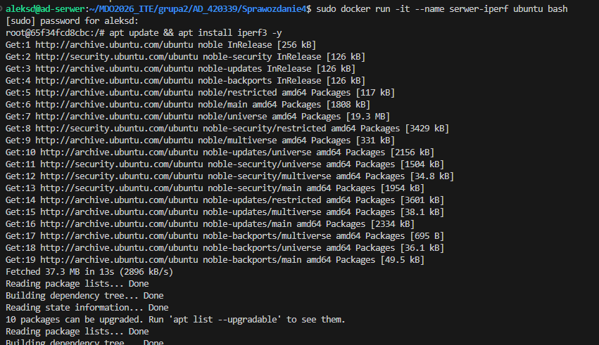
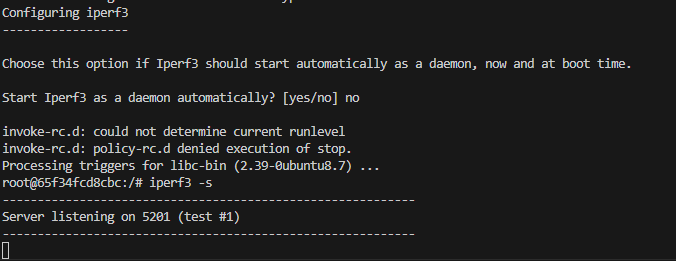

3. Uruchomiłam drugi kontener w drugim terminalu:
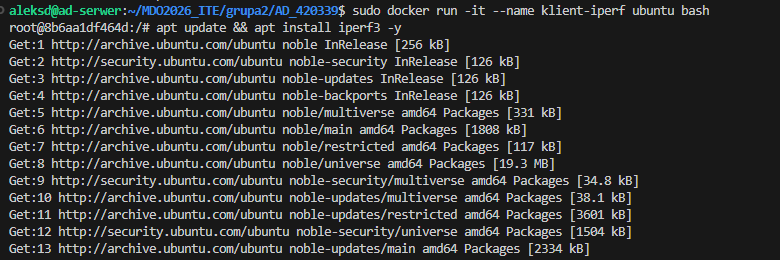

4. Znalazłam adres IP pierwszego kontenera z serwerem iperf korzystając z drugiego terminalu:
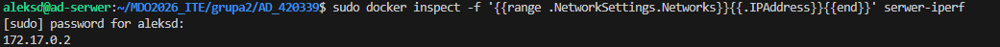

5. Połączyłam się z tym serwerem z drugiego terminala. Na kliencie zobaczyłam wyniki z Transfer, Bitrate:
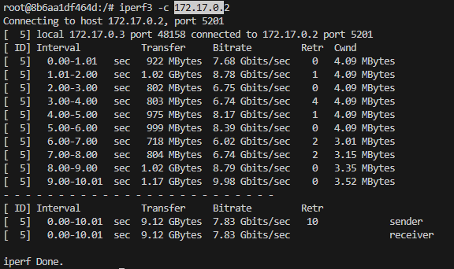
Natomiast na serwerze zobaczyłam:
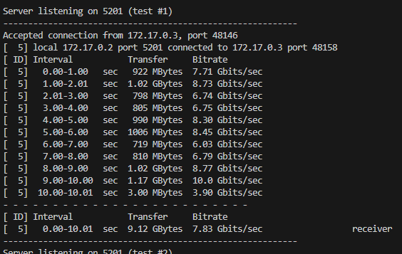
Badanie ruchu wykazało przepustowość na poziomie 7.83 Gbits/sec. Ponieważ oba kontenery działają w ramach tej samej sieci na jednym hoście fizycznym, komunikacja odbywa się przez interfejs wirtualny, co pozwala na uzyskanie znacznie wyższych transferów niż w przypadku fizycznej sieci. W większości przypadków zaobserwowałam brak retransmisji, co świadczy o bardzo wysokiej stabilności poączenia wewnątrz sieci wirtualnej Dockera.

6. Zapoznałam się z dokumentacją network create. 

7. Ponowiłam krok, wykorzystując własną dedykowaną sieć mostkową (siecAD) używając rozwiązywania nazw:
- serwer:
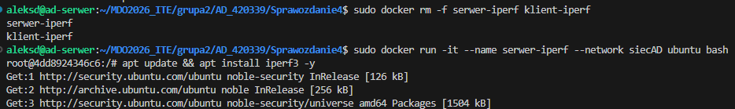
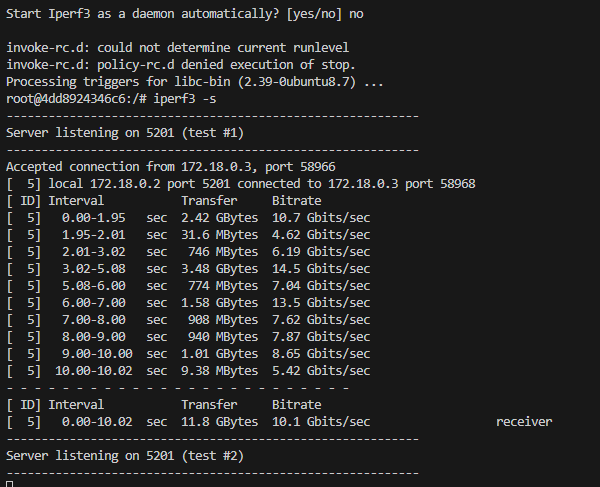
- klient:
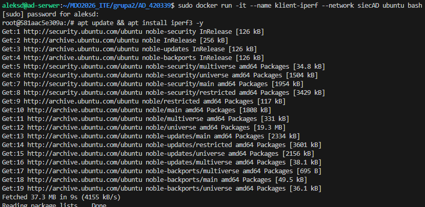
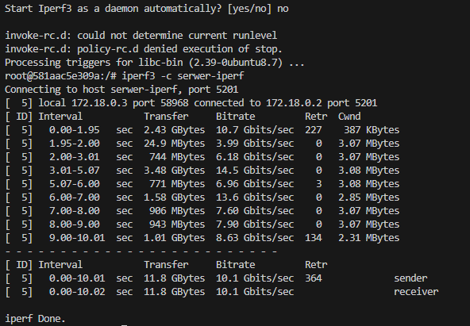

8. Połączyłam się spoza kontenera (z hosta i spoza hosta).
Zatrzymałam serwer i uruchomiłam go ponownie dodając flagę -p 5201:5201. W środku uruchomiłam iperf
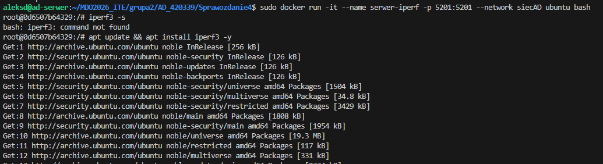
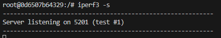
Następnie wykonałam test z hosta (z localhost) z nowego terminalu:
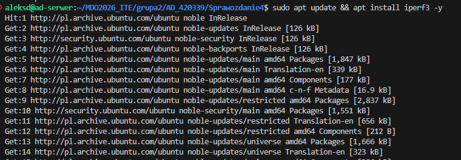
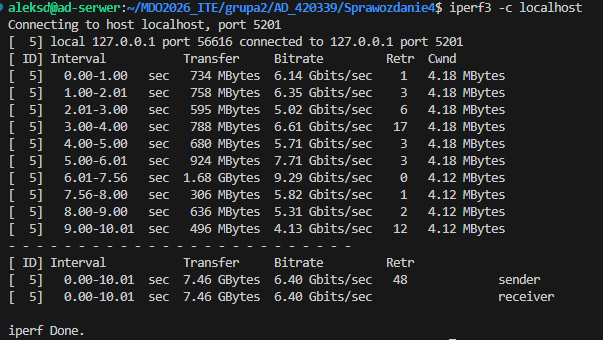
Jak widać po wynikach Bitrate, przepustowość w połączeniu host-kontener jest gorsza niż w połączeniu kontener-kontener. Również częstsze są retransmisje pakietów.

Następnie połączyłam się spoza hosta wykorzystując tunelowanie portów vs code.
Uruchomiłam serwer iperf:
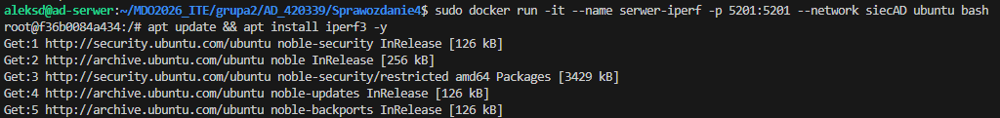
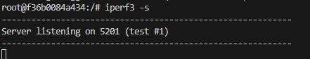
Stworzyłam tunel używając portów:
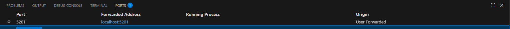
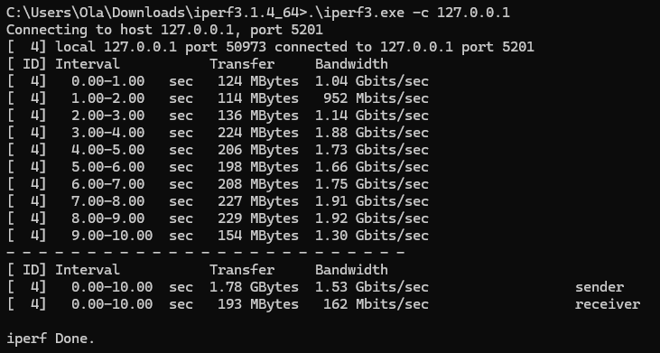

Na zrzutach ekranu widać, że podczas testu połączenia z zewnętrznego laptopa do kontenera, uzyskano realną przepustowość na poziomie 162 Mbits/sec (Receiver), co pokazuje drastyczny spadek prędkości w porównaniu do testu wewnątrz sieci Dockera. Powodem tego jest ograniczona komunikacja zewnętrzna przez fizyczne parametry łącza internetowego i narzut protokołu SSH użytego do tunelowania portu.

9. Wyciągnęłam logi z kontenera do pliku iperf_serwer_log.txt

## Usługi w rozumieniu systemu, kontenera i klastra
1. Zestawiłam w kontenerze ubuntu usługę SSHD - uruchomiłam nowy kontener z mapowaniem dla portu SSH, wewnątrz kontenera zainstalowałam serwer SSH.
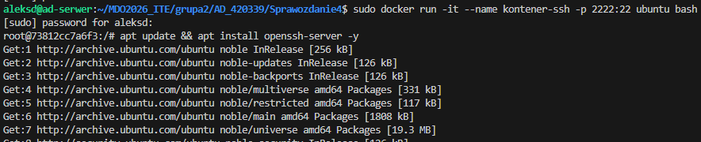

Skonfigurowałam SSH (utworzyłam folder, ustawiłam hasło dla użytkownika root i pozwoliłam na logowanie roota w konfiguracji) i uruchomiłam usługę SSH:
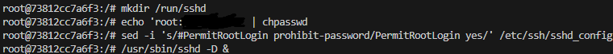

2. Następnie połączyłam się z usługą z poziomu serwera Ubuntu, w nowym terminalu vs code (host->kontener):
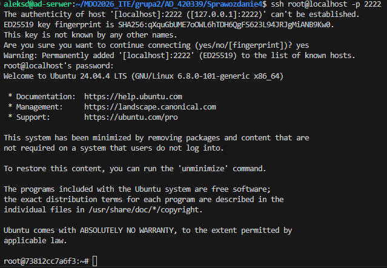

3. Zalety i wady SSH w kontenerze:
- Zalety:
  - wygoda - obsługa przez standardowe narzędzia, np PuTTY
  - łatwa praca zdalna w vs code bezpośrednio wewnątrz kontenera
  - proste przesyłanie danych protokołem SCP/SFTP

- Wady:
  - ciężki konetner - dodatkowy proces sshd zużywa ram i powiększa obraz
  - mniejsze bezpieczeństwo ponieważ otwarcie portu 22 to dodatkowy punkt ataku
  - antywzorzec, lepiej jak jest jeden kontener = jedna usługa

- Przypadki użycia:
  - stare aplikacje wymagające SFTP do wymiany danych
  - izolowane środowiska programistyczne dostępne przez sieć
  - nauka administracji Linuxem w bezpiecznym środowisku

Na codzień lepiej używać docker exec. SSH jest dobre do nauki

## Przygotowałam do uruchomienia serwer Jenkins
1. Zapoznałam się z dokumentacją serwera CI Jenkins. Jenkins to serwer automatyzacji, którego zadaniem jest pobranie kodu, przetestowanie go i zbudowanie gotowej aplikacji.

2. Przeprowadziłam instalację skonteneryzowanej instancji z pomocnikiem DIND. DIND (Docker-in-Docker) to kontener pomocnik Jenkinsa, który udostępnia mu silnik Dockera, ponieważ Jenkins działa w kontenerze i cześtwo musi budować obrazy Dockera.
Utworzyłam sieć dla Jenkinsa, uruchomiłam pomocnika DinD:
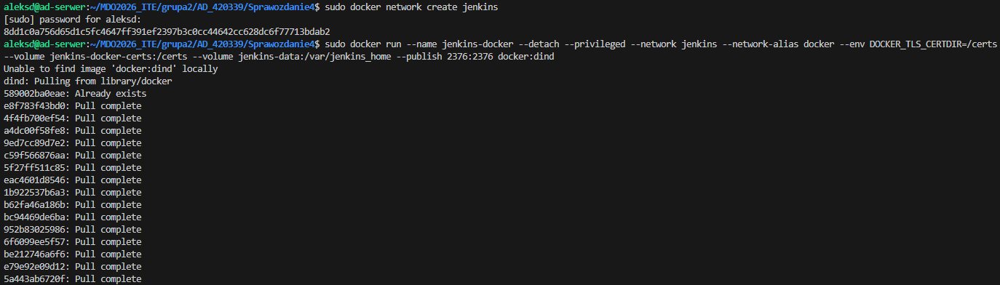

a nastęnie uruchomiłam właściwego Jenkinsa:
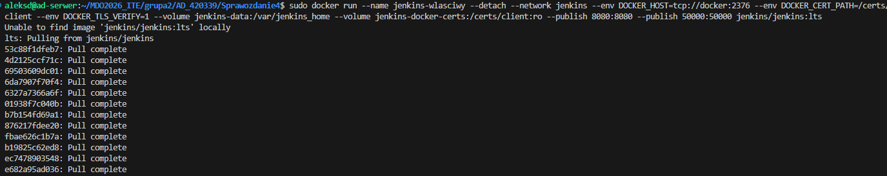

3. Działające kontenery i ekran logowania:
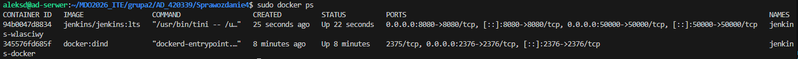

Dodałam port do panelu vs code i zobaczyłam ekran logowania Jenkins:
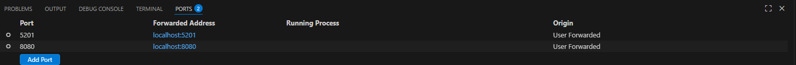
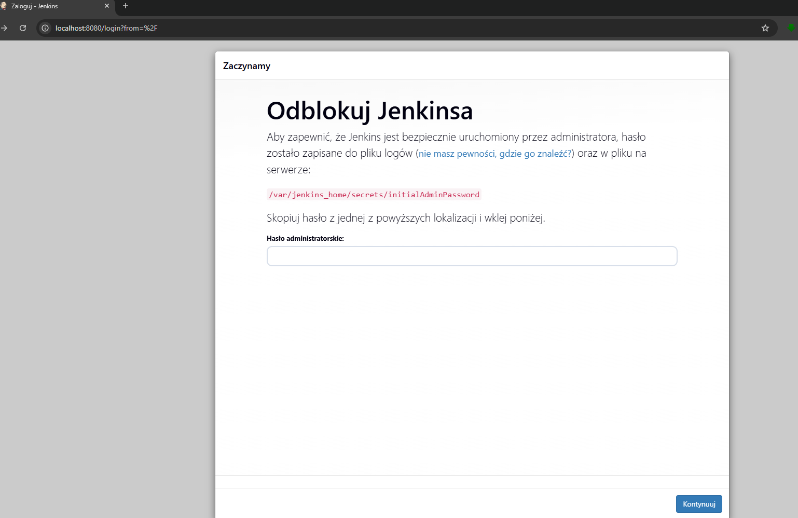


Polecenie history z jednego głównie używanego terminala:
```bash
253  mkdir Sprawozdanie4
  254  ls
  255  cd Sprawozdanie4
  256  ls
  257  cd Sprawozdanie4
  258  ls
  259  git branch -a
  260  docker volume create wejscie_programu
  261  sudo docker volume create wejscie_programu
  262  sudo docker volume create wyjscie_build
  263  pwd
  264  cd ..
  265  ls
  266  cd Sprawozdanie3
  267  docker run --rm -v $(pwd):/src -v wejscie_programu:/dest busybox cp -av /src/. /dest/
  268  sudo docker run --rm -v $(pwd):/src -v wejscie_programu:/dest busybox cp -av /src/. /dest/
  269  history
  270  cd ..
  271  Sprawozdanie4
  272  cd Sprawozdanie4
  273  sudo docker run -it   -v wejscie_programu:/app_input   -v wyjscie_build:/app_output   ubuntu bash
  274  cd ..
  275  sudo docker run --rm -v $(pwd):/src -v wejscie_programu:/dest busybox cp -av /src/. /dest/
  276  ls
  277  cd MDO2026_ITE/
  278  ls
  279  sudo docker run --rm -v $(pwd):/src -v wejscie_programu:/dest busybox sh -c "rm -rf /dest/* && cp -av /src/. /dest/"
  280  history
  281  ls
  282  cd grupa2
  283  ls
  284  cd AD_420339/
  285  ls
  286  cd Sprawozdanie4
  287  sudo docker run -it   -v wejscie_programu:/app_input   -v wyjscie_build:/app_output   ubuntu bash
  288  sudo docker run -it   -v wejscie_programu:/app_input   -v wyjscie_build:/app_output   node:20 bash
  289  sudo docker run --rm -v wyjscie_build:/check busybox ls -F /check
  290  sudo docker run -it -v wejscie_programu:/app_input -v wyjscie_build:/app_output ubuntu bash
  291  docker run =it --name serwer-iperf ubuntu bash
  292  docker run -it --name serwer-iperf ubuntu bash
  293  sudo docker run -it --name serwer-iperf ubuntu bash
  294  sudo docker network create siecAD
  295  sudo docker run -it --name serwer-iperf --network siecAD ubuntu bash
  296  sudo docker rm -f serwer-iperf klient-iperf
  297  sudo docker run -it --name serwer-iperf --network siecAD ubuntu bash
  298  sudo docker rm -f serwer-iperf
  299  sudo docker run -it --name serwer-iperf -p 5201:5201 --network siecAD ubuntu bash
  300  history
  301  sudo docker run -it --name serwer-iperf -p 5201:5201 --network siecAD ubuntu bash
  302  sudo docker rm -f serwer-iperf
  303  sudo docker run -it --name serwer-iperf -p 5201:5201 --network siecAD ubuntu bash
  304  sudo docker rm -f serwer-iperf
  305  sudo docker run -it --name serwer-iperf -p 5201:5201 --network siecAD ubuntu bash
  306  sudo docker rm -f serwer-iperf
  307  sudo docker run -it --name serwer-iperf -p 5201:5201 --network siecAD ubuntu bash
  308  sudo docker logs serwer-iperf > finalny_test_sieci.log
  309  sudo docker run -it --name kontener-ssh -p 2222:22 ubuntu bash
  310  sudo docker network create jenkins
  311* sudo docker run --name jenkins-wlasciwy --detach --network jen --network jenkins --network-alias docker --env DOCKER_TLS_CERTDIR=/certs --volume jenkins-docker-certs:/certs --volume jenkins-data:/var/jenkins_home --publish 2376:2376 docker:dind
  312  sudo docker ps
  313  sudo docker run --name jenkins-wlasciwy --detach --network jenkins --env DOCKER_HOST=tcp://docker:2376 --env DOCKER_CERT_PATH=/certs/client --env DOCKER_TLS_VERIFY=1 --volume jenkins-data:/var/jenkins_home --volume jenkins-docker-certs:/certs/client:ro --publish 8080:8080 --publish 50000:50000 jenkins/jenkins:lts
  314  sudo docker ps
  315  sudo docker logs jenkins-wlasciwy
  316  history
  ```