# Sprawozdanie z lab5 - Pipeline, Jenkins, izolacja etapów
**Autor:** Aleksandra Duda, grupa 2

## Cel
Utworzenie pipeline, którego celem będzie opracowanie kroków "build-test-deploy-publish". Kroki build i test będą zbieżne z krokami wykonanymi w Dockerze.

## Przygotowanie
### Na początku utworzyłam instancję Jenkins
Najpierw upewniłam się, że działają kontenery budujące i testujące, stworzone na poprzednich zajęciach:
kontener budujący:
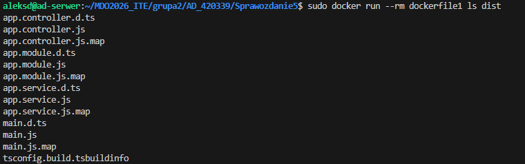
kontener testujący:
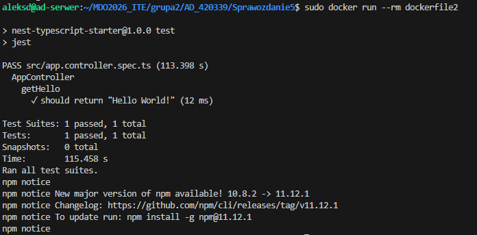
Kontener zbudowany z Dockerfile1 poprawnie generuje pliki w folderze dist, a kontener z Dockerfile2 przechodzi testy pozytywnie.

    * uruchomiłam obraz Dockera który eksponuje środowisko zagnieżdżone. Wykorzystałam do tego sieć Jenkinsa utworzoną na poprzednich zajęciach.
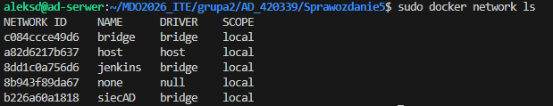
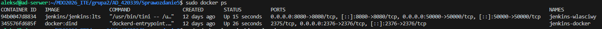

    * przygotowałam obraz blueocean na podstawie obrazu Jenkinsa.
    W pliku Dockerfile budowałam własny obraz, który ma w sobie Dockera i wtyczkę Blueocean:
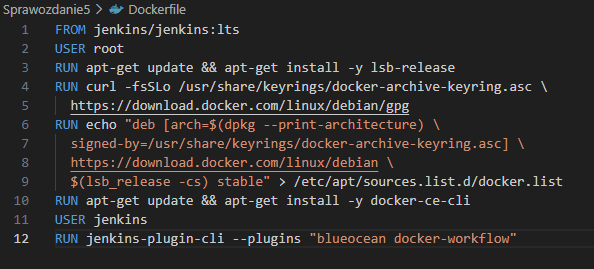

Następnie zbudowałam nowy obraz blueocean:
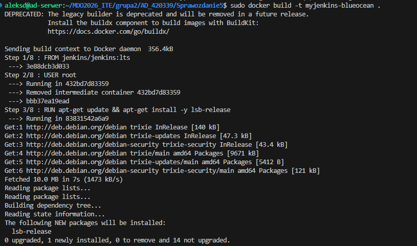

**Czym się różnią?**: standardowy obraz Jenkins jest "czysty". Nie ma zainstalowanego klienta Docker, więc nie mógłby niczego zbudować. Nie ma też interfejsu Blueocean. Nowy obraz (myjenkins-blueocean) ma natomiast doinstalowane narzędzia docker-ce-cli (dzięki czemu jenkins ma czym pracować) oraz wtyczkę Blueocean (ładny interfejs graficzny).

    * uruchomiłam Blueocean, jednocześnie uruchamiając nowy obraz łączący Jenkinsa z silnikiem dockera (jenkins-docker) za pomocą sieci i certyfikatów:
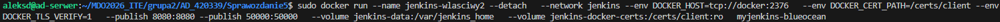

    * zalogowałam się i skonfigurowałam Jenkins
    Zapoznałam się z instrukcją instalacji Jenkinsa. Zainstalowałam sugerowane wtyczki:
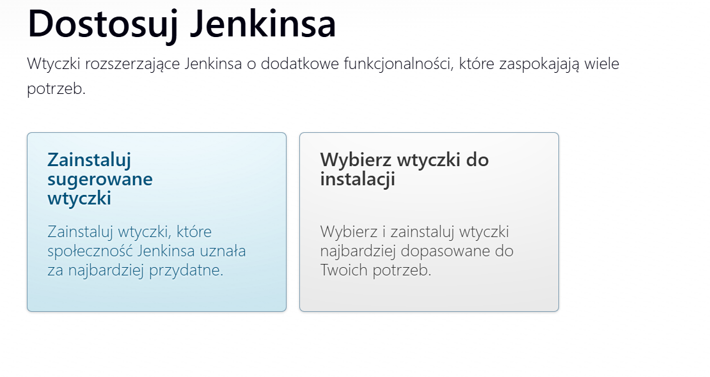
    Stworzyłam pierwszego administratora w Jenkins:
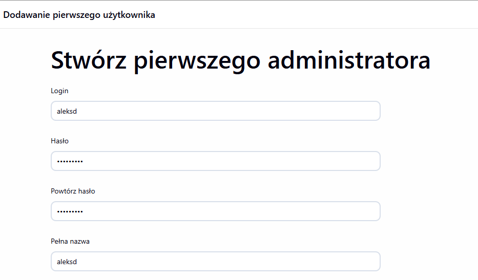
    W konfiguracji instancji ustawiłam url http://localhost:8080/
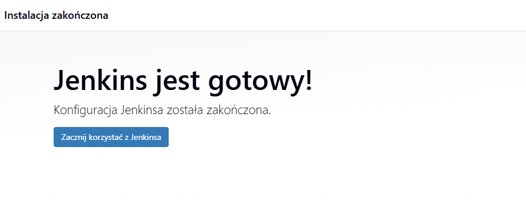

    * zadbałam o archiwizację i zabezpieczenie logów
        - zabezpieczenie na poziomie wolumenu (dzięki zewnętrznemu wolumenowi jenkins-data): zastosowałam --volume jenkins-data:/var/jenkins_home, dzięki czemu logi systemowe są fizycznie bezpieczne.
        - logi na maszynie może zobaczyć tylko administrator (konieczna komenda 'sudo')
        - logi w jenkinsie z poziomu przeglądarki może zobaczyć tylko zalogowany użytkownik
        -archiwizację zdefiniuję w skrypcie pipeline.

## Zadanie wstępne: uruchomienie
### Konfiguracja wstępna i pierwsze uruchomienie
Projekty utworzyłam jako trzy osobne projekty.
    * utworzyłam projekt, który wyświetla uname
    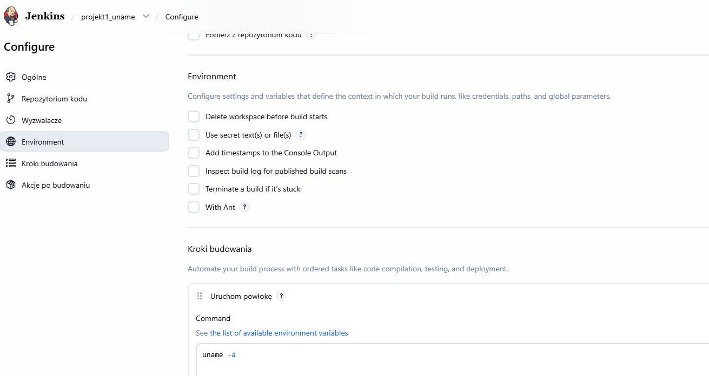
    Projekt wykonał się prawidłowo.
    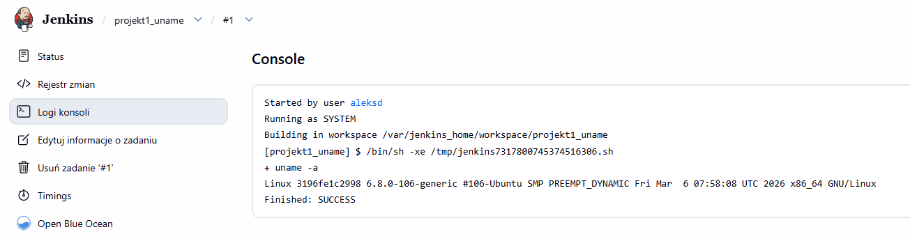
    * utworzyłam projekt, który zwraca błąd, gdy ... godzina jest nieparzysta
    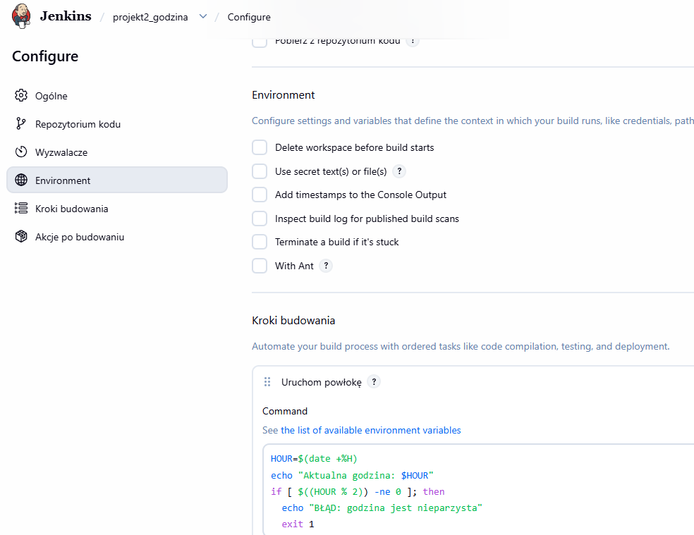
    Projekt wykonał się prawidłowo.
    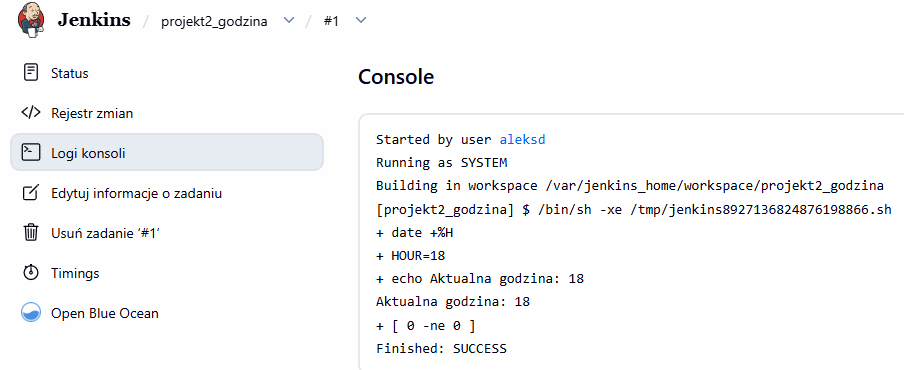
    * pobrałam w projekcie obraz kontenera ubuntu (stosując docker pull)
    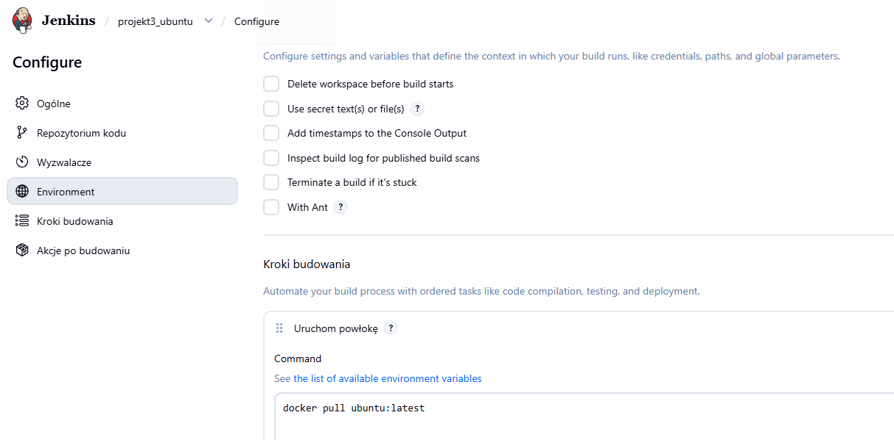
    Początkowo projekt pokazał błąd:
    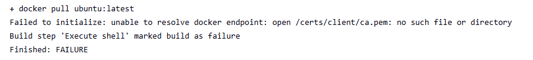
    Błąd wynikał z niewłaściwego zmapowania wolumenu z certyfikatami tls. Jenkins szukał certyfikatów w złym folderze. Wolumen zawierał już w sobie podfolder i naprawiłam błąd poprawiając punkt montowania wolumenu na -v jenkins-docker-certs:/certs:ro, dzięki czemu folder client znajdujący się wewnątrz wolumenu został zamontowany bezpośrednio pod ścieżką /certs.
    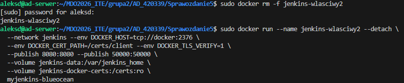
    Projekt zadziałał prawidłowo:
    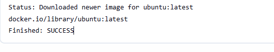
    Ten błąd nauczył mnie, że poprawna komunikacja między kontenerem Jenkins a poocniczym kontenerem DiD wymaga ścisłej korelacji między ścieżkami zdefiniowany,i w zmiennych środowiskowych a punktem montowania wolumenu certyfikatów.


## Zadanie wstępne: obiekt typu pipeline
Wykazanie działania Jenkinsa:

* Najpierw utworzyłam nowy obiekt typu pipeline
* Wpisałam treść pipeline'u bezpośrednio do obiektu, w pipeline klonowane jest repo przedmiotowe, jest robiony checkout do mojego pliku Dockerfile właściwego dla buildera wybranego w poprzednim sprawozdaniu programu
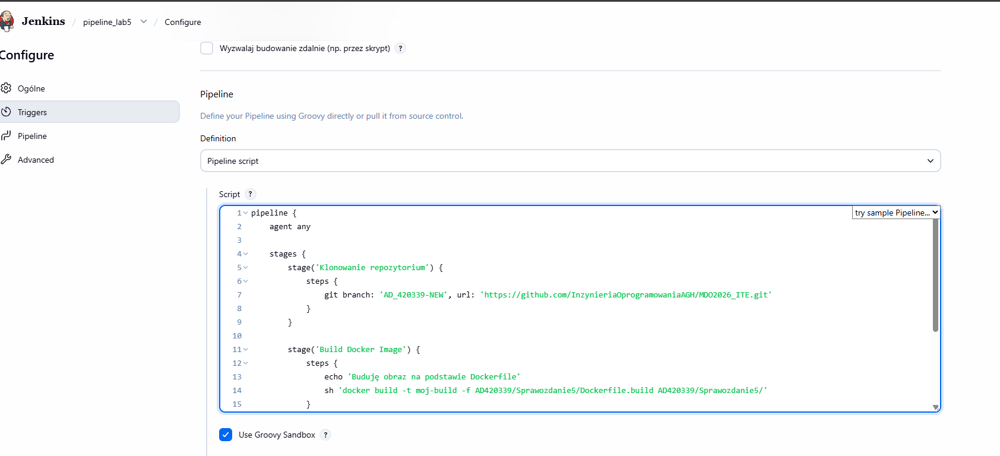
* spróbowałam zbudować Dockerfile uruchamiając pipeline. Na początku jednak skrypt nie zadziałał:
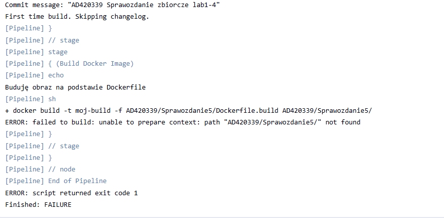
Aby Jenkins zobaczył folder 'Sprawozdanie5' musiałam go najpierw wypchać na githuba.


* Uruchomiłam stworzony pipeline drugi raz

Treść dockerfile:
```dockerfile
FROM jenkins/jenkins:lts
USER root
RUN apt-get update && apt-get install -y lsb-release
RUN curl -fsSLo /usr/share/keyrings/docker-archive-keyring.asc \
  https://download.docker.com/linux/debian/gpg
RUN echo "deb [arch=$(dpkg --print-architecture) \
  signed-by=/usr/share/keyrings/docker-archive-keyring.asc] \
  https://download.docker.com/linux/debian \
  $(lsb_release -cs) stable" > /etc/apt/sources.list.d/docker.list
RUN apt-get update && apt-get install -y docker-ce-cli
USER jenkins
RUN jenkins-plugin-cli --plugins "blueocean docker-workflow"
```

Skrypt z projektem 1 (uname):
```bash
uname -a
```

Skrypt z projektem 2 (godzina):
```bash
HOUR=$(date +%H)
echo "Aktualna godzina: $HOUR"
if [ $((HOUR % 2)) -ne 0 ]; then
  echo "BŁĄD: godzina jest nieparzysta"
  exit 1
fi
```

Skrypt z projektem 3 (ubuntu):
```bash
docker pull ubuntu:latest
```

Skrypt pipeline:
```bash
pipeline {
    agent any

    stages {
        stage('Klonowanie repozytorium') {
            steps {
                git branch: 'AD_420339-NEW', url: 'https://github.com/InzynieriaOprogramowaniaAGH/MDO2026_ITE.git'
            }
        }

        stage('Build Docker Image') {
            steps {
                echo 'Buduję obraz na podstawie Dockerfile'
                sh 'docker build -t moj-build -f AD420339/Sprawozdanie5/Dockerfile.build AD420339/Sprawozdanie5/'
            }
        }
    }
    
    post {
        success {
            echo 'Pipeline zakończony sukcesem'
        }
    }
}
```

Historia poleceń z terminala (polecenie history):
```bash

```