# Zajęcia 06 - sprawozdanie
---
**Autor:** Aleksandra Duda, grupa 2

## Pipeline: lista kontrolna
Scharakteryzuj plan na *pipeline* i przedstaw postęp prac. Czy mamy pomysł na każdy krok poniżej?

### Ścieżka krytyczna
Podstawowy zbiór czynności do wykonania w ramach zadania z pipelinem CI/CD. Ścieżką krytyczną jest:
- [x] commit (lub tzw. *manual trigger* @ Jenkins)
- [x] clone
- [x] build
- [x] test
- [x] deploy
- [x] publish

Poniższe czynności wykraczają ponad tę ścieżkę, ale zrealizowanie ich pozwala stworzyć pełny, udokumentowany, jednoznaczny i łatwy do utrzymania pipeline z niskim progiem wejścia dla nowych *maintainerów*.

Końcowy wynik:
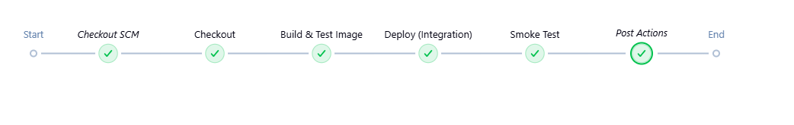

Cała ścieżka krytyczna została zaimplementowana w ramach jednego potoku CI/CD. Od budowania, Jenkins samodzielnie pobiera kod, buduje i testuje obraz Docker, a następnie wdraża go integracyjnie i publikuje logi z weryfikacji.

### Pełna lista kontrolna
Zweryfikuj dotychczasową postać sprawozdania oraz planowane czynności względem ścieżki krytycznej oraz poniższej listy. Realizacja punktu wymaga opisania czynności,
wykazania skuteczności (np. zrzut ekranu), podania poleceń i uzasadnienia decyzji dot. implementacji.

- [x] Aplikacja została wybrana
Repozytorium: https://github.com/nestjs/typescript-starter
Jest to oficjalny szablon frameworka NestJS, który nadaje się do demonstracji protokołu CI/CD dzięki wbudowanym skryptom budującym i testowym.
- [x] Licencja potwierdza możliwość swobodnego obrotu kodem na potrzeby zadania
Licencja MIT, która pozwala na swobodne kopiowanie, modyfikowanie i dystrybucję kodu.
- [x] Zdecydowano, czy jest potrzebny fork własnej kopii repozytorium
Wykonałam fork na stronie github, aby mieć własną kopie projektu, do której będę mogła poźniej pushować swoje pliki.
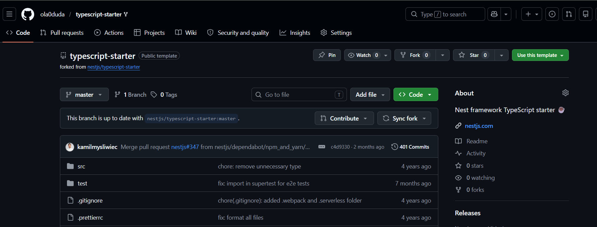
sklonowałam fork na maszynę wirtualną:
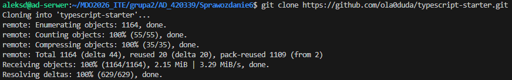
- [x] Wybrany program buduje się
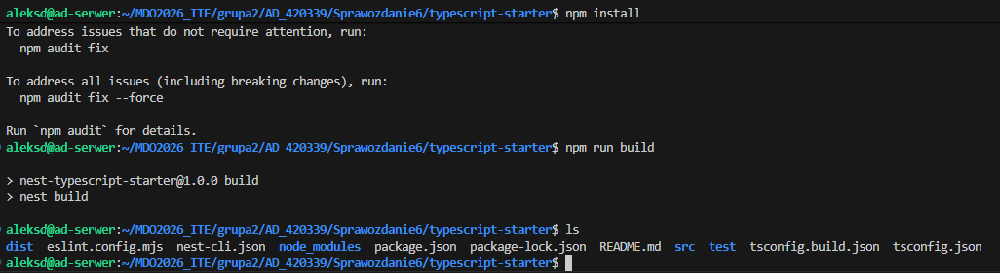
W folderze pojawił się katalog dist więc program buduje się prawidłowo.
- [x] Przechodzą dołączone do niego testy
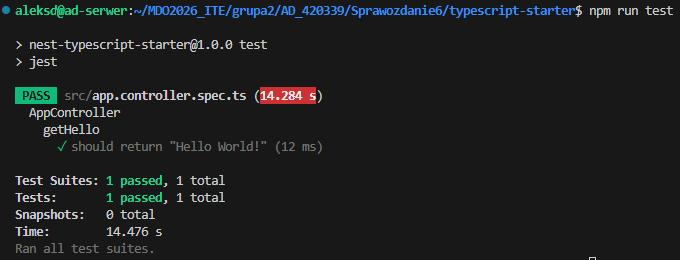
- [x] Stworzono diagram UML zawierający planowany pomysł na proces CI/CD
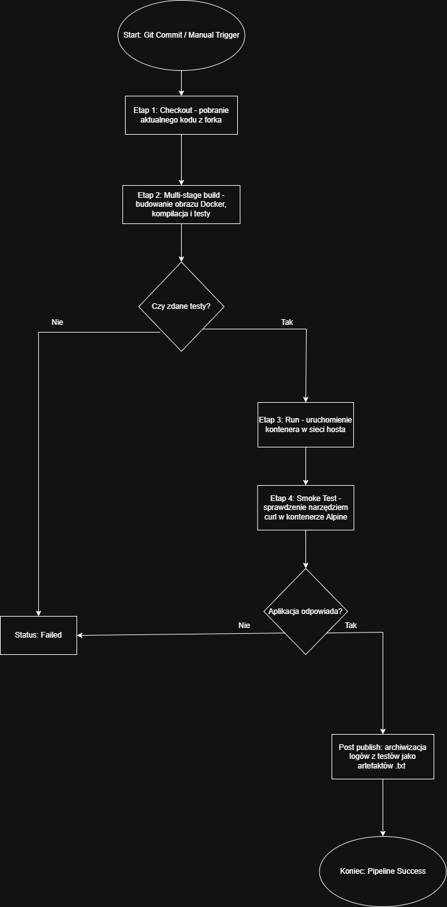
- [x] Wybrano kontener bazowy lub stworzono odpowiedni kontener wstepny (runtime dependencies)
Wybrałam oficjalny obraz node:20-alpine. Jest to obraz oparty na Alpine Linux znacznie mniejszy od standardowych obrazów, co pozwala na szybsze pobranie obrazu przez Jenkinsa i oszczędność miejsca na dysku. Obraz ten także zawiera stabilną wersję środowiska Node.js, która jest natywnym środowiskiem uruchomieniowym dla aplikacji NestJS.
-----------------------------------
- [x] *Build* został wykonany wewnątrz kontenera
- [x] Testy zostały wykonane wewnątrz kontenera (kolejnego)
- [x] Kontener testowy jest oparty o kontener build
Trzy powyższe punkty są zrealizowane za pomocą Multi-stage build, co pozwala na wykonanie wszystkich kroków w jednym pliku, zachowując izolację. Kod Dockerfile:
```dockerfile
# ETAP 1: build
FROM node:20-alpine AS build
WORKDIR /app
COPY package*.json ./
RUN npm ci
COPY . .
RUN npm run build

# ETAP 2: test
FROM build AS test
RUN npm test

# ETAP 3: runtime
FROM node:20-alpine AS runtime
WORKDIR /app
COPY --from=build /app/dist ./dist
COPY --from=build /app/node_modules ./node_modules
COPY package*.json ./

EXPOSE 3000
CMD ["node", "dist/main"]
```
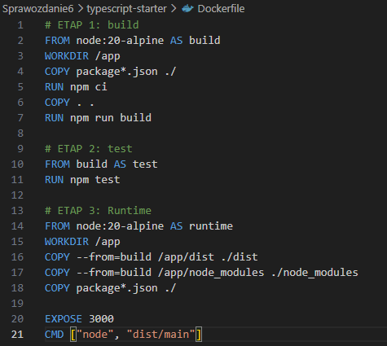

Test przeszły pomyślnie i obraz się zbudował:
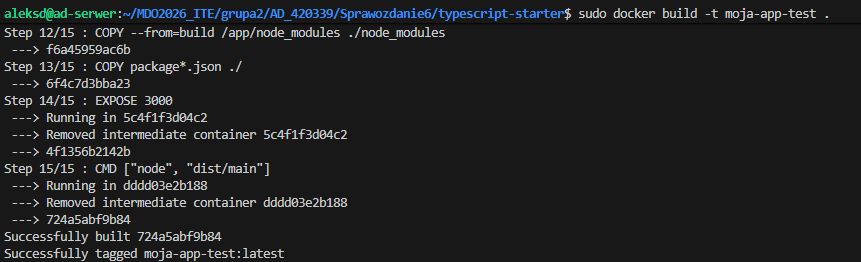

-----------------------------------

- [x] Logi z procesu są odkładane jako numerowany artefakt, niekoniecznie jawnie
- [x] Zdefiniowano kontener typu 'deploy' pełniący rolę kontenera, w którym zostanie uruchomiona aplikacja (niekoniecznie docelowo - może być tylko integracyjnie)
- [x] Uzasadniono czy kontener buildowy nadaje się do tej roli/opisano proces stworzenia nowego, specjalnie do tego przeznaczenia
W moim projekcie kontener buildowy nie nadaje się do roli produkcyjnej/wdrożeniowej, ponieważ zawiera on pełny kod źródłowy, kompilatory TypeScript oraz folder node_modules z zależnościami deweloperskimi, które zajmują dużo miejsca i zwiększają powierzchnię ataku.
Proces stworzenia nowego: stworzyłam dedykowany etap runtime (w Dockerfile), do którego kopiuję tylko skompilowany folder dist i niezbędne pakiety produkcyjne. Dzięki temu obraz końcowy jest czysty, bezpieczny i wydajny.

- [x] Wersjonowany kontener 'deploy' ze zbudowaną aplikacją jest wdrażany na instancję Dockera
- [x] Następuje weryfikacja, że aplikacja pracuje poprawnie (*smoke test*) poprzez uruchomienie kontenera 'deploy'
- [x] Zdefiniowano, jaki element ma być publikowany jako artefakt
- [x] Uzasadniono wybór: kontener z programem, plik binarny, flatpak, archiwum tar.gz, pakiet RPM/DEB
Jako główne artefakty wybrałam obraz kontenera Docker oraz logi tekstowe (.txt).
Kontener ponieważ zawiera w sobie wszystko (kod, biblioteki, system), co gwarantuje, że aplikacja zadziała tak samo na każdym serwerze.
Logi ponieważ archiwizacja logów z przebiegu budowania i smoke testu pozwala na błyskawiczną diagnostykę błędów bez konieczności wchodzenia na serwer.

- [x] Opisano proces wersjonowania artefaktu (można użyć *semantic versioning*)
Proces wersjonowania opiera się na unikalnym numerze buildu nadawanym przez Jenkinsa (${BUILD_NUMBER}). Każdy wygenerowany artefakt tekstowy oraz obraz Docker otrzymuje ten tag, co pozwala na precyzyjne powiązanie instancji z konkretnym uruchomieniem pipeline.

- [x] Dostępność artefaktu: publikacja do Rejestru online, artefakt załączony jako rezultat builda w Jenkinsie
Artefakty załączone jako rezultat builda w Jenkinsie pozwalają na szybki dostęp do wyników bezpośrednio z panelu sterowania pipelinem. Każdy build ma przypisany swój własny zestaw logów, co ułatwia kontrolę bez konieczności logowania się do zewnętrznych rejestrów.
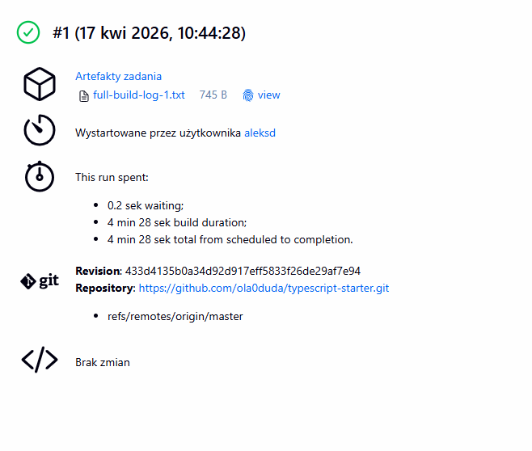

- [x] Przedstawiono sposób na zidentyfikowanie pochodzenia artefaktu
Identyfikacja pochodzenia artefaktu jest możliwa dzięki mechanizmowi fingerprint: true. Jenkins generuje sumy kontrolne dla plików, co pozwala jednoznacznie stwierdzić, z której rewizji kodu pochodzi dany log.

Wszystkie punkty od "Logi z procesu są odkładane jako numerowany artefakt, niekoniecznie jawnie" są uwzględnione w jednym pliku Jenkinsfile:
```
pipeline {
    agent any
    environment {
        IMAGE_NAME = "nestjs-app-aleksd"
        CONTAINER_NAME = "nestjs-instance"
    }
    stages {
        stage('Checkout') {
            steps {
                checkout scm
            }
        }
        stage('Build & Test Image') {
            steps {
                echo 'Budowanie i testowanie obrazu...'
                sh "docker build -t ${IMAGE_NAME}:${BUILD_NUMBER} ."
            }
        }
        stage('Deploy (Integration)') {
            steps {
                echo 'Uruchamianie kontenera do testów integracyjnych...'
                sh "docker stop ${CONTAINER_NAME} || true"
                sh "docker rm ${CONTAINER_NAME} || true"
                sh "docker run -d --name ${CONTAINER_NAME} --network host ${IMAGE_NAME}:${BUILD_NUMBER}"
            }
        }
        stage('Smoke Test') {
            steps {
                echo 'Weryfikacja działania aplikacji (smoke test)...'
                sleep 10
                sh "docker run --rm --network host alpine sh -c 'apk add --no-cache curl && curl -f http://localhost:3000'"
            }
        }
    }
    post {
        always {
            echo 'Archiwizacja logów...'
            sh "docker logs ${CONTAINER_NAME} > full-build-log-${BUILD_NUMBER}.txt"
            archiveArtifacts artifacts: "*.txt", fingerprint: true
        }
    }
}
```
-----------------------------------

Konfiguracja jenkinsa:
 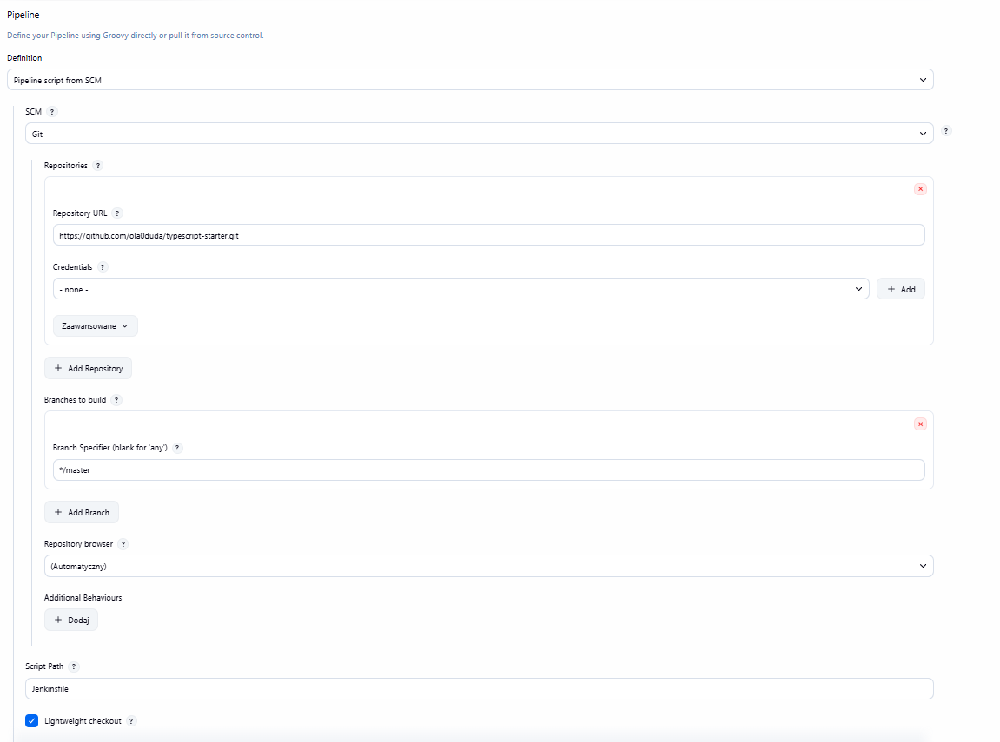

Pipeline pomyślnie przechodzi przez wszystkie etapy:
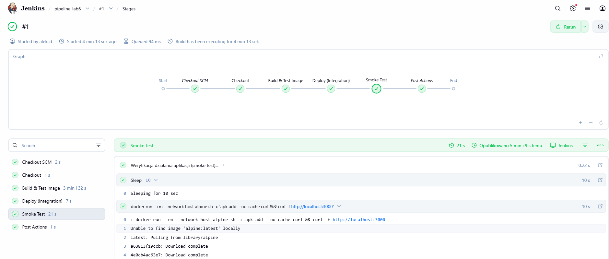
Etap build&test image potwierdził poprawność kodu i przejście testów jednostkowych wewnątrz kontenera. Etap smoke test zweryfikował dostępność usługi pod portem 3000. Etap post actions zrealizował automatyczną archiwizację logów.

- [x] Pliki Dockerfile i Jenkinsfile dostępne w sprawozdaniu w kopiowalnej postaci oraz obok sprawozdania, jako osobne pliki
- [x] Zweryfikowano potencjalną rozbieżność między zaplanowanym UML a otrzymanym efektem
Porównując diagram uml z przebiegiem potoku w Jenkins, procesy się ze sobą zgadzają. Wszystkie główne etapy zostały zrealizowane zgodnie z zaplanowaną kolejnością.

Polecenie history:
```bash
418  mkdir Sprawozdanie6
  419  cd Sprawozdanie6
  420  git branch
  421  git checkout main -- 06-Class.md
  422  git checkout main -- READMEs/06-Class.md
  423  git checkout main -- MDO2026_ITE/READMEs/06-Class.md
  424  git ls-tree -r main --name-only | grep "06-Class"
  425  git show main:READMEs/06-Class.md > sprawozdanie6.md
  426  cd ~/MDO2026_ITE/
  427  git checkout main READMEs/
  428  ls -d READMEs/
  429  cd READMEs/
  430  ls
  431  git fetch origin
  432  cd ~/MDO2026_ITE/grupa2/AD_420339/Sprawozdanie6
  433  git show origin/main:READMEs/06-Class.md > grupa2/AD_420339/Sprawozdanie6/06-Class.md
  434  git show origin/main:READMEs/06-Class.md > grupa2/AD_420339/Sprawozdanie6/README.md
  435  git checkout origin/main -- READMEs/06-Class.md
  436  cd ~/MDO2026_ITE
  437  git checkout main READMEs/
  438  git checkout origin/main -- READMEs/06-Class.md
  439  mv READMEs/06-Class.md grupa2/AD_420339/Sprawozdanie6/
  440  cd ~/MDO2026_ITE/grupa2/AD_420339/Sprawozdanie6
  441  docker ps -a
  442  sudo docker ps -a
  443  sudo docker start jenkins-docker
  444  sudo docker restart jenkins-wlasciwy2
  445  sudo docker ps
  446  git clone https://github.com/ola0duda/typescript-starter.git
  447  cd typescript-starter/
  448  npm install
  449  npm run build
  450  ls
  451  npm run test
  452  docker build -t moja-app-test .
  453  sudo docker build -t moja-app-test .
  454  git status
  455  git add .
  456  git status
  457  git commit -m "AD420339 multi-stage dockerfile"
  458  git branch
  459  git push origin master
  460  git status
  461  git reset --soft HEAD~1
  462  git status
  463  git add .
  464  git status
  465  git commit -m "Dockerfile i Jenkinsfile do potoku CI/CD"
  466  git remote set-url origin git@github.com:ola0duda/typescript-starter.git
  467  git push origin master
  468  cd ..
  469  history
```