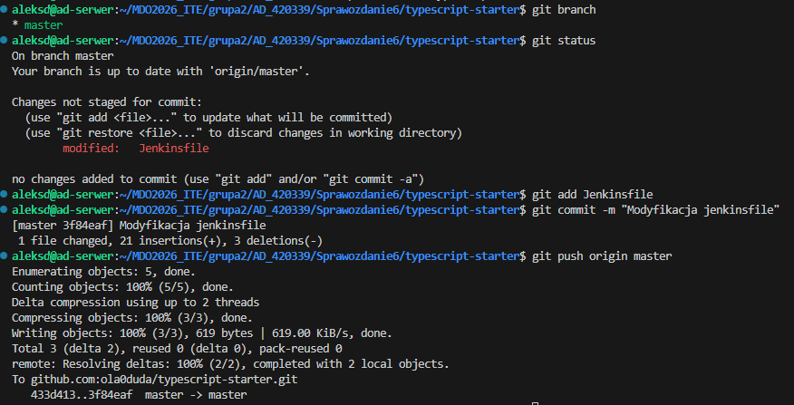
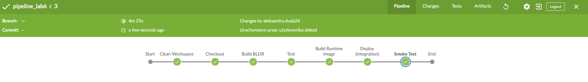
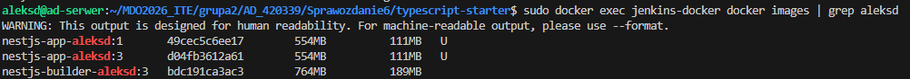
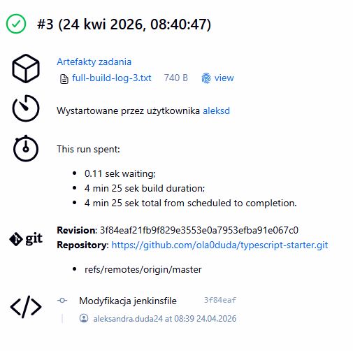
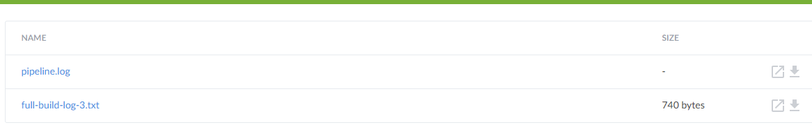

# Sprawozdanie laboratorium nr 7
**Autor:** Aleksandra Duda, grupa 2

## Cel
Celem laboratorium było przeniesienie definicji pipeline CI/CD do repozytorium kodu przy użyciu pliku Jenkinsfile. Pozwoliło to na pełną automatyzację procesu budowania, testowania i wdrożenia aplikacji w oparciu o zasady infrastruktury jako kodu (IaC).

--------------------------------------------------------------------------------------

### Przeniesienie Pipeline do SCM
Zamiast ręcznego wklejania skryptu do Jenkinsa, proces CI/CD jest teraz wersjonowany razem z kodem aplikacji. Każda zmiana w Jenkinsfile jest śledzona przez Git, co pozwala na łatwy powrót do poprzedniej wersji pipeline.


### Kroki Jenkinsfile
Zweryfikuj, czy definicja pipeline'u obecna w repozytorium pokrywa ścieżkę krytyczną:

- [x] Przepis dostarczany z SCM, a nie wklejony w Jenkinsa lub sprawozdanie (co załatwia nam `clone` )
odp: W ustawieniach w Pipeline w Jenkinsie wybrane Pipeline script from SCM. To sprawia, że clone dzieje się automatycznie na starcie (checkout scm).

- [x] Posprzątaliśmy i wiemy, że odbyło się to skutecznie - mamy pewność, że pracujemy na najnowszym (a nie *cache'owanym* kodzie)
odp: Dodałam do Jenkinsfile na sam początek etap:
```bash
stage('Clean Workspace'){
            steps {
                deleteDir() //usuwanie wszystkiego z folderu roboczego 
            }
        }
```

- [x] Etap `Build` dysponuje repozytorium i plikami `Dockerfile`
odp: Jenkinsfile i Dockerfile są w tym samym katalogu Sprawozdanie6/typescript-starter.

- [x] Etap `Build` tworzy obraz buildowy, np. `BLDR`
odp: dodany etap w Jenkinfile:
```bash
stage('Build BLDR'){
            steps {
                echo 'Budowanie obrazu budującego (BLDR)...'
                sh "docker build --target build -t ${BUILDER_IMAGE}:${BUILD_NUMBER} ."
            }
        }
```

- [x] Etap `Build` (krok w tym etapie) lub oddzielny etap (o innej nazwie), przygotowuje artefakt - **jeżeli docelowy kontener ma być odmienny**, tj. nie wywodzimy `Deploy` z obrazu `BLDR`
odp: AS runtime w Dockerfile, więc obrazy są odmienne. Obraz końcowy nie zawiera narzędzi deweloperskich i kodu źródłowego.

- [x] Etap `Test` przeprowadza testy
odp: dodałam etap:
```bash
stage('Test'){
            steps {
                echo 'Uruchamianie testów wewnątrz kontenera BLDR...'
                sh "docker run --rm ${BUILDER_IMAGE}:${BUILD_NUMBER} npm run test"
            }
        }
```

- [x] Etap `Deploy` przygotowuje **obraz lub artefakt** pod wdrożenie. W przypadku aplikacji pracującej jako kontener, powinien to być obraz z odpowiednim entrypointem. W przypadku buildu tworzącego artefakt niekoniecznie pracujący jako kontener (np. interaktywna aplikacja desktopowa), należy przesłać i uruchomić artefakt w środowisku docelowym.
odp: Tworzony jest obraz nestjs-app-aleksd.

- [x] Etap `Deploy` przeprowadza wdrożenie (start kontenera docelowego lub uruchomienie aplikacji na przeznaczonym do tego celu kontenerze sandboxowym)
odp: Zapewnione przez docker run z flagą -d i --network host.

- [x] Etap `Publish` wysyła obraz docelowy do Rejestru i/lub dodaje artefakt do historii builda
odp: Archiwizacja logów jako .txt.

- [x] Ponowne uruchomienie naszego *pipeline'u* powinno zapewniać, że pracujemy na najnowszym (a nie *cache'owanym*) kodzie. Innymi słowy, *pipeline* musi zadziałać więcej niż jeden raz 😎
odp: W pliku zapewnia to docker stop/rm.


Dockerfile (z multi-stage build):
```dockerfile
# ETAP 1: build
FROM node:20-alpine AS build
WORKDIR /app
COPY package*.json ./
RUN npm ci
COPY . .
RUN npm run build

# ETAP 2: test
FROM build AS test
RUN npm test

# ETAP 3: Runtime
FROM node:20-alpine AS runtime
WORKDIR /app
COPY --from=build /app/dist ./dist
COPY --from=build /app/node_modules ./node_modules
COPY package*.json ./

EXPOSE 3000
CMD ["node", "dist/main"]
```

Jenkinsfile:
```bash
pipeline {
    agent any
    environment {
        IMAGE_NAME = "nestjs-app-aleksd"
        BUILDER_IMAGE = "nestjs-builder-aleksd"
        CONTAINER_NAME = "nestjs-instance"
    }
    stages {
        stage('Clean Workspace'){
            steps {
                deleteDir() //usuwanie wszystkiego z folderu roboczego 
            }
        }
        stage('Checkout') {
            steps {
                checkout scm
            }
        }
        stage('Build BLDR'){
            steps {
                echo 'Budowanie obrazu budującego (BLDR)...'
                sh "docker build --target build -t ${BUILDER_IMAGE}:${BUILD_NUMBER} ."
            }
        }
        stage('Test'){
            steps {
                echo 'Uruchamianie testów wewnątrz kontenera BLDR...'
                sh "docker run --rm ${BUILDER_IMAGE}:${BUILD_NUMBER} npm run test"
            }
        }
        stage('Build Runtime Image') {
            steps {
                echo 'Przygotwanie finalnego obrazu Deploy...'
                sh "docker build --target runtime -t ${IMAGE_NAME}:${BUILD_NUMBER} ."
            }
        }
        stage('Deploy (Integration)') {
            steps {
                echo 'Uruchamianie kontenera do testów integracyjnych...'
                sh "docker stop ${CONTAINER_NAME} || true"
                sh "docker rm ${CONTAINER_NAME} || true"
                sh "docker run -d --name ${CONTAINER_NAME} --network host ${IMAGE_NAME}:${BUILD_NUMBER}"
            }
        }
        stage('Smoke Test') {
            steps {
                echo 'Weryfikacja działania aplikacji (smoke test)...'
                sleep 10
                sh "docker run --rm --network host alpine sh -c 'apk add --no-cache curl && curl -f http://localhost:3000'"
            }
        }
    }
    post {
        always {
            echo 'Archiwizacja logów...'
            sh "docker logs ${CONTAINER_NAME} > full-build-log-${BUILD_NUMBER}.txt"
            archiveArtifacts artifacts: "*.txt", fingerprint: true
        }
    }
}
```

### Weryfikacja
Po wysłaniu zmian na forka sprawdziłam, czy pipeline pomyślnie przechodzi przez wszystkie kroki:


Pipeline wykonał się prawidłowo.

### Definition of done
Na końcu pipeline powstaje możliwy do wdrożenia artefakt - obraz nestjs-app-aleksd. Jest to kompletny, skompilowany obraz zawierający środowisko Node.js, node_modules oraz zbudowaną aplikację (dist). Dowodem na to jest etap build runtime image zakończony sukcesem.



* Czy opublikowany obraz może być pobrany z Rejestru i uruchomiony w Dockerze **bez modyfikacji** (acz potencjalnie z szeregiem wymaganych parametrów, jak obraz DIND)? Nie chcemy posyłać w świat czegoś, co działa tylko u nas!
odp. Tak, obraz jest w pełni autonomiczny. Jest to spowodowane zastosowaniem EXPOSE 3000 w Dockerfile oraz CMD ["node", "dist/main"]. Każdy, kto pobierze obraz, musi wpisać tylko docker run, a aplikacja sama wie, jak się uruchomić i na jakim porcie nasłuchiwać.

* Czy dołączony do jenkinsowego przejścia artefakt, gdy pobrany, ma szansę zadziałać **od razu** na maszynie o oczekiwanej konfiguracji docelowej?
odp. Tak, w moim przypadku artefaktem są logi full-build-log-X.txt (przy tym zadaniu dokładnie full-build-log-3.txt), które pozwalają administratorowi na natychmiastową weryfikację stanu aplikacji bez konieczności logowania się na serwer przez SSH. 
Przy zapisaniu jako artefaktu obrazu np przez docker save mógłby on zostać przeniesiony na dowolną maszynę z Dockerem i uruchomiony w sekundę, zachowując 100% zgodności ze środowiskiem, w którym był testowany.



## Podsumowanie
Zrealizowany pipeline skutecznie automatyzuje cykl życia aplikacji, tworząc zoptymalizowany i bezpieczny obraz produkcyjny pozbawiony zbędnych zależności. Przeniesienie procesu do SCM oraz wdrożenie testów zapewnia wysoką powtarzalność wdrożeń i natychmiastową informację zwrotną o stanie aplikacji.

Polecenie history:
```bash
509  mkdir Sprawozdanie7
  510  cd Sprawozdanie7
  511  docker ps
  512  sudo docker ps
  513  sudo docker ps -a
  514  sudo docker start jenkins-docker
  515  sudo docker start jenkins-wlasciwy2
  516  sudo docker ps
  517  git branch
  518  git cd /home/aleksd/MDO2026_ITE/grupa2/AD_420339/Sprawozdanie6/typescript-starter
  519  cd ..
  520  cd Sprawozdanie6/typescript-starter
  521  git branch
  522  git status
  523  git add Jenkinsfile
  524  git commit -m "Modyfikacja jenkinsfile"
  525  git push origin master
  526  sudo docker images | grep aleksd
  527  sudo docker images
  528  sudo docker exec jenkins-docker docker images | grep aleksd
  529  cd ..
  530  history
```