# Sprawozdanie laboratorium nr 8
**Autor:** Aleksandra Duda, grupa 2

## Cel
Celem laboratorium była automatyzacja i zdalne wykonywanie poleceń za pomocą Ansible.

--------------------------------------------------------------------------------------

### Instalacja zarządcy Ansible
* 🌵 Utwórz drugą maszynę wirtualną o **jak najmniejszym** zbiorze zainstalowanego oprogramowania
  * Zastosuj ten sam system operacyjny, co "główna" maszyna (najlepiej też w tej samej wersji)
  * Zapewnij obecność programu `tar` i serwera OpenSSH (`sshd`)
  Obecne:
  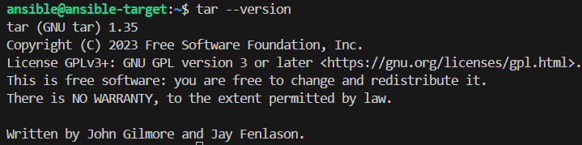
  Obecmość serwera OpenSSH jest potwierdzona faktem, że udało się zalogować zdalnie.
  * Nadaj maszynie *hostname* `ansible-target` (najlepiej jeszcze podczas instalacji)
  * Utwórz w systemie użytkownika `ansible` (najlepiej jeszcze podczas instalacji)
  * Zrób migawkę maszyny (i/lub przeprowadź jej eksport)
* 🌵 Na głównej maszynie wirtualnej (nie na tej nowej!), zainstaluj [oprogramowanie Ansible](https://docs.ansible.com/ansible/latest/installation_guide/index.html), najlepiej z repozytorium dystrybucji
* Wymień klucze SSH między użytkownikiem w głównej maszynie wirtualnej, a użytkownikiem `ansible` z nowej tak, by logowanie `ssh ansible@ansible-target` nie wymagało podania hasła

Wykonałam wszystkie wyżej wymienione zadania, potwierdzenia w postaci zrzutów ekranu:
* Maszyna wirtualna działa i jest widoczna w sieci. Serwer SSH działa, wymieniłam klucze ssh między użytkownikami i **logowanie jest bezhasłowe**, hostname to ansible-target, a użytkownik nazywa się ansible:
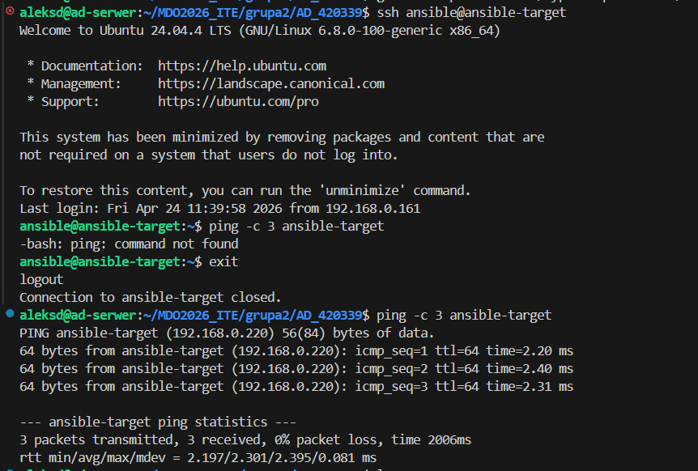
Widok z wirtualboxa, wykonana migawka:
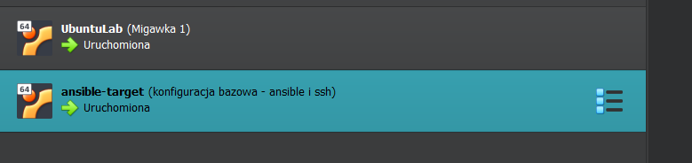
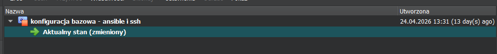
Zainstalowany ansible na głównej maszynie:
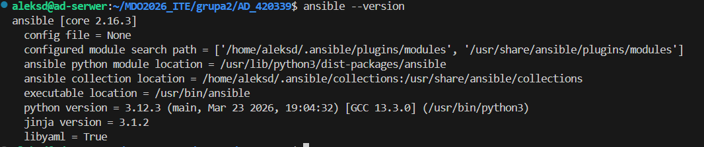
  
### Inwentaryzacja
* 🌵 Dokonaj inwentaryzacji systemów
  * Ustal przewidywalne nazwy komputerów (maszyn wirtualnych) stosując `hostnamectl`, Unikaj `localhost`.
Ustawiłam ansible-control i ansible-target:
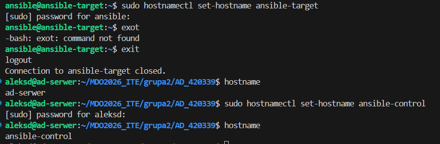

  * Wprowadź nazwy DNS dla maszyn wirtualnych, stosując `systemd-resolved` lub `resolv.conf` i `/etc/hosts` - tak, aby możliwe było wywoływanie komputerów za pomocą nazw, a nie tylko adresów IP
Po sprawdzeniu adresu ip ansible-target uzupełniłam plik /etc/hosts:
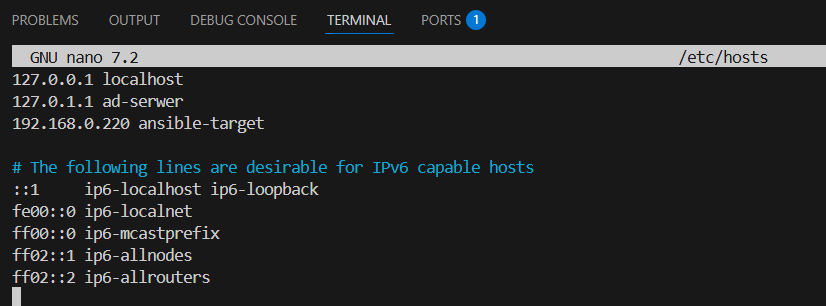
Zweryfikowałam za pomocą systemd-resolved:
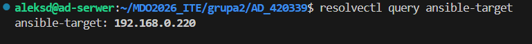
Polecenie zwróciło poprawny adres ip.

  * Zweryfikuj łączność - pakiety wracają, więc DNS działa:
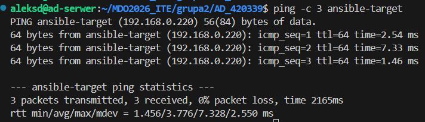

  * Stwórz [plik inwentaryzacji](https://docs.ansible.com/ansible/latest/getting_started/get_started_inventory.html)
  * Umieść w nim sekcje `Orchestrators` oraz `Endpoints`. Umieść nazwy maszyn wirtualnych w odpowiednich sekcjach
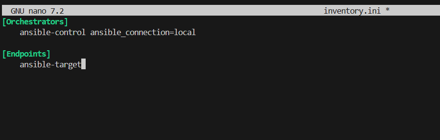

  * 🌵 Wyślij żądanie `ping` do wszystkich maszyn
Wykonało się prawidłowo:
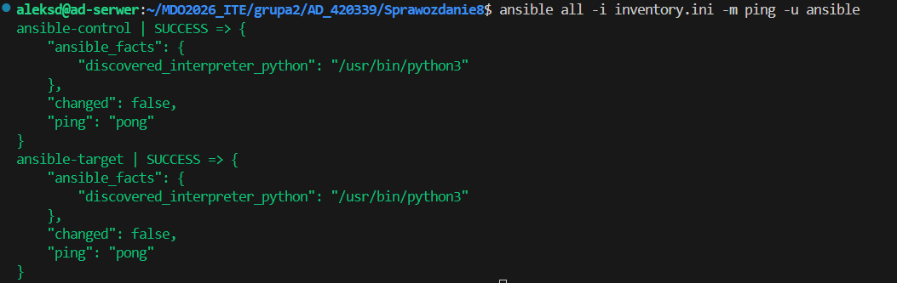

* Zapewnij łączność między maszynami
  * Użyj co najmniej dwóch maszyn wirtualnych (optymalnie: trzech)
Wykorzystuję dwie maszyny wirtualne.

  * Dokonaj wymiany kluczy między maszyną-dyrygentem, a końcówkami (`ssh-copy-id`)
Dowód na wymianę kluczy:
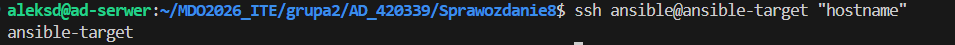

  * Upewnij się, że łączność SSH między maszynami jest możliwa i nie potrzebuje haseł
Na wcześniejszym zrzcie ekranu status success dla maszyny ansible-target potwierdza, że połączenie SSH zostało nawiązane bez bez podawania hasła, co było możliwe dzięki wcześniejszemu wykonaniu komendy ssh-copy-id (wykonałam to przed zajęciami)
  
### Zdalne wywoływanie procedur
Za pomocą [*playbooka*](https://docs.ansible.com/ansible/latest/getting_started/get_started_playbook.html) Ansible:
  * 🌵 Wyślij żądanie `ping` do wszystkich maszyn
  * Skopiuj plik inwentaryzacji na maszyny/ę `Endpoints`
Stworzyłam playbook tasks.yml:
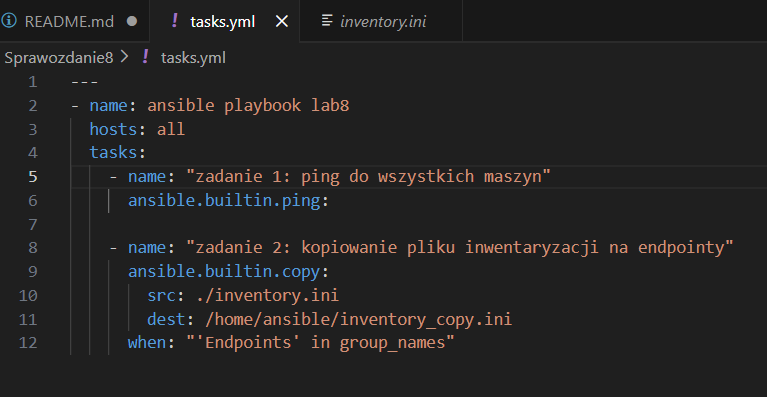
Za pierwszym razem jednak pokazał się błąd:
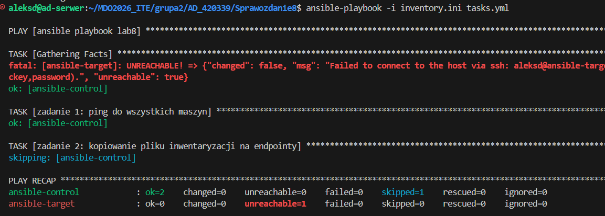
Który naprawiłam edytując plik inwenraryzacji:
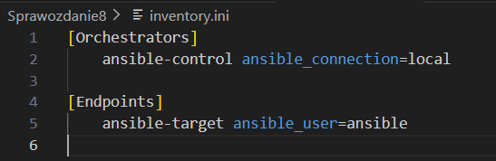
Uruchominy playbook wykonał się prawidłowo:
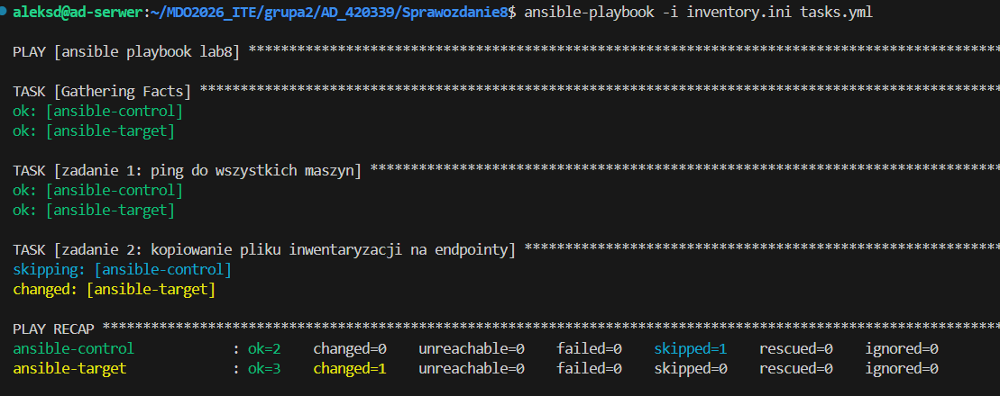

  * Ponów operację, porównaj różnice w wyjściu
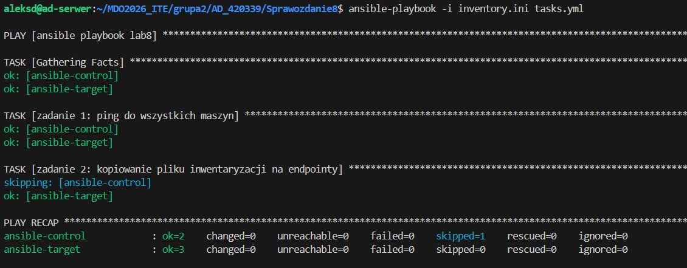
Za drugim razem widać brak changed=1, co jest efektem tego, że Ansible sprawdza czy plik w celu jest taki sam jak źródło. Jeśli tak, to nie wykonuje żadnej pracy.

  * Zaktualizuj pakiety w systemie (⚠️ [uwaga!](https://github.com/ansible/ansible/issues/84634) )
  * Zrestartuj usługi `sshd` i `rngd`
Zaktualizowałam playbook:
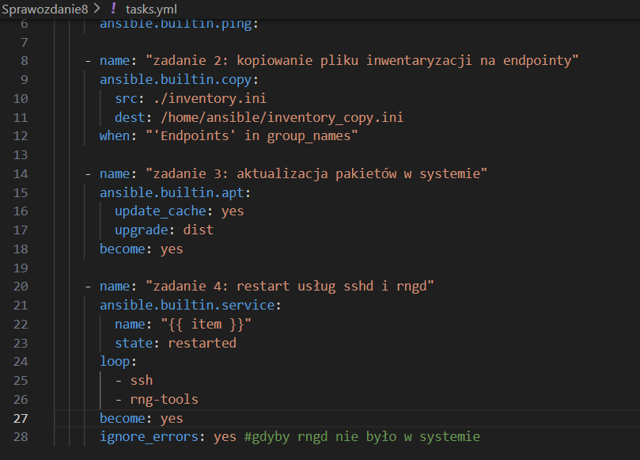

Pierwsze uruchomienie - trwało bardzo długo, ansible-target pokazało status changed, jednak dużo czasu zajęło aktualizowanie ansible-control. Musiałam zabić proces, odblokować system i zedytować playbook tak, aby endpointy dotyczyly tylko maszyny ansible-target.
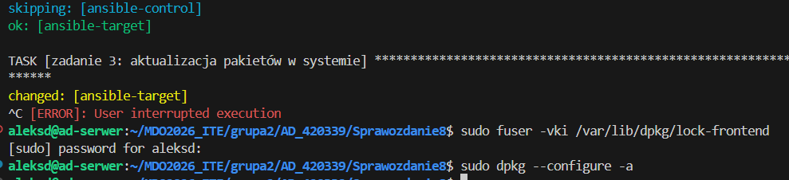
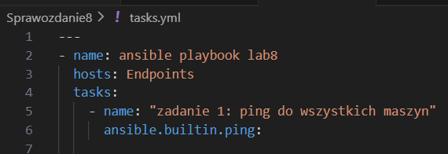

Drugie uruchomienie - ansible pominął moją maszynę ansibe-control i zajął się jedynie ansible-target. Ponieważ ansible-target już się wcześniej zaktualizował, zobaczyłam szybko wynik działania playbooka:
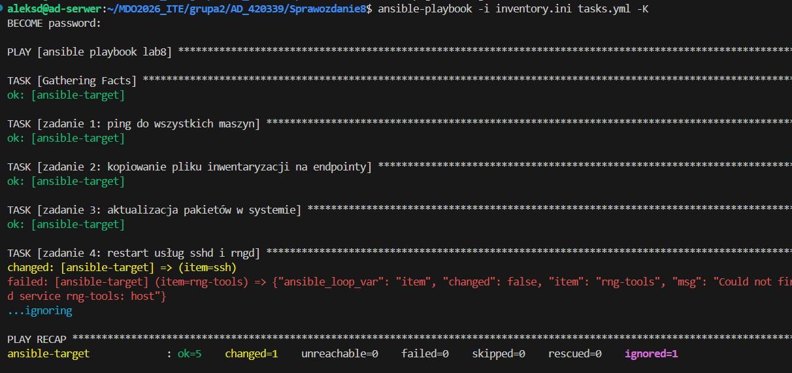
Usługa SSH została pomyślnie zrestartowana, failed=0 - playbook zakończony sukcesem.

Zaktualizowałam jednak playbooka i uruchomiłam go jeszcze raz tak, aby instalował i akrualizował też rng:
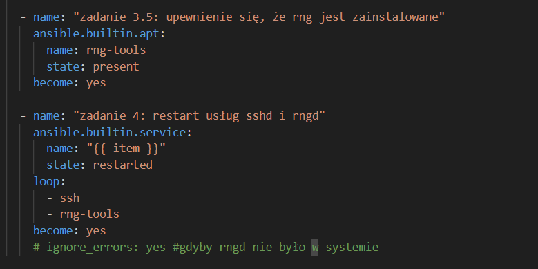

**Pełny sukces**:
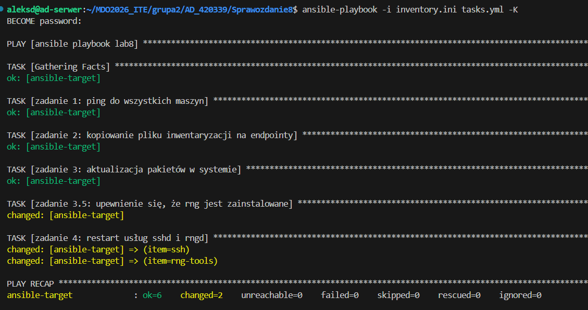

  * Przeprowadź operacje względem maszyny z wyłączonym serwerem SSH, odpiętą kartą sieciową
Na ansible-target wyłączyłam serwer SSH:
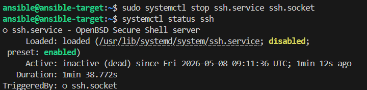

Uruchomiłam playbooka ponownie:
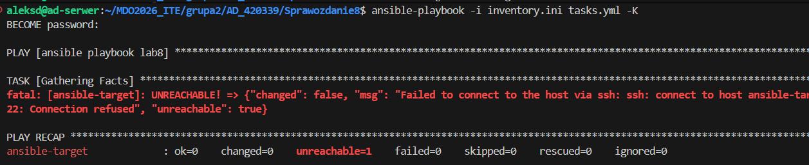
Zgodnie z założeniami ansible-target jest nieosiągalny.

W ustawieniach sieci ansible-target odłączyłam kartę sieciową i uruchomiłam playbooka:
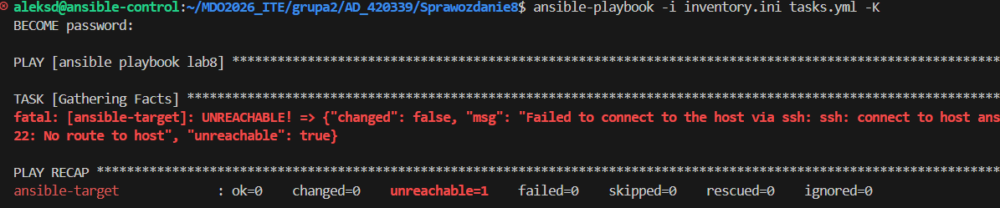
Ponownie ansible-target jest unreachable.

Po wykonanym zadaniu z powrotem podłącztłam kartę sieciową i włączyłam serwer SSH.
  
### Zarządzanie stworzonym artefaktem
Z uwagi na brak zewnętrznego rejestru obrazów (Docker Hub), zrealizowałam krok Publish poprzez eksport obrazu do archiwum .tar (docker save). Plik ten stanowi artefakt wdrożeniowy, który jest przesyłany na maszynę docelową, a następnie importowany do lokalnego silnika Docker (docker load). To alternatywna metoda dystrybucji obrazów w środowiskach izolowanych.

Najpierw przygotowałam artefakt (krok publish). Dzięki temu stworzyłam przenośną wersję kontenera.
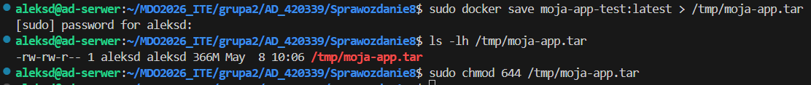

Następnie zautomatyzowałam Ansible - utworzyłam playbook deploy_flat.yml, zgodny z wymaganiami z instrukcji:
```bash
- name: zarządzanie artefaktem i wdrożenie
  hosts: Endpoints
  become: true
  tasks:

    # 1. sanity check
    - name: "Sanity check: sprawdzenie wolnego miejsca"
      ansible.builtin.shell: "df -h / | awk 'NR==2 {print $4}'"
      register: disk_space
      ignore_errors: yes

    - name: "Wynik Sanity Check"
      ansible.builtin.debug:
        msg: "Dostępne miejsce na Target: {{ disk_space.stdout }}. Kontynuuję..."

    # 2. instalacja dockera
    - name: "Instalacja pakietów bazowych i python3-docker"
      ansible.builtin.apt:
        name: [ca-certificates, curl, gnupg, python3-docker]
        state: present
        update_cache: yes

    - name: "Konfiguracja repozytorium Dockera"
      block:
        - name: Katalog na klucze
          ansible.builtin.file: { path: /etc/apt/keyrings, state: directory, mode: '0755' }
        - name: Pobierz klucz GPG
          ansible.builtin.get_url: { url: "https://download.docker.com/linux/ubuntu/gpg", dest: "/etc/apt/keyrings/docker.asc" }
        - name: Dodaj repo
          ansible.builtin.apt_repository:
            repo: "deb [arch=amd64 signed-by=/etc/apt/keyrings/docker.asc] https://download.docker.com/linux/ubuntu {{ ansible_distribution_release }} stable"
            state: present

    - name: "Instalacja Docker Engine"
      ansible.builtin.apt:
        name: [docker-ce, docker-ce-cli, containerd.io]
        state: present

    # 3. wdrożenie artefaktu (Deploy)
    - name: "Przesłanie artefaktu (.tar) z /tmp/ sterującej na /tmp/ docelowej"
      ansible.builtin.copy:
        src: /tmp/moja-app.tar
        dest: /tmp/moja-app.tar
        mode: '0644'

    - name: "Załadowanie obrazu do Dockera na Target"
      ansible.builtin.shell: "docker load < /tmp/moja-app.tar"

    - name: "Uruchomienie kontenera aplikacji"
      community.docker.docker_container:
        name: moja-aplikacja-final
        image: moja-app-test:latest
        state: started
        restart_policy: always
        published_ports:
          - "3000:3000"

    # 4. weryfikacja łączności
    - name: "Weryfikacja: Czy aplikacja odpowiada na porcie 3000?"
      ansible.builtin.uri:
        url: "http://localhost:3000"
        status_code: 200
      register: result
      until: result.status == 200
      retries: 5
      delay: 5

    # 5. oczyszczanie
    - name: "Oczyszczanie: Usunięcie pliku .tar z maszyny docelowej"
      ansible.builtin.file:
        path: /tmp/moja-app.tar
        state: absent
```

Uruchomiłam playbooka. Otrzymałam wyniki:
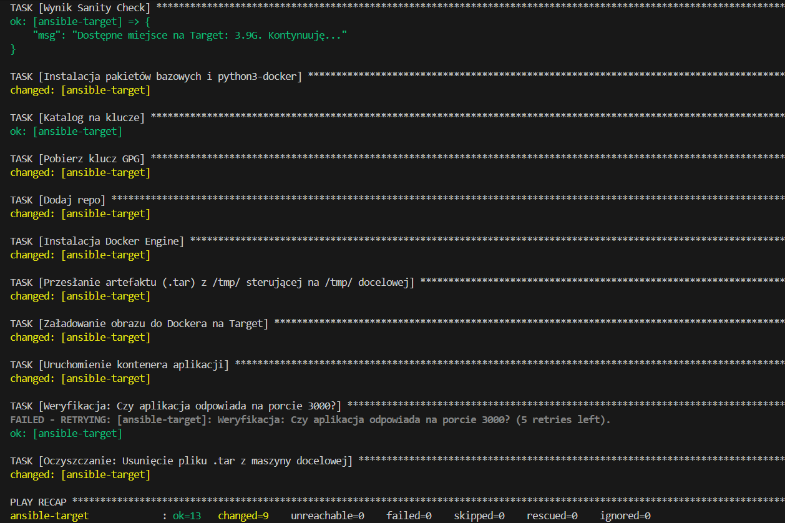

Wszystko przebiegło domyślnie.

Następnie zainicjalizowałam rolę za pomocą szkieletowania ansible-galaxy:
  * `ansible-galaxy role init <ROLE>`
  * Wypełnij poprawnie `meta/main.yml`
  * Umieść sktrukturę w naszym repozytorium GitHub

Wypełniłam zadania w deploy_app/tasks/main.yml, a następnie wypełniłam metadane w deploy_app/meta/main.yml:
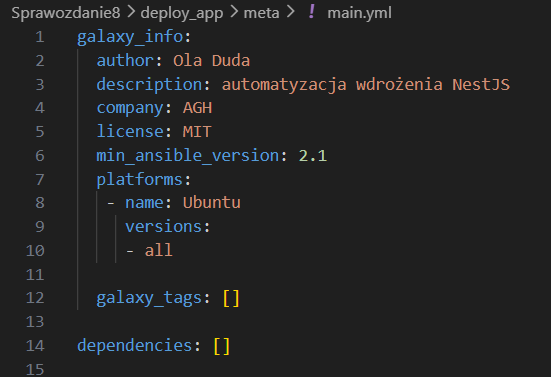

Stworzyłam plik site.yml, wywołujący tę rolę:
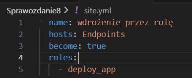

Uruchomiłam:
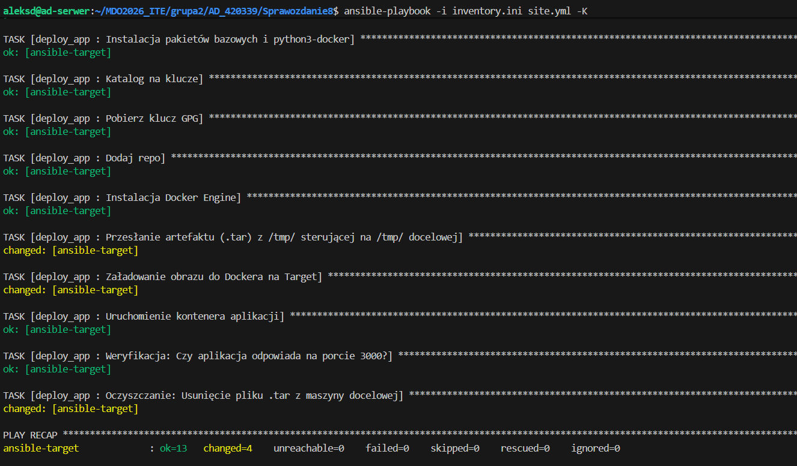

Wszystko przebiegło pomyślnie.

### Wnioski
Zastosowanie roli Ansible pozwoliło na profesjonalną strukturę kodu, oddzielającą logikę wdrożenia od metadanych i konfiguracji. Wykorzystanie artefaktu w formacie .tar umożliwiło skuteczne wdrożenie obrazu kontenera w środowisku izolowanym, bez konieczności korzystania z zewnętrznego rejestru Docker Hub. Całość procesu została w pełni zautomatyzowana, zapewniając powtarzalność instalacji środowiska Docker oraz automatyczną weryfikację dostępności aplikacji NestJS.

inventory.ini:
```bash
[Orchestrators]
    ansible-control ansible_connection=local

[Endpoints]
    ansible-target ansible_user=ansible

```

deploy_app/tasks/main.yml:
```bash
- name: "Sanity check: Sprawdzenie wolnego miejsca"
  ansible.builtin.shell: "df -h / | awk 'NR==2 {print $4}'"
  register: disk_space
  ignore_errors: yes

- name: "Wynik Sanity Check"
  ansible.builtin.debug:
    msg: "Dostępne miejsce na Target: {{ disk_space.stdout }}. Kontynuuję..."

- name: "Instalacja pakietów bazowych i python3-docker"
  ansible.builtin.apt:
    name: [ca-certificates, curl, gnupg, python3-docker]
    state: present
    update_cache: yes

- name: "Katalog na klucze"
  ansible.builtin.file: { path: /etc/apt/keyrings, state: directory, mode: '0755' }

- name: "Pobierz klucz GPG"
  ansible.builtin.get_url: { url: "https://download.docker.com/linux/ubuntu/gpg", dest: "/etc/apt/keyrings/docker.asc" }

- name: "Dodaj repo"
  ansible.builtin.apt_repository:
    repo: "deb [arch=amd64 signed-by=/etc/apt/keyrings/docker.asc] https://download.docker.com/linux/ubuntu {{ ansible_distribution_release }} stable"
    state: present

- name: "Instalacja Docker Engine"
  ansible.builtin.apt:
    name: [docker-ce, docker-ce-cli, containerd.io]
    state: present

- name: "Przesłanie artefaktu (.tar) z /tmp/ sterującej na /tmp/ docelowej"
  ansible.builtin.copy:
    src: /tmp/moja-app.tar
    dest: /tmp/moja-app.tar
    mode: '0644'

- name: "Załadowanie obrazu do Dockera na Target"
  ansible.builtin.shell: "docker load < /tmp/moja-app.tar"

- name: "Uruchomienie kontenera aplikacji"
  community.docker.docker_container:
    name: moja-aplikacja-final
    image: moja-app-test:latest
    state: started
    restart_policy: always
    published_ports:
      - "3000:3000"

- name: "Weryfikacja: Czy aplikacja odpowiada na porcie 3000?"
  ansible.builtin.uri:
    url: "http://localhost:3000"
    status_code: 200
  register: result
  until: result.status == 200
  retries: 5
  delay: 5

- name: "Oczyszczanie: Usunięcie pliku .tar z maszyny docelowej"
  ansible.builtin.file:
    path: /tmp/moja-app.tar
    state: absent
```

deploy_app/meta/main.yml:
```bash
galaxy_info:
  author: Ola Duda
  description: automatyzacja wdrożenia NestJS
  company: AGH
  license: MIT
  min_ansible_version: 2.1
  platforms:
   - name: Ubuntu
     versions:
     - all

  galaxy_tags: []

dependencies: []

```

site.yml:
```bash
- name: wdrożenie przez rolę
  hosts: Endpoints
  become: true
  roles:
    - deploy_app
```

