# Sprawozdanie laboratorium nr 9
**Autor:** Aleksandra Duda, grupa 2

## Cel
Celem laboratorium było utworzenie źródła instalacji nienadzorowanej dla systemu operacyjnego hostującego oprogramowanie oraz przeprowadzenie instalacji systemu, który po uruchomieniu rozpocznie hostowanie programu.

-------------------------------------------------------------

## Zadania do wykonania

🌵 Przeprowadź instalację nienadzorowaną systemu Fedora z pliku odpowiedzi z naszego repozytorium

* Zainstaluj [system Fedora](https://download.fedoraproject.org/pub/fedora/linux/releases/)
  * zastosuj instalator sieciowy (*Everything Netinst*)
Odp. Wybrałam tą wersję, ze względu na mniejsze użycie pamięci komputera. Zainstalowałam Fedora Server 44.
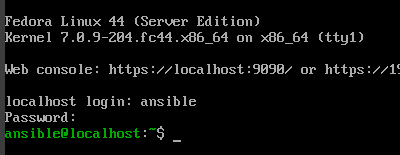

* Pobierz plik odpowiedzi `/root/anaconda-ks.cfg`
Z powodu ograniczeń konta użytkownika 'ansible' przy zdalnym połączeniu, przeniosłam plik odpowiedzi do folderu /home/ansible/ks.cfg
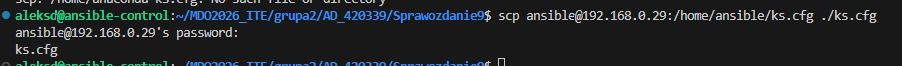

* Zapoznaj się z [dokumentacją pliku odpowiedzi](https://pykickstart.readthedocs.io/en/latest/kickstart-docs.html) i zmodyfikuj swój plik:
  * Plik odpowiedzi może nie zawierać wzmianek na temat potrzebnych repozytoriów. Jeżeli Twoja płyta instalacyjna nie zawiera pakietów, dodaj wzmiankę o repozytoriach skąd je pobrać. Na przykład, dla systemu Fedora 38:
      * `url --mirrorlist=http://mirrors.fedoraproject.org/mirrorlist?repo=fedora-38&arch=x86_64`
      * `repo --name=update --mirrorlist=http://mirrors.fedoraproject.org/mirrorlist?repo=updates-released-f38&arch=x86_64`
  * Plik odpowiedzi może zakładać pusty dysk. Zapewnij, że zawsze będzie formatować całość, stosując `clearpart --all`
  * Ustaw *hostname* inny niż domyślny `localhost`
Wszystkie wymagania dodane:
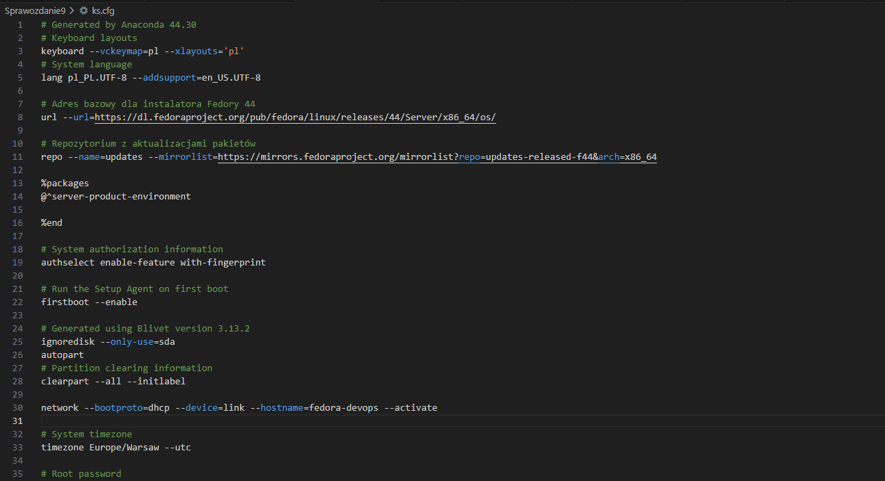


* Użyj pliku odpowiedzi do przeprowadzenia [instalacji nienadzorowanej](https://docs.fedoraproject.org/en-US/fedora/f36/install-guide/advanced/Kickstart_Installations/)
  * 🌵 Uruchom nową maszynę wirtualną z płyty ISO i wskaż instalatorowi przygotowany plik odpowiedzi stosowną dyrektywą

Wskazanie instalatorowi przygotowanego pliku odpowiedzi:
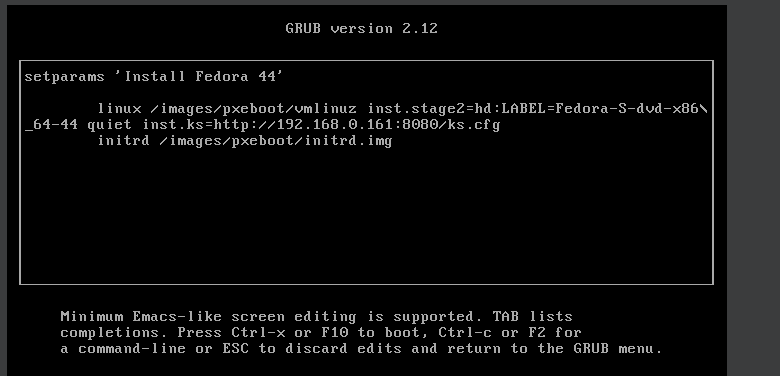
Aby instalator sieciowy pobral plik tekstowy, wykorzystałam wbudowany w Pythona mini-serwer WWW:
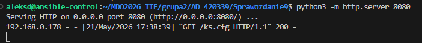
Status 200 oznacza sukces - nowa maszyna wirtualna pomyślnie połączyła się przez sieć mostkową z serwerem w Pythonie, pobrała plik ks.cfg i wykonuje instrukcje linijka po linijce.
Instalacja (wszystko wykonało się automatycznie):
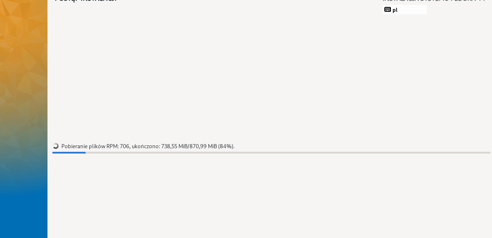
Działająca fedora:
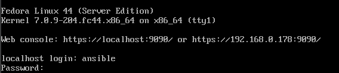

----------------------------------------------------------

Wybór mechanizmu wdrożenia: Ponieważ efektem pracy mojego pipelinu był kontener, zgodnie z instrukcją pominęłam kroki dotyczące instalacji aplikacji samodzielnej (pobieranie z Jenkinsa, konfiguracja SFTP/HTTP, instalacja dependencji systemowych). Całość środowiska oraz aplikacji została zamknięta w Dockerze. Do celów testowych i weryfikacji automatyzacji wykorzystałam oficjalny, lekki program testowy z Docker Hub o nazwie hello-world.

Zaimplementowałam pełną automatyzację procesu wdrożenia bezpośrednio w pliku konfiguracyjnym .cfg:
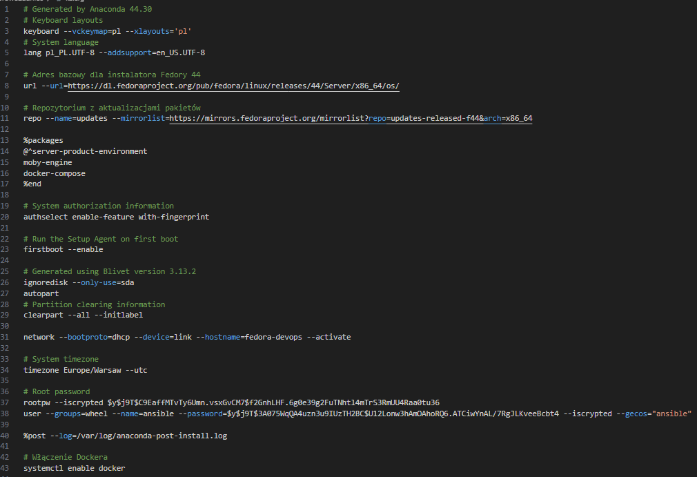
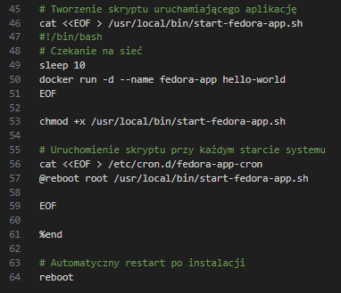

Spełnione warunki:
- w sekcji %post użyłam polecenia systemctl enable docker
- w sekcji %post utworzyłam skrypt /usr/local/bin/start-fedora-app.sh zawierający komendę docker run -d --name fedora-app hello-world (z opóźnieniem sleep 10 na podniesienie sieci)
- poprzez dopisanie @reboot do pliku /etc/crontab, zapewniłam, że od razu po pierwszym (i każdym kolejnym) uruchomieniu systemu, oprogramowanie zostanie uruchomione
- na samym końcu pliku (poza sekcją %post) dodałam dyrektywę reboot, co zapewnia automatyczny restart maszyny po zakończeniu instalacji

Ponowne utworzenie nowej maszyny Fedora z nowego, koncowego pliku .cfg:
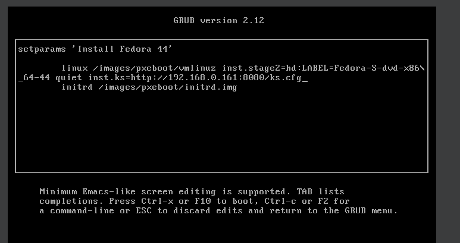

Niestety maszyna przez wiele prób nie chciała zadziałać, serwer nie mógł odczytać pliku .cfg co zauważyłam przez brak wiadomości ze statusem 200 w terminalu.

Dlatego zmieniłam adresy url i repo z https (zabezpieczonych) na http:
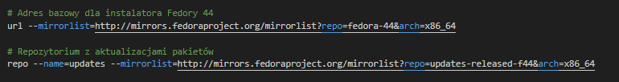
I terminal w końcu zwrócił GET z sukcesem:
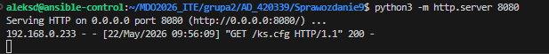
Fedora zainstalowała się i uruchomiła prawidłowo:
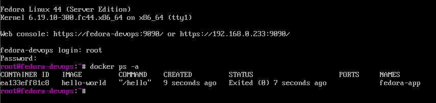

## Wnioski
Automatyczna instalacja Fedory udowodniła, że instalator sieciowy jest bardzo wrażliwy na konfigurację i wymaga czyszczenia dysku przed jego podziałem oraz stosowania linków http zamiast https. Najważniejszym wnioskiem z laboratorium jest to, że odpowiednio przygotowany plik Kickstart pozwala na postawienie kompletnego systemu od zera bez jakiegokolwiek udziału człowieka.

Finalny plik ks.cfg:
```bash
# Generated by Anaconda 44.30
# Keyboard layouts
keyboard --vckeymap=pl --xlayouts='pl'
# System language
lang pl_PL.UTF-8

# Adres bazowy dla instalatora Fedory 44
url --mirrorlist=http://mirrors.fedoraproject.org/mirrorlist?repo=fedora-44&arch=x86_64

# Repozytorium z aktualizacjami pakietów
repo --name=updates --mirrorlist=http://mirrors.fedoraproject.org/mirrorlist?repo=updates-released-f44&arch=x86_64

%packages
@^server-product-environment
moby-engine
docker-compose
%end

# System authorization information
authselect enable-feature with-fingerprint

# Run the Setup Agent on first boot
firstboot --enable

# Generated using Blivet version 3.13.2
ignoredisk --only-use=sda
autopart
# Partition clearing information
clearpart --all --initlabel

network --hostname=fedora-devops

# System timezone
timezone Europe/Warsaw --utc

# Root password
rootpw --iscrypted xxx
user --groups=wheel --name=ansible --password=xxx --iscrypted --gecos="ansible"

%post --log=/var/log/anaconda-post-install.log

# Włączenie Dockera
systemctl enable docker

# Tworzenie skryptu uruchamiającego aplikację
cat <<EOF > /usr/local/bin/start-fedora-app.sh
#!/bin/bash
# Czekanie na sieć
sleep 10
docker run -d --name fedora-app hello-world
EOF

chmod +x /usr/local/bin/start-fedora-app.sh

# Uruchomienie skryptu przy każdym starcie systemu
cat <<EOF > /etc/cron.d/fedora-app-cron
@reboot root /usr/local/bin/start-fedora-app.sh

EOF

%end

# Automatyczny restart po instalacji
reboot
```