# Sprawozdanie zbiorcze z części 1: laboratorium 1-4
**Autor:** Aleksandra Duda, grupa 2

## Cel i tematyka
W tym sprawozdaniu przedstawię w formie złączonej opis tego, co wykonałam i czego się nauczyłam na pierwszych czterech laboratoriach. Tematyka tych laboratoriów dotyczyła Gita, Gałęzi, SSH, Dockera, Dockerfiles, konteneru jako definicji etapu, instancji Jenkins.

--------------------------------------------------------------------------------------

## 1. Laboratorium 1: środowisko i kontrola wersji (Git/SSH)

### Cel
Przygotowanie i zapoznanie się ze środowiskiem do pracy.

### Konfiguracja stacji roboczej
Pierwszym etapem laboratorium było przygotowanie środowiska opartego na systemie Linux (mój wybór: Virtual Box - maszyna wirtualna) oraz integracja z edytorem VS Code. Zweryfikowałam poprawność instalacji pakietów git oraz openssh-client.

Wersje narzędzi:


### Bezpieczeństwo i SSH
Zrezygnowałam z wpisywania hasła/tokenu na rzecz kluczy asymetrycznych - wygenerowałam parę kluczy ed25519.
Klucz publiczny dodałam do profilu GitHub, co zweryfikowałam komendą ssh -T git@github.com.
Skonfigurowałam uwierzytelnianie dwuskładnikowe (2FA) za pomocą Google Authenticator, zabezpieczając dostęp do konta.

Lista kluczy:


Weryfikacja GitHub:


2FA:
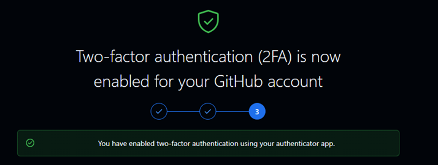

Sklonowałam repozytorium z wykorzystaniem protokołu SSH:


### Narzędzia
Skonfigurowałam dostęp do repozytorium przedmiotowego i maszyny wirtualnej w Visual Studio Code, skonfigurowałam natychmiastową wymianę plików ze środowiskiem pracy za pomocą menedżera plików FileZilla.
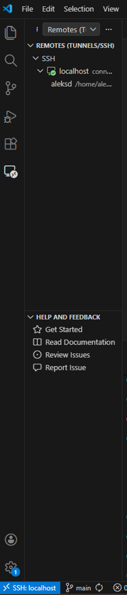


### Gałąź 
Po przełączeniu się na gałąź swojej grupy utworzyłam swoją gałąź AD420339. Na tej gałęzi rozpoczęłam pracę, zaczynając od utworzenia nowego katalogu o tej samej nazwie.


### Git Hooks
W celu wymuszenia standardów commitowania wiadomości, zaimplementowałam skrypt pre-commit (Git Hook). Skrypt korzysta z wyrażeń regularnych (regex), aby sprawdzić, czy każda wiadomość zaczyna się od mojego identyfikatora i numeru indeksu.

Treść git hooka:
```bash
#!/bin/bash

#sciezka do pliku z wiadomoscia commita
tekst=$(cat "$1")

regex="^AD420339"

if [[ ! $tekst =~ $regex ]]; then
    echo "BŁĄD: Wiadomość musi zaczynać się od inicjałów&numer_indeksu"
    exit 1
fi
```
Przeprowadziłam testy - próba commita z błędną nazwą została odrzucona przez system, natomiast poprawna przeszła pomyślnie.

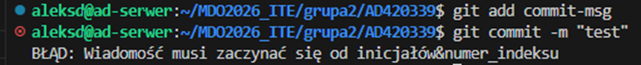


Na koniec laboratorium wysłałam zmiany na swoją gałąź i zrealizowałam pull requesta:
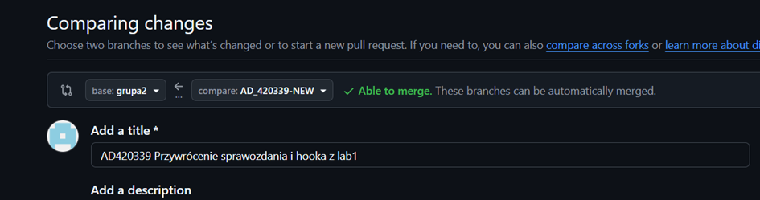
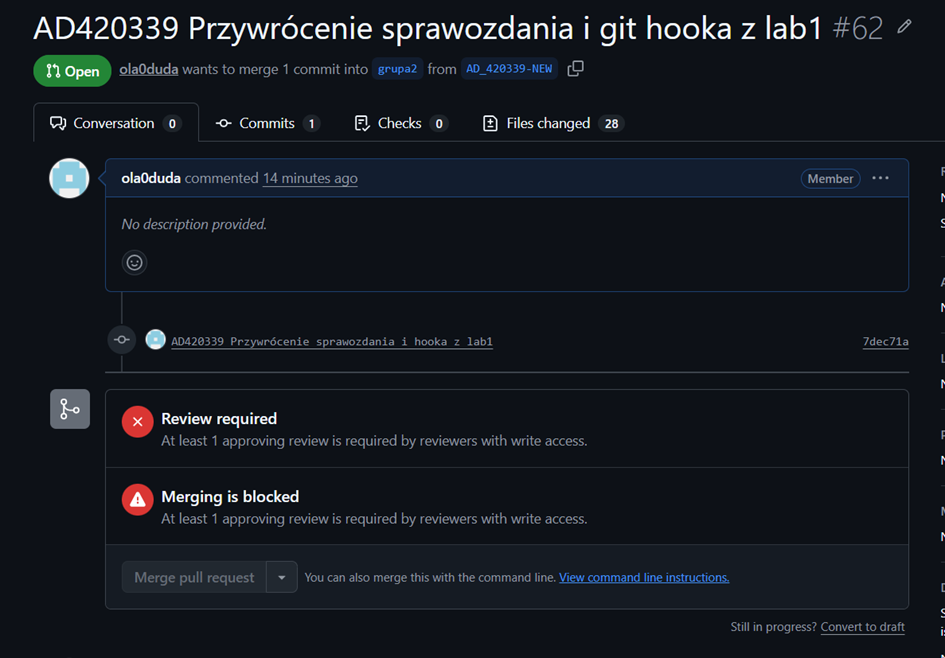

### Wnioski cząstkowe
Na zajęciach przygotowałam środowisko oparte na maszynie wirtualnej i zintegrowałam je z VS Code, co stworzyło wygodne oraz stabilne środowisko do pracy w systemie Linux. Dzięki konfiguracji kluczy SSH oraz 2FA zadbałam o wysoki poziom bezpieczeństwa, a nauka pracy na gałęziach i wdrożenie Git Hooka pozwoliły mi zrozumieć, jak automatycznie pilnować jakości i standardów w projekcie.

--------------------------------------------------------------------------------------

## 2. Laboratorium 2: architektura kontenerowa (Docker)
### Cel
Zrozumienie działania kontenerów, ich zalet i wad.

### Zarządzanie obrazami i cykl życia kontenera
Przeprowadziłam analizę porównawczą różnych obrazów bazowych pod kątem ich rozmiaru i przeznaczenia. Zaobserwowałam między innymi znaczące różnice między minimalistycznym hello-world a rozbudowanym środowiskiem .NET SDK.

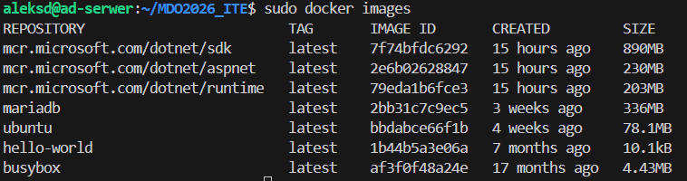

Lista kontenerów i ich kody wyjścia:
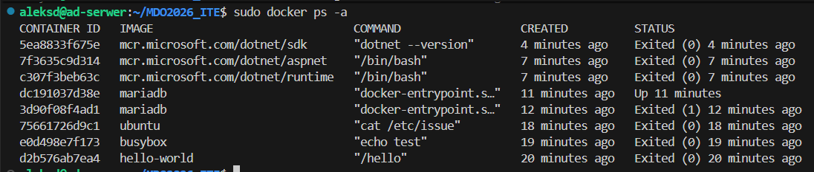

### Izolacja i Namespace
Kluczowym elementem zajęć było zrozumienie, że kontener nie jest pełnym systemem operacyjnym, a odizolowanym procesem.
	* Wewnątrz kontenera proces bash otrzymał PID 1.
	* Na hoście ten sam proces był widoczny z wysokim numerem PID, co udowodniło działanie mechanizmu PID Namespace.

PID w kontenerze:
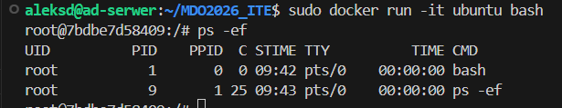

PID na hoście:
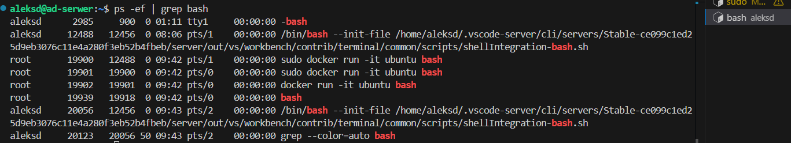

### Budowa mojego obrazu (Dockerfile)
Stworzyłam plik Dockerfile wykorzystujący obraz alpine:latest. Obraz został wzbogacony o klienta git, a proces budowania obejmował automatyczne klonowanie repozytorium do warstwy obrazu.

build:
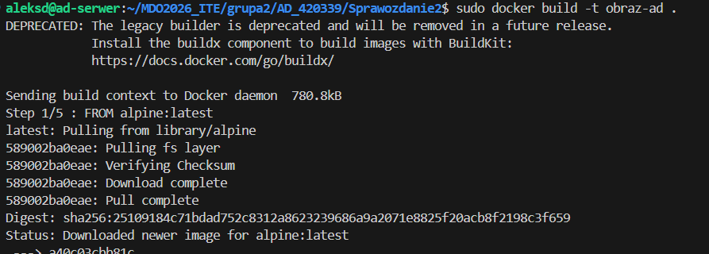

Weryfikacja zawartości:
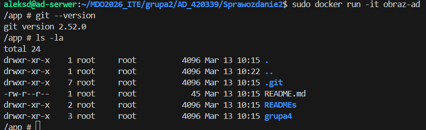

Treść Dockerfile:
```dockerfile
#lekki obraz bazowy
FROM alpine:latest

#instalacja gita i czyszczenie cache
RUN apk update && apk add --no-cache git

#ustalenie folderu roboczego
WORKDIR /app

#sklonowanie repozytorium do bieżącego folderu
RUN git clone https://github.com/InzynieriaOprogramowaniaAGH/MDO2026_ITE.git .

#domyślne polecenie po startcie kontenera - odpalanie shella, bez tego kontener by się wyłączył
CMD ["/bin/sh"]
```

### Wnioski cząstkowe
Porównanie rozmiarów obrazów pozwoliło mi zrozumieć, jak optymalnie zarządzać zasobami i kontenerami. Test z izolacją PID udowodnił w praktyce, że kontener nie jest osobnym systemem, lecz odizolowanym procesem, a stworzenie własnego pliku Dockerfile pokazało, jak skutecznie automatyzować budowę lekkich i gotowych do pracy obrazów.

--------------------------------------------------------------------------------------

## 3. Laboratorium 3: konteneryzacja procesów CI
### Cel
Zbudowanie oprogramowania w powtarzalnym środowisku CI tak, aby proces był przenośny między różnymi systemami.

### Wybór oprogramowania
Do realizacji zadań wybrałam repozytorium z kodem NestJS. Wybór ten został podyktowany spełnieniem wszystkich wymagań instrukcji: projekt udostępniany jest na licencji MIT, korzysta z menedżera npm. Posiada zdefiniowane skrypty npm run build oraz npm run test.

### Powtarzalność środowiska build
Zamiast instalować wszystko na swoim komputerze i zapełniać go programami, cały proces budowania i sprawdzania programu przeniosłam do środka kontenera (node:20-alpine). Dzięki temu miałam pewność, że program zadziała u każdego tak samo, bo ma swoje własne, czyste środowisko.

Najpierw przeprowadziłam proces ręcznie wewnątrz kontenera node:20-alpine (wybrany ze względu na lekkość i gotowe środowisko uruchomieniowe). Uruchomiłam kontener z flagami -it (interaktywne TTY), sklonowałam repozytorium i wykonałam build oraz testy.

*build nestjs:
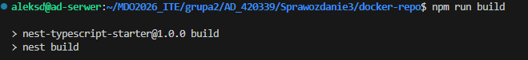

*testy jednostkowe zakończone sukcesem:
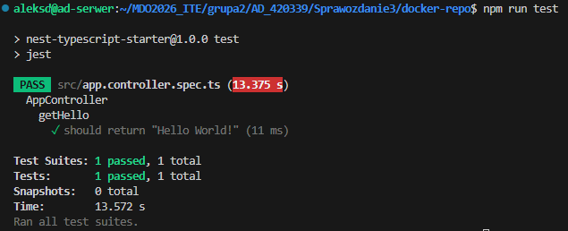

*uruchomienie kontenera node:20 (start pracy interaktywnej):
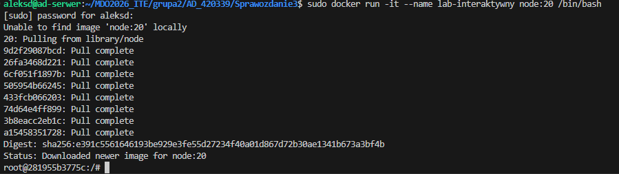

### Automatyzacja - Dockerfiles
Zautomatyzowałam proces, tworząc dwa pliki Dockerfile:
1. Dockerfile1 (build): instaluje zależności i przeprowadza kompilację kodu.
2. Dockerfile2 (test): bazuje na obrazie z pierwszego kroku i automatycznie uruchamia testy.

Budowanie obrazu z pliku Dockerfile:
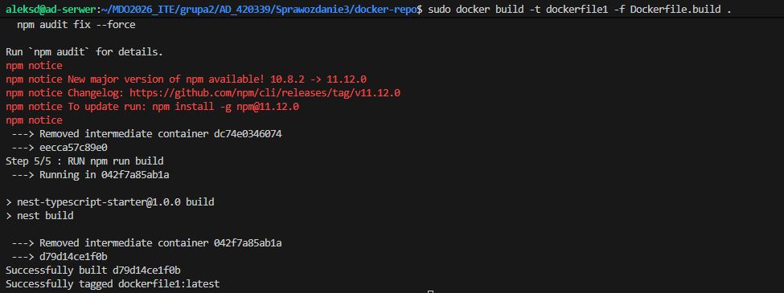

Testy zakończone sukcesem:
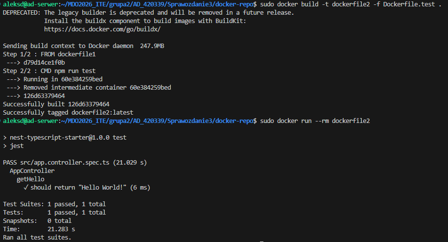

### Optymalizacja: multi-stage build
Zastosowanie dwóch etapów pozwoliło na separację zadań. Pierwszy kontener przygotował środowisko i zbudował aplikację, a drugi (bazujący na nim) zweryfikował jej poprawność za pomocą testów.
	* Wniosek: kontener wdraża się i pracuje poprawnie, co potwierdzają logi z wynikiem 1 passed.
	* Różnica między obrazem a kontenerem: obraz to statyczny, niemodyfikowalny plik na dysku opisujący jak ma działać aplikacja, natomiast kontener to uruchomiona instancja tego obrazu - żywy proces.
	* Co pracuje w kontenerze: w tym przypadku wewnątrz kontenera pracuje proces środowiska uruchomieniowego Node.js, który wykonuje skrypty testowe aplikacji NestJS. Dzięki izolacji, proces ten widzi tylko zasoby przyznane mu przez Docker, a nie całą zawartość hosta.

Treść Dockerfile1:
```dockerfile
FROM node:20-alpine

WORKDIR /app

# kopiowanie plików z ubuntu do kontenera
COPY . .

RUN npm install

RUN npm run build
```

Treść Dockerfile2:
```dockerfile
FROM dockerfile1

# cmd żeby testy ruszyły dopiero w momencie startu kontenera
CMD npm run test
```

### Wnioski cząstkowe
Laboratorium wykazało, że konteneryzacja środowiska budowania jest kluczem do powtarzalności procesów, dzięki czemu aplikacja NestJS przeszła te same kroki weryfikacji niezależnie od systemu, na którym jest uruchamiana. Rozdzielenie fazy instalacji i kompilacji od fazy testowej w Dockerfile pozwoliło na uzyskanie lekkich, wydajnych kontenerów, co znacząco podniosło poziom bezpieczeństwa i szybkość wdrażania nowych wersji oprogramowania.

--------------------------------------------------------------------------------------

## 4. Laboratorium 4: dodatkowa wiedza dotycząca kontenerów i instancja Jenkins
### Cel
Uruchomienie instancji Jenkins w środowisku skonteneryzowanym. Jenkins to serwer automatyzacji open-source, który pozwala na automatyczne budowanie, testowanie i wdrażanie kodu w ramach procesów ciągłej integracji i dostarczania (CI/CD).

### Trwałość danych (wolumeny)
Przetestowałam mechanizm wolumenów, aby oddzielić dane od cyklu życia kontenera. Przygotowałam dwa wolumeny: wejściowy (kod źródłowy) i wyjściowy (zbudowana aplikacja).
	* sposób dostarczenia kodu: wykorzystałam kontener pomocniczy z obrazem busybox, do którego podpięłam kod źródłowy z hosta za pomocą bind mount. Następnie, używając polecenia cp, skopiowałam pliki na wolumen wejściowy.
	* dlaczego: dzięki temu mój kontener bazowy pozostał czysty - nie musiał posiadać zainstalowanego Gita ani moich prywatnych kluczy SSH, a kod został dostarczony bezpośrednio na wolumen zarządzany przez Docker
	* po uruchomieniu buildu, pliki wynikowe zapisałam na wolumenie wyjściowym. Dzięki temu są one trwałe i dostępne na hostu nawet po usunięciu kontenera.


Lista plików w wolumenie po wyłączeniu kontenera:


automatyzacja: proces ten można zautomatyzować w pliku Dockerfile przy użyciu instrukcji RUN --mount=type=bind. Pozwala to na zamontowanie kodu źródłowego tylko na czas budowania obrazu, co sprawia, że finalny obraz jest lżejszy i nie zawiera zbędnych plików źródłowych.

### Analiza przepustowości sieciowej (iperf)
Przetestowałam komunikację sieciową przy użyciu narzędzia IPerf w różnych konfiguracjach.
	* dedykowana sieć mostkowa: stworzyłam własną sieć mostkową. Wykorzystałam rozwiązywanie nazw (DNS) zamiast adresów IP, dzięki czemu kontenery komunikowały się po swoich nazwach
	* kontener-kontener: najwyższa prędkość, bez narzutu fizycznej sieci. (ponad 7Gbits/sec)
	* host-kontener (port forwarding): stabilne połączenie ale z lekkim narzutem sieci
	* spoza hosta (tunel ssh): drastyczny spadek prędkości wynikający z narzutu szyfrowania tunelu VS Code oraz ograniczeń fizycznego łącza internetowego. (162 Mbits/sec)

Wynik iperf:


Konfiguracja tunelu:


### Usługi systemowe: SSHD w kontenerze
Zestawiłam usługę SSHD w kontenerze opartym na systemie Ubuntu i połączyłam się z nią zdalnie. Dokładne zalety i wady opisałam w sprawozdaniu po laboratorium, jednak najważniejsze to:
	* zalety: możliwość zarządzania kontenerem przez standardowe narzędzia (np. PuTTY), łatwy dostęp
	* wady: antywzorzec Dockerowy. SSHD zwiększa wagę obrazu, zużywa zasoby i rozszerza płaszczyznę ataku (zmniejsza bezpieczeństwo)

Dowód, że usługa działa:


### Instancja Jenkins
Zestawiłam Jenkins przy użyciu mechanizmu Docker-in-Docker (DinD). Pozwala to na uruchamianie poleceń docker build wewnątrz zadań Jenkinsa.
Zastosowałam kontener pomocniczy docker:dind, który udostępnia silnik Dockera kontenerowi Jenkinsa. Dzięki temu Jenkins może budować własne obrazy podczas wykonywania potoków (pipelines).

Utworzyłam sieć dla Jenkinsa, uruchomiłam pomocnika DinD:


a nastęnie uruchomiłam właściwego Jenkinsa:


Widoczne dwa kontenery:


Panel logowania Jenkinsa:


### Wnioski cząstkowe
Praktyka z wolumenami pokazała mi, jak trwale zapisywać dane, żeby nie znikały po usunięciu kontenera. Testy prędkości udowodniły, że sieć mostkowa jest najszybsza, a tunelowanie przez SSH mocno ogranicza transfer ze względu na szyfrowanie. Na koniec uruchomiłam Jenkinsa w trybie DinD, co pozwoliło mu na automatyczne budowanie obrazów bezpośrednio wewnątrz zadań automatyzacji.

--------------------------------------------------------------------------------------

## Wnioski końcowe
Podczas czterech laboratoriów poznałam fundamenty technologii DevOps. Wiem już, jak bezpiecznie pracować w środowisku na zajęciach (Git/SSH), jak izolować procesy za pomocą kontenerów Docker, jak zarządzać trwałymi danymi (wolumeny), oraz jak rozpocząć pracę z automatyzacją Jenkins. Jednym z najważniejszych wniosków jest fakt, że konteneryzacja nie tylko ułatwia wdrażanie, ale przede wszystkim gwarantuje spójność środowiska na każdym etapie cyklu życia oprogramowania. Dzięki temu praca nad projektami jest znacznie bardziej uporządkowana i odporna na błędy.
