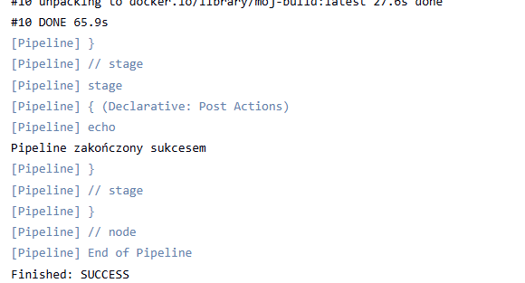
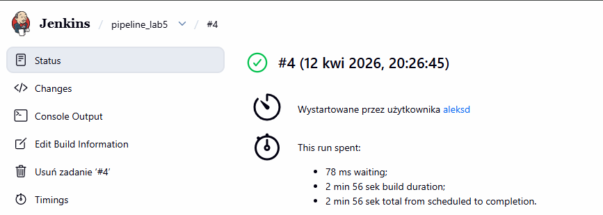
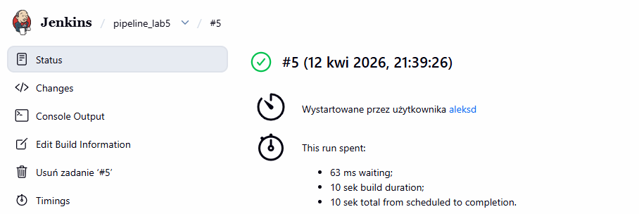
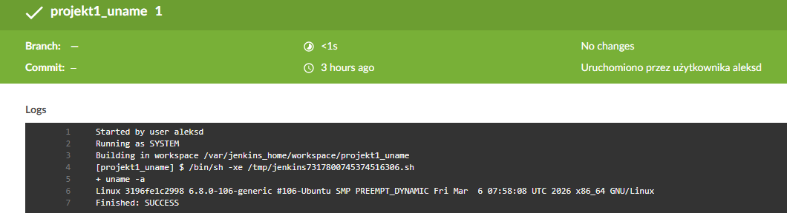
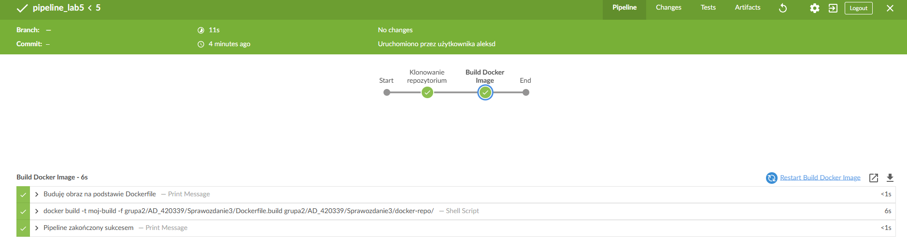

# Sprawozdanie zbiorcze z części 1: laboratorium 5-7
**Autor:** Aleksandra Duda, grupa 2

## Cel i tematyka
W tym sprawozdaniu przedstawię w formie złączonej opis tego, co wykonałam i czego się nauczyłam na trzech kolejnych laboratoriach (od 5 do 7). Tematyka tych laboratoriów dotyczyła Pipeline, Jenkins, izolacji etapów, Jenkinsfile. Głównym celem była implementacja zautomatyzowanego potoku CI/CD w środowisku Jenkins i Docker.

--------------------------------------------------------------------------------------

## Laboratorium 5: Pipeline, Jenkins, izolacja etapów

### Cel
Celem zajęć było przygotowanie kompletnego środowiska automatyzacji w architekturze Docker-in-Docker (DinD) oraz wdrożenie pierwszych zadań typu Pipeline. Zajęcia miały na celu naukę izolacji procesów budowania i testowania oraz konfiguracji serwera Jenkins w sposób trwały (z użyciem wolumenów).

1. Przygotowanie infrastruktury
**Weryfikacja kontenerów bazowych**
Przed uruchomieniem Jenkinsa sprawdziłam poprawność działania obrazów przygotowanych na wcześniejszych laboratoriach:

* Kontener budujący: poprawnie generuje artefakty w katalogu /dist.


* Kontener testujący: pomyślnie przechodzi testy jednostkowe.


**Uruchomienie Jenkins w architekturze DinD**
Proces instalacji oparłam na oficjalnej dokumentacji, wykorzystując sieć jenkins do komunikacji między kontenerami:

* Uruchomiłam kontener pomocniczy (Docker), który eksponuje środowisko zagnieżdżone.


* Przygotowałam plik Dockerfile dla obrazu myjenkins-blueocean.


**Kluczowa różnica:** Standardowy obraz Jenkins jest pozbawiony klienta Docker i wtyczki BlueOcean. Mój obraz pozwala Jenkinsowi na wydawanie poleceń silnikowi Dockera i oferuje nowoczesny interfejs graficzny.

Zbudowałam i uruchomiłam obraz, łącząc go z certyfikatami i siecią.
, 

**Konfiguracja wstępna i zabezpieczenia**
* Zainstalowałam sugerowane wtyczki:


* Utworzyłam konto administratora:


* Gotowy jenkins:


* Zabezpieczenie logów: Zastosowałam wolumen jenkins-data:/var/jenkins_home, co fizycznie separuje dane od cyklu życia kontenera. Dostęp do logów na poziomie systemu operacyjnego ograniczony jest do administratora (wymaga sudo).

2. Zadania wstępne: Projekt typu freestyle
Przetestowałam środowisko za pomocą trzech prostych projektów:

* Projekt uname: weryfikacja systemu operacyjnego agenta.
, 

* Projekt godzina: skrypt sprawdzający parzystość godziny (zwraca błąd przy nieparzystej).
, 

* projekt docker pull: pobranie obrazu Ubuntu.
, 

3. Zadanie główne: Obiekt typu Pipeline
Przeszłam do definicji procesów za pomocą skryptów Groovy (Jenkins):

* Utworzyłam nowy obiekt typu Pipeline.


* Skonfigurowałam etap klonowania repozytorium i budowania obrazu. Pierwsza próba zakończyła się błędem ze względu na nieprawidłową ścieżkę do Dockerfile względem głównego folderu repozytorium.


* Po korekcie ścieżki w skrypcie, potok zakończył się sukcesem.
, 

* Drugie uruchomienie potoku trwało znacznie krócej dzięki mechanizmowi cachowania.

* Wizualizacja przebiegu w BlueOcean:
, 

### Wnioski cząstkowe
Laboratorium 5 udowodniło, że architektura Docker-in-Docker jest kluczowa dla zachowania czystości systemu operacyjnego, pozwalając na izolację procesów budowania wewnątrz kontenerów. Zrozumiałam również, że obiekty typu Pipeline oferują znacznie lepszą wizualizację i kontrolę nad procesem niż projekty Freestyle, a mechanizm cachowania warstw Dockera skraca czas kolejnych wdrożeń. Zastosowanie zewnętrznych wolumenów dla danych Jenkinsa gwarantuje trwałość konfiguracji i bezpieczeństwo logów nawet po usunięciu instancji kontenera.

Treść dockerfile:
```dockerfile
FROM jenkins/jenkins:lts
USER root
RUN apt-get update && apt-get install -y lsb-release
RUN curl -fsSLo /usr/share/keyrings/docker-archive-keyring.asc \
  https://download.docker.com/linux/debian/gpg
RUN echo "deb [arch=$(dpkg --print-architecture) \
  signed-by=/usr/share/keyrings/docker-archive-keyring.asc] \
  https://download.docker.com/linux/debian \
  $(lsb_release -cs) stable" > /etc/apt/sources.list.d/docker.list
RUN apt-get update && apt-get install -y docker-ce-cli
USER jenkins
RUN jenkins-plugin-cli --plugins "blueocean docker-workflow"
```

Skrypt z projektem 1 (uname):
```bash
uname -a
```

Skrypt z projektem 2 (godzina):
```bash
HOUR=$(date +%H)
echo "Aktualna godzina: $HOUR"
if [ $((HOUR % 2)) -ne 0 ]; then
  echo "BŁĄD: godzina jest nieparzysta"
  exit 1
fi
```

Skrypt z projektem 3 (ubuntu):
```bash
docker pull ubuntu:latest
```

Skrypt pipeline:
```bash
pipeline {
    agent any

    stages {
        stage('Klonowanie repozytorium') {
            steps {
                git branch: 'AD_420339-NEW', url: 'https://github.com/InzynieriaOprogramowaniaAGH/MDO2026_ITE.git'
            }
        }

        stage('Build Docker Image') {
            steps {
                echo 'Buduję obraz na podstawie Dockerfile'
                sh 'docker build -t moj-build -f grupa2/AD_420339/Sprawozdanie3/Dockerfile.build grupa2/AD_420339/Sprawozdanie3/docker-repo/'
            }
        }
    }
    
    post {
        success {
            echo 'Pipeline zakończony sukcesem'
        }
    }
}
```

--------------------------------------------------------------------------------------

## Laboratorium 6: Pipeline: lista kontrolna

### Cel
Głównym celem laboratorium było zaprojektowanie i wdrożenie kompletnej ścieżki CI/CD dla aplikacji. Ulepszyłam potok poprzez zastosowanie Multi-stage builds, automatyzację testów jednostkowych i integracyjnych (smoke test) oraz proces wersjonowania i publikacji artefaktów.

1. Ścieżka krytyczna i postęp prac
W ramach laboratorium zrealizowałam pełny zbiór czynności CI/CD:

* Commit/Manual Trigger: Uruchomienie potoku w Jenkins.

* Clone: Pobranie kodu z fork repozytorium NestJS.

* Build & Test: Wykonane wewnątrz kontenerów (izolacja środowiska).

* Deploy: Wdrożenie integracyjne kontenera na instancji Dockera.

* Publish: Archiwizacja logów i obrazu jako artefaktów.

Widok końcowy pomyślnie wykonanej ścieżki:


2. Realizacja listy kontrolnej
**Wybór aplikacji i przygotowanie**
* Aplikacja: Wybrałam nestjs/typescript-starter.

* Fork i Clone: Wykonałam fork repozytorium, aby posiadać pełną kontrolę nad kodem i plikami konfiguracyjnymi.


* Weryfikacja lokalna: Potwierdziłam, że aplikacja się buduje (dist) i przechodzi testy lokalnie.


* Planowanie: Przygotowałam diagram UML procesu.


**Konteneryzacja (Multi-stage Build)**
Zastosowałam obraz node:20-alpine jako bazę. Proces budowania i testowania został w pełni odizolowany:

* Build & Test: Etap testowy opiera się bezpośrednio na etapie build, co gwarantuje spójność środowiska.


* Runtime: Stworzyłam osobny kontener wdrożeniowy, który nie zawiera kodu źródłowego ani zależności deweloperskich (minimalizacja obrazu).


**Wdrożenie i weryfikacja**

* Deploy: Aplikacja jest wdrażana na instancję Dockera w sieci hosta.

* Smoke Test: Potok automatycznie weryfikuje działanie usługi za pomocą curl po oczekiwaniu na start.

* Artefakty: Jako artefakty publikowane są logi .txt oraz obraz kontenera.

* Zastosowałam numerację buildów Jenkinsa, co zapewnia unikalność każdego artefaktu.


Dostępność artefaktów:


### Wnioski cząstkowe
Laboratorium 6 pokazało, że pipeline musi opierać się na ścisłej izolacji etapów budowania i testowania przy użyciu Multi-stage builds, co znacząco zwiększa bezpieczeństwo i wydajność obrazów. Wprowadzenie automatycznych smoke testów pozwoliło na natychmiastową weryfikację poprawności wdrożenia bez ingerencji.

Kod Dockerfile:
```dockerfile
# ETAP 1: build
FROM node:20-alpine AS build
WORKDIR /app
COPY package*.json ./
RUN npm ci
COPY . .
RUN npm run build

# ETAP 2: test
FROM build AS test
RUN npm test

# ETAP 3: runtime
FROM node:20-alpine AS runtime
WORKDIR /app
COPY --from=build /app/dist ./dist
COPY --from=build /app/node_modules ./node_modules
COPY package*.json ./

EXPOSE 3000
CMD ["node", "dist/main"]
```


Test przeszły pomyślnie i obraz się zbudował:


Jenkinsfile:
```bash
pipeline {
    agent any
    environment {
        IMAGE_NAME = "nestjs-app-aleksd"
        CONTAINER_NAME = "nestjs-instance"
    }
    stages {
        stage('Checkout') {
            steps {
                checkout scm
            }
        }
        stage('Build & Test Image') {
            steps {
                echo 'Budowanie i testowanie obrazu...'
                sh "docker build -t ${IMAGE_NAME}:${BUILD_NUMBER} ."
            }
        }
        stage('Deploy (Integration)') {
            steps {
                echo 'Uruchamianie kontenera do testów integracyjnych...'
                sh "docker stop ${CONTAINER_NAME} || true"
                sh "docker rm ${CONTAINER_NAME} || true"
                sh "docker run -d --name ${CONTAINER_NAME} --network host ${IMAGE_NAME}:${BUILD_NUMBER}"
            }
        }
        stage('Smoke Test') {
            steps {
                echo 'Weryfikacja działania aplikacji (smoke test)...'
                sleep 10
                sh "docker run --rm --network host alpine sh -c 'apk add --no-cache curl && curl -f http://localhost:3000'"
            }
        }
    }
    post {
        always {
            echo 'Archiwizacja logów...'
            sh "docker logs ${CONTAINER_NAME} > full-build-log-${BUILD_NUMBER}.txt"
            archiveArtifacts artifacts: "*.txt", fingerprint: true
        }
    }
}
```

--------------------------------------------------------------------------------------

## Laboratorium 7: Jenkinsfile: lista kontrolna

### Cel
Celem laboratorium było przeniesienie definicji potoku CI/CD bezpośrednio do repozytorium kodu przy użyciu pliku Jenkinsfile. Pozwoliło to na pełną automatyzację procesu w oparciu o zasady Infrastructure as Code (IaC), umożliwiając powtarzalność i wersjonowanie samego procesu budowania razem z kodem aplikacji.

1. Kroki Jenkinsfile i Ścieżka Krytyczna
Wdrożony potok w pełni pokrywa założoną ścieżkę krytyczną, co zweryfikowałam punkt po punkcie:

* Zmieniłam konfigurację projektu na Pipeline script from SCM. Jenkins automatycznie pobiera przepis na budowanie (Jenkinsfile) wraz z kodem.


* Dodałam etap Clean Workspace z komendą deleteDir(). Dzięki temu mam pewność, że pracuje na świeżym kodzie, a nie na pozostałościach z poprzednich buildów.

* Etap Build BLDR tworzy obraz bazowy (--target build), zawierający wszystkie zależności potrzebne do kompilacji i testów.

* Testy jednostkowe są uruchamiane wewnątrz kontenera BLDR (npm run test), co gwarantuje izolację od środowiska hosta.

* Wykorzystałam Multi-stage Build (AS runtime), aby stworzyć docelowy, lekki obraz produkcyjny, który różni się od obrazu budującego brakiem kodu źródłowego i kompilatorów.

* Etap Deploy przeprowadza start kontenera w sieci hosta (--network host). Zastosowanie docker stop/rm || true pozwala na wielokrotne uruchamianie pipeline'u bez konfliktów nazw.

* Etap post wykonuje archiwizację logów systemowych kontenera do pliku .txt.


2. Definition of Done (Weryfikacja skuteczności)
Proces uznaję za zakończony sukcesem, ponieważ na końcu pipeline'u powstaje gotowy do pracy artefakt:


* Opublikowany obraz nestjs-app-aleksd jest w pełni możliwy do wdrożenia. Dzięki instrukcjom EXPOSE 3000 i CMD w Dockerfile, może zostać pobrany i uruchomiony na dowolnej maszynie z Dockerem bez żadnych modyfikacji.

### Wnioski cząstkowe
Laboratorium 7 pokazało, że przeniesienie definicji potoku do pliku Jenkinsfile zwiększa powtarzalność i bezpieczeństwo wdrożeń, czyniąc proces CI/CD integralną częścią kodu źródłowego. Wykorzystanie etapów Clean Workspace oraz precyzyjne celowanie w etapy Dockera pozwoliło na optymalizację czasu budowania i minimalizację rozmiaru obrazów produkcyjnych. Zrozumiałam, że podejście Pipeline as Code pozwala na łatwe śledzenie historii zmian w procesie budowania, a automatyczne smoke testy i archiwizacja logów stanowią solidny fundament dla bezawaryjnych wdrożeń ciągłych.

Dockerfile (z multi-stage build):
```dockerfile
# ETAP 1: build
FROM node:20-alpine AS build
WORKDIR /app
COPY package*.json ./
RUN npm ci
COPY . .
RUN npm run build

# ETAP 2: test
FROM build AS test
RUN npm test

# ETAP 3: Runtime
FROM node:20-alpine AS runtime
WORKDIR /app
COPY --from=build /app/dist ./dist
COPY --from=build /app/node_modules ./node_modules
COPY package*.json ./

EXPOSE 3000
CMD ["node", "dist/main"]
```

Jenkinsfile:
```bash
pipeline {
    agent any
    environment {
        IMAGE_NAME = "nestjs-app-aleksd"
        BUILDER_IMAGE = "nestjs-builder-aleksd"
        CONTAINER_NAME = "nestjs-instance"
    }
    stages {
        stage('Clean Workspace'){
            steps {
                deleteDir() //usuwanie wszystkiego z folderu roboczego 
            }
        }
        stage('Checkout') {
            steps {
                checkout scm
            }
        }
        stage('Build BLDR'){
            steps {
                echo 'Budowanie obrazu budującego (BLDR)...'
                sh "docker build --target build -t ${BUILDER_IMAGE}:${BUILD_NUMBER} ."
            }
        }
        stage('Test'){
            steps {
                echo 'Uruchamianie testów wewnątrz kontenera BLDR...'
                sh "docker run --rm ${BUILDER_IMAGE}:${BUILD_NUMBER} npm run test"
            }
        }
        stage('Build Runtime Image') {
            steps {
                echo 'Przygotwanie finalnego obrazu Deploy...'
                sh "docker build --target runtime -t ${IMAGE_NAME}:${BUILD_NUMBER} ."
            }
        }
        stage('Deploy (Integration)') {
            steps {
                echo 'Uruchamianie kontenera do testów integracyjnych...'
                sh "docker stop ${CONTAINER_NAME} || true"
                sh "docker rm ${CONTAINER_NAME} || true"
                sh "docker run -d --name ${CONTAINER_NAME} --network host ${IMAGE_NAME}:${BUILD_NUMBER}"
            }
        }
        stage('Smoke Test') {
            steps {
                echo 'Weryfikacja działania aplikacji (smoke test)...'
                sleep 10
                sh "docker run --rm --network host alpine sh -c 'apk add --no-cache curl && curl -f http://localhost:3000'"
            }
        }
    }
    post {
        always {
            echo 'Archiwizacja logów...'
            sh "docker logs ${CONTAINER_NAME} > full-build-log-${BUILD_NUMBER}.txt"
            archiveArtifacts artifacts: "*.txt", fingerprint: true
        }
    }
}
```

--------------------------------------------------------------------------------------

## Wnioski końcowe
Laboratoria 5–7 pozwoliły mi przejść pełną drogę od konfiguracji serwera CI/CD, przez konteneryzację aplikacji w modelu multi-stage, aż po zaawansowaną automatyzację. Finalny system zapewnia izolację środowisk, automatyczną weryfikację jakości kodu oraz dostarczanie gotowych do pracy artefaktów w sposób powtarzalny i bezpieczny.