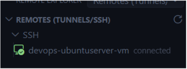
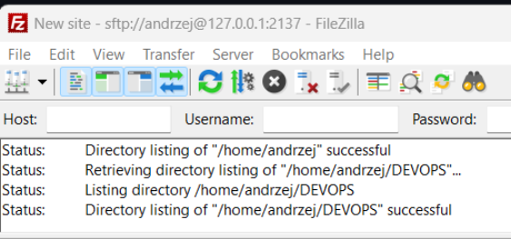
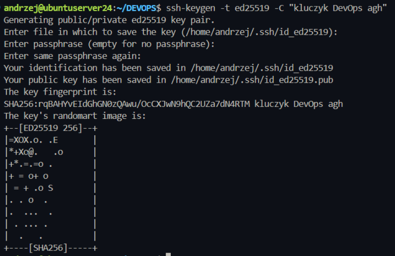
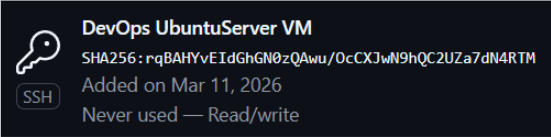
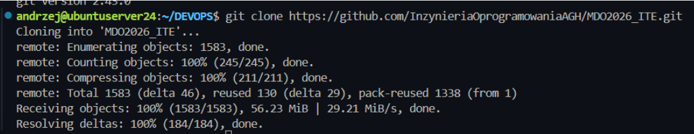
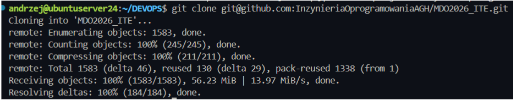
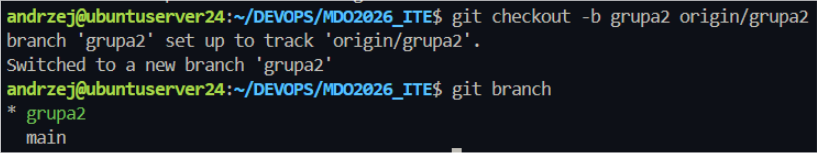
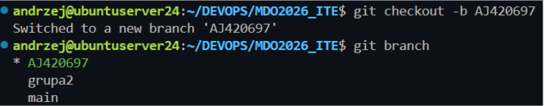
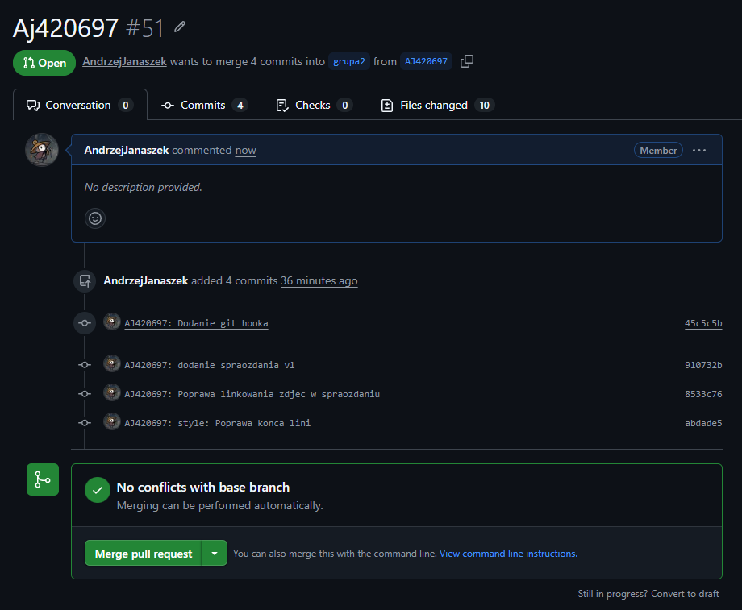

# Sprawozdanie - DevOps - Lab 1 - Andrzej Janaszek

## Narzędzia i konfiguracja:

### Konfiguracja maszyny wirtualnej
Ustawienie przekierowania portu Host:2137 na VM:22 (ssh)

#### Konfiguracja VS Code i Remote SSH (wtyczka)
Zainstalowanie wtyczki Remote SSH (Microsoft) i skonfigurowanie połączenia



### Konfiguracja połączenia SFTP w File Zilla


### Utworzenie klucza SSH i dodanie go na githubie




## Klonowanie

### Klonowanie repo HTTP


### Klonowanie repo SSH


## Branching

#### Przełączenie się na branch grupy


#### Utworzenie własnego brancha


## Git Hook

### Utworznie Git Hook'a do weryfikacji prefixu

Kod hooka
```bash
#!/bin/bash

PREFIX="AJ420697"
msg="$(cat "$1")"

if [[ $msg =~ ^$PREFIX ]]; then
    echo "[OK]: jest prefix w commit msg"
    exit 0
else
    echo "[ERROR]: Commit musi zaczynać się od prefixa inicjały i nr"
    exit 1
fi
```

## Pull Request
