# ISNTALACJA I PIERWSZE URUCHOMIENIE MINIKUBE

# 1
instalacja minikube

```
curl -LO https://storage.googleapis.com/minikube/releases/latest/minikube-latest.x86_64.rpm
sudo rpm -Uvh minikube-latest.x86_64.rpm
```

instaslacja kubectl

```
curl -LO "https://dl.k8s.io/release/$(curl -L -s https://dl.k8s.io/release/stable.txt)/bin/linux/amd64/kubectl"

chmod +x kubectl

mv kubectl /usr/local/bin/
```

poprawna isntalcja

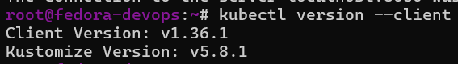

# 2

Nie powinno uruchamiać się z przywilejami roota więc tworze nowego usera

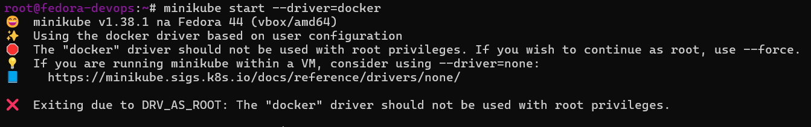

utworzenie usera `andrzej` i dodanie go do grupy dockera

```
useradd -m andrzej
passwd andrzej

usermod -aG docker andrzej
```

porpawne uruchomienie `minikube start --driver=docker`
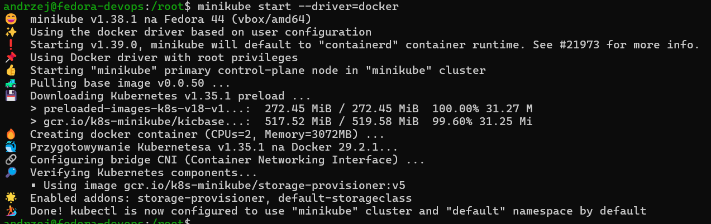

# 3

Minikube uzywa 2 cpu i 3GB ramu

``` 
Creating docker container (CPUs=2, Memory=3072MB) ...
```

Sprawdzenie działania:
`kubectl get nodes`
`minikube status`

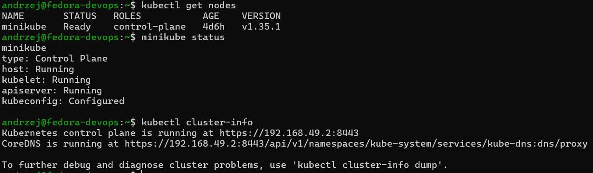

# 4
Uruchomienie minikube dashboard
`minikube dashboard --url`

```bash
andrzej@fedora-devops:~$ minikube dashboard --url
🤔  Weryfikowanie statusu dashboardu...
🚀  Uruchamianie proxy ...
🤔  Weryfikowanie statusu proxy...
http://127.0.0.1:41051/api/v1/namespaces/kubernetes-dashboard/services/http:kubernetes-dashboard:/proxy/
```

Dashboard Kubernetes nie jest bezpośrednio eksponowany w sieci. Dostęp realizowany jest przez lokalny proxy nasłuchujący na interfejsie loopback (127.0.0.1), co ogranicza możliwość nieautoryzowanego dostępu z innych hostów.

Przekierowanie portu portu przez ssh aby móc połączyć się z hosta (win11): `ssh -L 41051:127.0.0.1:41051 andrzej@192.168.100.152`

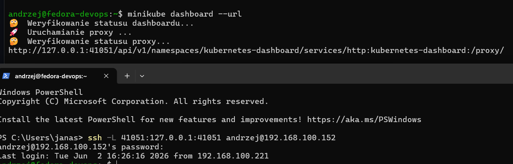
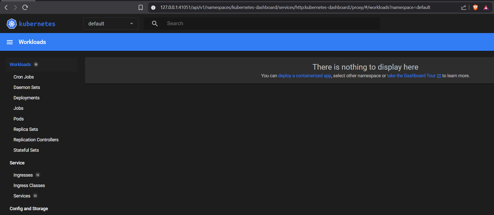

# PRZYGOTOWANIE APLIKACJI NODE I URUCHOMIENIE

Prosta aplikacja stawiająca serwer na porcie `3000`i wypisująca "hello world".

app.js
```js
const http = require('http');

const server = http.createServer((req, res) => {
  res.writeHead(200, { 'Content-Type': 'text/plain' });
  res.end('hello world\n');
});

server.listen(3000, '0.0.0.0', () => {
  console.log('Server running on port 3000');
});
```

Dockerfile
```dockerfile
FROM node:20-alpine

WORKDIR /app

COPY app.js .

EXPOSE 3000

CMD ["node", "app.js"]
```

Budowa obrazu `docker build -t hello-node:1.0 .`

### testowe uruchomienie kontenera aplikacji
`docker run -p 3000:3000 --rm hello-node:1.0`
i sprawdzenie działania `curl localhost:3000`

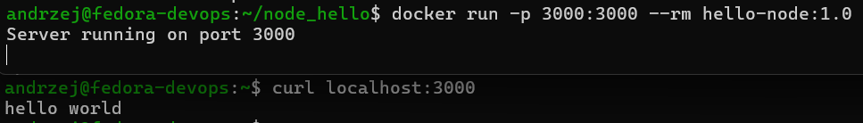

przygotowanie artefaktu `hello-node_1.0.tar` poleceniem `docker save hello-node:1.0 -o hello-node_1.0.tar`

# IMPORT OBRAZU DO KUBERNETESA I JEGO URUCHOMIENIE

przełączenie kontekstu
```bash
eval $(minikube docker-env)
```

załadowanie obrazu
```bash
docker load -i hello-node_1.0.tar
```
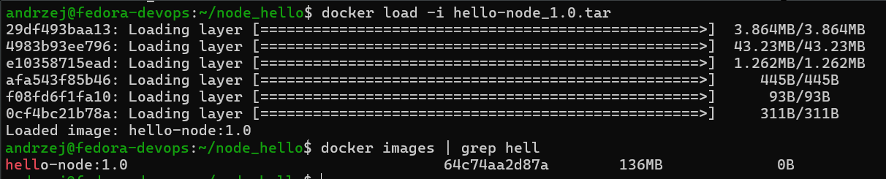

Uruchomienie przez kubernetes:

```bash
kubectl run hello-node \
  --image=hello-node:1.0 \
  --port=3000 \
  --labels app=hello-node
```

Przetestowanie działania:
```bash
# wypisanie podów
kubectl get pods

# sprawdzenie logów poda
kubectl logs hello-node

# przekierowanie portu
kubectl port-forward pod/hello-node 3000:3000

# curl w osobnym terminalu
curl localhost:3000
```

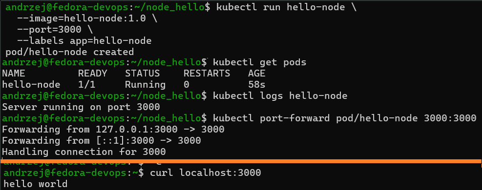

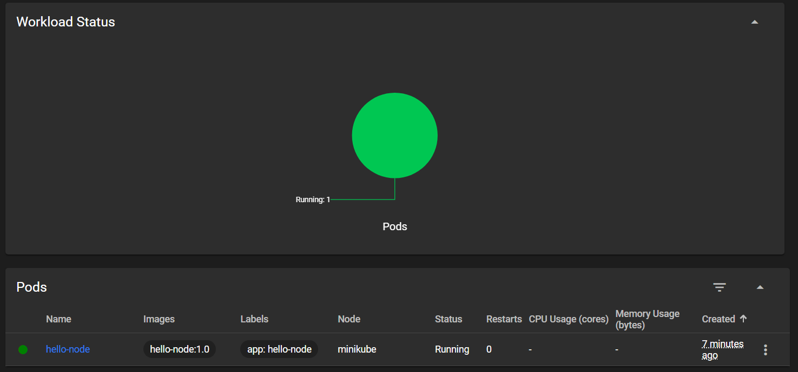

# PRZEKUCIE WDROŻENIA MANUALNEGO W PLIK WDROŻENIA

utworzenie pliku `nginx-deployment.yaml`

```yaml
apiVersion: apps/v1
kind: Deployment
metadata:
  name: nginx-deployment

spec:
  replicas: 4

  selector:
    matchLabels:
      app: nginx

  template:
    metadata:
      labels:
        app: nginx

    spec:
      containers:
      - name: nginx
        image: nginx
        ports:
        - containerPort: 80
```

Wdrożenie: `kubectl apply -f nginx-deployment.yaml`


Sprawdzenie:
```bash
kubectl get deployments


kubectl get pods -o wide


kubectl rollout status deployment/nginx-deployment
```

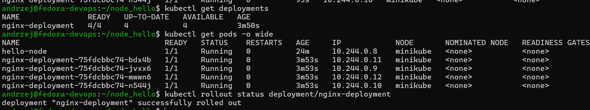


eksponowanie portu z poda
```bash
 kubectl expose deployment nginx-deployment \
  --type=NodePort \
  --port=80
```

eksponowanie portu z kubernetesa do vm:
```bash
kubectl port-forward service/nginx-deployment 8080:80
```

i test `curl localhost:8080`

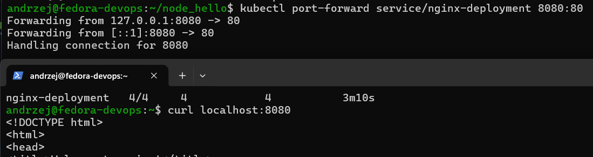